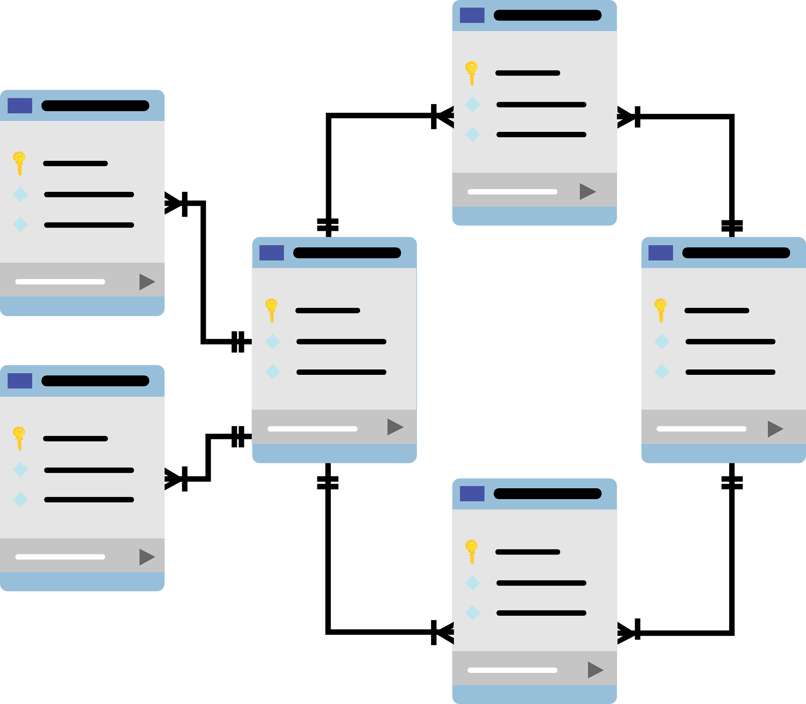

# BASES DE DATOS
---

- [1. Introducción, Instalación , Tipos de datos y Operadores](Ut1/README.md)
  
- [2. Estructuras de control, funciones y excepciones](Ut2/README.md)

- [3. Estructuras de datos dinámicas](Ut3/README.md)

- [4. Programación Orientdada a Objetos](Ut4/README.md)

- [5. Ficheros y directorios](Ut5/README.md)
  
- [6. Módulos y entonos Virtuales](Ut6/README.md)
---
