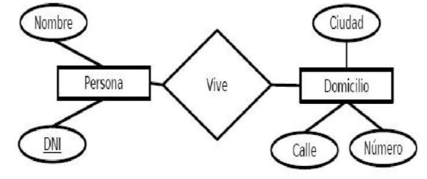
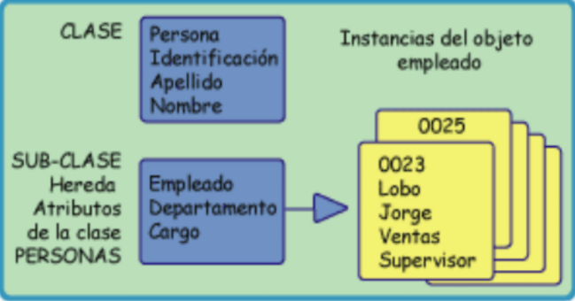
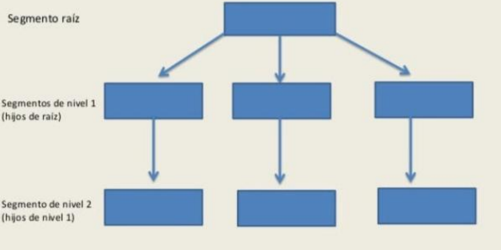
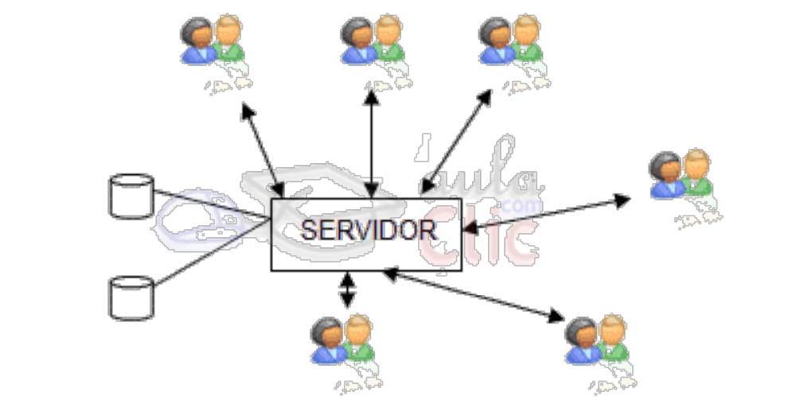
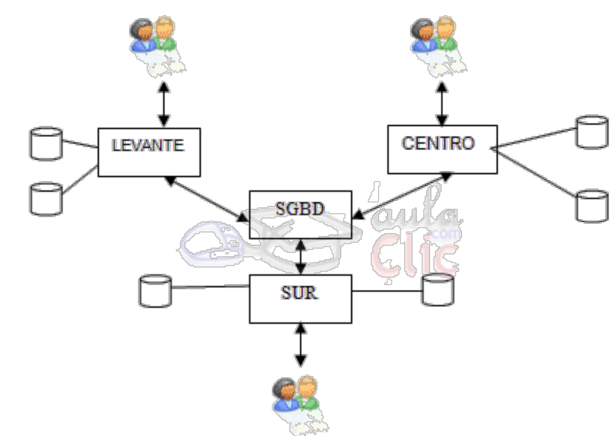

# UT1 INTRODUCCIÓN <!-- omit in toc -->
---

- [1. Introducción.](#1-introducción)
- [2. Datos información y conocimiento.](#2-datos-información-y-conocimiento)
- [3. ¿Qué es una base de datos?](#3-qué-es-una-base-de-datos)
- [4. Evolución de la base de datos.](#4-evolución-de-la-base-de-datos)
- [5. Tipos de Bases de Datos.](#5-tipos-de-bases-de-datos)
  - [5.1. Modelos Lógicos Basados en Objetos.](#51-modelos-lógicos-basados-en-objetos)
    - [5.1.1. El modelo entidad relación.](#511-el-modelo-entidad-relación)
    - [5.1.2. El modelo orientado a objetos.](#512-el-modelo-orientado-a-objetos)
  - [5.2. Modelo Lógico Basado en Registros.](#52-modelo-lógico-basado-en-registros)
    - [5.2.1. Modelo jerárquico.](#521-modelo-jerárquico)
    - [5.2.2. Modelo en red.](#522-modelo-en-red)
    - [5.2.3. Modelo relacional.](#523-modelo-relacional)
  - [5.3. Tipos de bases de datos según su ubicación.](#53-tipos-de-bases-de-datos-según-su-ubicación)
    - [5.3.1. Bases de datos locales.](#531-bases-de-datos-locales)
    - [5.3.2. Bases de datos centralizados.](#532-bases-de-datos-centralizados)
    - [5.3.3. Bases de datos distribuidas.](#533-bases-de-datos-distribuidas)
- [6. Sistemas gestores de bases de datos.](#6-sistemas-gestores-de-bases-de-datos)

# 1. Introducción.

En este módulo vamos a estudiar las **Bases de Datos** y su importancia en el desarrollo de aplicaciones  informáticas.

Comenzaremos desde lo más básico: los conceptos fundamentales relacionados con la información, para después avanzar hacia las bases de datos, su evolución y las herramientas que permiten gestionarlas.

La informática, entendida como la ciencia que estudia el tratamiento automático y racional de la información, tiene como objetivo principal facilitar dicho tratamiento. La información procesada puede ser:

+ **Volátil**, cuando no es necesario almacenarla y se descarta después de usarla.
+ **Persistente**, cuando es necesario conservarla para futuras consultas, análisis y procesamiento.
  
Esta necesidad de almacenamiento y tratamiento eficiente es lo que dio origen a los sistemas de archivos primero, y más tarde a las bases de datos modernas.

# 2. Datos información y conocimiento.

Hoy en día se dice que “los datos son el petróleo del siglo XXI”. La generación de datos es masiva y constante, y su valor para empresas y organizaciones radica en que de ellos se
puede extraer información muy valiosa.

Pero, ¿qué diferencia existe entre un dato y la información?

+ Un **dato** es un hecho, evento o transacción registrado.
+ La **información** surge cuando esos datos son procesados y comunicados en un contexto que permite su interpretación.

> Ejemplo:

+ “Hace 22 °C” → es un dato aislado.
+ “Hace 22 °C en Sevilla el 15 de julio” → al añadir contexto, ese dato se convierte en información.

Los datos necesitan un contexto para transformarse en información. Muchas veces, dicho contexto lo proporcionan  otros  datos relacionados.

Cuando la información es asimilada, se transforma en **conocimiento**, que a su vez permite tomar decisiones y generar valor.

# 3. ¿Qué es una base de datos?

Una **base de datos (BD)** es una entidad en la que se almacenan datos de forma estructurada, con la menor redundancia posible, para que puedan ser utilizados por distintos usuarios y programas. El concepto de base de datos está ligado a la **compartición de información a través de redes**, de ahí el término base.

También puede definirse como:

“Un conjunto de datos almacenados y estructurados según sus características o tipología,con el fin de ser utilizados o consultados posteriormente”.
En inglés, se denomina **database**.

# 4. Evolución de la base de datos.

Las primeras BD eran analógicas, consistían en documentos en papel o archivos físicos.
+ **Problemas**: ocupaban espacio, dificultaban las búsquedas y no permitían manejar grandes volúmenes de datos.

En la actualidad  son digitales e informatizadas, lo que permite:
+ Ahorro de espacio.
+ Consultas rápidas y precisas.
+ Almacenamiento masivo de datos.
+ Menor redundancia y más fiabilidad.

Con la llegada de la era digital y el Big Data, las bases de datos se han convertido en herramientas imprescindibles en prácticamente todos los ámbitos.

El almacenamiento y uso de bases de datos se gestiona mediante programas llamados **Sistemas Gestores de Bases de Datos (SGBD)** o **Database Management Systems (DBMS)**.

Estos permiten:

+ **Almacenar** datos de forma organizada.
+ **Consultar, modificar o eliminar** información mediante consultas.
+ Controlar el acceso de múltiples usuarios.

El lenguaje más utilizado es SQL (Structured Query Language), estándar en bases de datos relacionales.

Aunque en sus orígenes solo grandes empresas y dministraciones públicas los utilizaban, hoy los emplean todo tipo de organizaciones y usuarios, incluso en aplicaciones tan cotidianas como el registro de usuarios de una página web.

+ De los archivos a las bases de datos
Antes de existir los SGBD, la información se gestionaba con sistemas de archivos.

Un archivo o fichero es una colección de datos relacionados entre sí, almacenados como una unidad en algún medio físico de almacenamiento.

Ejemplo:

+ El fichero con todos los clientes de un banco, donde cada registro corresponde a un cliente.

Los archivos se pueden clasificar según su función, los elementos que contienen o el tipo de acceso (secuencial, directo, indexado, etc.).

Sin embargo, los sistemas de archivos presentaban limitaciones:

+ Alta redundancia.
+ Dificultad de acceso simultáneo.
+ Problemas de integridad de datos.

Estas limitaciones impulsaron la evolución hacia los SGBD modernos, que resuelven estos problemas y permiten un tratamiento más eficiente de la información.

En resumen, las bases de datos surgieron como respuesta a la necesidad de almacenar, organizar y acceder a la información de manera eficiente. Pasaron de registros físicos en papel a sistemas digitales complejos, gestionados mediante programas especializados (SGBD/DBMS).

Su estrecha relación con la informática radica en que el propósito de esta disciplina es precisamente el tratamiento automático de la información, y las bases de datos son una
herramienta esencial para lograrlo en el mundo digital actual.

# 5. Tipos de Bases de Datos.

Existen muchos tipos distintos de bases de datos. Lo más habitual es clasificarlas según el modelo, su contenido o la variabilidad de los datos que incluyen. Un modelo de base de datos es la estructura lógica que adopta la base de datos, incluyendo las relaciones y limitaciones que determinan cómo se almacenan y organizan y cómo se accede a los datos (logical
structure that the database adopts, including the  relationships and constraints that determine how data is stored, organized, and accessed).

Así mismo, un modelo de base de datos también define qué tipo de operaciones se pueden realizar con los datos, es decir, que también determina cómo se manipulan los mismos,proporcionando también la base sobre la que se diseña el lenguaje de consultas.

Las bases de datos pueden clasificarse de numerosas formas, dependiendo del criterios que impongamos. 

## 5.1. Modelos Lógicos Basados en Objetos.

Se enfoca en describir los datos, las relaciones entre los datos y algunas limitaciones definidas.

### 5.1.1. El modelo entidad relación.

Está basado en una percepción del mundo real que consta de una colección de objetos básicos llamados entidades, y de relaciones entre estos objetos.

La totalidad de estructuras lógicas de una base de datos se pueden expresar gráficamente mediante un diagrama Entidad Relación, que consta de los siguientes componentes:
Rectángulos, elipses, rombos y líneas.

### 5.1.2. El modelo orientado a objetos.

Está basado en una colección de objetos. Un objeto contiene valores almacenados en variables de ejemplares (instancias) de ese objeto. Los objetos se agrupan en clases. Al contrario que las entidades en el modelo E-R, cada objeto tiene su propia identidad única, independientemente de los valores que contenga.

## 5.2. Modelo Lógico Basado en Registros.

Se enfoca en describir la estructura de datos y las técnicas de acceso en un sistema de administración de bases de datos.

Se usan para describir datos en los niveles lógico y de vistas. En contraste con los modelos basados en objetos, se usan tanto para especificar la estructura lógica completa de la base de datos como para proporcionar una descripción de alto nivel de la implementación.

Los modelos basados en registros se llaman así debido a que la base de datos se estructura en registros de formato fijo de diferentes tipos. En cada tipo de registro se define un número
fijo de campos o atributos, y cada campo tiene normalmente una longitud fija.

### 5.2.1. Modelo jerárquico.

En este modelo los datos son representados en la forma de un árbol. Los datos se representan como una colección de registros, y las relaciones entre los datos son representados por enlaces.

### 5.2.2. Modelo en red.

Es similar al modelo jerárquico en la forma en que los datos y las relaciones son representados como registros y enlaces. Sin embargo, los registros en la base de datos son representados gráficamente.

### 5.2.3. Modelo relacional.

En este modelo, la base de datos es estructurada en registros de formato fijo, de varios tipos.
Cada tipo de registro tiene un número fijo de atributos o campos, los cuales son usualmente de tamaño fijo. Este es el modelo más utilizado.

## 5.3. Tipos de bases de datos según su ubicación.

### 5.3.1. Bases de datos locales.

En modo local tenemos la base de datos y el usuario ubicados en el mismo ordenador. Un ejemplo de base de datos que funciona en modo local es Microsoft Access, MS Access es
una base de datos fácil de manejar por usuarios poco expertos que funciona bien en modo local y mientras no tenga que albergar grandes cantidades de información.

> Ventajas.

+ **Economía**: Es la más barata.
+ **Simplicidad**: No se necesita llevar controles de accesos concurrentes, de transmisión de datos, etc.

> Inconvenientes.

+ **Monousuario**: En un instante determinado sólo la puede utilizar una persona.
+ **Capacidad**: Suele tener una capacidad de almacenamiento limitada.
  
### 5.3.2. Bases de datos centralizados.

En los sistemas centralizados tenemos la base de datos completa en un mismo servidor, y todos los usuarios acceden a ese servidor. Que la base de datos esté en un mismo servidor
no implica que esté en un solo archivo o en el mismo disco, puede estar repartida.

En modo Cliente/Servidor, la base de datos se encuentra en un ordenador (el Servidor) y los usuarios acceden simultáneamente a esa base de datos a través de la red (sea una red local
o Internet) desde sus ordenadores a través de un programa Cliente.

A nivel de empresas es el sistema que más se utiliza en la actualidad.

> Ventajas:

+ **Multiusuario**: Permite que varios usuarios accedan a la vez a la misma información.
+ **No redundancia**: Al estar todos los datos en el mismo servidor, la información no se duplica y es más fácil evitar fallos debidos a redundancias.

> Desventajas:

+ **Complejidad**: Tiene que incluir y gestionar un sistema de usuario y subesquemas.
+ **Seguridad**: Se tienen que realizar controles para garantizar la seguridad de los datos, tanto a nivel interno como a nivel de comunicaciones.

### 5.3.3. Bases de datos distribuidas.

Tenemos la información repartida en distintas localizaciones unidas todas ellas mediante red y un sistema gestor de bases de datos distribuidas.Las distintas localizaciones suelen ser distintas geográficamente.

> Ventajas

+ **Rendimiento**. Una clara ventaja es que es posible ubicar los datos en lugares donde se necesitan con más frecuencia, aunque también se permita a usuarios no locales acceder a los datos según sus necesidades. Esto hace que la información se recupere de forma más rápida y ágil en las ubicaciones locales. Además los sistemas trabajan en paralelo, lo cual permite balancear la carga en los servidores.
+ **Disponibilidad**. En caso de que falle la base de datos de alguna localidad, el sistema no se colapsa, puede seguir funcionando excluyendo los datos de la localidad que haya fallado.

+ **Economía en la implantación**. Es más barato crear una red de muchas máquinas pequeñas, que tener una sola máquina muy poderosa.
+ **Modularidad**. Se pueden modificar, agregar o quitar sistemas de la base de datos distribuida sin afectar a los demás sistemas (módulos).

> Desventajas

+ **Complejidad en el diseño de datos**. Además de las dificultades que generalmente se encuentran al diseñar una base de datos, el diseño de una base de datos distribuida
debe considerar la fragmentación, replicación y ubicación de los fragmentos en sitios específicos, se tiene que trabajar tomando en cuenta su naturaleza distribuida, por lo cual no podemos pensar en hacer joins que afecten a tablas de varios sistemas, etc.
+ **Complejidad técnica**. Se debe asegurar que la base de datos sea transparente, se debe lidiar con varios sistemas diferentes que pueden presentar dificultades únicas.
+ **Economía en el mantenimiento**. La complejidad y la infraestructura necesaria implica que se necesitará mayor mano de obra.
+ **Seguridad**. Se debe trabajar en la seguridad de la infraestructura así como cada uno de los sistemas.
+ **Integridad**. Se vuelve difícil mantener la integridad, aplicar las reglas de integridad a través de la red puede ser muy caro en términos de transmisión de datos.

# 6. Sistemas gestores de bases de datos.

Un sistema gestor de bases de datos (SGBD) es una aplicación que permite a los usuarios definir, crear y mantener una base de datos, y proporciona acceso controlado a la misma.

El objetivo fundamental de los SGBD es proporcionar eficiencia y seguridad a la hora de recuperar o insertar información en las bases de datos. Estos sistemas están diseñados para
la manipulación de grandes bloques de información.

En general, un SGBD proporciona los siguientes servicios:

+ Permite la **definición de la base de datos** mediante el lenguaje de definición de datos (**DDL – Data Description Language**). Este lenguaje permite especificar la estructura y el tipo de los datos, así como las restricciones sobre los datos. Todo esto se almacenará en la base de datos.
+ Permite la **inserción, actualización, eliminación y consulta de datos** mediante el lenguaje de manejo o manipulación de datos (**DML - Data Manipulation Language**).
+ Proporciona un acceso controlado a la base de datos mediante:
  + Un sistema de seguridad, de modo que los usuarios no autorizados no puedan acceder a la base de datos, mediante el lenguaje de control de datos (**DCL - Data Control Language**);
  + Un sistema de integridad que mantiene la integridad y la consistencia de los datos;
  + Un sistema de control de concurrencia que permite el acceso compartido a la base de datos;
  + Un sistema de control de recuperación que restablece la base de datos después de que se produzca un fallo del hardware o del software;
  + Un diccionario de datos o catálogo accesible por el usuario que contiene la descripción de los datos de la base de datos.

La principal herramienta de un SGBD es la interfaz de programación con el usuario. Esta interfaz consiste en un lenguaje muy sencillo mediante el cual el usuario interactua con el servidor. Este lenguaje comúnmente se denomina **SQL, Structure Query Language**, está estandarizado por la ISO 1, es decir, todas las BD que soporten SQL deben tener la misma sintaxis a la hora de aplicar el lenguaje.