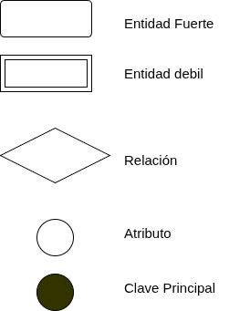
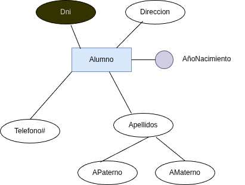
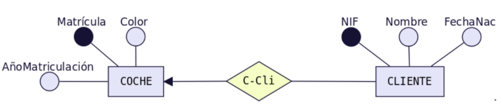
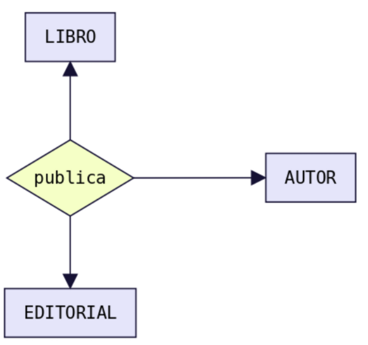
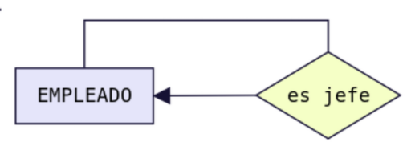
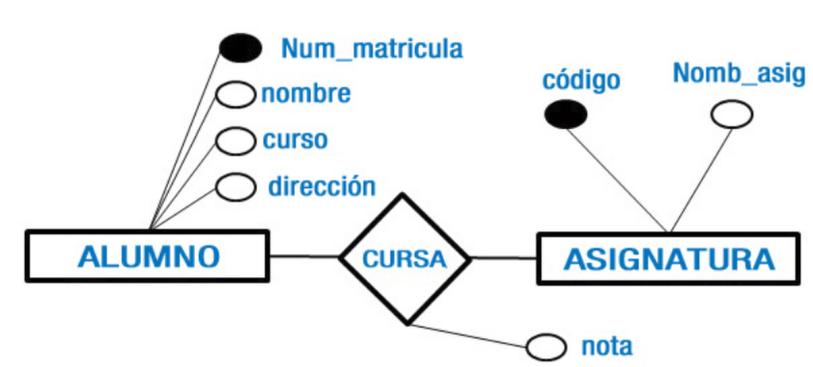
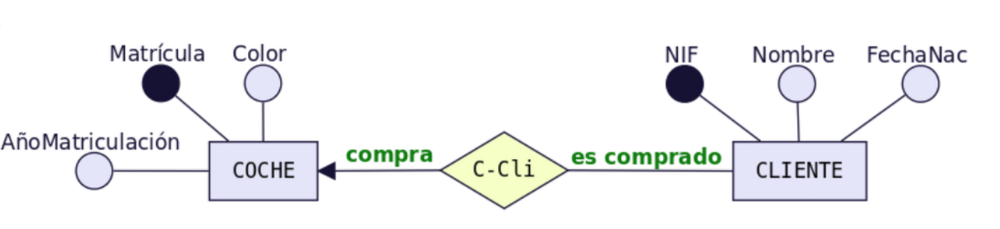
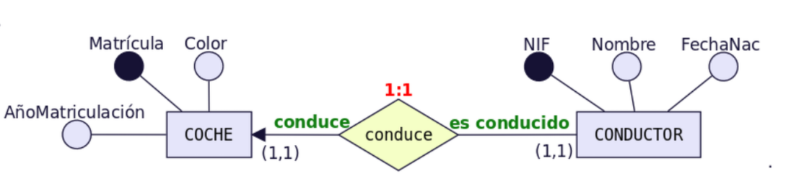
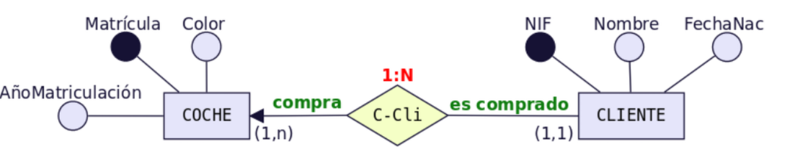
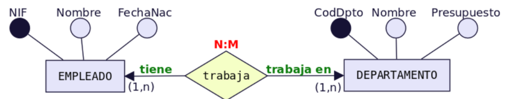

# UT2 MODELO ENTIDAD RELACIÓN <!-- omit in toc -->
---

- [1. Introducción.](#1-introducción)
- [2. Modelo Entidad/Relación (E/R).](#2-modelo-entidadrelación-er)
- [3. Entidades.](#3-entidades)
  - [3.1. Entidades fuertes.](#31-entidades-fuertes)
  - [3.2. Entidades débiles.](#32-entidades-débiles)
- [4. Atributos.](#4-atributos)
  - [4.1. Atributos Identificadores.](#41-atributos-identificadores)
  - [4.2. Atributos descriptivos.](#42-atributos-descriptivos)
  - [4.3. Atributos heredados.](#43-atributos-heredados)
  - [4.4. Atributos compuestos.](#44-atributos-compuestos)
  - [4.5. Atributos Multivaluados.](#45-atributos-multivaluados)
  - [4.6. Atributos heredados por identificación.](#46-atributos-heredados-por-identificación)
  - [4.7. Ejemplos de atributos.](#47-ejemplos-de-atributos)
- [5. Relaciones.](#5-relaciones)
  - [5.1. Tipos de Relaciones.](#51-tipos-de-relaciones)
    - [5.1.1. Relaciones Binarias.](#511-relaciones-binarias)
    - [5.1.2. Relaciones N-arias.](#512-relaciones-n-arias)
    - [5.1.3. Relaciones Reflexivas.](#513-relaciones-reflexivas)
    - [5.1.4. Atributos en una relación.](#514-atributos-en-una-relación)
  - [5.2. Rol de las entidades en las relaciones.](#52-rol-de-las-entidades-en-las-relaciones)
  - [5.3. Cardinalidades de las relaciones y la participación de las entidades.](#53-cardinalidades-de-las-relaciones-y-la-participación-de-las-entidades)
- [6. El modelo E/R Extenido.](#6-el-modelo-er-extenido)

# 1. Introducción.
En este tema veremos como hacer el diseño conceptual y lógico de una base de datos. Empezaremos elaborando el modelo conceptual usando diagramas Entidad-Relación y Entidad-Relación extendidos. 

Este diseño es de más alto nivel, más próximo al usuario y más alejado del diseño físico de la BD. A continuación, a partir del modelo Entidad-Relación, procederemos a generar el modelo relacional, el cual ya se halla muy próximo al modelo físico de BD. 

Veremos las reglas de transformación que hemos de seguir para ello. Por último deberemos normalizar las tablas obtenidas para evitar redundancias. Resumiendo, los 2 modelos lógicos, de mayor a menor nivel de abstracción, que veremos en este tema son:

+ Modelo Entidad-Relación (extendido)
+ Modelo Relacional

Cuando hemos de desarrollar una base de datos se distinguen claramente dos fases de trabajo, **Análisis** y **Diseño**. En la siguiente tabla te describimos las etapas que forman parte de cada fase.

|Fase de Análisis|Fase de Diseño|
|:--------------:|:------------:|
|**Análisis de entidades**: Se trata de localizar y definir las entidades y sus atributos. |Diseño de tablas.|
|**Análisis de relaciones**: Se definirán las relaciones existentes entre entidades, | Normalización.|
|**Obtención del Esquema Conceptual** a través del modelo E-R.|Aplicación de retrodiseño, si fuese necesario.|
|Diseño físico| Paso a la implementación física en el SGBD|

# 2. Modelo Entidad/Relación (E/R).

Para la realización de esquemas que ofrezcan una visión global de los datos, Peter Chen en 1976 y 1977 presenta dos artículos en los que se describe el **modelo Entidad/Relación**. Con el paso del tiempo, este modelo ha sufrido modificaciones y mejoras. Actualmente, el modelo **entidad/relación extendido (ERE)** es el más aceptado, aunque existen variaciones que hacen que este modelo no sea totalmente un estándar.

Para la realización de los esquemas E/R seguirmos la siguiente nomenclatura:

# 3. Entidades.

Una entidad es cualquier objeto o elemento acerca del cual se pueda almacenar información en la BD. Las entidades pueden ser concretas como una persona, un objeto  o abstractas como una fecha. Las entidades se representan gráficamente mediante rectángulos y su nombre aparece en el interior. Un nombre de entidad sólo puede aparecer una vez en el esquema conceptual.

+ Se representan gráficamente mediante un rectángulo.
+ Se recomienda nombrarlas en singular y su nombre aparece en el interior del rectángulo.
+ El nombre de entidad sólo puede aparecer una vez en el modelo entidad relación.

## 3.1. Entidades fuertes.

Se dice que una entidad es fuerte si puede existir por sí misma sin que dependa de la existencia de otra entidad.

## 3.2. Entidades débiles.

Si una entidad depende de la existencia de otra, será débil por existencia o por identificación.

Vemos que **Factura** es una entidad fuerte, mientras que **LineaFactura** es debil, ya que una factura está compuesta por muchas **líneas de factura**, y por sí sola no podemos identificar a que factura corresponde esta línea.

Vamos a visualizar con tablas:

> Entidad Factura

| ID Factura | Fecha | Cliente | ID Fiscal / NIF | Moneda | Total Factura |
| :--- | :---: | :--- | :---: | :---: | :---: |
| **FAC-001** | 2026-06-15 | Alimentos S.A. | A12345678 | EUR | 41,00 € |
| **FAC-002** | 2026-06-18 | Tech Solutions | B87654321 | EUR | 185,00 € |
| **FAC-003** | 2026-06-22 | Constructora Norte | A55566677 | EUR | 885,00 € |

> Entidad Linea Factura

| ID Línea | ID Factura  | Descripción Producto     | Cantidad | Precio Unitario | Total Línea |
| :------: | :---------- | :----------------------- | :------: | :-------------: | :---------: |
|  L-001   | **FAC-001** | Harina de trigo 1kg      |    10    |     1,50 €      |   15,00 €   |
|  L-002   | **FAC-001** | Azúcar refinada 1kg      |    5     |     1,20 €      |   6,00 €    |
|  L-003   | **FAC-001** | Aceite de girasol 1L     |    8     |     2,50 €      |   20,00 €   |
|  L-004   | **FAC-002** | Ratón inalámbrico        |    2     |     25,00 €     |   50,00 €   |
|  L-005   | **FAC-002** | Teclado mecánico         |    2     |     60,00 €     |  120,00 €   |
|  L-006   | **FAC-002** | Alfombrilla XL           |    1     |     15,00 €     |   15,00 €   |
|  L-007   | **FAC-003** | Cemento gris (saco)      |    50    |     7,00 €      |  350,00 €   |
|  L-008   | **FAC-003** | Arena de río (m³)        |    3     |     45,00 €     |  135,00 €   |
|  L-009   | **FAC-003** | Ladrillo cerámico (pack) |    5     |     80,00 €     |  400,00 €   |

# 4. Atributos.

Las entidades se representan mediante un conjunto de **atributos**. Éstos describen características o propiedades que posee cada miembro de un conjunto de entidades. El mismo atributo establecido para un conjunto de entidades o, lo que es lo mismo, para un tipo de entidad, almacenará información parecida para cada ocurrencia de entidad. Pero, cada ocurrencia de entidad tendrá su propio valor para cada atributo.

+ Representado con un circulo y el nombre del atributo.
+ Si el nombre es muy grande el nombre puede colocarse al lado del circulo. Si no podemos etiquetarlo dentro del circulo.

## 4.1. Atributos Identificadores.

También llamados como **clave principal**, estos atributos tienen la particularidad de no repetir valores dentro de la entidad y sirven para **identificar de forma univoca cada ocurrencia**. Tal como se aprecia en el gráfico anterior, el Documento es un identificador único debido a que este atributo identifica a cada cliente de manera única.

La clave principal puede estar compuesta por **uno o un conjunto** de atributos.

+ Se representa con un circulo relleno de negro.

## 4.2. Atributos descriptivos.

Los atributos descriptores son los más comunes que se pueden evidenciar en las entidades de un modelo entidad relación, estos atributos describen diversas propiedades de una entidad.

+ Se representa con un circulo en blanco.

## 4.3. Atributos heredados.

Estos atributos cuyos valores se calculan a partir de los valores de otros atributos. Por ejemplo, la edad se calcula a partir de la fecha de nacimiento y la fecha actual.

## 4.4. Atributos compuestos.

Un atributo compuesto es un atributo que puede ser descompuesto en otros atributos pertenecientes a distintos dominios. En muchas ocasiones un atributo compuesto puede ser un identificador de una entidad.

+ Se representa en forma de arbol los atributos compuestos.

## 4.5. Atributos Multivaluados.

Es un atributo que almacenan varios valores de un mismo dominio. En ocasiones se confunden con los atributos compuestos. Por ejemplo, las habilidades o teléfonos de un empleado.

+ Se representa con un `#`  al final nombre del atributo.

## 4.6. Atributos heredados por identificación.

Estos atributos son heredados de otra entidad cuando la relación entre ambas es por Identificación. Esto se verá más adelante.

+ Se representa con un circulo en gris.

## 4.7. Ejemplos de atributos.

+ Clave principal: Dni.
+ Atributo descritptivo: Direccion.
+ Atributo Compuesto: Apellidos.
+ Atributo Multivaluado: Telefono.
+ Atributo heredado por Id; AñoNacimiento.

# 5. Relaciones.

Una relación es la asociación entre dos a más entidades. Para nombrar una relación debemos tener en cuenta:

+ Tiene un nombre que describe su función.
+ Se representan gráficamente mediante rombos.
+ El nombre aparece en el interior de los rombos.
+ El nombre es la unión separada por un guión de las iniciales de cada entidad.

Las entidades que están involucradas en una determinada relación se denominan entidades participantes. El número de participantes en una relación es lo que se denomina grado de la relación. 

## 5.1. Tipos de Relaciones.
### 5.1.1. Relaciones Binarias.

Cuando intervienen dos entidades en la relación.

### 5.1.2. Relaciones N-arias.

Cuando intervienen mas de dos entidades.

### 5.1.3. Relaciones Reflexivas.

Cuando existe relación de una entidad consigo misma.

### 5.1.4. Atributos en una relación.

Las relaciones también pueden tener atributos, se les denominan atributos propios. Son aquellos atributos cuyo valor sólo se puede obtener en la relación, puesto que dependen de todas las entidades que participan en la relación. 

## 5.2. Rol de las entidades en las relaciones.

Es la función que tiene en una relación. Se especifican los papeles o roles cuando se quiera aclarar el significado de una entidad en una relación. 

+ Se indica con una descripción del rol de cada entidad.

+ Vemos que un cliente **compra** un coche.
+ Un coche **es_comprado** por un cliente.

## 5.3. Cardinalidades de las relaciones y la participación de las entidades.

La **cardinalidad** es el número de ocurrencias de una entidad asociada a una ocurrencia de la otra entidad. 

> **Relación de cardinalidad 1:1**

A cada elemento de una entidad le corresponde solamente un elemento de la segunda entidad y viceversa.

+ Lo representamos encima del rombo con `1:1`.

Pero además hay que representar la participación de las entidades dentro de la relación. Representa la cardinalidad mínima y màxima **(cardinalidad mínima,cardinalidad máxima)**.En este caso lo valores son:

+ `(0,1)`, cuando la entidad puede o no participar en la relación. 
+ `(1,1)`,  cuando la entidad participa en la relación.

Un conductor «conduce» como mínimo 1 coche y como máximo 1 coche → Participación (1,1) y se pone en el lado opuesto a CONDUCTOR, es decir, junto a COCHE. Un coche «es conducido» como mínimo por 1 conductor y como máximo por 1 conductor → Participación (1,1) y se pone en el lado opuesto a COCHE, es decir, junto a CONDUCTOR. Para determinar la cardinalidad nos quedamos con las dos participaciones máximas. Es decir → 1:1.

> **Relación de cardinalidad 1:N o N:1**

Cuando a los elementos de una entidad le corresponde mas de un elemento de la otra entidad.

+ Lo representamos encima del rombo con `1:N`.

Cardinalidades:

+ `(0,1)`, cuando la entidad puede o no participar en la relación. 
+ `(1,1)`,  cuando la entidad participa en la relación.
+ `(0,N)`, cuando la entidad puede o no participar en la relación. Y si participa puede participar muchas veces.
+ `(1,N)`,  cuando la entidad participa en la relación, de una a muchas veces.

Un cliente «compra» como mínimo 1 coche y como máximo puede comprar más de un coche, es decir, varios coches. Ese varios se representa con la letra «n» → Participación (1,n) y se pone en el lado opuesto a CLIENTE, es decir, junto a COCHE. Un coche «es comprado» como mínimo por 1 cliente y como máximo por 1 cliente → Participación (1,1) y se pone en el lado opuesto a COCHE, es decir, junto a CLIENTE. Para determinar la cardinalidad nos quedamos con las dos participaciones máximas y la «n» se pone en mayúsculas «N». Es decir → 1:N.

> **Relación de cardinalidad N:M**

Cuando a los elementos de ambas entidades le corresponde mas de un elemento de la otra entidad.

+ Lo representamos encima del rombo con `N:M`.

Cardinalidades:

+ `(0,N)`, cuando la entidad puede o no participar en la relación. Y si participa puede participar muchas veces.
+ `(1,N)`,  cuando la entidad participa en la relación, de una a muchas veces.
  

Un empleado «trabaja» como mínimo 1 departamento y como máximo puede trabajar en varios. Ese varios se representa con la letra «n» → Participación(1,n) y se pone en el lado opuesto a EMPLEADO, es decir, junto a DEPARTAMENTO. Un departamento «tiene» como mínimo por 1 empleado y como máximo puede tener varios → Participación (1,n) y se pone en el lado opuesto a DEPARTAMENTO, es decir, junto a EMPLEADO. Para determinar la cardinalidad nos quedamos con las dos participaciones máximas y la «n» se pone en mayúsculas «N» y para diferenciar el otro «varios» en lugar de «N» ponemos «M» (Igual que cuando en matemáticas había dos variables no se ponía x e x sino x e y). Es decir → N:M.

# 6. El modelo E/R Extenido.

