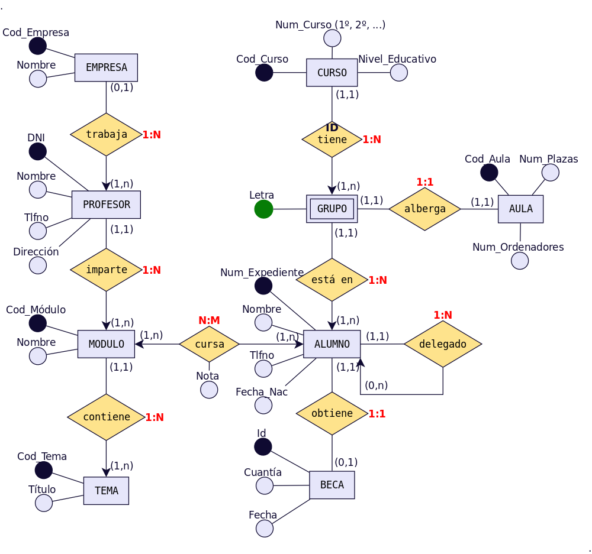

# UT3 MODELO RELACIONAL <!-- omit in toc -->
---

- [1. Introducción.](#1-introducción)
- [2. Elementos y propiedades del modelo relacional](#2-elementos-y-propiedades-del-modelo-relacional)
- [3. Transformación de un esquema E/R a esquema relacional.](#3-transformación-de-un-esquema-er-a-esquema-relacional)
  - [3.1. Entidades.](#31-entidades)
  - [3.2. Relaciones binarias.](#32-relaciones-binarias)
    - [3.2.1. Relaciones N:M.](#321-relaciones-nm)
    - [3.2.2 Relaciones 1:N.](#322-relaciones-1n)

# 1. Introducción.

**Edgar Frank Codd** definió las bases del **modelo relacional** a finales de los 60. En 1970 publicaba el documento “A Relational Model of data for Large Shared Data Banks” (“Un modelo relacional de datos para grandes bancos de datos compartidos”). 

El modelo relacional de datos es el **modelo lógico** en el que se basan la mayoría de los Sistemas Gestores de Bases de Datos (SGBD) usados en la actualidad, tales como ORACLE, Access, MySQL,MS SQL Server, postgreSQL, etc.

Los objetivos que buscaba Codd con el modelo relacional iban encaminados a obtener:

+ **Independencia física**. Almacenamiento/manipulación. Un cambio físico en la base de datos no afecta a los programas.
+ **Independencia lógica**. Añadir, eliminar o modificar elementos en la BD no debe repercutir en los programas y/o usuarios que acceden a ellos.
+ **Flexibilidad**. Ofrecer al usuario los datos en la forma más adecuada a cada aplicación.
+ **Uniformidad**. Las estructuras lógicas de los datos son tablas. Facilita la concepción y utilización de la BD por parte de los usuarios.
+ **Sencillez**. Por las características anteriores y por los sencillos lenguajes de usuario que utiliza, el modelo relacional es fácil de comprender y utilizar por parte del usuario final.

# 2. Elementos y propiedades del modelo relacional

+ **Relación (tabla)**: Representan las entidades de las que se quiere almacenar información en la BD. Esta formada por:
  + **Filas (Registros o Tuplas)**: Corresponden a cada ocurrencia de la entidad.
  + **Columnas (Atributos o campos)**: Corresponden a las propiedades de la entidad. Siendo rigurosos una relación está constituida sólo por los atributos, sin las tuplas.
+ Las relaciones tienen las siguientes **propiedades**:
  + Cada relación tiene un nombre y éste es distinto del nombre de todas las demás relaciones de la misma BD.
  + No hay dos atributos que se llamen igual en la misma relación.
  + El orden de los atributos no importa: los atributos no están ordenados.
  + Cada tupla es distinta de las demás: no hay tuplas duplicadas. (Como mínimo se diferenciarán en la clave principal)
  + El orden de las tuplas no importa: las tuplas no están ordenadas.
+ **Clave candidata**: atributo que identifica unívocamente una tupla. Cualquiera de las claves candidatas se podría elegir como clave principal.
+ **Clave Principal**: Clave candidata que elegimos como identificador de la tuplas.
+ **Clave Alternativa**: Toda clave candidata que no es clave primaria (las que no hayamos elegido como clave principal)
+ Una clave principal no puede asumir el valor nulo (**Integridad de la entidad**).
+ **Dominio de un atributo**: Conjunto de valores que pueden ser asumidos por dicho atributo.
+ **Clave Externa o foránea o ajena**: el atributo o conjunto de atributos que forman la clave principal de otra relación. Que un atributo sea clave ajena en una tabla significa que para introducir datos en ese atributo, previamente han debido introducirse en la tabla de origen. Es decir, los valores presentes en la clave externa tienen que corresponder a valores presentes en la clave principal correspondiente (**Integridad Referencial**).

# 3. Transformación de un esquema E/R a esquema relacional.

Pasamos ya a enumerar las normas para traducir del Modelo E/R al modelo relacional, ayudándonos del siguiente ejemplo:

> [!NOTE]
> Al pasar del esquema E/R al esquema Relacional deberemos añadir las **claves foráneas** necesarias para establecer las interrelaciones entre las tablas. Dichas claves foráneas no aparecen representadas en el esquema E/R.

> [!IMPORTANT]
> Se deben elaborar los diagramas relacionales de tal forma que, posteriormente al introducir datos, **no quede ninguna clave foránea a valor nulo (NULL)**. Para ello se siguen las reglas que se muestran a continuación.

## 3.1. Entidades.

Cada entidad se transforma en una tabla. El identificador (o identificadores) de la entidad pasa a ser la clave principal de la relación y aparece **subrayada** o con la indicación: PK (Primary Key). Si hay clave alternativa esta se pone en «negrita».

Transformación de la Entidad AULA.

aula([cod_aula](#),num_plazas,num_ordenadores)

## 3.2. Relaciones binarias.

### 3.2.1. Relaciones N:M.

Cada una de las entidades que participan genera una tabla. Además generamos otra tabla que genera la relación, con las claves primarias de ambas entidades. Esta tercera tabla la clave primaria será la agregación de las claves principales de las entidades. Estas claves hay que declararlas como claves foráneas  **FK (Foreign Key)**. Se indicarán en **negrita**.

> [!NOTE]
> Los atributos de la relación pasan a la tabla que la relación genera.

Realicemos el paso a tablas de la relación N:M entre MÓDULO (1,n) y ALUMNO (1,n). Este tipo de relación siempre genera tabla y los atributos de la relación, pasan a la tabla que ésta genera.

alumno([num_expediente](#),nombre,tlfno,fecha_nac)

modulo([cod_modulo](#),nombre)

cursa([**num_expediente,cod_modulo**](#),nota)

### 3.2.2 Relaciones 1:N.

Podemos tener 2 casos:

+ **Caso 1**: Si la entidad del lado «1» presenta participación (0,1), entonces se crea una nueva tabla para la relación que incorpora como claves ajenas las claves de ambas entidades. La clave principal de la relación será sólo la clave de la entidad del lado «N».
  
 Realicemos el paso a tablas de la relación 1:N entre PROFESOR (1,n) y EMPRESA (0,1). Como en el lado «1» encontramos participación mínima 0, se generará una nueva tabla. Donde la clave principal es la clave principal de la entidad que participa con cardinalidad mínima 1. Si elegimos la de cardinalidad mínima 0, podemos obtener valores nulos, y una clave primaria no puede poseer valores nulos.

empresa([cod_empresa](#),nombre)

profesor([dni](#),nombre,tlfno,direccion)

trabaja([**dni_profesor**](#),**cod_empresa**)

+ **Caso 2**: Para el resto de situaciones, la entidad del lado «N» recibe como clave ajena la clave de la entidad del lado «1». Los atributos propios de la relación pasan a la tabla donde se ha incorporado la clave ajena.

Realicemos el paso a tablas de la relación 1:N entre MÓDULO (1,1) y TEMA (1,n). Como no hay participación mínima «0» en el lado 1, no genera tabla y la clave principal del lado «1» pasa como foránea al lado «n».

modulo([codigo_modulo](#),nombre)
tema([cod_tema](#),titulo,**cod_modulo**)

