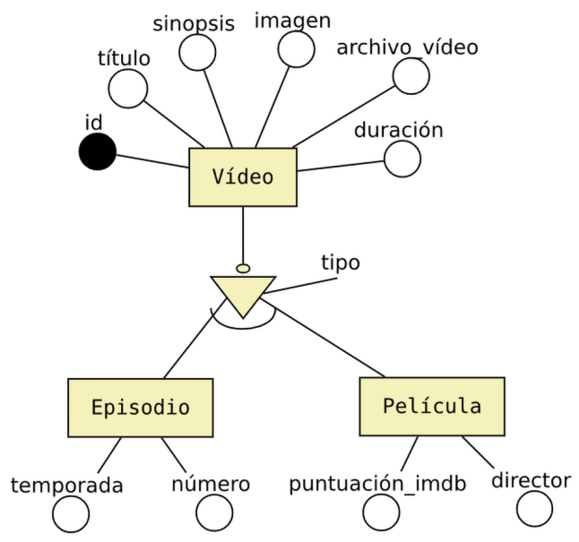
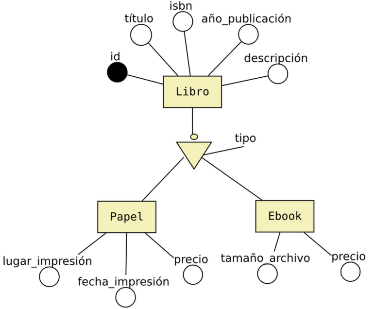
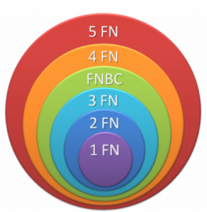
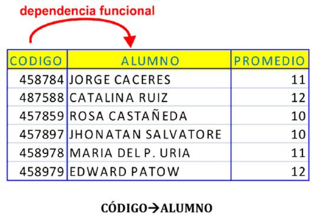

# UT3 MODELO RELACIONAL <!-- omit in toc -->
---

- [1. Introducción.](#1-introducción)
- [2. Elementos y propiedades del modelo relacional](#2-elementos-y-propiedades-del-modelo-relacional)
- [3. Transformación de un esquema E/R a esquema relacional.](#3-transformación-de-un-esquema-er-a-esquema-relacional)
  - [3.1. Entidades.](#31-entidades)
  - [3.2. Relaciones binarias.](#32-relaciones-binarias)
    - [3.2.1. Relaciones N:M.](#321-relaciones-nm)
    - [3.2.2 Relaciones 1:N.](#322-relaciones-1n)
    - [3.2.3. Relaciones 1:1.](#323-relaciones-11)
    - [3.2.4. Relaciones reflexivas.](#324-relaciones-reflexivas)
    - [3.2.5. Relaciones N-arias.](#325-relaciones-n-arias)
    - [3.2.6. Interrelaciones débiles.](#326-interrelaciones-débiles)
    - [3.2.7. Generalización y especialización.](#327-generalización-y-especialización)
      - [3.2.7.1. Ejemplo de especialización exclusiva/total.](#3271-ejemplo-de-especialización-exclusivatotal)
      - [3.2.7.2. Ejemplo de especialización inclusiva/total.](#3272-ejemplo-de-especialización-inclusivatotal)
- [4. Normalización.](#4-normalización)
  - [4.1. Formas Normales.](#41-formas-normales)
  - [4.2. Conceptos importantes.](#42-conceptos-importantes)
    - [4.2.1. Dependencia Funcional.](#421-dependencia-funcional)
    - [4.2.2. Dependencia funcional completa o total.](#422-dependencia-funcional-completa-o-total)
    - [4.2.3. Dependencia funcional transitiva.](#423-dependencia-funcional-transitiva)
  - [4.3. Formas Normales.](#43-formas-normales)
    - [4.3.1. Primera Forma Normal 1FN.](#431-primera-forma-normal-1fn)
    - [4.3.2. Segunda Forma Normal 2FN.](#432-segunda-forma-normal-2fn)
    - [4.3.3. Tercera Forma Normal 3FN.](#433-tercera-forma-normal-3fn)
    - [4.3.4. Forma Normal de Boyce-Codd FNBC.](#434-forma-normal-de-boyce-codd-fnbc)


# 1. Introducción.

**Edgar Frank Codd** definió las bases del **modelo relacional** a finales de los 60. En 1970 publicaba el documento “A Relational Model of data for Large Shared Data Banks” (“Un modelo relacional de datos para grandes bancos de datos compartidos”). 

El modelo relacional de datos es el **modelo lógico** en el que se basan la mayoría de los Sistemas Gestores de Bases de Datos (SGBD) usados en la actualidad, tales como ORACLE, Access, MySQL,MS SQL Server, postgreSQL, etc.

Los objetivos que buscaba Codd con el modelo relacional iban encaminados a obtener:

+ **Independencia física**. Almacenamiento/manipulación. Un cambio físico en la base de datos no afecta a los programas.
+ **Independencia lógica**. Añadir, eliminar o modificar elementos en la BD no debe repercutir en los programas y/o usuarios que acceden a ellos.
+ **Flexibilidad**. Ofrecer al usuario los datos en la forma más adecuada a cada aplicación.
+ **Uniformidad**. Las estructuras lógicas de los datos son tablas. Facilita la concepción y utilización de la BD por parte de los usuarios.
+ **Sencillez**. Por las características anteriores y por los sencillos lenguajes de usuario que utiliza, el modelo relacional es fácil de comprender y utilizar por parte del usuario final.

# 2. Elementos y propiedades del modelo relacional

+ **Relación (tabla)**: Representan las entidades de las que se quiere almacenar información en la BD. Esta formada por:
  + **Filas (Registros o Tuplas)**: Corresponden a cada ocurrencia de la entidad.
  + **Columnas (Atributos o campos)**: Corresponden a las propiedades de la entidad. Siendo rigurosos una relación está constituida sólo por los atributos, sin las tuplas.
+ Las relaciones tienen las siguientes **propiedades**:
  + Cada relación tiene un nombre y éste es distinto del nombre de todas las demás relaciones de la misma BD.
  + No hay dos atributos que se llamen igual en la misma relación.
  + El orden de los atributos no importa: los atributos no están ordenados.
  + Cada tupla es distinta de las demás: no hay tuplas duplicadas. (Como mínimo se diferenciarán en la clave principal)
  + El orden de las tuplas no importa: las tuplas no están ordenadas.
+ **Clave candidata**: atributo que identifica unívocamente una tupla. Cualquiera de las claves candidatas se podría elegir como clave principal.
+ **Clave Principal**: Clave candidata que elegimos como identificador de la tuplas.
+ **Clave Alternativa**: Toda clave candidata que no es clave primaria (las que no hayamos elegido como clave principal)
+ Una clave principal no puede asumir el valor nulo (**Integridad de la entidad**).
+ **Dominio de un atributo**: Conjunto de valores que pueden ser asumidos por dicho atributo.
+ **Clave Externa o foránea o ajena**: el atributo o conjunto de atributos que forman la clave principal de otra relación. Que un atributo sea clave ajena en una tabla significa que para introducir datos en ese atributo, previamente han debido introducirse en la tabla de origen. Es decir, los valores presentes en la clave externa tienen que corresponder a valores presentes en la clave principal correspondiente (**Integridad Referencial**).


# 3. Transformación de un esquema E/R a esquema relacional.

Pasamos ya a enumerar las normas para traducir del Modelo E/R al modelo relacional, ayudándonos del siguiente ejemplo (el ejemplo no tiene toda la casuistica que vamos a ver solo algunas):


> [!NOTE]
> Al pasar del esquema E/R al esquema Relacional deberemos añadir las **claves foráneas** necesarias para establecer las interrelaciones entre las tablas. Dichas claves foráneas no aparecen representadas en el esquema E/R.


> [!IMPORTANT]
> Se deben elaborar los diagramas relacionales de tal forma que, posteriormente al introducir datos, **no quede ninguna clave foránea a valor nulo (NULL)**. Para ello se siguen las reglas que se muestran a continuación.

## 3.1. Entidades.

Cada entidad se transforma en una tabla. El identificador (o identificadores) de la entidad pasa a ser la clave principal de la relación y aparece **subrayada** o con la indicación: PK (Primary Key). Si hay clave alternativa esta se pone en «negrita».

Transformación de la Entidad AULA.

aula([cod_aula](#),num_plazas,num_ordenadores)

## 3.2. Relaciones binarias.

### 3.2.1. Relaciones N:M.

Cada una de las entidades que participan genera una tabla. Además generamos otra tabla que genera la relación, con las claves primarias de ambas entidades. Esta tercera tabla la clave primaria será la agregación de las claves principales de las entidades. Estas claves hay que declararlas como claves foráneas  **FK (Foreign Key)**. Se indicarán en **negrita**.


> [!NOTE]
> Los atributos de la relación pasan a la tabla que la relación genera.

Realicemos el paso a tablas de la relación N:M entre MÓDULO (1,n) y ALUMNO (1,n). Este tipo de relación siempre genera tabla y los atributos de la relación, pasan a la tabla que ésta genera.

alumno([num_expediente](#),nombre,tlfno,fecha_nac)

modulo([cod_modulo](#),nombre)

cursa([**num_expediente,cod_modulo**](#),nota)

### 3.2.2 Relaciones 1:N.

Podemos tener 2 casos:

+ **Caso 1**: Si la entidad del lado «1» presenta participación (0,1), entonces se crea una nueva tabla para la relación que incorpora como claves ajenas las claves de ambas entidades. La clave principal de la relación será sólo la clave de la entidad del lado «N». Si la relación tuviese atributo se agregaria a la nueva tabla.
  
Realicemos el paso a tablas de la relación 1:N entre PROFESOR (1,n) y EMPRESA (0,1). Como en el lado «1» encontramos participación mínima 0, se generará una nueva tabla. Donde la clave principal es la clave principal de la entidad que participa con cardinalidad mínima 1. Si elegimos la de cardinalidad mínima 0, podemos obtener valores nulos, y una clave primaria no puede poseer valores nulos.

empresa([cod_empresa](#),nombre)

profesor([dni](#),nombre,tlfno,direccion)

trabaja([**dni_profesor**](#),**cod_empresa**)

+ **Caso 2**: Para el resto de situaciones, la entidad del lado «N» recibe como clave ajena la clave de la entidad del lado «1». Propagación de clave. Los atributos propios de la relación pasan a la tabla donde se ha incorporado la clave ajena. Si la relación tiene atributo también se propaga.

Realicemos el paso a tablas de la relación 1:N entre MÓDULO (1,1) y TEMA (1,n). Como no hay participación mínima «0» en el lado 1, no genera tabla y la clave principal del lado «1» pasa como foránea al lado «n».

modulo([codigo_modulo](#),nombre)

tema([cod_tema](#),titulo,**cod_modulo**)

### 3.2.3. Relaciones 1:1.

Podemos tener 3 casos:

+ **Caso 1**: Si las dos entidades participan con participación (0,1), entonces se crea una nueva tabla para la relación. Si la interrelación tuviese atributo se agregaría a la nueva tabla.


No se presenta ninguna situación así en el esquema estudiado. Una situación donde puede darse este caso es en HOMBRE (0,1) se casa con MUJER (0,1). Es similar al caso 1 del apartado anterior en relaciones 1:N, aunque en este caso debemos establecer una restricción de valor único para FK2.

hombre([dni_h](#),nombre,tlfno,direccion)

mujer([dni_m](#),nombre,tlfno,direccion)

secasacon([**dni_m**](#),**dni_h**)


+ **Caso 2**: Si alguna entidad, pero no las dos, participa con participación mínima 0 (0,1), entonces se pone la clave ajena en dicha entidad, para evitar en lo posible, los valores nulos. Propagación de clave. Si la relación tuviese atributo también se propagaría el atributo.


+ **Caso 3**: Si tenemos una relación 1:1 y ninguna tiene participación mínima 0, elegimos la clave principal de una de ellas y la introducimos como clave clave ajena en la otra tabla. Se elegirá una u otra forma en función de como se quiera organizar la información para facilitar las consultas. Los atributos propios de la relación pasan a la tabla donde se introduce la clave ajena. Propagación de clave. Si la relación tuviese atributo también se propagaría el atributo.

Caso 2 y 3. Realicemos el paso a tablas de la relación 1:1 entre ALUMNO (1,1) y BECA (0,1). Como BECA tiene participación mínima 0, incorporamos en ella, como clave foránea, la clave de ALUMNO. Esta forma de proceder también es válida para el caso 3, pudiendo acoger la clave foránea cualquiera de las entidades.

alumno([num_expediente](#),nombre,tlfno,fecha_nac)

beca([id](#),cuantia,fecha,**num_expediente**)

> [!IMPORTANT]
> Las claves propagadas no pueden contener valores NULOS.


### 3.2.4. Relaciones reflexivas.

 + Si es **1:1**, no genera tabla. En la entidad se introduce dos veces la clave, una como clave principal y otra como clave ajena. Se suele introducir una modificación en el nombre por diferenciarlas. 
 + Si es **1:N**, se puede generar tabla o no. Si hubiese participación 0 en el lado 1, obligatoriamente se generaría tabla. 
 + Si es N:N, la relación genera tabla.

Realicemos el paso a tablas de la relación reflexiva de ALUMNO. Como no tiene participación mínima «0» en el lado 1, no genera tabla. La clave principal de ALUMNOS, volverá a aparecer en ALUMNOS como clave foránea, igual que en cualquier relación 1:N. Ahora bien, como no puede haber dos campos con el mismo nombre en la misma tabla, deberemos cambiar un poco el nombre de la clave principal, para que haga referencia al papel que ocupa como clave foránea.

alumno([num_expediente](#),nombre,tlfno,fecha_nac,**num_expediente_delegado**)


### 3.2.5. Relaciones N-arias.

Relaciones n-arias (solo veremos hasta grado 3): Siempre generan tabla. Las claves principales de las entidades que participan en la relación pasan a la nueva tabla como claves foráneas. Y solo las de los lados «n» forman la principal. Si hay atributos propios de la relación, estos se incluyen en esa tabla.

### 3.2.6. Interrelaciones débiles.

La interrelación que provenga de una entidad débil con dependencia en existencia o en identificación se modeliza como propagación de clave y la clave ajena no admitir valores nulos,
tal y como se ha indicado en la transformación de las interrelaciones 1:1.


### 3.2.7. Generalización y especialización.

Existen varias soluciones para realizar el el paso a tablas de una especialización. La solución que se elija en cada caso dependerá del tipo de especialización que estemos resolviendo: total, parcial, inclusiva o exclusiva.

Las 3 soluciones posibles que podemos aplicar son las siguientes:

1. Crear una única tabla para la superclase. En este caso todos los atributos de las subclases se guardarían en la superclase.

2. Crear una tabla sólo para las subclases. En este caso los atributos de la superclase habría que guardarlos en cada una de las subclases.

3. Crear una tabla para cada una de las entidades, tanto para la superclase como las subclases. En este caso las subclases tendrían que guardar la clave de la primaria de la superclase.

#### 3.2.7.1. Ejemplo de especialización exclusiva/total.

En este caso sería adecuado utilizar la solución 2 o 3. También sería posible utilizar la solución 1, pero al tratarse de una especialización exlusiva, tendríamos muchas columnas con valores NULL.



> Solución 2: Crear una tabla sólo para las subclases.

episodio([id](#), título, sinopsis, imagen, archivo_vídeo, duración temporada, número)

pelicula([id](#), título, sinopsis, imagen, archivo_vídeo, duración puntuación_imdb, director)

> Solución 3: Crear una tabla para cada una de las entidades.

video([id](#), título, sinopsis, imagen, archivo_vídeo, duración, tipo)

episodio([**id**](#), temporada, número)

pelicula([**id**](#),, puntuación_imdb, director)


#### 3.2.7.2. Ejemplo de especialización inclusiva/total.

En este caso podríamos utilizar cualquiera de las tres soluciones, dependerá del contexto del ejercicio y de cómo se relacionen estas entidades con el resto de entidades del diagrama.



> Solución 1. Crear una única tabla para la superclase.

libro([id](#), título, isbn, año_publicación, descripción, tipo, lugar_impresión, fecha_impresión, precio_papel, tamaño_archivo, precio_ebook)

> Solución 2: Crear una tabla sólo para las subclases.

libro_papel([id](#), título, isbn, año_publicación, descripción, lugar_impresión, fecha_impresión, precio)

libro_ebook([id](#), título, isbn, año_publicación, descripción, tamaño_archivo, precio)

> Solución 3: Crear una tabla para cada una de las entidades.

libro([id](#), título, isbn, año_publicación, descripción, tipo)

libro_papel([**id**](#), fecha_impresión, precio)

libro_ebook([**id**](#), tamaño_archivo, precio)

# 4. Normalización.

Una vez obtenido el esquema relacional resultante del esquema E/R que representa la base de datos, normalmente tendremos una buena base de datos. Pero otras veces, debido a fallos en el diseño o a problemas indetectables, tendremos un esquema que puede producir que una base de datos tenga los siguientes problemas:

+ **Redundancia**. Se llama así a los datos que se repiten continua e innecesariamente por las tablas de las bases de datos. Cuando es excesiva es evidente que el diseño hay que revisarlo, es el primer síntoma de problemas y se detecta fácilmente.
+ **Ambigüedades**. Datos que no clarifican suficientemente el registro al que representan. Los datos de cada registro podrían referirse a más de un registro o incluso puede ser imposible saber a qué ejemplar exactamente se están refiriendo. Es un problema muy grave y difícil de detectar.
+ **Pérdida de restricciones de integridad**. Normalmente debido a **dependencias funcionales**. Más adelante se explica este problema. Se arreglan fácilmente siguiendo una serie de pasos concretos.
+ **Anomalías en operaciones de modificación de datos**. El hecho de que al insertar un solo elemento haya que repetir tuplas en una tabla para variar unos pocos datos. O que eliminar un elemento suponga eliminar varias tuplas necesariamente (por ejemplo que eliminar un cliente suponga borrar seis o siete filas de la tabla de clientes, sería un error muy grave y por lo tanto un diseño terrible).

> [!TIP]
> NORMALIZACIÓN es el proceso de simplificación de los datos.
> Pretende conseguir:
> 
> * Tener toda la información alamacenada en el menor espacio posible.
> * Eliminar datos repetidos.
> * Eliminar errores lógicos.
> * Datos ordenados.

## 4.1. Formas Normales.

Las formas normales se corresponden a una teoría de normalización iniciada por el propio Codd y continuada por otros autores (entre los que destacan Boyce y Fagin). Codd definió en 1970 la Primera Forma Normal, desde ese momento aparecieron la Segunda, Tercera, la Boyce-Codd, la Cuarta y la
Quinta Forma Normal.

En la teoría de bases de datos relacionales, las **formas normales (FN)** proporcionan los criterios para determinar el grado de vulnerabilidad de una tabla a inconsistencias y anomalías lógicas. Cuanto más alta sea la forma normal aplicable a una tabla, menos vulnerable será a inconsistencias y anomalías. Edgar F. Codd originalmente definió las tres primeras formas normales (**1FN, 2FN, y 3FN**) en 1970. Estas formas normales se han resumido como **requiriendo que todos los atributos sean atómicos, dependan de la clave completa y en forma directa (no transitiva)**. La forma normal de Boyce-Codd (**FNBC**) fue introducida en 1974 por los dos autores que aparecen en su denominación. Las cuarta y quinta formas normales (**4FN y 5FN**) se ocupan específicamente de la representación de las relaciones muchos a muchos y uno a muchos entre los atributos y fueron introducidas por Fagin en 1977 y 1979 respectivamente.Cada forma normal incluye a las anteriores.



## 4.2. Conceptos importantes.

### 4.2.1. Dependencia Funcional.

Se dice que un conjunto de atributos **Y depende funcionalmente de otro conjunto de atributos X** si cada valor de X tiene asociado en todo momento un único valor de Y. Se denota X-->Y. Al conjunto X se le denomina **determinante** o **implicante**. Al conjunto Y se le llama **implicado**.

También: Y depende funcionalmente de **X si cada valor de X tiene asociado siempre el mismo valor de Y** en
una relación R que contiene a X y Y como atributos.



Vemos como a un código de alumno le corresponde un unico Alumno.

Otro ejemplo sería el DNI con el nombre de una persona.

> Ejemplo:

producto([codigo](#),nombre,precio,descripcion)

codigo--> nombre, puesto que un código de producto solo puede tener asociado un único nombre.

### 4.2.2. Dependencia funcional completa o total.

Un conjunto de atributos Y tiene una **dependencia funcional completa** sobre otro conjunto de atributos X si Y tiene dependencia funcional de X y además [no se puede obtener de X un subconjunto de atributos más pequeño que consiga una dependencia funcional de Y](#) (es decir, no hay en X un
determinante formado por atributos más pequeños). Se denota X=>Y.

> Ejemplo :

producto([id_pedido,id_producto](#),cantidad,nombre_producto)

+ La combinación de `ID_Pedido + ID_Producto` determina la `Cantidad`. Esta es una **dependencia funcional completa**, porque necesitas conocer ambos datos juntos para saber exactamente qué producto se vendió en qué cantidad.
+ Sin embargo, el `Nombre_Producto` solo depende de `ID_Producto` (una parte de la clave principal). Esto es una **dependencia parcial** (no es completa), lo cual genera redundancia y suele resolverse dividiendo la información en diferentes tabla.

> [!note]
> Si la clave no es compuesta siempre existe dependencia funcional completa.

### 4.2.3. Dependencia funcional transitiva.

Dados tres conjuntos de atributos X, Y y Z, se dice que X tiene una dependencia funcional transitiva sobre Z cuando Y depende funcionalmente de X (X-->Y), Z depende funcionalmente de Y (Y -->Z), y además X no depende funcionalmente de Y. Se denota X -->-->Z.

> Ejemplo :

empleado([id_empleado](#),departamento,ubicacion_oficina)

Existen las siguientes dependencias:

1. id_empleado --> departamento
2. departamento --> ubicacion_oficina

## 4.3. Formas Normales.

### 4.3.1. Primera Forma Normal 1FN.

Una relación está en 1FN si y sólo só cada atributo es atómico.

> [!note]
> Atributo es **atómico** si sus elementos se pueden considerar como unidades indivisibles.

> **Pasos a seguir para pasar las tablas a 1FN**.

1. Se localizan los atributos que forman la clave principal.
2. Se descompone la tabla realizando dos proyecciones:
   1. Relación 1: **Clave + atributos únicos**: La clave con los atributos que tiene valores únicos, tomando la tabla nueva el nombre de la tabla original.
   2. Relación 2: **Clave + atributos múltiples**. La nueva clave está formada por ambos campos. Se crea otra tabla con la clave y los atributos que tienen valores múltiples, distribuyendo cada valor en una fila, con lo que cada fila tendrá un valor elemental parael atributo. La tabla que se genera tendrá un nombre mnemotécnico compuesto por la abreviatura de los atributos que la definen.

> **Ejemplo** : 

Vemos que esta tabla no cumple la 1FN, ya que telefonos no es atómico.

| id_alumno | nombre | teléfonos                       |
| --------- | ------ | ------------------------------- |
| 1         | Juan   | 600111111, 699222222            |
| 2         | Ana    | 666333333                       |
| 3         | Pedro  | 611444444, 622555555, 633666666 |

Aplicamos el proceso de 1FN

Tabla Alumnos

| id_alumno | nombre |
| --------- | ------ |
| 1         | Juan   |
| 2         | Ana    |
| 3         | Pedro  |

Tabla Telefonos

| id_alumno | teléfono  |
| --------- | --------- |
| 1         | 600111111 |
| 1         | 699222222 |
| 2         | 666333333 |
| 3         | 611444444 |
| 3         | 622555555 |
| 3         | 633666666 |

### 4.3.2. Segunda Forma Normal 2FN.

La Segunda Forma Normal trata de relaciones entre los atributos clave y los atributos no clave.

**Una tabla está en Segunda Forma Normal** si **está en 1FN** y **además cada atributo que no forma parte de la clave primaria depende completamente de la clave primaria de la tabla**. La comprobación sólo hay que hacerla cuando la clave primaria está compuesta por varios atributos.

> [!note]
> Si la clave principal no es compuesta, formada por mas de un atributo la relación está en 2FN.

> **Pasos a seguir para pasar las tablas a 2FN**.
 
1. Se comprueba que todas estén en 1FN.
2. Se crea una primera tabla con la clave de la inicial y todos los atributos que tienen una dependencia funcional total con ella.
3. Se crea una segunda tabla para los atributos que no dependan de la totalidad de la clave compuesta.
4. El identificador o clave primaria de la nueva tabla será la parte de la clave compuesta de que dependen el atributo o atributos seleccionados.
  
> **Ejemplo** : 

Vemos que esta tabla no cumple la 2FN. 

Tabla Matriculas.

| id_alumno | id_asignatura | nombre_alumno | nombre_asignatura | nota |
| --------- | ------------- | ------------- | ----------------- | ---- |
| A01       | BD            | Juan          | Bases de Datos    | 8    |
| A01       | PRO           | Juan          | Programación      | 9    |
| A02       | BD            | Ana           | Bases de Datos    | 7    |
| A02       | PRO           | Ana           | Programación      | 6    |

Clave primaria: (id_alumno,id_asignatura).

Problema

+ nombre_alumno depende únicamente de id_alumno.
+ nombre_asignatura depende únicamente de id_asignatura.
+ Solo nota depende de la clave completa (id_alumno, id_asignatura).

Por tanto, la tabla no cumple la Segunda Forma Normal.

Una vez aplicado 2FN.

Tabla Alumnos.

| id_alumno | nombre_alumno |
| --------- | ------------- |
| A01       | Juan          |
| A02       | Ana           |

Tabla Asignatura.

| id_asignatura | nombre_asignatura |
| ------------- | ----------------- |
| BD            | Bases de Datos    |
| PRO           | Programación      |

Tabla Matricula.

| id_alumno | id_asignatura | nota |
| --------- | ------------- | ---- |
| A01       | BD            | 8    |
| A01       | PRO           | 9    |
| A02       | BD            | 7    |
| A02       | PRO           | 6    |

### 4.3.3. Tercera Forma Normal 3FN.

Una tabla está en T**ercera Forma Normal (3FN)** cuando está en 2FN y todo atributo que no forma parte de la clave primaria **depende de la clave de forma no transitiva**. La 3FN elimina las dependencias transitivas de los atributos de una tabla respecto de la clave primaria. Es decir, **no hay dependencia funcional entre dos atributos no clave**.

> [!note]
> No está en 3FN, cuando dentro de una tabla tenemos una subtabla.


> **Pasos a seguir para pasar las tablas a 3FN**.

1. Se comprueba que está en 2FN.
2. Por cada atributo que dependa de otro que no sea clave, se crea una nueva tabla (si no existe) a la que se le pasan esos atributos, con clave del atributo del cual dependían. Este atributo se queda en la primera tabla como clave ajena.Si la nueva tabla sigue sin estar en 3FN se repite el proceso de nuevo hasta que obtengamos una 3FN.

> **Ejemplo** : 

La tabla Empleados no cumple la 3FN.

Tabla Empleados.

| id_empleado | nombre | id_departamento | nombre_departamento |
| ----------- | ------ | --------------- | ------------------- |
| 1           | Juan   | D01             | Informática         |
| 2           | Ana    | D02             | Ventas              |
| 3           | Pedro  | D01             | Informática         |
| 4           | María  | D03             | Recursos Humanos    |

Clave primaria: id_empleado

Problema

+ nombre depende de id_empleado.
+ id_departamento depende de id_empleado.
+ nombre_departamento depende de id_departamento, no de id_empleado.

```
id_empleado
      │
      ▼
id_departamento
      │
      ▼
nombre_departamento
```
Una vez aplicado 3FN.

Tabla Departmentos.

| id_departamento | nombre_departamento |
| --------------- | ------------------- |
| D01             | Informática         |
| D02             | Ventas              |
| D03             | Recursos Humanos    |

Tabla Empleados.

| id_empleado | nombre | id_departamento |
| ----------- | ------ | --------------- |
| 1           | Juan   | D01             |
| 2           | Ana    | D02             |
| 3           | Pedro  | D01             |
| 4           | María  | D03             |

### 4.3.4. Forma Normal de Boyce-Codd FNBC.

Una Relación esta en FNBC si está en 3FN y no existe solapamiento de claves candidatas. Solamente hemos de tener en cuenta esta forma normal cuando tenemos varias claves candidatas compuestas y existe solapamiento entre ellas. Pocas veces se da este caso.

> **Ejemplo** : 

La tabla Matriculas no cumple FNBC.

Tabla Matriculas.

| alumno | asignatura     | profesor |
| ------ | -------------- | -------- |
| Juan   | Bases de Datos | García   |
| Pedro  | Bases de Datos | García   |
| Ana    | Programación   | López    |
| Luis   | Programación   | López    |

La clave primaria es: (alumno, asignatura)

Pero además existe la dependencia: profesor → asignatura

Porque cada profesor imparte una única asignatura.

Por ejemplo:

García → Bases de Datos
López → Programación

No cumple FNBC

Aunque la tabla cumple la 3FN, aparece esta dependencia:

profesor → asignatura

Sin embargo, profesor no es una clave candidata de la tabla.

Despues de aplicar FNBC

Tabla profesores.

| profesor | asignatura     |
| -------- | -------------- |
| García   | Bases de Datos |
| López    | Programación   |

Tabla matriculas

| alumno | profesor |
| ------ | -------- |
| Juan   | García   |
| Pedro  | García   |
| Ana    | López    |
| Luis   | López    |
