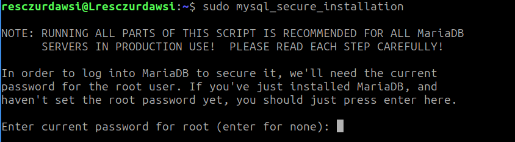
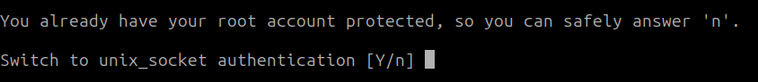
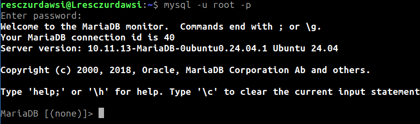
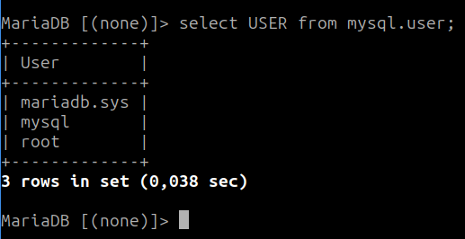

# UT4 CREACION DE TABLAS, VISTAS Y GESTIÓN DE USUARIOS <!-- omit in toc -->
---


- [1. Introducción.](#1-introducción)
- [2. Elementos del lenguaje. Normas de escritura.](#2-elementos-del-lenguaje-normas-de-escritura)
- [3. Tipos de datos.](#3-tipos-de-datos)
  - [3.1. Tipos de dato numéricos.](#31-tipos-de-dato-numéricos)
  - [3.2. Tipos de dato con formato fecha.](#32-tipos-de-dato-con-formato-fecha)
  - [3.3. Tipos de dato con formato string.](#33-tipos-de-dato-con-formato-string)
- [4. Creación de la base de datos.](#4-creación-de-la-base-de-datos)
  - [4.1. Cotejamiento de la base de datos.](#41-cotejamiento-de-la-base-de-datos)
- [5. Creación de las tablas.](#5-creación-de-las-tablas)
  - [5.1. CONSTRAINT (Restricciones)](#51-constraint-restricciones)
  - [5.2. Nombrar restricciones.](#52-nombrar-restricciones)
- [6. Borrado de las tablas.](#6-borrado-de-las-tablas)
- [7. Modificación de las tablas.](#7-modificación-de-las-tablas)
- [8. Vistas.](#8-vistas)
- [9. Gestión de Usuarios.](#9-gestión-de-usuarios)
  - [9.1. Usuarios en Linux.](#91-usuarios-en-linux)
    - [9.1.1. Instalación de MariaDb.](#911-instalación-de-mariadb)
    - [9.1.2. Gestión de usuarios.](#912-gestión-de-usuarios)
    - [9.1.3. Eliminar usuarios.](#913-eliminar-usuarios)
  - [9.2. Usuarios en Windows, Mysql Workbench.](#92-usuarios-en-windows-mysql-workbench)


# 1. Introducción.

SQL (Structured Query Language) es el lenguaje fundamental de los SGBD relacionales. Es uno de los lenguajes más utilizados en informática en todos los tiempos. SQL surgió como una evolución de SEQUEL (Structured English Query Language), lenguaje definido por IBM en 1977. ANSI lo definió como estándar unos años más tarde (1986), y fue adoptado también por ISO al año siguiente. Es un lenguaje declarativo y, por tanto, lo más importante es definir qué se desea hacer, y no cómo hacerlo. De esto último ya se encarga el SGBD. Hablamos por tanto de un lenguaje normalizado que nos permite trabajar con cualquier tipo de lenguaje (ASP o PHP) en combinación con cualquier tipo de base de datos (Access, SQL Server, MySQL, Oracle, etc.). El lenguaje SQL puede ser utilizado tanto de forma interactiva (en una consola del SGBD) como inmerso dentro de un lenguaje anfitrión.

SQL posee dos características muy apreciadas, potencia y versatilidad, que contrastan con su facilidad para el aprendizaje, ya que utiliza un lenguaje bastante natural. Es por esto que las instrucciones son muy parecidas a órdenes humanas. Por esta característica se le considera un Lenguaje de Cuarta Generación. Aunque frecuentemente se oye que SQL es un "lenguaje de consulta", ten en cuenta que no es exactamente cierto ya que contiene muchas otras capacidades además de la de consultar la base de datos, como son la definición de la propia estructura de los datos, su manipulación, y la especificación de conexiones seguras.

# 2. Elementos del lenguaje. Normas de escritura.

El lenguaje SQL está compuesto por comandos, cláusulas, operadores, funciones y literales. Todos estos elementos se combinan en las instrucciones y se utilizan para crear, actualizar y manipular bases de datos. 

En SQL no se distingue entre mayúsculas y minúsculas. Da lo mismo como se escriba. El final de una instrucción o sentencia lo marca el signo de **punto y coma**.

Las sentencias SQL (SELECT, INSERT, …) se pueden escribir en varias líneas siempre que las palabras no sean partidas. Los comentarios en el código SQL pueden ser de 2 tipos:

+ de bloque: comienzan por /* y terminan por */
+ de línea: comienzan por – y terminan en final de línea

# 3. Tipos de datos.

Cuando se crea una tabla instrucción **CREATE TABLE** se debe especificar el tipo de dato para cada una de sus columnas, estos tipos de datos definen el dominio de valores que cada columna puede contener. Los tipos de datos primarios son: 

| Categoría    | Tipo de dato       | Tamaño aproximado    | Descripción                 | Ejemplo               |
| ------------ | ------------------ | -------------------- | --------------------------- | --------------------- |
| Numérico     | `TINYINT`          | 1 byte               | Entero muy pequeño          | `edad TINYINT`        |
| Numérico     | `SMALLINT`         | 2 bytes              | Entero pequeño              | `cantidad SMALLINT`   |
| Numérico     | `MEDIUMINT`        | 3 bytes              | Entero mediano              | `codigo MEDIUMINT`    |
| Numérico     | `INT` o `INTEGER`  | 4 bytes              | Entero                      | `id INT`              |
| Numérico     | `BIGINT`           | 8 bytes              | Entero muy grande           | `poblacion BIGINT`    |
| Numérico     | `DECIMAL(M,D)`     | Variable             | Decimal exacto              | `precio DECIMAL(8,2)` |
| Numérico     | `NUMERIC(M,D)`     | Variable             | Equivalente a DECIMAL       | `nota NUMERIC(4,2)`   |
| Numérico     | `FLOAT`            | 4 bytes              | Decimal de precisión simple | `temperatura FLOAT`   |
| Numérico     | `DOUBLE`           | 8 bytes              | Decimal de doble precisión  | `altura DOUBLE`       |
| Numérico     | `BIT(M)`           | Variable             | Almacena bits               | `permisos BIT(8)`     |
| Lógico       | `BOOLEAN` o `BOOL` | 1 byte               | Valor lógico (0 ó 1)        | `activo BOOLEAN`      |
| Texto        | `CHAR(n)`          | Fijo                 | Cadena de longitud fija     | `dni CHAR(9)`         |
| Texto        | `VARCHAR(n)`       | Variable             | Cadena de longitud variable | `nombre VARCHAR(50)`  |
| Texto        | `TINYTEXT`         | Hasta 255 caracteres | Texto corto                 | `comentario TINYTEXT` |
| Texto        | `TEXT`             | Hasta 65 KB          | Texto largo                 | `descripcion TEXT`    |
| Texto        | `MEDIUMTEXT`       | Hasta 16 MB          | Texto muy largo             | `articulo MEDIUMTEXT` |
| Texto        | `LONGTEXT`         | Hasta 4 GB           | Texto extremadamente largo  | `libro LONGTEXT`      |
| Fecha y hora | `DATE`             | 3 bytes              | Fecha                       | `fecha DATE`          |
| Fecha y hora | `TIME`             | 3 bytes              | Hora                        | `hora TIME`           |
| Fecha y hora | `DATETIME`         | 8 bytes              | Fecha y hora                | `fecha_hora DATETIME` |
| Fecha y hora | `TIMESTAMP`        | 4 bytes              | Marca temporal              | `creado TIMESTAMP`    |
| Fecha y hora | `YEAR`             | 1 byte               | Año                         | `curso YEAR`          |

## 3.1. Tipos de dato numéricos.
Listado de cada uno de los tipos de dato numéricos en MySQL, su ocupación en disco y valores. 

+ **INT (INTEGER)**: Ocupación de 4 bytes con valores entre -2147483648 y 2147483647 o entre 0 y 4294967295. 
+ **SMALLINT**: Ocupación de 2 bytes con valores entre -32768 y 32767 o entre 0 y 65535. 
+ **TINYINT**: Ocupación de 1 bytes con valores entre -128 y 127 o entre 0 y 255. 
+ **MEDIUMINT**: Ocupación de 3 bytes con valores entre -8388608 y 8388607 o entre 0 y 16777215. 
+ **BIGINT**: Ocupación de 8 bytes con valores entre -8388608 y 8388607 o entre 0 y 16777215. 
+ **DECIMAL (NUMERIC)**: Almacena los números de coma flotante como cadenas o string. 
+ **FLOAT (m,d)**: Almacena números de coma flotante, donde ‘m’ es el número de dígitos de la parte entera y ‘d’ el número de decimales. 
+ **DOUBLE (REAL)**: Almacena número de coma flotante con precisión doble. Igual que FLOAT, la diferencia es el rango de valores posibles. 
+ **BIT (BOOL, BOOLEAN)**: Número entero con valor 0 o 1. 

## 3.2. Tipos de dato con formato fecha. 
Listado de cada uno de los tipos de dato con formato fecha en MySQL, su ocupación en disco y valores. 

+ **DATE**: Válido para almacenar una fecha con año, mes y día, su rango oscila entre ‘1000- 01-01′ y ‘9999-12-31′. 
+ **DATETIME**: Almacena una fecha (año-mes-día) y una hora (horas-minutos-segundos), su rango oscila entre ‘1000-01-01 00:00:00′ y ‘9999-12-31 23:59:59′. 
+ **TIME**: Válido para almacenar una hora (horas-minutos-segundos). Su rango de horas oscila entre -838-59-59 y 838-59-59. El formato almacenado es ‘HH:MM:SS’. 
+ **TIMESTAMP**: Almacena una fecha y hora UTC. El rango de valores oscila entre ‘1970-01- 01 00:00:01′ y ‘2038-01-19 03:14:07′. 
+ **YEAR**: Almacena un año dado con 2 o 4 dígitos de longitud, por defecto son 4. El rango de valores oscila entre 1901 y 2155 con 4 dígitos. Mientras que con 2 dígitos el rango es desde 1970 a 2069 (70-69). 

## 3.3. Tipos de dato con formato string.

Listado de cada uno de los tipos de dato con formato string en MySQL, su ocupación en disco y valores. 

+ **CHAR**: Ocupación fija cuya longitud comprende de 1 a 255 caracteres. 
+ **VARCHAR**: Ocupación variable cuya longitud comprende de 1 a 255 caracteres. 
+ **TINYBLOB**: Una longitud máxima de 255 caracteres. Válido para objetos binarios como son un fichero de texto, imágenes, ficheros de audio o vídeo. No distingue entre minúsculas y mayúsculas. 
+ **BLOB**: Una longitud máxima de 65.535 caracteres. Válido para objetos binarios como son un fichero de texto, imágenes, ficheros de audio o vídeo. No distingue entre minúsculas y mayúsculas. 
+ **MEDIUMBLOB**: Una longitud máxima de 16.777.215 caracteres. Válido para objetos binarios como son un fichero de texto, imágenes, ficheros de audio o vídeo. No distingue entre minúsculas y mayúsculas. 
+ **LONGBLOB**: Una longitud máxima de 4.294.967.298 caracteres. Válido para objetos binarios como son un fichero de texto, imágenes, ficheros de audio o vídeo. No distingue entre minúsculas y mayúsculas. 
+ **SET**: Almacena 0, uno o varios valores una lista con un máximo de 64 posibles valores. 
+ **ENUM**: Igual que SET pero solo puede almacenar un valor. 
+ **TINYTEXT**: Una longitud máxima de 255 caracteres. Sirve para almacenar texto plano sin formato. Distingue entre minúsculas y mayúsculas. 
+ **TEXT**: Una longitud máxima de 65.535 caracteres. Sirve para almacenar texto plano sin formato. Distingue entre minúsculas y mayúsculas. 
+ **MEDIUMTEXT**: Una longitud máxima de 16.777.215 caracteres. Sirve para almacenar texto plano sin formato. Distingue entre minúsculas y mayúsculas. 
+ **LONGTEXT**: Una longitud máxima de 4.294.967.298 caracteres. Sirve para almacenar texto plano sin formato. Distingue entre minúsculas y mayúsculas. 

# 4. Creación de la base de datos.

Básicamente, la creación de la base de datos consiste en crear las tablas que la componen. Con el estándar de SQL la instrucción a usar sería **Create Database**, pero cada SGBD tiene un procedimiento para crear las bases de datos.


> Crear Base de datos.

```sql
create database nombreBaseDatos;
```
> Borrar Base de datos.

```sql
drop database nombreBaseDatos;
```
> Ver las bases de datos creadas.

```sql
show databases;
```
> Usar una base de datos para usarla.

```sql
use nombreBaseDatos;
```
Como vamos a trabajar con scripts, donde vamos a tener la creación de la base de datos, la creación de las tablas y la inserción de los datos. Lo conveniente es borrar la base de datos primero si existe, para ello utilizaremos:

```sql
DROP DATABASE IF EXISTS nombreBaseDatos;
```

## 4.1. Cotejamiento de la base de datos.

El cotejamiento de una base de datos es un conjunto de reglas que define cómo se comparan y ordenan los caracteres y cadenas de texto, como la distinción entre mayúsculas y minúsculas, o el orden de los acentos y letras especiales como la 'ñ'. Determina el juego de caracteres y la configuración específica que se usará para el contenido de la base de datos, como el uso de **utf8_spanish_ci** para español. 

El cotejamiento de la base de datos afecta a:

+ **Comparación de caracteres**: Define cómo se tratan las diferencias entre caracteres. Por ejemplo, si el cotejamiento es "sensible a mayúsculas" (_cs), "A" y "a" se consideran diferentes, mientras que si es "insensible a mayúsculas" (_ci), se tratan como iguales.
+ **Orden de los caracteres**: Establece el orden para ordenar datos alfabéticamente. Un cotejamiento puede colocar la 'ñ' entre la 'n' y la 'o', o tratarla como una letra separada, lo que afecta la forma en que se ordenan las palabras.
+ **Consideraciones del idioma**: Es crucial para manejar correctamente el contenido en diferentes idiomas. Un cotejamiento específico para español, como utf8_spanish_ci, incluye reglas para caracteres como la 'ñ' y las vocales acentuadas.
+ **Configuración**: Se establece al crear la tabla o la base de datos y se puede modificar después, aunque es importante hacerlo con cuidado para evitar problemas de compatibilidad. 

> Ejemplo:

```sql
CREATE DATABASE IF NOT EXISTS `carnea` DEFAULT CHARACTER SET utf8 COLLATE utf8_general_ci;
```
# 5. Creación de las tablas.

Los objetos básicos con los que trabaja SQL son las tablas, que como ya sabemos es un conjunto de filas y columnas cuya intersección se llama celda. Es ahí donde se almacenarán los elementos de información, los datos que queremos recoger. Antes de crear la tabla es conveniente planificar algunos detalles: 

+ Qué nombre le vamos a dar a la tabla. 
+ Qué nombre le vamos a dar a cada una de las columnas. 
+ Qué tipo y tamaño de datos vamos a almacenar en cada columna. 
+ Qué restricciones tenemos sobre los datos. 
+ Alguna otra información adicional que necesitemos. 

La sintaxis básica del comando que permite crear una tabla es la siguiente: 

```sql
CREATE TABLE nombre_tabla (
  columna1  tipo_dato  [ restricciones de columna1 ],
  columna2  tipo_dato  [ restricciones de columna2 ],
  columna3  tipo_dato  [ restricciones de columna3 ],
  ...
  [ restricciones de tabla ]
);
```

Donde las restricciones de la columna son:

```sql
CONSTRAINT nombre_restricción {
  [NOT] NULL | UNIQUE | PRIMARY KEY | DEFAULT valor | CHECK (condición)
}
```
Y las restricciones de la tabla son:

```sql
CONSTRAINT nombre_restricción {
  PRIMARY KEY (columna1 [,columna2] ... )
| UNIQUE (columna1 [,columna2] ... )
| FOREIGN KEY (columna1 [,columna2] ... )
    REFERENCES nombre_tabla (columna1 [,columna2] ... )
    [ON DELETE {CASCADE | SET NULL}]
| CHECK (condición)
}
```
## 5.1. CONSTRAINT (Restricciones)

El significado de las distintas restricciones:

+ **NOT NULL**: no puede tomar valores nulos.
+ **UNIQUE**: el atributo o atributos no podrá tener valores duplicados.
+ **PRIMARY KEY**: indica que el atributo o atributos es la clave primaria. La clave primaria ya lleva implícito no tomar valores nulos ni duplicados.
+ **FOREIGN KEY**: indica que el atributo o atributos actúan como clave foránea de la clave principal de la tabla, viene siempre acompañada de **REFERENCES**.
+ **REFERENCES**: para indicar a qué clave principal de qué tabla hace referencia la clave foránea.
+ **ON DELETE CASCADE**:  acompaña a **FOREIGN KEY** y **REFERENCES** , e indica que al eliminar una fila de la tabla principal, se eliminen automáticamente todas las filas relacionadas en las tablas secundarias.
+ **CHECK**: indicar restricciones en un conjunto de valores que pueda tomar un atributo de una tabla.
+ **AUTO_INCREMENT**: indica que el campo se incrementa automáticamente, por defecto comienza en 1. Si queremos que comience en una cantidad específica hay que indicarlo con  **ALTER TABLE nombre_tabla AUTO_INCREMENT=numero**;
+ **DISABLE**: desactiva temporalmente el **CONSTRAINT**.
+ **ENABLE**: activa un CONSTRAINT no activo.


Para la creación de las restricciones podemos usar los operadors de la tabla, en los ejemplos veremos como se usan:

|Operador|Descripcion|
|--------|-----------|
|<       | menor que|
|>       | mayor que |
|<>      | distinto |
|<=      | menor o igual|
|>=      | mayor o igual|
|=       | igual   |
|BETWEEN | especifica un intervalo de valores| 
|LIKE    | se utiliza para comparar |
|IN      | se utiliza para especificar si unos datos estan en un conjunto|


## 5.2. Nombrar restricciones.

Para nombrar las restricciones podemos seguir los siguientes criterios:

Para la Restricción de Clave principal (solo una en cada tabla):
```sql
CONSTRAINT tabla_campo_pk PRIMARY KEY ...
```
Para Restricciones de Clave foránea (puede haber varias en cada tabla):
```sql
CONSTRAINT tabla_campo_fk1 FOREING KEY ...
CONSTRAINT tabla_campo_fk2 FOREING KEY ...
CONSTRAINT tabla_campo_fk3 FOREING KEY ...
```
Para Restricciones de tipo CHECK (puede haber varias en cada tabla)
```sql
CONSTRAINT tabla_campo_ck1 CHECK ...
CONSTRAINT tabla_campo_ck2 CHECK ...
```
Para Restricciones de tipo UNIQUE (puede haber varias en cada tabla)
```sql
CONSTRAINT tabla_campo_uq1 UNIQUE ...
CONSTRAINT tabla_campo_uq2 UNIQUE ...
```

> Ejemplos :

```sql
CREATE TABLE COCHES (
  matricula             VARCHAR2(8),
  marca                 VARCHAR2(15) NOT NULL,
  color                 VARCHAR2(15),
  codTaller             VARCHAR2(10),
  codProp               VARCHAR2(10),
  CONSTRAINT coches_mat_pk PRIMARY KEY (matricula),
  CONSTRAINT coches_codtaller_fk1 FOREIGN KEY (codTaller)
      REFERENCES TALLER(codTaller),
  CONSTRAINT coches_codprop_fk2 FOREIGN KEY (codProp)
      REFERENCES PROPIETARIO(codProp),
  CONSTRAINT coches_color_ck1
      CHECK (color IN ('ROJO','AZUL','BLANCO','GRIS','VERDE','NEGRO'))
);
```
```sql
 CREATE TABLE EMPLEADO (
	NOMBRE VARCHAR(25), 
	EDAD TINYINT, 
	COD_PROVINCIA TINYINT,
	SEXO VARCHAR(2),
	CONSTRAINT ck_sexo CHECK (SEXO IN(‘H’,’M’)), 
	CONSTRAINT pk_empleado PRIMARY KEY (NOMBRE), 
	CONSTRAINT ck_edad CHECK(EDAD BETWEEN 18 AND 35), 
	CONSTRAINT fk_empleado FOREIGN KEY (COD_PROVINCIA) REFERENCES 	PROVIN (CODIGO) ON DELETE CASCADE
);
```
# 6. Borrado de las tablas.

Podemos eliminar una tabla siempre y cuando contemos con privilegios para ello. En tal caso debemos escribir:

```sql
DROP TABLE NombreTabla [CASCADE];
```
**CASCADE** elimina las restricciones de integridad referencial que remitan a la clave primaria de la tabla borrada.

Si queremos eliminar el contenido de una tabla usaremos:

```sql
TRUNCATE TABLE NombreTabla;
```

# 7. Modificación de las tablas.

> Cambiar el nombre de una tabla.

```sql
RENAME TABLE NombreViejo TO NombreNuevo;
```

> Añadir columnas a una tabla, se añaden al final.

```sql
ALTER TABLE NombreTabla ADD
    ( ColumnaNueva1 Tipo_Dato [ModificadordeTipo],              
      ColumnaNueva2 Tipo_Dato [ModificadordeTipo],
    …
      ColumnaNuevaN Tipo_Dato [ModificadordeTipo] );

Ejemplo:

ALTER TABLE VEHICULOS ADD (
  fechaMatric           DATE,
  tipoFaros             VARCHAR2(20) NOT NULL
);
```
> Modificar columnas de una tabla

```sql
ALTER TABLE nombre_tabla MODIFY (
  columna1  tipo_dato  [ restricciones de columna1 ][,
  columna2  tipo_dato  [ restricciones de columna2 ]
  ... ]
);

Ejemplo:

ALTER TABLE AUTOMOVILES MODIFY (
  color VARCHAR2(20) NOT NULL, 
  codTaller VARCHAR2(15));
```

> Eliminar columnas de una tabla.

```sql
ALTER TABLE NombreTabla DROP COLUMN (Columna1 [, Columna2, …] );
```
> Si queremos renombrar columnas de una tabla: 

```sql
ALTER TABLE NombreTabla RENAME COLUMN NombreAntiguo TO NombreNuevo;
``` 
> Podemos añadir y eliminar las siguientes restricciones de una tabla: CHECK, PRIMARY KEY, NOT NULL, FOREIGN KEY y UNIQUE. Para añadir restricciones usamos la orden: 
```sql
ALTER TABLE nombretabla ADD CONSTRAINT nombrerestricción ... 
```
> Para eliminar restricciones usamos la orden:
```sql
ALTER TABLE nombretabla DROP CONSTRAINT nombrerestriccion ...
```       
> Modificar restricciones.

No podemos modificar direcctamente una restricción pero el proceso es:

1. Borrar la restricción.
2. Crearla de nuevo.

> Activar restricciones.

```sql
ALTER TABLE nombre_tabla ENABLE CONSTRAINT restricción;
```

> Eliminar restricciones.


```sql
ALTER TABLE nombre_tabla DISABLE CONSTRAINT restricción;
```

# 8. Vistas.

Las vistas permiten definir subconjuntos de datos formados con una o varias tablas y/o vistas. Tiene la apariencia de una tabla, pero ocupa menos espacio que éstas ya que solo se almacena la definición de la vista y no los datos que la forman. Gracias a las vistas podemos mostrar a los usuarios una visión parcial de los datos, de modo que podamos mostrar a los usuarios sólo aquellos datos que son de su interés.

> Crear Vistas.

```sql
create view nombreVistas as subconsulta;

Ejemplo:

CREATE VIEW antonios AS
SELECT nombre, apellido1, apellido2, edad FROM personas
WHERE nombre = ‘ANTONIO’;
```

> Modificar Vistas.

Sólo se utiliza la instrucción **ALTER VIEW** para recompilar explícitamente una vista que no es válida. Si desea cambiar la definición de una vista se debe ejecutar la sentencia **CREATE OR REPLACE nombre_vista**.

> Borrado de Vistas.

```sql
drop view nombreVistas;
```

# 9. Gestión de Usuarios.

Por ahora hemos hecho todo como usuario root, con acceso completo a todas las bases de datos. A veces hay casos donde hay más restricciones que pueden ser requeridas, así que debemos conocer las formas de crear usuarios con permisos personalizados.

## 9.1. Usuarios en Linux.

En este apartado vamos a centrarnos en la configuración de los usuarios en consola, para ello vamos a instalar MariaDb y realizar alli las tareas de administración de los usuarios.

### 9.1.1. Instalación de MariaDb.

Lo primero que tenemos que hacer es actualizar los repositorios y actualizar el sistema con el comando:

```bash
sudo apt update && sudo apt upgrade
```

Una vez finalizado procedemos a instalar el Servidor MariaDB

```bash
sudo apt install mariadb-server
```

Cuando termine la instalación ejecutamos un script para mejorar la instalación y la seguridad. Se pedirá establecer una contraseña para el usuario root, eliminar usuarios anónimos, deshabilitar el inicio de sesión remoto del root y eliminar bases de datos de prueba.

```bash
sudo mysql_secure_installation
```

Comenzara el script donde ira mostrando las siguientes pantallas:



Pulsamos Enter o Intro, al no poseer contraseña.



Pulsamos **n**.


Pulsamos **Y** y nos pide la contraseña de root, nos la pedirá 2 veces.


Eliminamos usuarios anónimos pulsamos **Y**.


Para deshabilitar el acceso de root remoto, conexión desde otra máquina. Por seguridad se deshabilita **Y**.


Eliminar las bases de datos de test **Y**.


Actualizamos los privilegios de las tablas **Y**.

Para comprobar que hemos configurado bien ejecutamos

```bash
mysql -u root -p
```
Introducimos la contraseña y nos debe aparecer lo siguiente:



Como se ha visto anteriormente, vamos a ver los usuarios creados en nuestro servidor mediante la sentencia:

```sql
select User from mysql.user;
```

Nos debe aparecer:



### 9.1.2. Gestión de usuarios.

Por ahora hemos hecho todo como usuario root, con acceso completo a todas las bases de datos. A veces hay casos donde hay más restricciones que pueden ser requeridas, así que debemos conocer las formas de crear usuarios con permisos personalizados.

> Crear usuarios

Vamos a empezar por crear un usuario nuevo desde la consola de MySQL:

```sql
CREATE USER nombre_usuario@localhost IDENTIFIED BY 'tu_contrasena';
```

Si queremos ver los usuarios que hay podemos usar:

```sql
select User from mysql.user;
```
Si queremos ver las bases de datos creadas.

```sql
select databases;
```

El nuevo usuario no tiene permisos para hacer algo con las bases de datos. Por consecuencia si el usuario intenta identificarse (con la contraseña establecida), no será capaz de acceder a la consola de MySQL.

Por ello, lo primero que debemos hacer es proporcionarle el acceso requerido al usuario con la información que requiere.

+ **GRANT** da privilegios.

```sql
GRANT ALL PRIVILEGES ON * . * TO 'nombre_usuario'@'localhost';
```
Los asteriscos en este comando hacen referencia a la base de datos y la tabla (respectivamente) a la cual el nuevo usuario tendrá acceso; específicamente este comando permite al usuario leer, editar, ejecutar y realizar todas las tareas en todas las bases de datos y tablas.

Una vez que has finalizado con los permisos que deseas configurar para tus nuevos usuarios, hay que asegurarse siempre de refrescar todos los privilegios.

```sql
FLUSH PRIVILEGES;
```
> Ejemplos

```sql
-- Damos todos los privilegios al usuario administrador a todas las bases de datos y tablas, con contraseña jose.
GRANT ALL PRIVILEGES ON *.* to administrador@localhost IDENTIFIED BY ‘JOSE’;
-- Damos permisos de selec, insert y update a la base de datos facturacion y todas las tablas de la misma al usuario web concontraseña jose.
GRANT SELECT, INSERT, UPDATE ON facturacion.* to web@localhost IDENTIFIED BY ‘jose’;
-- Damos permisos select, insert y update a la base de datos facturacion y la tabla clientes al usuario comercial con contraseña Mercedes.
GRANT SELECT, INSERT, UPDATE ON facturacion.clientes to comercial@localhost IDENTIFIED BY ‘Mercedes’;
```
Aquí podemos ver una pequeña lista de los posibles permisos que los usuarios pueden gozar.

+ **ALL PRIVILEGES**: esto permite a un usuario de MySQL acceder a todas las bases de datos asignadas en el sistema.
+ **CREATE**: permite crear nuevas tablas o bases de datos.
+ **DROP**: permite eliminar tablas o bases de datos.
+ **DELETE**: permite eliminar registros de tablas.
+ **INSERT**: permite insertar registros en tablas.
+ **SELECT**: permite leer registros en las tablas.
+ **UPDATE**: permite actualizar registros seleccionados en tablas.

Para eliminar privilegios.

+ **REVOKE** quita privilegios,, funciona como GRANT.

```sql
REVOKE ALL PRIVILEGES ON *.* FROM administrador@localhost;
```

### 9.1.3. Eliminar usuarios.

Así como puedes borrar bases de datos con DROP, también puedes usar el comando DROP para borrar usuarios:

```sql
DROP USER ‘usuario_prueba’@‘localhost’;
```

## 9.2. Usuarios en Windows, Mysql Workbench.

