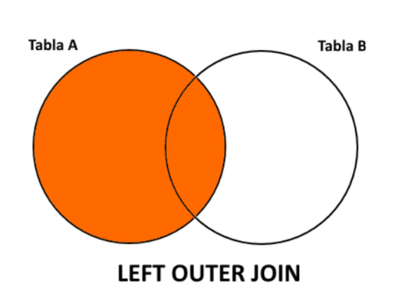
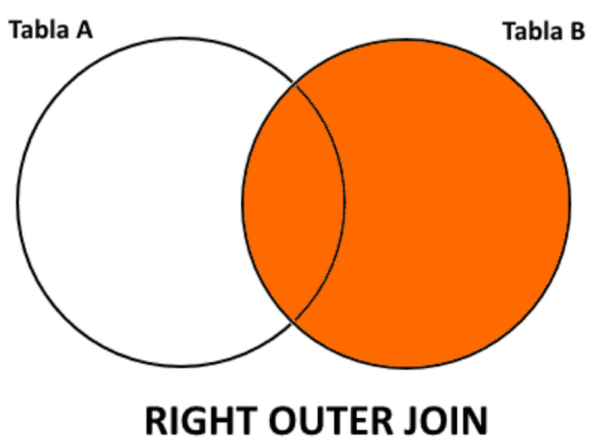
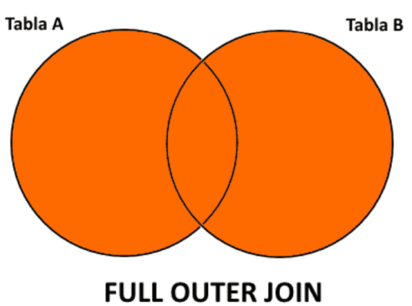

# UT5 CONSULTAS Y SUBCONSULTAS <!-- omit in toc -->
---

- [1. Consulta de datos.](#1-consulta-de-datos)
  - [1.1. Funciones de agregación.](#11-funciones-de-agregación)
  - [1.2. Agrupando resultados (GROUP BY y HAVING).](#12-agrupando-resultados-group-by-y-having)
  - [1.3. Funciones en consultas de selección.](#13-funciones-en-consultas-de-selección)
    - [1.3.1. Funciones aritméticas.](#131-funciones-aritméticas)
    - [1.3.2. Funciones de cadenas.](#132-funciones-de-cadenas)
    - [1.3.3. Funciones de manejo de fehas.](#133-funciones-de-manejo-de-fehas)
- [2. Operadores de comparación de cadenas de caracteres.](#2-operadores-de-comparación-de-cadenas-de-caracteres)
- [3. NULL y NOT NULL.](#3-null-y-not-null)
- [4. IN y BETWEEN.](#4-in-y-between)
- [5. Subconsultas.](#5-subconsultas)
- [6. Combinación de tablas.](#6-combinación-de-tablas)
- [7. Tipos de JOIN.](#7-tipos-de-join)
  - [7.1. INNER JOIN o JOIN.](#71-inner-join-o-join)
  - [7.2. LEFT JOIN.](#72-left-join)
  - [7.3. RIGHT JOIN.](#73-right-join)
  - [7.4. FULL JOIN.](#74-full-join)
- [8. Operadores UNION, INTERSECT y MINUS.](#8-operadores-union-intersect-y-minus)


# 1. Consulta de datos.

Para recuperar información o, lo que es lo mismo, para realizar consultas a la base de datos, utilizaremos una única sentencia **SELECT**. El usuario emplea esta sentencia con el nivel de complejidad apropiado para él: especifica qué es lo que quiere obtener, no dónde ni cómo. De la consulta se puede obtener: cualquier unidad de datos, todos los datos, cualquier subconjunto de datos, cualquier conjunto de subconjuntos de datos.

El formato de la sentencia SELECT es el siguiente:

```sql
SELECT [ALL|DISTINCT]
[expre_colum1, expre_colum2, ..., expre_column | * ]
[alias columna]
FROM [nombre_tabla1, nombre_tabla2, ..., nombre_tablan]
[WHERE condición]
[GROUP BY expre_colum1 , …, expre_column]
[HAVING condición2]
[ORDER BY expre_colum [DESC|ASC] [,expre_colum [DESC|ASC]]...];
```

Donde:
+ **expre_colum**: puede ser una columna de una tabla, una constante, una expresión aritmética, una función o varias funciones anidadas.
+ `*` : seleccionamos todas las columnas.
+ **DISTINCT**: no muestra valores duplicados.
```sql
SELECT DISTINCT DEPT_NO FROM EMPLE;
```
+ **ALL**: Recuperamos todas las filas es la opción por defecto.
+ **alias**: Cuando se consulta la base de datos, los nombres de las columnas se usan como cabeceras de presentación. Si el nombre resulta demasiado largo, corto o críptico, existe la posibilidad de cambiarlo con la misma sentencia SQL de consulta creando un ALIAS. El ALIAS se pone entre comillas dobles, a la derecha de la columna.
```sql
SELECT NOMBRE_ALUMNO "Nombre Alumno", (NOTA1+NOTA2+NOTA3)/3 "Nota Media" FROM NOTAS_ALUMNOS;
```
+ **FROM**: FROM [nombre_tabla1, nombre_tabla2, ..., nombre_tablan]

Especifica la tabla o lista de tablas de las que se ecuperarán los datos. Por ejemplo, consultamos los nombres de alumnos y su nota en la tabla ALUMNOS:

```sql
SELECT NOM_ALUM, NOTA FROM ALUMNOS;
SELECT nombre, precio, precio*1.16 FROM ARTICULOS;
```

Es posible asociar un nuevo nombre a las tablas mediante alias. 

```sql
-- si la tabla ALUMNOS le damos el nombre de A, las columnas de la tabla irán acompañadas de A.
SELECT A.NOM_ALUM, A.NOTA FROM ALUMNOS A;
```

+ **WHERE**: [WHERE condición]
  
Obtiene las filas que cumplen la condición expresada. La complejidad de la condición es prácticamente ilimitada. 
El formato de la condición es: *expresión operador expresión*. Lasexpresiones pueden ser una constante, una expresión aritmética, un valor nulo o un nombre de columna. Se pueden construir condiciones múltiples usando los operadores lógicos booleanos estándares: AND, OR y NOT. Está permitido emplear paréntesis para forzar el orden de evaluación.

Podemos utilizar los siguientes operadores:

|Operador|Descripcion|
|--------|-----------|
|<       | menor que|
|>       | mayor que |
|<>      | distinto |
|<=      | menor o igual|
|>=      | mayor o igual|
|=       | igual   |
|BETWEEN | especifica un intervalo de valores| 
|LIKE    | se utiliza para comparar |
|IN      | se utiliza para especificar si unos datos estan en un conjunto|
|AND     | Evalúa dos condiciones y devuelve un valor verdadero si ambas son verdaderas|
|OR     | Evalúa dos condiciones y devuelve un valor verdadero si alguna de las dos es verdaderas|
|NOT    | Devuelve el valor contrario a la expresión|

Veamos unos ejemplos de condiciones en la cláusula WHERE:

```sql
SELECT NOM_ALUM, NOTA FROM ALUMNOS WHERE NOTA = 5;
SELECT NOM_ALUM, NOTA FROM ALUMNOS WHERE (NOTA>=10) AND (CURSO=1);
```
+ **GROUP BY**: [GROUP BY expre_colum1 , …, expre_column]

Esta cláusula permite crear grupos de datos. Hasta ahora, todas las consultas han recuperado datos en bruto y sin ningún tipo de manipulación. Sin embargo, puede que en ocasiones queramos mostrar alguna tendencia en los datos que requiera que el servidor de la base de datos los procese de alguna manera antes de obtener el conjunto de resultados. Uno de estos mecanismos es la cláusula **group by**, que se utiliza para agrupar datos por los valores de las columnas. 

Por ejemplo, en lugar de consultar una lista de empleados y los departamentos a los que están asignados, es probable que deseemos ver una lista de departamentos junto con el número de empleados asignados a cada uno de ellos.

Cuando utilicemos la cláusula **group by**, también podemos utilizar la cláusula **having**, que le permite filtrar los datos de grupo del mismo modo que la cláusula **where** permite filtrar datos sin manipular.

Vamos a ver la diferencia de usar group by o no:

+ **Sin group by**: Si hacemos:
```sql
select SUM(pvp) from dormitorio;
-- Obtenemos la suma de todo el dinero de la tabla.
```

+ **Con group by**: Si hacemos:
```sql
select inmueble_id,SUM(pvp) from dormitorio
group by inmueble_id;
-- Obtenemos la suma por cada casa.
```
+ **HAVING**: [HAVING condición2]

Esta cláusula siempre viene acompañada de una cláusula **GROUP BY**. Y permite restringir los gruposformados por GROUP BY. Sería el WHERE de los grupos.

+ **ORDER BY**: [ORDER BY expre_columna [DESC|ASC] [,expre columna[DESC|ASC]]...]

Esta cláusula especifica el criterio de clasificación del resultado de la consulta. **ASC** especifica una ordenación ascendente, y **DESC** descendente. Es posible anidar los criterios. El situado más a la izquierda será el principal. 

```sql
SELECT * FROM ALUMNOS ORDER BY NOM_ALUM, CURSO DESC;
-- ordena por NOM_ALUM ascendente y por CURSO descendente.
```
También se puede indicar mediante un número, que indica la posición de la columna a la derecha de SELECT, el criterio de clasificación.

```sql
SELECT DEPT_NO, DNOMBRE, LOC FROM DEPART ORDER BY 2;
-- ordena la salida por la segunda columna que es DNOMBRE.
```
Podemos ver la estructura de una tabla con el comando DESC.
```sal
DESC  NOTAS_ALUMNOS;
```
Nos muestra el nombre de los campos, el tipo de dato si es admite valores NULL, las claves primaria y foráneas y los valores por defecto de los campos.

## 1.1. Funciones de agregación.

Las funciones de agregación en SQL nos permiten efectuar operaciones sobre un conjunto de resultados, pero devolviendo un único valor agregado para todos ellos. Es decir, nos permiten obtener medias, máximos, etc... sobre un conjunto de valores.

Las funciones de agregación básicas que soportan todos los gestores de datos son las siguientes:

+ **COUNT**: devuelve el número total de filas seleccionadas por la consulta.
+ **MIN**: devuelve el valor mínimo del campo que especifiquemos.
+ **MAX**: devuelve el valor máximo del campo que especifiquemos.
+ **SUM**: suma los valores del campo que especifiquemos. Sólo se puede utilizar en columnas numéricas.
+ **AVG**: devuelve el valor promedio del campo que especifiquemos. Sólo se puede utilizar en columnas numéricas.

Las funciones anteriores son las básicas en SQL, pero cada sistema gestor de bases de datos relacionales ofrece su propio conjunto, más amplio, con otras funciones de agregación
particulares.

```sql
-- Cálculo del salario medio de los empleados del departamento 10 de la tabla EMPLE:
SELECT AVG(SALARIO) FROM EMPLE WHERE DEPT_NO=10;
-- Cálculo del máximo salario de la tabla EMPLE:
SQL> SELECT MAX(SALARIO) FROM EMPLE;
-- Todas estas funciones se aplican a una sola columna, que especificaremos entre paréntesis,excepto la función COUNT, que se puede aplicar a una columna o indicar un “*”. La diferencia entre poner el nombre de una columna o un “*”, es que en el primer caso no cuentalos valores nulos para dicha columna, y en el segundo sí.
-- Cálculo del número de filas de la tabla EMPLE:
SELECT COUNT(*) FROM EMPLE;
-- Cálculo del número de filas de la tabla EMPLE donde la COMISION no es nula:
SELECT COUNT(COMISION) FROM EMPLE;
-- Calcula el número de oficios que hay en la tabla EMPLE:
SELECT COUNT(OFICIO) "OFICIOS" FROM EMPLE;
--Esta consulta cuenta todos los oficios de la tabla EMPLE que no sean nulos, estén repetidos o no. Si queremos contar los distintos oficios que hay en la tabla EMPLE, tendríamos que incluir
DISTINCT en la función de grupo:
SELECT COUNT(DISTINCT OFICIO) "OFICIOS" FROM EMPLE;
```

## 1.2. Agrupando resultados (GROUP BY y HAVING).

La cláusula GROUP BY unida a un SELECT permite agrupar filas según las columnas que se indiquen como parámetros, y se suele utilizar en conjunto con las funciones de agrupación,
para obtener datos resumidos y agrupados por las columnas que se necesiten.

```sql
-- Para saber cuál es el salario medio de cada departamento de la tabla EMPLE necesitamos realizar un agrupamiento por departamento. Para ello utilizaremos la cláusula GROUP BY.
SELECT DEPT_NO, AVG(SALARIO) FROM EMPLE GROUP BY DEPT_NO;
```
La sentencia SELECT posibilita agrupar uno o más conjuntos de filas. El agrupamiento se lleva a cabo mediante la cláusula GROUP BY por las columnas especificadas y en el orden
especificado. 

Sintaxis:
```sql
SELECT ...
FROM ...
GROUP BY columna1, columna2, columna3,... HAVING
condición
ORDER BY ...
```

Los datos seleccionados en la sentencia SELECT que lleva el GROUP BY deben ser: una constante, una función de grupo (SUM, COUNT, AVG, ...), una columna expresada en el GROUP BY.

La cláusula GROUP BY sirve para calcular propiedades de uno o más conjuntos de filas.Además, si se selecciona más de un conjunto de filas, GROUP BY controla que las filas de la tabla original sean agrupadas en una temporal. Del mismo modo que existe la condición debúsqueda WHERE para filas individuales, también hay una condición de búsqueda para grupos de filas: HAVING. La cláusula HAVING se emplea para controlar cuál de los conjuntos de filas se visualiza. Se evalúa sobre la tabla que devuelve el GROUP BY. No puede existir sin GROUP BY.

```sql
-- Visualiza a partir de la tabla EMPLE el número de empleados que hay en cadadepartamento. Para hacer esta consulta, tenemos que agrupar las filas de la tabla EMPLE por departamento (GROUP BY DEPT_NO) y contarlas (COUNT(*)).
SELECT DEPT_NO, COUNT(*) FROM EMPLE GROUP BY DEPT_NO;
-- COUNT es una función de grupo y da información sobre un grupo de filas, no sobre filas individuales de la tabla. La cláusula GROUP BY DEPT_NO obliga a COUNT a contar las filas que se han agrupado por cada departamento.
-- Si en la consulta anterior sólo queremos visualizar los departamentos con más de 4 empleados.
SELECT DEPT_NO, COUNT(*) FROM EMPLE GROUP BY DEPT_NO HAVING COUNT(*)4;
```

## 1.3. Funciones en consultas de selección.

En el lenguaje SQL estándar existen básicamente 5 tipos de funciones: aritméticas, de cadenas de caracteres, de fechas, de conversión, y otras funciones diversas que no se pueden incluir en ninguno de los grupos anteriores.

### 1.3.1. Funciones aritméticas.

+ **ABS(n)**: Devuelve el valor absoluto de “n”.
+ **ROUND(m, n)**: Redondea el número “m” con el número de decimales indicado en “n”, si no se indica “n” asume cero decimales.
+ **SQRT(n)**: Devuelve la raíz cuadrada del parámetro que se le pase.
+ **POWER(m, n)**: Devuelve la potencia de “m” elevada el exponente “n”.
  
### 1.3.2. Funciones de cadenas.

+ **LOWER(c)**: Devuelve la cadena “c” con todas las letras convertidas a minúsculas. No es lo mismo buscar "JUAN" que "juan"
+ **UPPER(c)**: Devuelve la cadena “c” con todas las letras convertidas a mayúsculas.
+ **LTRIM(c)**: Elimina los espacios por la izquierda de la cadena “c”.
+ **RTRIM(c)**: Elimina los espacios por la derecha de la cadena “c”.
+ **REPLACE(c, b, s)**: Sustituye en la cadena “c” el valor buscado “b” por el valor indicado en “s”. Ej. cambiar "Avda." por "Avenida"
+ **REPLICATE(c, n)**: Devuelve el valor de la cadena “c” el número de veces “n” indicado.
+ **LEFT(c, n)**: Devuelve “n” caracteres por la izquierda de la cadena “c”.
+ **RIGHT(c, n)**: Devuelve “n” caracteres por la derecha de la cadena “c”.
+ **SUBSTRING(c, m, n)**: Devuelve una sub-cadena obtenida de la cadena “c”, a partir de la posición “m” y tomando “n” caracteres. Si tienes un código de producto "ESP-1234" y quieres solo el país, usas substring para sacar las primeras 3 letras.

### 1.3.3. Funciones de manejo de fehas.

+ **YEAR(d)**: Devuelve el año correspondiente de la fecha “d”.
+ **MONTH(d)**: Devuelve el mes de la fecha “d”.
+ **DAY(d)**: Devuelve el día del mes de la fecha “d”.
+ **DATEADD(f, n, d)**: Devuelve una fecha “n” periodos (días, meses, años, según lo indicado) superior a la fecha “d”. Si se le pasa un número “n” negativo,devuelve una fecha “n” periodos inferior.

# 2. Operadores de comparación de cadenas de caracteres.

Para comparar cadenas de caracteres, hasta ahora hemos utilizado el operador de comparación Igual a (=). 

```sql
-- Partiendo de la tabla EMPLE, obtenemos el apellido de los ANALISTAS del departamento 10.
SELECT APELLIDO FROM EMPLE WHERE OFICIO = 'ANALISTA' AND DEPT_NO=10;
```

Pero este operador no nos sirve si queremos hacer consultas de este tipo: Obtener los datos de los empleados cuyo apellido empiece por una «P» u «obtener los nombres de alumnos que incluyan la palabra Pérez». Para especificar este tipo de consultas, en SQL usamos el operador LIKE que permite utilizar los siguientes caracteres especiales en las cadenas de comparación:

+ **% Comodín**: representa cualquier cadena de 0 o más caracteres.
+ **'_' Marcador de posición**: representa un carácter cualquiera.

**Ejemplos**: (Hemos de tener en cuenta que las mayúsculas y minúsculas son significativas, ‘m’ no es lo mismo que ‘M’, y que las constantes alfanuméricas deben encerrarse siempre entre
comillas simples).

+ **LIKE 'Director'** la cadena 'Director'.
+ **LIKE 'M%'** cualquier cadena que empiece por 'M'.
+ **LIKE '%X%'** cualquier cadena que contenga una 'X'.
+ **LIKE ' _M'** cualquier cadena de 3 caracteres terminada en 'M'.
+ **LIKE 'N_'** una cadena de 2 caracteres que empiece por 'N'.
+ **LIKE '_R%'** cualquier cadena cuyo segundo carácter sea una 'R' .

```sql
-- apellidos que empiezan por J
SELECT APELLIDO FROM EMPLE WHERE APELLIDO LIKE 'J%';
-- apellidos que tengan una R en segunda posición
SELECT APELLIDO FROM EMPLE WHERE APELLIDO LIKE '_R%';
-- apellidos que empieces por A y tengan una O en su interior
SELECT APELLIDO FROM EMPLE WHERE APELLIDO LIKE 'A%O%';
```

# 3. NULL y NOT NULL.

Se dice que una columna de una fila es NULL si está completamente vacía. Para comprobar si el valor de una columna es nulo empleamos la expresión: columna IS NULL. Si queremos saber si el valor de una columna no es nulo, usamos la expresión: columna IS NOT NULL. Cuando comparamos con valores nulos o no nulos no podemos utilizar los operadores de igualdad, mayor o menor.

```sql
-- a partir de la tabla EMPLE, consultamos los apellidos de los empleados cuya comisión es nula
SELECT APELLIDO FROM EMPLE WHERE COMISION IS NULL;
-- si queremos consultar los apellidos de los empleados cuya comisión no sea nula teclearemos esto:
SELECT APELLIDO FROM EMPLE WHERE COMISION IS NOT NULL;
```

# 4. IN y BETWEEN.

También podemos comparar una columna o una expresión con una lista de valores utilizando los operadores IN y BETWEEN.

El operador **IN** nos permite comprobar si una expresión pertenece o no (NOT) a un conjunto de valores, haciendo posible la realización de comparaciones múltiples. 

Su formato es:
```sql
<expresión> [NOT] IN (lista de valores separados por comas)
```

```sql
-- Consulta los apellidos de la tabla EMPLE cuyo número de departamento sea 10 o 30:
SELECT APELLIDO FROM EMPLE WHERE DEPT_NO IN(10,30);
-- Consulta los apellidos de la tabla EMPLE cuyo número de departamento no sea ni 10 ni 30:
SELECT APELLIDO FROM EMPLE WHERE DEPT_NO NOT IN(10,30);
-- Consulta los apellidos de la tabla EMPLE cuyo oficio sea 'VENDEDOR', 'ANALISTA' o 'EMPLEADO':
SELECT APELLIDO FROM EMPLE WHERE OFICIO IN ('VENDEDOR', 'ANALISTA','EMPLEADO');
```

El operador **BETWEEN** comprueba si un valor está comprendido o no (NOT) dentro de un rango de valores, desde un valor inicial a un valor final. 

Su formato es:
```sql
<expresión> [NOT] BETWEEN valor_inicial AND valor_final
```
```sql
-- A partir de la tabla EMPLE, obtén el apellido y el salario de los empleados cuyo salario esté comprendido entre 1500 y 2000
SELECT APELLIDO, SALARIO FROM EMPLE WHERE SALARIO BETWEEN 1500
AND 2000;
```

# 5. Subconsultas.

A veces, para realizar alguna operación de consulta, necesitamos los datos devueltos por otra consulta; una subconsulta, que no es más que una sentencia SELECT dentro de otra SELECT. Las subconsultas son aquellas sentencias SELECT que forman parte de una cláusula WHERE de una sentencia SELECT anterior. Una subconsulta consistirá en incluir una declaración SELECT como parte de una cláusula WHERE. El formato de una subconsulta es similar a éste:

```sql
SELECT ...
FROM ...
WHERE columna operador_comparativo (SELECT ...
                                    FROM ...
                                    WHERE ... );
```

La subconsulta (el comando SELECT entre paréntesis) se ejecutará primero y, posteriormente, el valor extraído es «introducido» en la consulta principal.

Las instrucciones que incluyen una subconsulta suelen emparejarse con uno de estos patrones en las secciones WHERE o HAVING:

+ Expresión_WHERE/HAVING **[NOT] IN** (subconsulta).
+ Expresión_WHERE/HAVING **operador_comparación [ANY | ALL]** (subconsulta).
+ WHERE **[NOT] EXISTS** (subconsulta).

```sql
-- Con la tabla EMPLE, obtén el APELLIDO de los empleados con el mismo OFICIO que 'GIL'.
SELECT APELLIDO FROM EMPLE WHERE OFICIO = (SELECT OFICIO FROM EMPLE WHERE APELLIDO ='GIL');
-- Obtener aquellos apellidos de empleados cuyo oficio sea alguno de los oficios que hay en el departamento 20.
SELECT APELLIDO FROM EMPLE WHERE OFICIO IN (SELECT OFICIO FROM EMPLE WHERE DEPT_NO=20);
--Listar los departamentos que tengan empleados.
SELECT DNOMBRE, DEPT_NO FROM DEPART WHERE EXISTS (SELECT * FROM EMPLE WHERE EMPLE.DEPT_NO= DEPART.DEPT_NO);
-- Obtener los datos de los empleados cuyo salario sea igual a algún salario de los empleados del departamento 30.
SELECT * FROM EMPLE WHERE SALARIO = ANY (SELECT SALARIO FROM EMPLE WHERE DEPT_NO=30);
-- Obtener los datos de los empleados cuyo salario sea menor a cualquier salario de los empleados del departamento 30.
SELECT * FROM EMPLE WHERE SALARIO < ALL (SELECT SALARIO FROM EMPLE WHERE DEPT_NO=30);
-- Usamos las tablas EMPLE y DEPART. Queremos consultar los datos de los empleados que trabajen en 'MADRID' o 'BARCELONA'. La localidad de los departamentos se obtiene de la tabla DEPART. Hemos de relacionar las tablas EMPLE y DEPART por el número de departamento.
SELECT EMP_NO, APELLIDO, OFICIO, DIR, FECHA_ALT, SALARIO,  COMISION, DEPT_NO FROM EMPLE WHERE DEPT_NO IN (SELECT DEPT_NO FROM DEPART WHERE LOC IN ('MADRID','BARCELONA');
```
Podemos realizar las subconsultas las veces que haga falta.

```sql
-- Mostramos el empleado y la paga de los empleados cuya paga sea menor que la paga de Martina y Luis.
SELECT nombre_empleado, paga
FROM EMPLEADOS
WHERE paga < ( SELECT paga
               FROM EMPLEADOS
               WHERE nombre_empleado='Martina')
AND   paga > ( SELECT paga
               FROM EMPLEADOS
               WHERE nombre_empleado='Luis');
```
# 6. Combinación de tablas.

Hasta ahora, en las consultas que hemos realizado sólo se ha utilizado una tabla, indicada a la derecha de la palabra FROM; pero hay veces que una consulta necesita columnas de varias tablas. En este caso, las tablas se expresarán a la derecha de la palabra FROM.

```sql
SELECT columnas
FROM tabla1, tabla2,...
WHERE tabla1.columna = tabla2.columna;
```

```sql
-- Realiza una consulta para obtener el nombre de alumno, su asignatura y su nota:
SELECT APELLIDOSNOMBRE, NOMBRE_ASIG, NOTA FROM ALUMNOS, ASIGNATURAS, NOTAS WHERE ALUMNOS.DNI=NOTAS.DNI AND NOTAS.COD=ASIGNATURAS.COD;
-- Obtén los nombres de alumnos matriculados en ‘FOL’:
SELECT APELLIDOS,NOMBRE FROM ALUMNOS, ASIGNATURAS, NOTAS WHERE ALUMNOS.DNI=NOTAS.DNI  AND  NOTAS.COD=ASIGNATURAS.COD  AND NOMBRE_ASIG =’FOL’;
```
# 7. Tipos de JOIN.

Lo que hemos hecho en el apartado anterior es equivalente a realizar una operación de unión de tablas JOIN.

[Join para principiantes](https://learnsql.es/blog/explicacion-de-sql-joins-5-ejemplos-claros-de-inner-join-sql-para-principiantes/).

La operación JOIN o combinación permite mostrar columnas de varias tablas como si se tratase de una sola tabla, combinando entre sí los registros relacionados usando para ello claves externas. Las tablas relacionadas se especifican en la  cláusula FROM, y además hay que hacer coincidir los valores que relacionan las columnas de las tablas.

```sql
SELECT [ ALL / DISTINCT ] [ * ] / [ListaColumnas_Expresiones] FROM NombreTabla1 JOIN NombreTabla2 ON Condiciones_Vinculos_Tablas
```

```sql
--Realiza una consulta para obtener el nombre de alumno, su asignatura y su nota: (sin JOIN)
SELECT APELLIDOSNOMBRE, NOMBRE_ASIG, NOTA FROM
ALUMNOS AL, ASIGNATURAS AS, NOTAS N WHERE AL.DNI=N.DNI AND N.COD=AS.COD;
--(con JOIN)
SELECT APELLIDOSNOMBRE, NOMBRE_ASIG, NOTA FROM
ALUMNOS AL JOIN NOTAS N ON AL.DNI=N.DNI JOIN
ASIGNATURAS AS ON N.COD=AS.COD;
```
## 7.1. INNER JOIN o JOIN.

Devuelven únicamente aquellos registros/filas que tienen valores idénticos en los dos campos que se comparan para unir ambas tablas. Es decir, aquellas que tienen elementos en las dos tablas, identificados éstos por el campo de relación. Veamos un diagrama que representa esto:


Sintaxis:

```sql
SELECT TABLA1.columna1, TABLA1.columna2, ...
       TABLA2.columna1, TABLA2.columna2, ...
FROM TABLA1 JOIN TABLA2
ON TABLA1.columnaX = TABLA2.columnaY;
```
```sql
-- Ver los empleados con sucursal asignada
SELECT E.*, S.LOCALIDAD
FROM EMPLEADOS E JOIN SUCURSALES S ON E.COD_SUCURSAL = S.COD_SUCURSAL;
```
En este caso se devuelven los registros que tienen nexo de unión en ambas tablas. En realidad, esto ya lo conocíamos puesto que, en las combinaciones internas, el uso de la palabra INNER es opcional así que si simplemente indicamos la palabra JOIN y la combinación de columnas el sistema sobreentiende que estamos haciendo una combinación interna (INNER JOIN).

## 7.2. LEFT JOIN.

Se obtienen todas las filas de la tabla colocada a la izquierda, aunque no tengan correspondencia en la tabla de la derecha:

Sintaxis:

```sql
SELECT T1.Col1, T1.Col2, T1.Col3, T2.Col7 FROM Tabla1 T1 LEFT
[OUTER] JOIN Tabla2 T2 ON T1.Col1 = T2.Col1
```


```sql
-- Mostrar los empleados que tengan asignada una sucursal.
SELECT E.*, S.LOCALIDAD
FROM EMPLEADOS E LEFT JOIN SUCURSALES S
ON E.COD_SUCURSAL = S.COD_SUCURSAL;
```

## 7.3. RIGHT JOIN.

Se obtienen todas las filas de la tabla de la derecha,
aunque no tengan correspondencia en la tabla de la izquierda.

```sql
SELECT T1.Col1, T1.Col2, T1.Col3, T2.Col7
FROM Tabla1 T1 RIGHT [OUTER] JOIN Tabla2 T2 ON T1.Col1 = T2.Col1
```


```sql
-- Muestra todas las sucursales que tiene algún empleado asignado.
SELECT E.DNI, E.NOMBRE, S.*
FROM EMPLEADOS E RIGHT JOIN SUCURSALES S
ON E.COD_SUCURSAL = S.COD_SUCURSAL;
```

## 7.4. FULL JOIN.

Se obtienen todas las filas en ambas tablas, aunque no tengan correspondencia en la otra tabla. Es decir, todos los registros de A y de B aunque no haya correspondencia entre
ellos, rellenando con nulos los campos que falten:

```sql
SELECT T1.Col1, T1.Col2, T1.Col3, T2.Col7
FROM Tabla1 T1 FULL [OUTER] JOIN Tabla2 T2 ON T1.Col1 = T2.Col1
```


# 8. Operadores UNION, INTERSECT y MINUS.

Los operadores relacionales UNION, INTERSECT y MINUS son operadores de conjuntos.
Los conjuntos son las filas resultantes de cualquier sentencia SELECT válida que permiten combinar los resultados de varias SELECT para obtener un único resultado.

Supongamos que tenemos dos listas de centros de enseñanza de una ciudad y que queremos enviar a esos centros una serie de paquetes de libros. Dependiendo de ciertas características de los centros, podemos enviar libros a todos los centros de ambas listas (UNION), a los centros que estén en las dos listas (INTERSECT) o a los que están en una lista y no están en
la otra (MINUS). 

El formato de SELECT con estos operadores es el siguiente:

```sql
SELECT ... FROM ... WHERE...
Operador_de_conjunto
SELECT ... FROM ... WHERE...
```

+ **UNION**

Combina los resultados de dos consultas. Las filas duplicadas que aparecen se reducen a una fila única. Éste es su formato:

```sql
SELECT COL1, COL2, ... FROM TABLA1 WHERE CONDICION UNION
SELECT COL1, COL2, ... FROM TABLA2 WHERE CONDICION;
```
```sql
-- ALUM contiene los nombres de alumnos que se han matriculado este curso en el centro,NUEVOS contiene los nombres de los alumnos que han reservado plaza para el próximo curso y ANTIGUOS contiene los nombres de antiguos alumnos del centro. Queremos visualizar los nombres de los alumnos actuales y de los futuros alumnos. Obtenemos los nombres de alumnos que aparezcan en las tablas ALUM y NUEVOS de la siguiente manera:
SELECT NOMBRE FROM ALUM UNION SELECT NOMBRE FROM NUEVOS;
```

+ **UNION ALL** 
  
Combina los resultados de dos consultas. Cualquier duplicación de filas que se dé en el resultado final aparecerá en la consulta. En la consulta anterior, usando UNION ALL
aparecerán nombres duplicados:

```sql
SELECT NOMBRE FROM ALUM UNION ALL SELECT NOMBRE FROM NUEVOS;
```

+ **INTERSECT** 

Devuelve las filas que son iguales en ambas consultas. Todas las filas duplicadas serán eliminadas antes de la generación del resultado final. Su formato es:

```sql
SELECT COL1, COL2, ... FROM TABLA1 WHERE CONDICION INTERSECT
SELECT COL1, COL2, ... FROM TABLA2 WHERE CONDICION;
```

```sql
-- Obtén los nombres de alumnos que están actualmente en el centro y que estuvieron en el centro hace ya un tiempo. Necesitamos los nombres que están en la tabla ALUM y que, además, aparezcan en la tabla de ANTIGUOS alumnos:
SELECT NOMBRE FROM ALUM INTERSECT SELECT NOMBRE FROM ANTIGUOS;
```

+ **MINUS** 

Devuelve aquellas filas que están en la primera SELECT y no en la segunda. Las filas duplicadas del primer conjunto se reducirán a una fila única antes de que empiece la comparación con el otro conjunto. Su formato es éste:

```sql
SELECT COL1, COL2, ... FROM TABLA1 WHERE CONDICION MINUS
SELECT COL1, COL2, ... FROM TABLA2 WHERE CONDICION;
``` 

```sql
-- Obtén los nombres y la localidad de alumnos que están actualmente en el centro y que nunca estuvieron anteriormente en él. Ordenamos la salida por LOCALIDAD. Necesitamos los nombres que están en la tabla ALUM y que, además, no aparezcan en la tabla de ANTIGUOS alumnos.
ELECT NOMBRE, LOCALIDAD FROM ALUM MINUS SELECT
NOMBRE, LOCALIDAD FROM ANTIGUOS ORDER BY
LOCALIDAD;
```