# UT8 POSTGRESQL <!-- omit in toc -->
---


- [1. Introducción.](#1-introducción)
- [2. Datos complejos.](#2-datos-complejos)
  - [2.1. Tipos de gran tamaño.](#21-tipos-de-gran-tamaño)
  - [2.2 Tipos definidos por el usuario.](#22-tipos-definidos-por-el-usuario)
  - [2.3. Colecciones.](#23-colecciones)
- [3. Herencia.](#3-herencia)
  - [3.1. Herencia incompleta.](#31-herencia-incompleta)
  - [3.2. Resumen de Trigger en Postgresl.](#32-resumen-de-trigger-en-postgresl)
- [4. Aspectos del diseño físico.](#4-aspectos-del-diseño-físico)
  - [4.1. Los TABLESPACES.](#41-los-tablespaces)
  - [4.2. Los ÍNDICES.](#42-los-índices)
  - [4.3. Las consultas y los índices](#43-las-consultas-y-los-índices)


# 1. Introducción.

Una base de datos objeto-relacional combina dos enfoques distintos:

+ El modelo relacional, que organiza la información en tablas (filas y columnas).
+ La programación orientada a objetos, que trabaja con objetos que agrupan datos y comportamiento.
  
Mientras que las bases de datos relacionales tradicionales se centran únicamente en los datos, el modelo orientado a objetos introduce estructuras más complejas y dinámicas. Para resolver esta diferencia, surgen las bases de datos objeto-relacionales, que amplían el modelo relacional incorporando características propias de los objetos.

En este contexto, PostgreSQL es uno de los sistemas gestores más destacados, ya que, aunque es una base de datos relacional, incluye extensiones que permiten trabajar con conceptos propios de la programación orientada a objetos.

Gracias a estas extensiones, PostgreSQL permite utilizar:

+ Tipos de datos compuestos (similares a objetos).
+ Arrays y estructuras complejas.
+ Tipos de datos definidos por el usuario.
+ Enumeraciones.
+ Herencia de tablas.

Estas características coinciden con las principales aportaciones de los Sistemas de Gestión de Bases de Datos Objeto-Relacionales (SGBDOR), que incluyen:

+ El uso de datos complejos.
+ La posibilidad de herencia.
+ La implementación de objetos mediante tipos abstractos definidos por el usuario.

En conclusión, las bases de datos objeto-relacionales representan una evolución del modelo relacional clásico, permitiendo manejar estructuras de datos más complejas. PostgreSQL es un ejemplo claro de este enfoque, ya que integra herramientas que acercan el mundo relacional al paradigma orientado a objetos.

# 2. Datos complejos.

## 2.1. Tipos de gran tamaño.

Son tipos de datos para almacenar gran cantidad de información entre los que podemos incluir los **BLOB** (Binary Large Object), que pueden guardar objetos de imagen, audio y vídeo, y los **CLOB** (Character Large Object), que almacenan texto.

```sql
CREATE TABLE entregas_tareas (
    entrega_id INT PRIMARY KEY,
    alumno_id INT NOT NULL,
    fecha_entrega TIMESTAMP DEFAULT CURRENT_TIMESTAMP,
    -- Campo CLOB: Guarda la justificación o respuesta escrita por el alumno
    comentarios_alumno CLOB,  
    -- Campo BLOB: Guarda el archivo adjunto (el proyecto en sí)
    archivo_adjunto BLOB
);
```

## 2.2 Tipos definidos por el usuario.

Son tipos de datos que crea el usuario: simples o estructurados y están definidos sobre otros predefinidos en el sistema gestor.

Los atributos compuestos del modelo conceptual eran transformados en atributos simples en el modelo relacional. En los sistemas objeto-relacionales no se tiene que realizar esta transformación: pueden ser creados como objetos. Dependiendo de como se implemente el tipo de dato estructurado por el SGBDOR se soportarán en mayor o en menor medida las características del modelo orientado a objetos.

Para poder crear un tipo de dato se utiliza la sentencia **CREATE TYPE** y hay que tener en cuenta que dos tipos de datos diferentes, aunque estén definidos sobre el mismo tipo de dato base, no se pueden comparar, a no ser que se fuerce la comparación con la función **CAST** o con el operador conversor de tipos del SGBD utilizado. Por ejemplo, en el caso de que se cree un tipo EUROS y otro DOLARES, aunque estén los dos definidos como decimal, el sistema no deja sumarlos porque son de diferente tipo, hay que usar la función CAST.

El tipo de dato estructurado estará formado por: atributos y funciones o métodos que definan su comportamiento. El estándar **SQL:1999** distingue dos tipos de datos abstractos: los que permiten el encapsulamiento y los que no (tipo tupla). Estos últimos utilizan procedimientos externos al tipo de dato estructurado (funciones, disparadores) para añadir funcionalidad a los datos que incluyen, como por ejemplo PostgreSQL. Sin embargo, Oracle implementa un tipo de datos que permite el encapsulamiento: los atributos y los métodos que definen su comportamiento se almacenan en el mismo lugar, característica inherente en el modelo orientado a objetos.

```sql
-- Creamos el tipo personalizado para estados de un pedido
CREATE TYPE estado_pedido AS ENUM ('pendiente', 'procesando', 'enviado', 'entregado');

-- Creamos un tipo compuesto para representar una dirección
CREATE TYPE direccion_tipo AS (
    calle VARCHAR(100),
    ciudad VARCHAR(50),
    codigo_postal VARCHAR(10)
);
-- Usamos el tipo en una tabla como si fuera cualquier otro tipo de dato
CREATE TABLE pedidos (
    id SERIAL PRIMARY KEY,
    cliente VARCHAR(100),
    direccion direccion_tipo,
    estado estado_pedido DEFAULT 'pendiente'
);
-- Insertamos datos en la tabla, el id no lo introducidmos ya que
-- el tipo de dato SERIAL es autoincremental

INSERT INTO pedidos (id, cliente, direccion,estado) 
VALUES ('Ana Gómez', ('Calle Mayor 12', 'Madrid', '28001'));
```
## 2.3. Colecciones.

Son tipos que permiten almacenar conjuntos de valores en cualquier columna. Esto provoca que no se cumpla un concepto fundamental en el modelo relacional: **la primera forma normal**.

Por otro lado, si se utiliza un tipo de dato estructurado como dominio de una columna, cada fila de esa columna solo puede contener un objeto y se mantendría la restricción del modelo relacional de que la intersección de cada fila con cada columna esté formada por valores atómicos.

```sql
CREATE TABLE empleado (
    id SERIAL PRIMARY KEY,
    nombre VARCHAR(60) NOT NULL,
    -- Definimos las columnas telefs y emails como un array de texto usando []
    telefs VARCHAR(14)[],
    emails VARCHAR(40)[] 
);
-- Insertar
INSERT INTO empleado VALUES(
    DEFAULT, 'Damián Polaina','secretario deportivo',
    '{"34123456789","34987654321"},{"dampol@gmail.com","dampol@hotmail.com"}
);
```

> Algunas funciones de PostgreSQL que trabajan con arrays son

+ **array_append(array, elemento)**: Agrega el elemento al final del array.
+ **array_cat(array1, array2)**: Concatena los dos arrays pasados como parámetros.
+ **array_length(array, dimension)**: Devuelve la longitud de la dimensión de la matriz
+ **array_positions(array, elemento)**: Devuelve una matriz de subíndices de todas las apariciones del segundo argumento en la matriz dada (debe ser unidimensional).
+ **array_replace(array, elemento1, elemento2)**: Reemplaza cada elemento de la matriz igual a elemento1 con el valor de elemento2.

Estas funciones se utilizan principalmente en dos lugares: en las consultas de selección (**SELECT**) para ver los datos modificados al momento, o en las sentencias de actualización (**UPDATE**) para cambiar permanentemente el contenido de la tabla.

> Ejemplo de cada una

```sql
-- Queremos añadir un nuevo email a la lista de Damián.
UPDATE empleado
SET emails = array_append(emails,'nuevo_correo@empresa.com')
WHERE id=1;

-- Ver los teléfonos actuales junto con uno de centralita solo para el informe.
SELECT nombre, array_cat(telefs,'{"900123123"}') AS todos_los_contactos FROM empleado;

-- Saber cuantos telefonos tiene cada empleado
SELECT nombre,array_length(telefs,1) AS total_telefonos
FROM empleado;

-- Imagina que en la tabla empleado, un trabajador ha registrado por error el mismo número de teléfono dos veces en su lista, de esta forma: telefs = {"34611111111", "900000000", "34611111111"}.

SELECT nombre, array_positions(telefs,'34611111111') AS donde_esta
FROM empleado
WHERE id=1;

-- Imagina que el secretario deportivo ha cambiado su correo de Hotmail a Outlook y queremos actualizarlo en su lista de emails.
SELECT nombre, array_replace(emails,'poldam@hotmail.com','poldman@outlook.com')
FROM empleado
WHERE id=1;
```

# 3. Herencia.

En el modelo relacional hemos utilizado el concepto de herencia a través de las entidades llamadas **supertipo** y **subtipo**. En el supertipo se agrupaban las características comunes de todos los subtipos y en estos solo se incluían sus características específicas. Entre el supertipo y el subtipo había una relación especial **"Es un"**: un ejemplar del subtipo es un ejemplar del supertipo que hereda todas las características del supertipo.

Hemos transformado estas entidades al modelo relacional de tres formas posibles y una de ellas lo hacía creando interrelaciones 1:1 entre cada pareja (supertipo, subtipo) del esquema conceptual. Los SGBDOR incorporan un mecanismo directo y automático de transformación, sin tener que crear el tipo de interrelación 1:1, utilizando **INHERITS** en el subtipo.

En PostgreSQL las tablas y las tuplas son como clases y objetos en el paradigma orientado a objetos. Las tablas que proceden del subtipo (clase derivada) heredan los atributos de la tabla supertipo (clase principal). Algunas operaciones sobre la tabla subtipo pueden dar lugar a errores de integridad, como veremos en el ejemplo que mostramos a continuación.

+ Forma de ver la herencia en programación

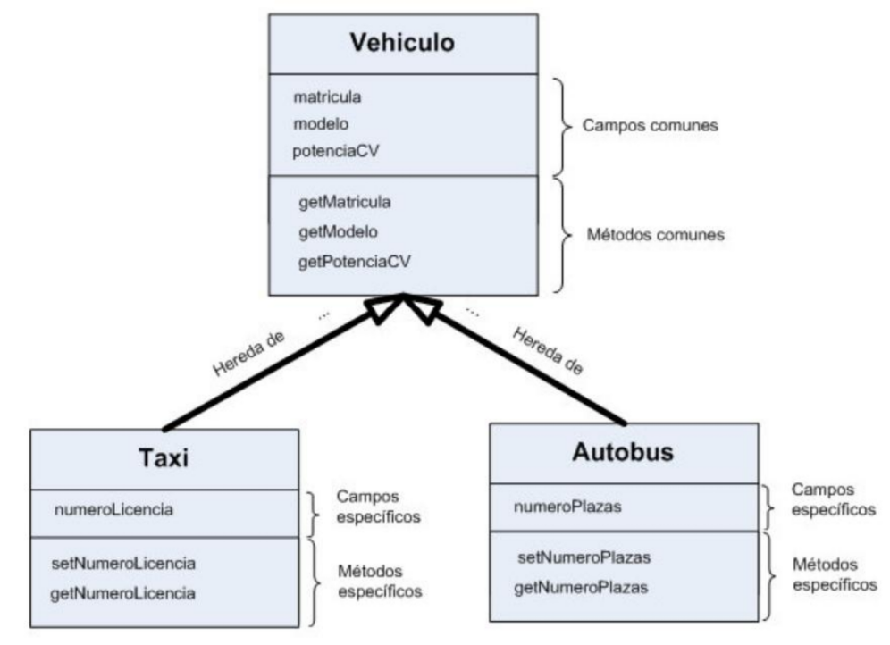

+ Forma de ver la herencia en el diagrama entidad relación.
  
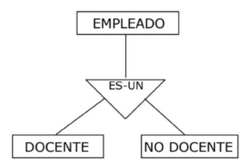

> Ejemplo

Supongamos que deseamos crear una pequeña base de datos para gestionar las clases (actividades) que se imparten en un pequeño gimnasio. Algunos requerimientos de este sistema de información son:

+ Cada clase la imparte un solo monitor.
+ Una clase tendrá asignados varios horarios, por ejemplo, la clase de boxeo sepuede impartir los lunes a partir de las 8:00h y los miércoles a partir de las 10:00h.
+ Algunas clases serán “online” y retransmitidas mediante una aplicación de videoconferencia.
+ Es habitual que un monitor pueda impartir distintas clases.
+ La información que falta por exponer queda representada en el DER (DiagramaEntidad-Relación) mostrado en la figura siguiente.

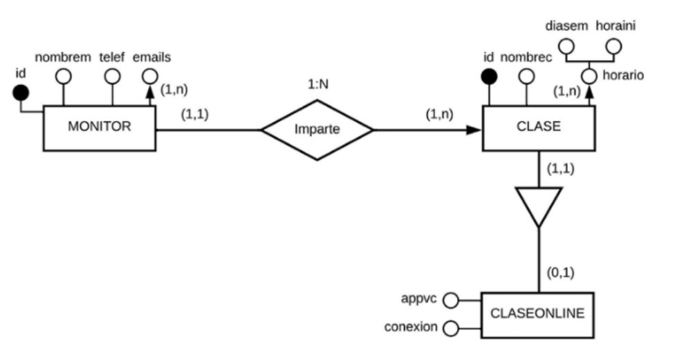

[Sql del ejemplo.](ejemplo.sql)

## 3.1. Herencia incompleta.

En PostgreSQL como en cualquier sistema gestor relacional si intentamos insertar un registro en la tabla **clase** (supertipo) con un identificador existente nos devolverá un error por duplicidad en clave primaria. Asimismo, si en esta inserción introducimos un monitor inexistente (**monitor_id**), retornará otro error al no existir un valor en la tabla padre (monitor) que se corresponda con la clave ajena en la tabla hija (clase). Este comportamiento es el esperado, pero no es el mismo cuando operamos con la tabla **claseonline** (subtipo, también llamada subclase o derivada) ya que el sistema no hace ninguna comprobación para garantizar la integridad de entidad y la integridad referencial.

Vamos a ir mostrando basándonos en el ejemplo.

La información existente en las tablas del ejemplo 7 es la siguiente:

```sql
SELECT * FROM monitor;
```
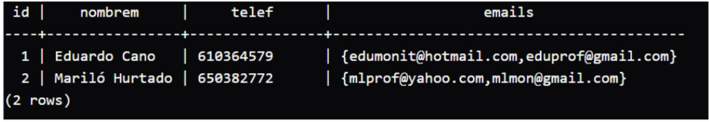

```sql
SELECT * FROM clase;
```
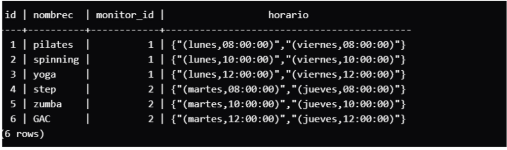

Para consultar solo la información de una de las tablas de la jerarquía debemos poner detrás de la cláusula **FROM** la palabra **ONLY** nombretabla.

La información existente en las tablas es la siguiente:

```sql
SELECT * FROM ONLY claseonline;
```
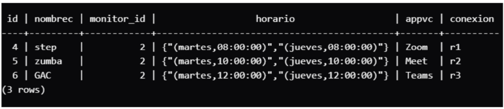

Si realizamos la inserción descrita más abajo en la tabla claseonline, debería rechazarla, ya que provoca duplicidad en los valores de la clave primaria de la tabla clase; sin embargo, la operación es aceptada:

```sql
INSERT INTO claseonline VALUES( 1,'boxeo', 2, ARRAY[ROW('martes','17:00'),
ROW('jueves','17:00')] ::thorario[], 'Zoom','r4');

SELECT * FROM clase;
```

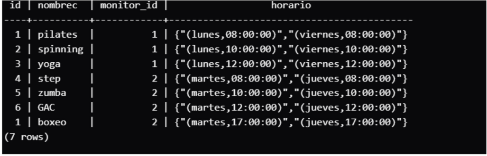

Comprobamos que hay duplicidad de valores en la clave primaria de la tabla **clase**: el campo **id** tiene el valor 1 para las clases de pilates y boxeo y por tanto no se respeta la **integridad de entidad**.

> [!note]
> Esto pasa porque en la herencia de PostgreSQL, la restricción de "Clave Primaria" de la tabla padre no se aplica automáticamente a las tablas hijas.

Asimismo, si realizamos esta otra inserción descrita a continuación sobre la tabla claseonline, debería rechazarla, ya que el valor de la clave foránea (monitor_id) no existe en la clave primaria (id) de la tabla con la que se corresponde (monitor); sin embargo, la operación es aceptada.

```sql
INSERT INTO claseonline VALUES(
DEFAULT,'baile',3,ARRAY[ROW('martes','19:00'),ROW('jueves', '21:00')] ::thorario[],'Meet','r5' );
SELECT * FROM clase;
```

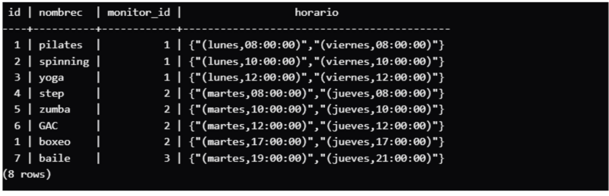

Comprobamos que podemos introducir el **monitor_id** con valor 3 que no está dado de alta en la tabla **monitor** y por tanto no se respeta la **integridad referencial**.

Para que no existan inconsistencias en la base de datos añadiremos un disparador en la tabla claseonline que se active en las operaciones de inserción y actualización y que realice este tipo de comprobaciones:

```sql
--- DISPARADOR 
CREATE OR REPLACE FUNCTION ChkIntegridClaseOnline() RETURNS TRIGGER AS $$
BEGIN

IF EXISTS (SELECT * FROM clase WHERE id=NEW.id)
THEN
    RAISE NOTICE 'Operación rechazada';
    RAISE NOTICE 'Duplicidad de clases: ya existe una clase con el identificador %',NEW.id;
    RETURN NULL;
END IF;

IF NOT EXISTS (SELECT * FROM monitor WHERE id=NEW.monitor_id) THEN
    RAISE NOTICE 'Operación rechazada';
    RAISE NOTICE 'Monitor inexistente: se debe dar de alta previamente al monitor %',NEW.monitor_id;
    RETURN NULL;
END IF;

RAISE NOTICE 'La operación de % ha sido aceptada',TG_OP; -- Trigger Operation (Operación del Disparador), 
-- puede tomar los valores de INSERT, UPDATE, DELETE
RETURN NEW;
END;
$$ LANGUAGE plpgsql;

CREATE TRIGGER ChkIntegridClaseOnline BEFORE INSERT OR UPDATE ON claseonline FOR EACH ROW 
EXECUTE PROCEDURE ChkIntegridClaseOnline(); -- Conecta el disparador con la función que hemos definido arriba
```

Podemos eliminar los dos últimos registros introducidos en la tabla:

```sql
DELETE FROM claseonline WHERE id IN (1,7);
SELECT * FROM clase;
```


Introducimos en la base de datos el trigger ChkIntegridClaseOnline e intentamos insertar los datos borrados anteriormente (inconsistentes):
```sql
INSERT INTO claseonline VALUES (1,'boxeo',2,
ARRAY[ROW('martes','17:00'),ROW('jueves','17:00')]::thorario[],'Zoom','r4');
```

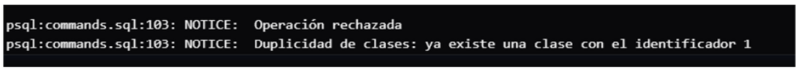

No se permite introducir un valor de una clave primaria duplicada.

```sql
INSERT INTO claseonline VALUES(DEFAULT,'baile',3,
ARRAY[ROW('martes','19:00'),ROW('jueves','21:00')]::thorario[], 'Meet','r5');
```

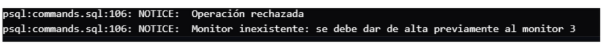

Tampoco se permite introducir un valor en la clave foránea (monitor_id), heredada de la tabla clase, que no exista en la clave primaria (id) de la tabla (monitor) con la que se corresponde.

Por tanto, todas las tablas cumplen las restricciones de integridad de la base de datos.


## 3.2. Resumen de Trigger en Postgresl.


> TIPO 1: Cancelación con advertencia (RAISE NOTICE + RETURN NULL)

1. El sistema evalúa la condición de error.
2. Mediante RAISE NOTICE, envía un mensaje informativo al canal de salida de la consola, pero **no interrumpe la ejecución del código**.
3. Como la función sigue activa, se requiere obligatoriamente la instrucción RETURN NULL, para indicarle al motor de la base de datos que descarte la inserción de la fila actual de manera silenciosa.

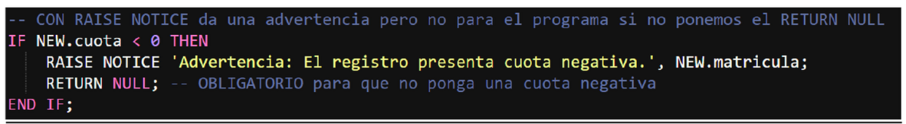

>TIPO 2: Interrupción por excepción (RAISE EXCEPTION)

1. El sistema evalúa la condición de error.
2. Al ejecutar RAISE EXCEPTION, el motor de PostgreSQL genera un error de estado SQL (SQLSTATE) y **aborta la ejecución de la función de manera inmediata**.
3. ¿Por qué NO lleva RETURN NULL? Porque la excepción rompe el flujo del programa en esa misma línea. La ejecución nunca llega a evaluar lo que haya debajo, haciendo innecesaria cualquier instrucción de retorno. **Puedo ponerlo, pero no se ejecutaría nunca**.

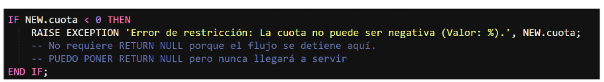

Hacen lo mismo, evitar que el dato negativo entre, pero:

+ EXCEPTION se carga la inserción provocando un error del sistema.
+ NOTICE + RETURN NULL se carga la inserción de forma silenciosa (tirar el dato a la papelera sin avisar a la aplicación). Y cuando tu vas a buscar ese dato no está en la base de datos.

>¿Cuándo se usa IF o IF EXIST/ IF NO EXIST?

La diferencia principal está en de dónde saca los datos el ordenador para hacer la comprobación.

1. El IF convencional (Evaluación de variables en memoria)

El IF a secas se utiliza para evaluar expresiones lógicas, operaciones matemáticas o comparar valores de variables que ya están cargadas en la memoria RAM del ordenador en ese momento.

1. El motor de la base de datos no necesita ir a buscar nada a los discos duros, simplemente mira el dato que tiene delante (por ejemplo, dentro del registro temporal NEW) y lo compara.
2. Validar si un dato individual cumple una regla matemática o lógica.

**Ejemplo**: Comprobación de la cuota de un barco negativa

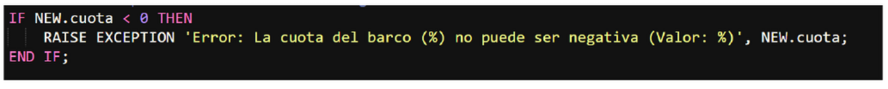

2. El IF EXISTS (Consulta de comprobación en disco)
   
El IF EXISTS es una estructura especial que se utiliza exclusivamente para realizar una consulta SQL dentro de las tablas de la base de datos.

1.  Obliga al motor de la base de datos a leer el disco duro, abrir una tabla y buscar fila por fila si se encuentra un registro que cumpla una condición específica.
2.  Siempre, sin excepción, debe ir acompañado de una sentencia SELECT encerrada entre paréntesis: IF EXISTS (SELECT ...) o IF NOT EXISTS (SELECT ...).
   
**Ejemplo**: Comprobación de que un DNI de una persona que inserte nueva existe en la base de datos.

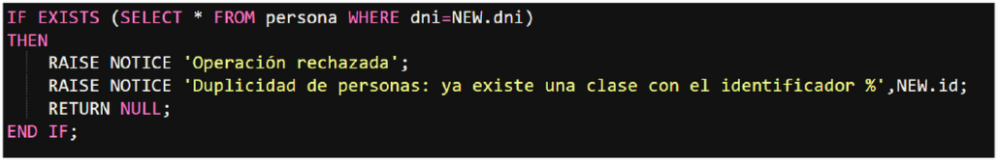

> EJEMPLO DE TRIGGER COMPLETO TIPO 1

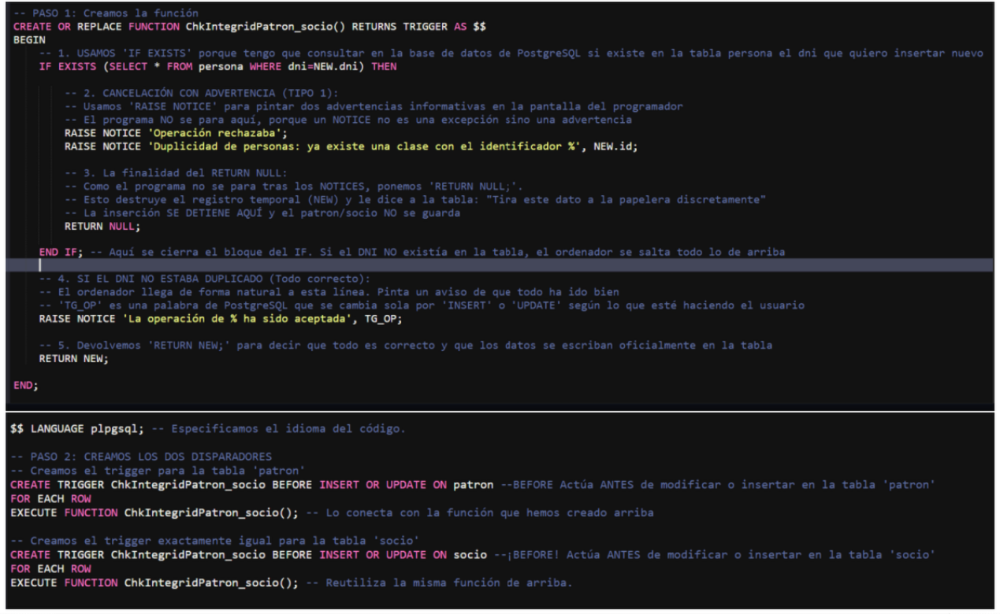

> EJEMPLO DE TRIGGER COMPLETO TIPO 2

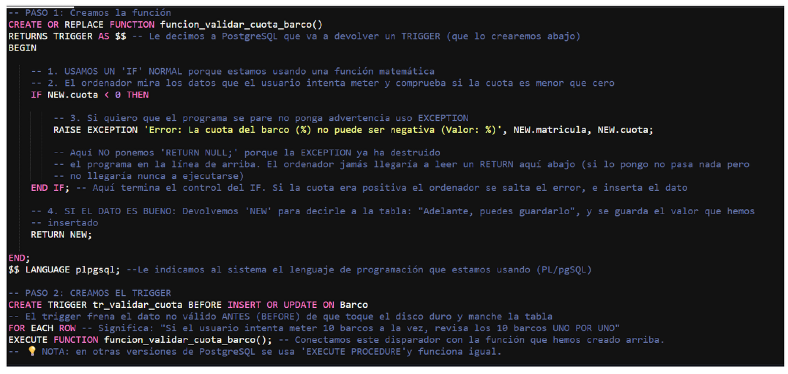

# 4. Aspectos del diseño físico.

Los datos se almacenan en soportes no volátiles que son gestionados por el sistema
operativo. Este proporciona al SGBD las rutinas necesarias para poder leer y escribir los datos guardados en los soportes de almacenamiento.

Los sistemas operativos utilizan los ficheros no solo para almacenar información sino para gestionar el espacio en los dispositivos de almacenamiento. Un fichero está compuesto de un conjunto de extensiones y estas, de un grupo de páginas donde finalmente se guardan los objetos de la base de datos.

El principal elemento del nivel lógico en el modelo relacional es la tabla, que ha de ser almacenada en las páginas que componen los ficheros que son gestionados por el sistema operativo. Por tanto, habrá que realizar una transformación de los componentes lógicos en componentes físicos para que persistan los datos a lo largo del tiempo. Algunos SGBD tienen el objeto denominado **TABLESPACE** que facilita esta transformación.

El diseño físico es la última etapa en el desarrollo de bases de datos y obtiene como resultado la base de datos almacenada en un sistema informático de la manera más eficiente posible. Para conseguirla se pretenden optimizar entre otros factores: los tiempos de respuesta del sistema gestor y el espacio de almacenamiento.

El modelo relacional es un modelo lógico y aúna la información de los niveles conceptual y externo, pero en ningún caso incluye los datos del nivel interno, que depende del SGBD con el que se implemente la base de datos.

En el diseño físico no solo se tiene que tener en cuenta el esquema relacional obtenido enel diseño lógico sino también:

+ **Los elementos del nivel interno** o características físicas implementadas en el SGBD en el que se va a crear la base de datos.
+ **Los recursos hardware** con los que vamos a contar: soportes de almacenamiento, sistemas RAID, etc.
+ **El sistema operativo** utilizado.
+ **Las aplicaciones** que interactuarán con el sistema gestor de bases de datos.
+ **Las consultas y transacciones** que se realizarán con más frecuencia junto con la carga de datos estimada que tendrá cada una de las estructuras de datos que formen la base de datos. En base a esta información se podrán:
    + **Crear índices** para acceder fácilmente a los datos. 
    + **Agrupar tablas**, sobre todo que sean pequeñas, en un mismo componente físico. De esta manera se minimizan los accesos simultáneos a las tablas que están agrupadas.
    + **Particionamiento vertical u horizontal** de las tablas. Aquellas tablas que sean muy grandes es conveniente dividirlas en columnas (vertical) o enfilas (horizontal) con el fin de que los accesos a los datos sean más rápidos.
    + Desnormalización de tablas. Consiste en la introducción de redundancia en el diseño lógico con el objetivo de aumentar la eficiencia de la base de datos. Hay que controlar la redundancia añadida y evaluar si conviene utilizarla ya que ralentiza las actualizaciones de los datos. Por ejemplo, se pueden fusionar tablas con tipo de correspondencia 1:1 si frecuentemente se accede a ambas tablas de manera conjunta. Otra forma de incluir redundancia es añadiendo atributos derivados en las tablas.

## 4.1. Los TABLESPACES.

Un tablespace es un espacio virtual que se utiliza como interfaz entre los componentes del nivel lógico (tablas) y los del nivel físico (ficheros). No pertenece al diseño lógico de bases de datos y no está incluido en el estándar SQL.

Los tablespaces en PostgreSQL definen ubicaciones en el sistema de archivos para almacenar los archivos que contienen los objetos (como tablas e índices) de la base de datos. Una vez creado, se puede hacer referencia a un tablespace por su nombre al añadir objetos de la base de datos.

Cuando se define una tabla se le puede asignar un tablespace y este puede agrupar distintas tablas. El contenido de un tablespace puede estar almacenado en varios ficheros y estos contener varios tablespaces.

La finalidad de un **tablespace **es **decidir en qué lugar físico** (qué disco o carpeta) de tu ordenador se guarda cada parte de tu base de datos.

En PostgreSQL la sentencia **CREATE TABLESPACE** define un espacio virtual para todo el clúster o instancia.

```sql
CREATE TABLESPACE nombre_tablespace
    [ OWNER { propietario | CURRENT_ROLE | CURRENT_USER | SESSION_USER } ] -- (Opcional) Indica quien es el propietario
-- Solo el dueño podrá crear indices y tablas dentro de este espacio
    LOCATION 'directorio' -- (Obligatorio) indíca la dirección donde está /mnt/disco_ssd/mi_base_datos
    [ WITH ( opcion = valor [, ... ] ) ] -- (opcional) le indicas como la calidad del directorio que has elegido
-- seq_page_cost: Cuanto le "cuesta" al sistema leer los datos en orden (uno detrás de otro)
-- random_page_cost: Cuanto le cuesta saltar de un punto a otro del disco para buscar datos sueltos.
```

> Ejemplo

```sql
-- Crea el tablespace espaciorapido en la ubicación /ssd1/postgres/datos.
CREATE TABLESPACE espaciorapido
LOCATION '/ssd1/postgres/datos';

-- Crea la tabla producto en el tablespace espaciorapido.

CREATE TABLE producto(
    id SERIAL PRIMARY KEY,
    nombre TEXT NOT NULL) TABLESPACE espaciorapido;
-- Otra forma

SET default_tablespace = espaciorapido;
CREATE TABLE producto(
    id SERIAL PRIMARY KEY,
    nombre TEXT NOT NULL);
```

>[!note]
Cualquier objeto creado con CREATE TABLE o CREATE INDEX que no se le asigne explícitamente un tablespace será almacenado en el tablespace indicado por defecto (pg_default).

## 4.2. Los ÍNDICES.

Los índices no forman parte del diseño lógico de la base de datos, así que no están incluidos en el estándar SQL, aunque sí en el diseño físico porque mejoran el rendimiento de las consultas (operaciones de lectura) facilitando el acceso a los datos.

Un índice está asociado a una tabla y se parece mucho al índice de un libro: debe estar ordenado, ocupa un espacio en disco, es redundante y hace referencia a la información de la tabla vinculada, que normalmente está almacenada en otro lugar.

Los índices son estructuras de datos separadas (archivos de índices) y distintas de las tablas o vistas a las que hacen referencia. Contienen una copia ordenada de todos los valores de las columnas por las que se indiza y para cada fila del índice hay un puntero que localiza físicamente todos los datos de la fila de dicha tabla o vista. Una búsqueda mediante un índice consiste:

1. Buscar los valores en el índice para conocer el localizador de los datos.
2. Este puntero obtiene la página que contiene la fila con la información buscada.

El orden del índice es aprovechado por el optimizador de consultas del SGBD para mejorar el rendimiento de las operaciones de lectura, intentando reducir el número de accesos (operaciones de E/S a disco) que el sistema tendrá que realizar para localizar los datos.

Hay varios tipos de índices:

+ **Agrupado**. Este índice ordena y almacena las filas de los datos de la tabla de acuerdo con los valores de la clave del índice. Los registros con similares claves de indización se almacenan físicamente en ubicaciones contiguas. Los datos solo pueden tener una ordenación física y por tanto solo puede haber un índice agrupado definido sobre unos datos. Se asemeja a una guía telefónica. PostgreSQL no dispone de índices agrupados. Sin embargo, se puede utilizar el comando CLUSTER nombre_tabla USING nombre_indice para ordenar físicamente los datos de la tabla nombre_tabla según el índice nombre_indice. Por ejemplo, este nombre te indica que puede ser definido para la PRIMARY KEY de cualquier tabla.
+ **No agrupado**. Define un orden lógico distinto al orden en el que se almacenan las filas físicamente. Los registros con similares claves de indización se almacenan físicamente en ubicaciones aleatorias. Se asemeja a un índice de un libro, dondeel índice se almacena en un lugar distinto al de los datos.

## 4.3. Las consultas y los índices

Si al ejecutar una consulta no existe ningún índice, el sistema gestor tendrá que recorrer secuencialmente todas las filas de la tabla y extraer todas aquellas que cumplan los criterios de la consulta. Si por el contrario existe un índice, el optimizador de consultas puede acceder a él secuencialmente y, cuando exista una coincidencia con la clave buscada, accede de manera directa a la tabla que incluye los datos.

Si continuamos la comparación con un libro, tanto el índice como el contenido de este son objetos estáticos, mientras que en las bases de datos los índices y las tablas que almacenan los datos son objetos dinámicos que evolucionan a lo largo del tiempo.

Los inconvenientes de los índices son que crean redundancia sobre los datos y deben estar actualizados para mantenerse ordenados, por lo que penalizan las operaciones de edición sobre las columnas indizadas, ya que además de actualizar el índice hay que actualizar también la tabla a la que hace referencia. Algunas de estas operaciones provocarán la reorganización del índice o volver a generarlo.

La mayoría de los SGBD crean automáticamente un índice único para las columnas que constituyen las restricciones **PRIMARY KEY** y **UNIQUE** de una tabla, o bien, se pueden crear explícitamente con la sentencia CREATE INDEX. En un índice único las columnas indizadas no contienen valores duplicados.

Sería conveniente estudiar la posibilidad de crear índices en los siguientes casos:

+ En aquellos campos que son claves ajenas (Foreign Keys), ya que son campos frecuentemente utilizados en la combinación de distintas tablas. (JOIN) y en las siguientes operaciones de actualización:
  
  + **INSERT y UPDATE** sobre los valores de la clave ajena. El sistema debe comprobar la existencia de dichos valores en la clave primaria de la tabla referenciada.
  + **UPDATE y DELETE** sobre los valores de la clave primaria. El sistema debe comprobar la existencia de estos valores en la clave ajena de la tabla que referencia.
  
+ En los campos que son utilizados en los filtros de la cláusula **WHERE**.
+ En los campos que aparecen en las cláusulas **ORDER BY** y **GROUP BY**. En este caso el índice libera al SGBD de las tareas de ordenación y agrupación.
+ En los campos que sirven de enlace en las combinaciones de dos o más tablas (JOIN).
+ De manera genérica en tablas con grandes volúmenes de datos, en las que predominen las operaciones de lectura, que devuelvan pocas tuplas, frente a las de actualización. En estas tablas se estudiaría la viabilidad de crear índices en aquellos campos que son frecuentemente consultados.

No sería conveniente crear índices en las siguientes situaciones:

+ Si la tabla tiene pocas filas. Es más eficiente leer la tabla de manera secuencial que accediendo al índice para localizar ciertas filas de dicha tabla.
+ Si el índice contiene muy pocos valores distintos, es decir, contiene muchos duplicados: el sistema gestor pierde tiempo y recursos en diferenciar estos registros. Por ejemplo, no tiene sentido crear un índice para un campo llamado tipo_agua que almacene dos valores: dulce y salada.
+ Si el índice (las columnas que lo forman) se actualiza con mucha frecuencia.
+ Si el índice no se utiliza en procesos selectivos, sino en procesos masivos en los que intervienen casi la totalidad de los registros de la tabla en la que se basa el índice. En este caso es más eficiente recorrer la tabla de manera secuencial que hacerlo a través del índice.

Sería conveniente almacenar físicamente los índices que se utilizan frecuentemente en discos muy rápidos y de alta disponibilidad, como los dispositivos de estado sólido (SSD).

> Creación de índices en PostgreSQL


En PostgreSQL se pueden crear índices sin repetidos (UNIQUE) con los comandos CREATE TABLE, ALTER TABLE y CREATE INDEX y solo se pueden crear índices con repetidos con el comando CREATE INDEX, hasta la versión actual (12).

>Sintaxis:

```sql
CREATE [UNIQUE] INDEX [ <nombre_ind> ] ON <nombre_tabla> ( { <nombre_col1>
| <expresión> } [ ASC | DESC ] [, ... ] );
```

donde:

+ <nombre_ind> es el nombre de la restricción con la que se guardará el índice en el diccionario de datos. Este nombre es  opcional y si no se indica el sistema genera un nombre único.

+ <nombre_tabla> es el nombre de la tabla para la que se va a crear el índice.
+ <nombre_col1> | <expresión> es la columna o expresión que forma la clave de indización.


>Ejemplo. 

```sql
-- Crea un índice (con repetidos) sobre la columna empleado_id de la tabla inmueble.
CREATE INDEX ON inmueble(empleado_id);
-- Crea un índice único sobre el campo email de la tabla empleado.
CREATE UNIQUE INDEX ON empleado(email);
```