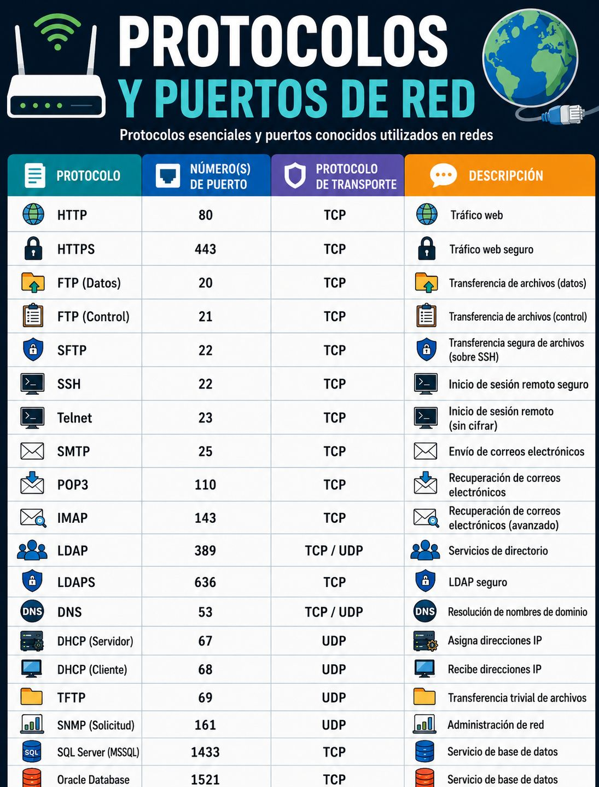

# UT1 INTRODUCCIÓN <!-- omit in toc -->
---
- [1. Introducción.](#1-introducción)
- [2. Fases del Despliegue.](#2-fases-del-despliegue)
- [3. Opciones de alojamiento](#3-opciones-de-alojamiento)
- [4. DNS.](#4-dns)
  - [4.1. Características de DNS.](#41-características-de-dns)
  - [4.2. Ficheros hosts.](#42-ficheros-hosts)
- [5. Puertos en redes informáticas.](#5-puertos-en-redes-informáticas)


# 1. Introducción.

El **despliegue de aplicaciones web** es el proceso mediante el cual un software desarrollado localmente se transfiere a un servidor para que sea público y accesible a través de internet. Transforma un proyecto privado en un entorno de producción funcional y seguro.

# 2. Fases del Despliegue.

1. **Preparación del servidor**: Configuración de la infraestructura (física, en la nube o local) y de los servidores web (como Apache o Nginx).
   
2. **Transferencia de código**: Subida de los archivos y dependencias a la máquina remota (vía FTP, SSH, o herramientas automatizadas).
   
3. **Configuración de bases de datos**: Importación y conexión segura a los gestores de datos (MySQL, PostgreSQL, etc.).
   
4. **Integración y Entrega Continua (CI/CD)**: Automatización de los procesos de testeo y subida del código mediante plataformas como GitHub o GitLab.

5. **Seguridad y Dominio**: Configuración de protocolos de cifrado (SSL/TLS), cortafuegos (firewalls) y enrutamiento del nombre de dominio (DNS).

# 3. Opciones de alojamiento

> Hosting

Contratamos un alojamiento para  nuestra página web en un servidor, y pagamos por dicho alojamiento, normalmente es el alojamiento en Mb que ocupe nuestra web, transferencia de red, características del servidor (memoria ram, cpu, etc..).

> Housing

Este tipo de alojamiento es que nosotros poseemos un servidor y alojamos dicho servidor en nuestro proveedor de servicios.

Opciones de alojamiento

+ **Plataformas PaaS (Platform as a Service)**: Ideales para abstraerse de la gestión de servidores. Servicios como Vercel o Render destacan por su simplicidad y despliegue automático desde repositorios.
  
+ **Proveedores Cloud**: Para configuraciones avanzadas, proveedores como Amazon Web Services (AWS), Google Cloud o Microsoft Azure ofrecen infraestructuras escalables, máquinas virtuales y contenedores (Docker).
  
+ **Servidores VPS/Dedicalos**: Control total sobre la máquina con servicios como DigitalOcean o Linode.
  
# 4. DNS.

™El **Domain Name System** (DNS) es una base de datos distribuida y jerárquica que gestiona y mantiene información asociada a nombres de dominio en redes como Internet.


Su uso más común es la asignación de nombres de dominio a direcciones IP de los nodos de Internet y la localización de los servidores de correo electrónico de cada dominio.

DNS permite traducir los nombres de dominio (campus.upc.edu) a sus respectivas direcciones IP (82.223.162.102).

™Cuando queramos acceder a una máquina (Web, Ftp, Telnet, ...) en vez de recordar su @ IP, basta recordar el nombre del servidor:
```
ftp ftp.smbserver.com -> ftp 178.98.56.23
http://www.elmundo.es -> http://132.56.23.22
```

DNS permite recordar fácilmente los nombres de todos los servidores conectados a Internet.

El nombre es más fiable. La dirección numérica podría cambiar por muchas razones, pero no el nombre que identifica el servidor.

## 4.1. Características de DNS.

+ Es una base de datos jerárquica que contiene asociaciones de nombres de dominios a @ IP.
+ Está formada por un conjunto de servidores distribuidos por todo Internet, en lugar de mantenerla centralizada en un único servidor.
+ Sigue el paradigma cliente/servidor con nivel de transporte TCP/UDP y puerto 53.
+ Usa un resolvedor (“resolver”) que permite realizar las consultas a la bbdd.
+ Utiliza un protocolo para intercambiar información de nombres.

## 4.2. Ficheros hosts.

Cuando se hace una petición a un sitio Web, lo primero que busca es en fichero `hosts`, este fichero se encuentra tanto en Windows como en Linux.

En Windows se encuentra en la ruta: 
`C:\windows\system32\drivers\etc`.

En Linux se encuentra en la ruta: `/etc/hosts`. Otro fichero importante es `/etc/resolv.conf`, que guarda las IP de los servidores DNS primario y secundario.

Si no puede resolver el nombre de dominio entonces intenta contactar con un servidor DNS, que ha tenido que ser configurado en la configuración de la tarjeta de red.

Algunos servidor Dns (pueden cambiar su Ip):
+ 8.8.8.8 primario y 8.8.4.4 secundario de Google.
+ 1.1.1.1 primario y 1.0.0.1 secundario de Cloudflare.
+ 208.67.222.222 primario y 208.67.220.220 secundario de OpenDns.

# 5. Puertos en redes informáticas.

En redes informáticas, un puerto es la interfaz virtual que permite a un equipo comunicarse con programas o servicios específicos. Cada servicio se asocia a un número de puerto estándar para enrutar correctamente el tráfico de datos en protocolos como TCP o UDP.

Los servicios y sus puertos más comunes son:HTTP: 

+ Puerto 80 (Tráfico web no cifrado).
+ HTTPS: Puerto 443 (Tráfico web cifrado).
+ DNS: Puerto 53 (Resolución de nombres de dominio).
+ SSH: Puerto 22 (Acceso remoto seguro a servidores).
+ FTP: Puerto 21 (Transferencia de archivos).
+ SMTP: Puerto 25 (Envío de correos electrónicos).

Es importante conocer los mas comunes ya que a veces los necesitamos para poder configurar nuestros servicios. O si tenemos dos paginas web en el mismo servidor no podemos servirlas en el puerto 80 las dos tendríamos que cambiar una de ellas por ejemplo al 81, y luego redirecionarlo con DNS.

Por ejemplo para acceder a un servicio por un puerto alojado en un servidor es `direcición Ip:puerto`.

```
Ejemplo:

192.168.1.50:8080
```





[Listado de puertos Wikipedia](https://es.wikipedia.org/wiki/Anexo:Puertos_de_red).
