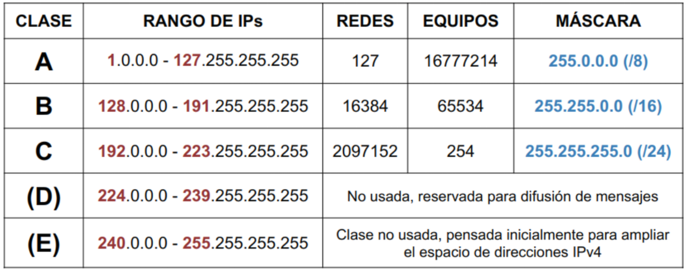
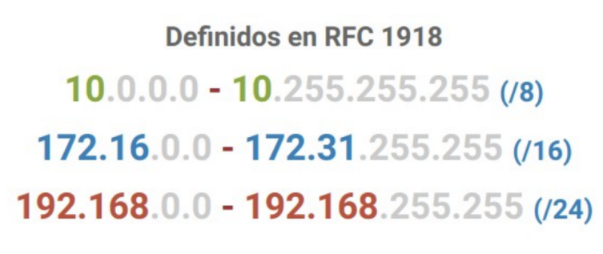
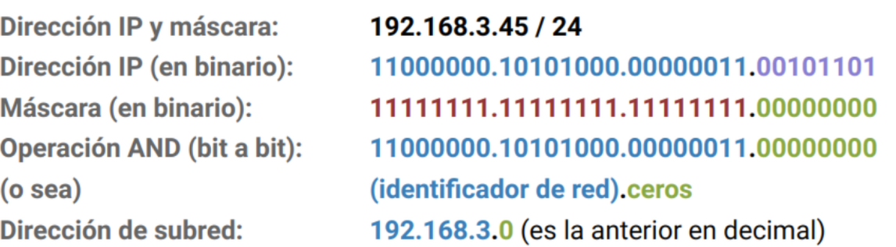
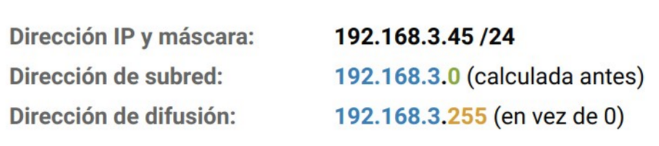
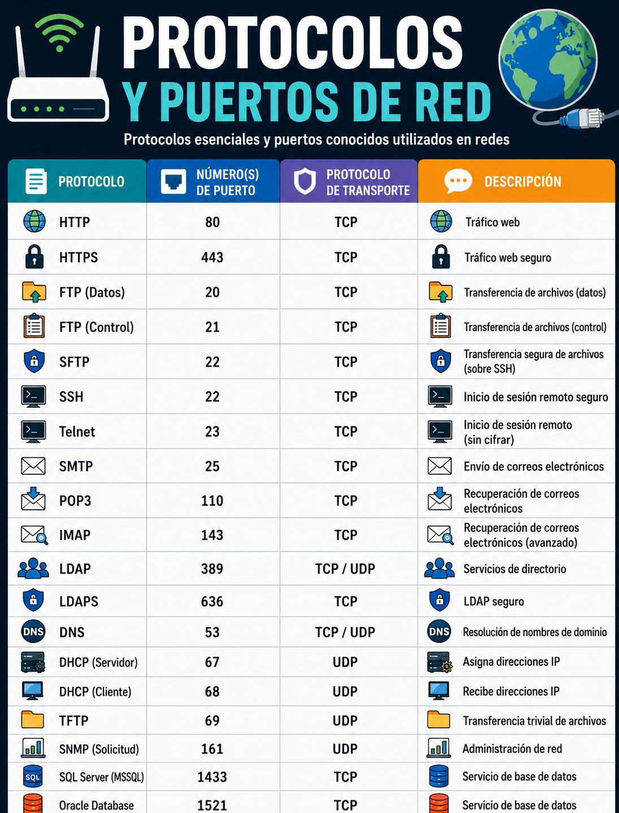
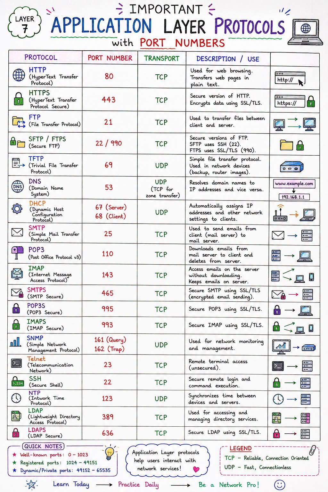

# UT1 INTRODUCCIÓN <!-- omit in toc -->
---
- [1. Introducción.](#1-introducción)
- [2. Fases del Despliegue.](#2-fases-del-despliegue)
- [3. Opciones de alojamiento](#3-opciones-de-alojamiento)
- [4. DNS.](#4-dns)
  - [4.1. Características de DNS.](#41-características-de-dns)
  - [4.2. Ficheros hosts.](#42-ficheros-hosts)
- [5. Direccionamiento IP.](#5-direccionamiento-ip)
  - [5.1. Puertos en redes informáticas.](#51-puertos-en-redes-informáticas)


# 1. Introducción.

El **despliegue de aplicaciones web** es el proceso mediante el cual un software desarrollado localmente se transfiere a un servidor para que sea público y accesible a través de internet. Transforma un proyecto privado en un entorno de producción funcional y seguro.

# 2. Fases del Despliegue.

1. **Preparación del servidor**: Configuración de la infraestructura (física, en la nube o local) y de los servidores web (como Apache o Nginx).
   
2. **Transferencia de código**: Subida de los archivos y dependencias a la máquina remota (vía FTP, SSH, o herramientas automatizadas).
   
3. **Configuración de bases de datos**: Importación y conexión segura a los gestores de datos (MySQL, PostgreSQL, etc.).
   
4. **Integración y Entrega Continua (CI/CD)**: Automatización de los procesos de testeo y subida del código mediante plataformas como GitHub o GitLab.

5. **Seguridad y Dominio**: Configuración de protocolos de cifrado (SSL/TLS), cortafuegos (firewalls) y enrutamiento del nombre de dominio (DNS).

# 3. Opciones de alojamiento

> Hosting

Contratamos un alojamiento para  nuestra página web en un servidor, y pagamos por dicho alojamiento, normalmente es el alojamiento en Mb que ocupe nuestra web, transferencia de red, características del servidor (memoria ram, cpu, etc..).

> Housing

Este tipo de alojamiento es que nosotros poseemos un servidor y alojamos dicho servidor en nuestro proveedor de servicios.

Opciones de alojamiento

+ **Plataformas PaaS (Platform as a Service)**: Ideales para abstraerse de la gestión de servidores. Servicios como Vercel o Render destacan por su simplicidad y despliegue automático desde repositorios.
  
+ **Proveedores Cloud**: Para configuraciones avanzadas, proveedores como Amazon Web Services (AWS), Google Cloud o Microsoft Azure ofrecen infraestructuras escalables, máquinas virtuales y contenedores (Docker).
  
+ **Servidores VPS/Dedicalos**: Control total sobre la máquina con servicios como DigitalOcean o Linode.


  
# 4. DNS.

™El **Domain Name System** (DNS) es una base de datos distribuida y jerárquica que gestiona y mantiene información asociada a nombres de dominio en redes como Internet.


Su uso más común es la asignación de nombres de dominio a direcciones IP de los nodos de Internet y la localización de los servidores de correo electrónico de cada dominio.

DNS permite traducir los nombres de dominio (campus.upc.edu) a sus respectivas direcciones IP (82.223.162.102).

™Cuando queramos acceder a una máquina (Web, Ftp, Telnet, ...) en vez de recordar su @ IP, basta recordar el nombre del servidor:
```
ftp ftp.smbserver.com -> ftp 178.98.56.23
http://www.elmundo.es -> http://132.56.23.22
```

DNS permite recordar fácilmente los nombres de todos los servidores conectados a Internet.

El nombre es más fiable. La dirección numérica podría cambiar por muchas razones, pero no el nombre que identifica el servidor.

## 4.1. Características de DNS.

+ Es una base de datos jerárquica que contiene asociaciones de nombres de dominios a @ IP.
+ Está formada por un conjunto de servidores distribuidos por todo Internet, en lugar de mantenerla centralizada en un único servidor.
+ Sigue el paradigma cliente/servidor con nivel de transporte TCP/UDP y puerto 53.
+ Usa un resolvedor (“resolver”) que permite realizar las consultas a la bbdd.
+ Utiliza un protocolo para intercambiar información de nombres.

## 4.2. Ficheros hosts.

Cuando se hace una petición a un sitio Web, lo primero que busca es en fichero `hosts`, este fichero se encuentra tanto en Windows como en Linux.

En Windows se encuentra en la ruta: 
`C:\windows\system32\drivers\etc`.

En Linux se encuentra en la ruta: `/etc/hosts`. Otro fichero importante es `/etc/resolv.conf`, que guarda las IP de los servidores DNS primario y secundario.

Si no puede resolver el nombre de dominio entonces intenta contactar con un servidor DNS, que ha tenido que ser configurado en la configuración de la tarjeta de red.

Algunos servidor Dns (pueden cambiar su Ip):
+ 8.8.8.8 primario y 8.8.4.4 secundario de Google.
+ 1.1.1.1 primario y 1.0.0.1 secundario de Cloudflare.
+ 208.67.222.222 primario y 208.67.220.220 secundario de OpenDns.

# 5. Direccionamiento IP.

Para organizar el tráfico de paquetes por una red se requiere de un protocolo para el nivel de red.

Trabajaremos el protocolo IP (Internet Protocol), que se encarga de la entrega no confiable de paquetes utilizando técnicas de encaminamiento (o enrutamiento).

Para que IP funcione, es necesario que los equipos de una red tengan una dirección IP, que identifica a un equipo dentro de una red TCP/IP.

> [!important]
>Dentro de una red no puede haber dos dispositivos con la >misma dirección IP ya que provocaría un conflicto de IP.

> Estructura de una dirección IP

Las direcciones Ipv4 tienen la siguiente estructura:


Cada número es un octeto (8 btis) que se suele representar con un número en decimal. Por lo tanto cada octeto de la dirección IP será un número que podrá tomar un valor entre 0 y 255.

También se puede representar en binario, en bloques de 8 bits separados por puntos.


> Máscara de subred

Las direcciones IP, están organizadas jerárquicamente. La parte más a la izquierda de la dirección IP se llama **identificador de red**(azul), y la parte más ala derecha es el **identificador de equipo**(rojo).


En este ejemplo podemos ver que nuestro equipo es el **75** dentro de la red **192.168.0**. Todos los equipos de una misma red tienen el mismo identificador de red, y distintos identificadores de equipos.

La cantidad de octetos destinados al identificador de red y a la del equipo, es una cantidad variable que depende de la mascara de subred, indicandonos **qué parte de la IP es el identificador de red y qué parte es el identificador de  equipo**.

> Notaciones de la mascara de red

Tres formas de expresar la misma dirección IP:

a) notación decimal: cuatro octetos decimales acompañando a la dirección IP:

         172.16.3.45 / 255.255.255.0

b) notación binaria: octetos enforma binaria separados por puntos

         10101100.00010000.0000011.00101101
         11111111.11111111.11111111.00000000

c) notación prefija: un numero decimal que indica el numero de “unos“ que tendria la mascara de red.

         172.16.3.45 / 24

> Redes con CLASE

Todo espacio de direcciones Ipv4 está inicialmente dividido en diferentes clases según su primer octeto. Si la máscara de subred de los equipos de una red es distinta a éstas.



> Direcciones IP privadas

Existen dos tipos de direcciones IP, las privadas y las públicas. Las públicas son visibles en ineternet, y las privadas usadas en redes locales LAN ,no visibles en Internet.



> Dirección de subred

La **primera dirección IP** de una red, representa a la red, y **no puede asignarse a un equipo**.
Todos los equipos de la red física cuya dirección de subred sea la misma, estarán en la misma red. La calculamos de la siguiente forma:



> Direccion de difusión (broadcast)

Es la **última dirección IP** de una red, representa a la red, y **no puede asignarse a un equipo**.
Sirve para cuando un equipo quiere enviar un paquete de difusión a todos los equipos de su subred. Se calcula:



> Direcciones IP reservadas para direcciones de enlace local

Se asignan al azar a equipos de una LAN en la que no hay servidor DHCP para configurar automáticamente las direcciones IP o no se configuran manualente.

Este proceso se realiza despues de 30 segundos. Se les llama tambén direcciones APIPA 
(Automatic Private Ip Address)

     Definido en RFC 3927(direcciones de enlace local)
            169.254.0.0 – 169.254.255.255 / 16


> Direcciones IP reservadas para localhost

El documento RFC 3330 define que debe existir un rango de direcciones reservado para hacerreferencia al propio equipo de la red o localhost. El rango llamado de direcciones loopback (de bucle de retorno), es el siguiente:

       127.0.0.0 – 127.255.255.255

Aunque en la práctica sólo se utilice la dirección 127.0.0.1/32 para localhost.

Para comprobarlo el comando seria:

      ping 127.0.0.1

>Direccion sin especificar

     0.0.0.0
Utilizada:

+ Como ruta estandar estática con una mascara de subred 0.0.0.0, cubre todas las direcciones. Ruta por defecto para la salida de paquetes.
+ Como dirección de origen para la trasnmisión Ipv4 de una lan.

## 5.1. Puertos en redes informáticas.

En redes informáticas, un puerto es la interfaz virtual que permite a un equipo comunicarse con programas o servicios específicos. Cada servicio se asocia a un número de puerto estándar para enrutar correctamente el tráfico de datos en protocolos como TCP o UDP.

Los servicios y sus puertos más comunes son:HTTP: 

+ Puerto 80 (Tráfico web no cifrado).
+ HTTPS: Puerto 443 (Tráfico web cifrado).
+ DNS: Puerto 53 (Resolución de nombres de dominio).
+ SSH: Puerto 22 (Acceso remoto seguro a servidores).
+ FTP: Puerto 21 (Transferencia de archivos).
+ SMTP: Puerto 25 (Envío de correos electrónicos).

Es importante conocer los mas comunes ya que a veces los necesitamos para poder configurar nuestros servicios. O si tenemos dos paginas web en el mismo servidor no podemos servirlas en el puerto 80 las dos tendríamos que cambiar una de ellas por ejemplo al 81, y luego redirecionarlo con DNS.

Por ejemplo para acceder a un servicio por un puerto alojado en un servidor es `direcición Ip:puerto`.

```
Ejemplo:

192.168.1.50:8080
```






[Listado de puertos Wikipedia](https://es.wikipedia.org/wiki/Anexo:Puertos_de_red).
