# UT2 DOCKER <!-- omit in toc -->
---
- [1.Introducción.](#1introducción)
  - [1.1. Virtualización.](#11-virtualización)
  - [1.2. Contenedores.](#12-contenedores)
  - [1.3. Glosario.](#13-glosario)
- [2. Instalación.](#2-instalación)
  - [2.1. Ayuda de docker.](#21-ayuda-de-docker)
- [3. Docker Hub.](#3-docker-hub)
- [4. Gestión de imágenes.](#4-gestión-de-imágenes)
  - [4.1. Descarga de imágenes.](#41-descarga-de-imágenes)
  - [4.2. Mostrar imágenes descargadas.](#42-mostrar-imágenes-descargadas)
  - [4.3. Borrado de imágenes.](#43-borrado-de-imágenes)
  - [4.4. Obteniendo inofrmación de las imágenes.](#44-obteniendo-inofrmación-de-las-imágenes)
  - [4.5. Otros comandos.](#45-otros-comandos)
- [5. Contenedores.](#5-contenedores)
  - [5.1. Asignando nombre a los contenedores.](#51-asignando-nombre-a-los-contenedores)
  - [5.2. Ejecución de servicios. Puertos y variables de entorno.](#52-ejecución-de-servicios-puertos-y-variables-de-entorno)
  - [5.3. Ejecutar órdenes en contenedores.](#53-ejecutar-órdenes-en-contenedores)
  - [5.4. Obtener información de los contenedores.](#54-obtener-información-de-los-contenedores)
    - [5.4.1. Docker ps.](#541-docker-ps)
    - [5.4.2. Docker inspect.](#542-docker-inspect)
    - [5.4.3. Docker Logs.](#543-docker-logs)
  - [5.5. Gestión de contenedores.](#55-gestión-de-contenedores)
- [6. Persistencia en Docker.](#6-persistencia-en-docker)
  - [6.1. Los datos en los contenedores.](#61-los-datos-en-los-contenedores)
  - [6.2. Volúmenes y Bind Mount.](#62-volúmenes-y-bind-mount)
    - [6.2.1. Volúmenes Docker.](#621-volúmenes-docker)
    - [6.2.2. Bind Mount.](#622-bind-mount)
  - [6.3. Gestionando volúmenes y obteniendo información.](#63-gestionando-volúmenes-y-obteniendo-información)
    - [6.3.1. Creación de volúmenes.](#631-creación-de-volúmenes)
    - [6.3.2 Eliminación de volúmenes.](#632-eliminación-de-volúmenes)
    - [6.3.3 Obtención de información de los volúmenes.](#633-obtención-de-información-de-los-volúmenes)
    - [6.3.4 Lista de volúmenes del sistema.](#634-lista-de-volúmenes-del-sistema)
  - [6.4. Asociando almacenamiento a los contenedores.](#64-asociando-almacenamiento-a-los-contenedores)
  - [6.5. Uso de los volúmenes y bind mounts.](#65-uso-de-los-volúmenes-y-bind-mounts)
  - [6.6. Bind mounts para desarrollo. Depurando aplicaciones.](#66-bind-mounts-para-desarrollo-depurando-aplicaciones)
- [7. Redes en Docker.](#7-redes-en-docker)
  - [7.1. Tipos de redes en Docker.](#71-tipos-de-redes-en-docker)
  - [7.2. Gestionando redes.](#72-gestionando-redes)
  - [7.3. Obteniendo información de las redes.](#73-obteniendo-información-de-las-redes)
  - [7.4. Asociando redes a contenedores.](#74-asociando-redes-a-contenedores)
  - [7.5. Iptables en contenedores.](#75-iptables-en-contenedores)
- [8. Imágenes propias.](#8-imágenes-propias)
  - [8.1. Desde un contenedor en ejecución.](#81-desde-un-contenedor-en-ejecución)
- [9. El fichero Dockerfile](#9-el-fichero-dockerfile)
  - [9.1. Uso de Docker build.](#91-uso-de-docker-build)
  - [9.2. Resumen de comandos Dockerfile.](#92-resumen-de-comandos-dockerfile)
  - [9.3. Fichero .dokerignore](#93-fichero-dokerignore)
- [10. Aplicaciones Multicapa. Docker Compose.](#10-aplicaciones-multicapa-docker-compose)


# 1.Introducción.

Docker es una tecnología de virtualización "ligera" cuyo elemento básico es la utilización de contenedores en vez de máquinas virtuales y cuyo objetivo principal es el despliegue de aplicaciones encapsuladas en dichos contenedores.

Dicho de esta manera puede parecer que no es más que otra tecnología de virtualización, pero para entender mejor cómo ha surgido esta tecnología y comprender las ventajas que aporta debemos echar un poco la vista atrás y conocer la evolución en el despliegue de aplicaciones.

En esa **evolución** nos podemos encontrar, de manera general y simplificada, con tres grandes pasos:

+ Arquitectura de un único servidor
+ Virtualización
+ Contenedores

A continuación describiremos estos tres pasos haciendo especial hincapié en sus ventajas e inconvenientes.

## 1.1. Virtualización.

Con el tiempo y para superar las limitaciones del modelo de un único servidor la tecnología evolucionó hacia servidores con características de virtualización. De una manera simplificada podríamos decir que para desplegar aplicaciones nos encontrábamos con arquitecturas similares a las siguientes:

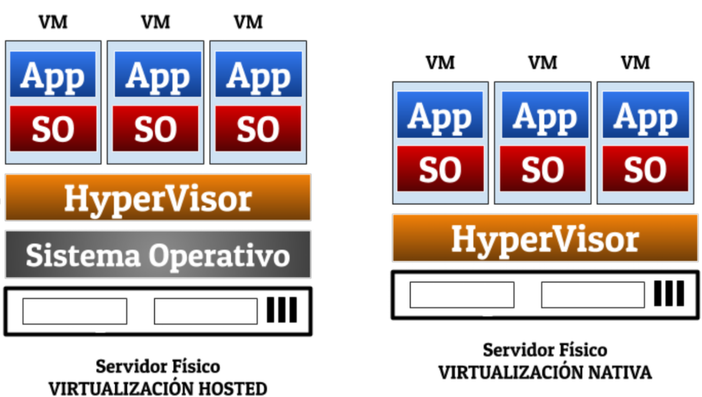

Estos enfoques tenían una serie de BENEFICIOS que derivaban principalmente de superar las limitaciones del modelo de servidor único. A saber:

+ Hay un **mejor aprovechamiento de los recursos**. Un servidor grande y potente se puede compartir entre distintas aplicaciones.
+ Los **procesos de migración y escalado no son tan dolorosos**, simplemente le doy más recursos a la máquina virtual dentro de mi servidor o bien muevo la máquina virtual a un nuevo servidor, propio o en la nube, más potente y que también tenga características de virtualización.
+ Esto además hizo que aparecieran **nuevos modelos de negocio en la nube** que nos permiten en cada momento tener y dimensionar las máquinas virtuales según nuestras necesidades y pagar únicamente por esas necesidades.

No obstante este enfoque también tiene algunos **INCONVENIENTES**:

+ Todas las máquinas virtuales siguen teniendo su propia memoria RAM, su almacenamiento y su CPU que será aprovechada al máximo...o no.
+ Para arrancar las máquinas virtuales tenemos que arrancar su sistema operativo al completo.
+ La portabilidad no está garantizada al 100%.

## 1.2. Contenedores.

El siguiente paso en la evolución, fue la aparición de los **CONTENEDORES**, eso que anteriormente hemos llamado "**máquinas virtuales ligeras**" . Su arquitectura general se puede ver en la siguiente imagen:

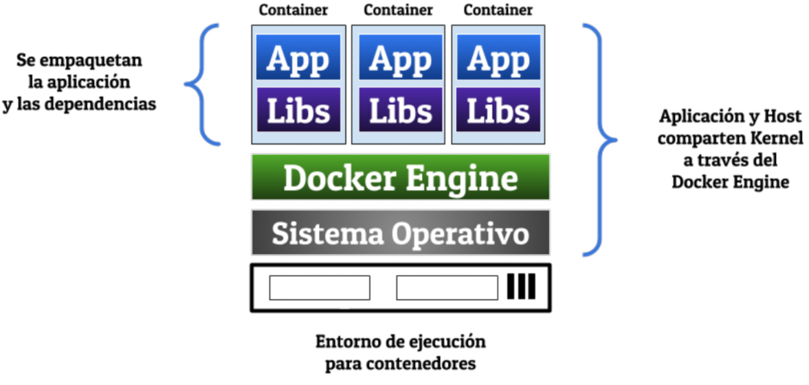

Y sus principales características son las siguientes:

+ Los contenedores utilizan el mismo Kernel Linux que la máquina física en la que se ejecutan gracias a la estandarización de los Kernel y a características como los Cgroups y los Namespaces. Esto elimina la sobrecarga que en las máquinas virtuales suponía la carga total del sistema operativo invitado.
+ Permiten aislar las distintas aplicaciones que tenga en los distintos contenedores.
+ Facilitan la distribución de las aplicaciones ya que éstas se empaquetan junto con sus dependencias y pueden ser ejecutadas posteriormente en cualquier sistema en el que se pueda lanzar el contenedor en cuestión.
+ Se puede pensar que se añade una capa adicional  el Docker Engine, pero esta capa apenas añade sobrecarga debido a que se hace uso del mismo Kernel.

Este enfoque por lo tanto aporta los siguientes **BENEFICIOS**:

+ Una mayor velocidad de arranque, ya que prescindimos de la carga de un sistema operativo invitado. Estamos hablando de apenas segundos para arrancar un contenedor (a veces menos).
+ Un gran portabilidad, ya que los contenedores empaquetan tanto las aplicaciones como sus dependencias de tal manera que pueden moverse a cualquier sistema en el que tengamos instalados el Docker Engine, y este se puede ser instalado en casi todos, por no decir todos.
+ Una mayor eficiencia ya que hay un mejor aprovechamiento de los recursos. Ya no tenemos que reservar recursos, como hacemos con las máquinas virtuales, sin saber si serán aprovechados al máximo o no.
  
Aunque como todo en esta vida, la tecnología de contenedores tiene algún **INCONVENIENTE**:

+ Los contenedores son más frágiles que las máquinas virtuales y en ocasiones se quedan en un estado desde el que no podemos recuperarlos. No es algo frecuente pero ocurre y para eso hay soluciones como la orquestación de contenedores que es algo que queda fuera del alcance de este curso que está más orientado a desarrolladores que a sistemas.

## 1.3. Glosario.

+ **Imagen** Una imagen es una plantilla (ya sea de una aplicación de un sistema) que podremos utilizar como base para la ejecución posterior de nuestras aplicaciones (contenedores). Si queremos una descripción más técnica y detallada diremos que es un archivo comprimido en el que, partiendo de un sistema base, se han ido añadiendo capas cada una de las cuales contiene elementos necesarios para poder ejecutar una aplicación o sistema. No tiene estado y no cambia salvo que generemos una nueva versión o una imagen derivada de la misma.
+ **Contenedor** Es una imagen que junto a unas instrucciones y variables de entorno determinadas se ejecuta. Tiene estado y podemos modificarlo. Estos cambios no afectan a la imagen o "plantilla" que ha servido de base.
+ **Repositorio** Almacén, normalmente en la nube desde el cual podemos descargar distintas versiones de una misma imagen para poder empezar a construir nuestras aplicaciones basadas en contenedores.
+ **Docker** Plataforma, mayormente opensource, para el desarrollo, empaquetado y distribución de aplicaciones de la empresa Docker Inc (anteriomente Dot Cloud Inc). Es un término que se suele utilizar indistintamente al del Docker Engine.
+ **Docker Engine** Aplicación cliente-servidor que consta de tres componentes: un servicio **dockerd** para la ejecución de los contenedores, un **API** para que otras aplicaciones puedan comunicarse con ese servicio y una aplicación de línea de comandos **docker cli** que sirve para gestionar los distintos elementos (contenedores, imágenes, redes, volúmenes etc..)
+ **Docker Hub** Registro de repositorios de imágenes de la empresa Docker Inc. Accesible a través de la URL https://hub.docker.com/


# 2. Instalación.

Para instalar Docker vamos a instalar el paquete **docker.io**, para ello hay que instalarlo con el sofware de la distribución que estamos utilizando. Es recomendable actualizar los repositorios y después instalarlo.

Si no estuviera seguimos el siguiente enlace.

https://docs.docker.com/engine/install/ubuntu/#install-using-the-repository

Comprobamos si docker se ha instalado correctamente

```bash
sudo systemctl status docker
```
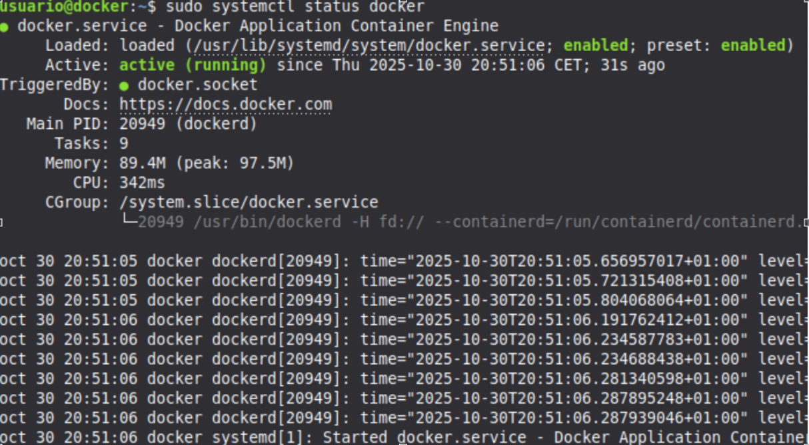

Una vez instalado, por defecto se usa utilizando permisos de administrador, y puede ser un engorro cada vez utilizar sudo para ello vamos a ver que hacer para poder utilizar Docker con un usuario.

Primero vamos a comprobar si el grupo docker ha sido creado.

```bash
sudo cat /etc/group | grep docker
```
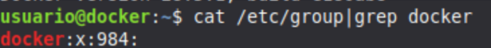

Si no lo hubiese creado lo creamos:
```bash
sudo groupadd docker
```
Añadir nuestro usuario al grupo ya que si no lo hacemos tenemos que utilizar siempre el sudo para realizar cualquier acción.
```bash
sudo usermod -aG docker $USER
```
Reiniciamos la máquina.

Para ver que todo está funcionando vamos a instalar el contenedor Hello World.

```bash
docker run hello-world
```
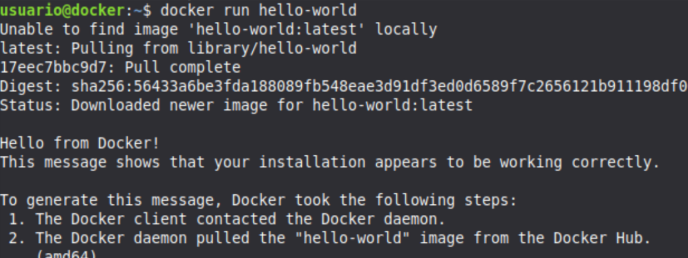

Otra de las utilidades que vamos a utilizar es **docker-compose**. Aunque la instalación la veremos más adelante, podemos realizar ya la instalación.

La instalación de docker-compose es un proceso muy sencillo. Si somos usuarios de MAC y Windows no tendremos que instalar nada ya que docker-compose es una de las herramientas que por defecto se incluyen dentro de Docker Desktop. 

Si somos usuarios de Linux su instalación se realiza únicamente con dos pasos:

```bash
# Descarga del fichero mediante la orden curl y colocación en el directorio adecuado. 
sudo curl -L "https://github.com/docker/compose/releases/download/2.40.3/docker-compose-$(uname -s)-$(uname -m)" -o /usr/local/bin/docker-compose

# Concesión de los permisos de ejecución
sudo chmod +x /usr/local/bin/docker-compose

# Comprobación de que la instalación está correcta.
docker-compose --version
docker-compose version 2.40.3
```


> [!IMPORTANT]
>
> Si no se descargase hay que realizar manualmente la descarga:

1. Lo descargamos de: https://github.com/docker/compose/releases/tag/v2.40.3/
2. El fichero a descargar es **docker-compose-linux-x86_64**.
3. Copiarlo al directorio correcto **sudo cp  /home/usuario/Descargas/docker-compose-linux-x86_64 /usr/local/bin/docker-compose** Sustituyendo usuario por el usuario local.
 4. Darle permisos de ejecución: **sudo chmod +x /usr/local/bin/docker-compose**.
 5. Comprobar la versión: **docker-compose --version**.

## 2.1. Ayuda de docker.

Si necesitamos ayuda se puede mostrar con la opción **--help**.
```bash
docker rmi --help
docker --help
```

# 3. Docker Hub.

Es un repositorio donde podemos descargar imagenes de servicios que queramos montar.
Podemos aceder desde [Enlace Docker Hub](https://hub.docker.com/)

Cuando hemos ejecutado **docker run hello-world** ha pasado dos cosas:

+ Se **DESCARGA** la imagen que es algo así como la "plantilla" para la creación de contenedores en ejecución.
+ Se **EJECUTA** el contenedor.

# 4. Gestión de imágenes.

Como ya hemos dicho las imágenes son la plantilla a partir de las cuales vamos a generar nuestros contenedores.

## 4.1. Descarga de imágenes.

Un comando útil es la búsqueda de imágenes para poder crear nuestros contenedores, utilizaremos el siguiente comando, por ejemplo si queremos instalar un contenedor con **ubuntu** podemos buscar las imágenes ya creadas con el siguiente comando:

```bash
docker search ubuntu
```

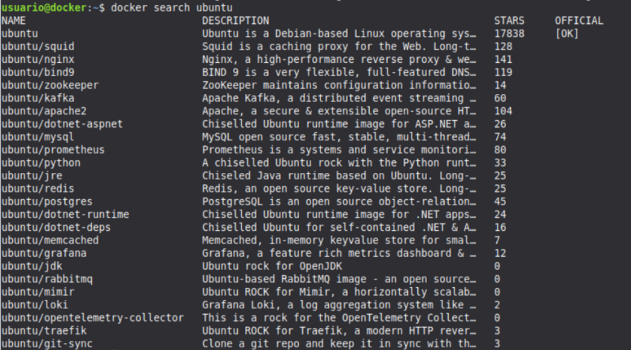

De la información que nos muestra una de las columnas más importantes es la de ST**ARS que son las estrellas que tiene dicha imagen, en modo gráfico también. 

Descargamos las imágenes con el comando 

```
docker pull imagen:version
```

Indicando el nombre de la imagen y la versión de la misma (**TAG**). Si no indicamos nada se descarga la última versión (latest). 

```bash
# mysql - Es el nombre de la imagen 8.0.22 es la versión o TAG
docker pull mysql:8.0.22
```

Es recomendable usar `docker pull` por las siguientes razones:

+ Me permite **actualizar** una determina pareja imagen:versión a su última actualización. Solo tendré que hacer **docker pull con el mismo imagen:versión**.
+ Suponiendo que ya teníamos previamente la versión descargada. Actualiza la versión mysql:5.7

```
docker pull mysql:5.7
```

> [!IMPORTANT]
>
>Me permite **bajar todas las versiones de una imagen** de una >sola vez. Esto **puede ser peligroso** si una imagen tiene >muchas >versiones disponibles. Lo conseguiremos con la opción >`-a` o `--all-tags`.

## 4.2. Mostrar imágenes descargadas.

Cada vez que descarguemos una imagen podemos mostrar por pantalla una lista de las imágenes que tenemos en nuestro sistema usando la orden:

```bash
# Listas imágenes descargas
docker images o docker image ls
```

La información que se nos muestra se organiza en forma tabular y nos proporciona los siguientes datos:

+ **IMAGE**: Nombre de la imagen en el repositorio., con la versión de la imagen descargada Por ejemplo: mysq:5.7
+ **ID**: Un identificador que es único para cada imagen. Siempre podemos usar este ID en vez del nombre.
+ **DISK SIZE**: Tamaño de la imagen.

## 4.3. Borrado de imágenes.

Conforme vamos avanzando en el uso de Docker iremos **acumulando imágenes** en nuestro sistema. Estas imágenes, bien es cierto, no ocupan tanto espacio como una máquina virtual pero si hemos descargado varias decenas o centenas de las mismas (basta un par docker pull -a para eso) al final nos encontraremos con que podemos llegar a ocupar una cantidad considerable de espacio en disco si no tenemos cierto control sobre las mismas.

En este caso, para una mejor gestión, podemos empezar a borrar imágenes de la siguiente forma:

```bash
# Borrado de la imagen mysql:8.0.22
docker rmi mysql:8.0.22
# Borrado de una imagen usando su IMAGE ID
docker rmi dd7265748b5d
# Borrado de dos imágenes (o varias) a la vez. Puedes usar nombre e IMAGE ID
docker rmi mysql:8.0.22 mysql:5.7
```


> [!IMPORTANT]
>
>No podemos borrar una imagen si ya tenemos un contenedor que está usándola.

Si aun así queremos borrarla **podemos forzar ese borrado**, lo cual afectará, evidentemente, a los contenedores que tuviéramos referenciando esa imagen. Eso lo conseguimos añadiendo la opción `-f` o `--force`. Por ejemplo:

```bash
# Borra la imagen httpd (Apache latest) aunque hubiera contenedores que estuvieran usando esa imagen.
docker rmi -f httpd
```
Este proceso de borrado, sobre todo si tenemos muchas imágenes,  puede ser un proceso engorroso. Para facilitar esto disponemos de la orden **docker image prune** que tiene tres opciones básicas:

+ **-a** o **--all** para borrar todas las imágenes que no están siendo usadas por contenedores
+ **-f** o **--force** para que no nos solicite confirmación. Es una operación que puede borrar muchas imágenes de una tacada y debemos ser cuidadosos. Os recomiendo no usar esta opción.
+ **--filter** para especificar ciertos filtros a las imágenes.

Para demostrar su funcionamiento vamos a poner varios ejemplos:

```bash
# Borrar todas las imágenes sin usar
docker image prune -a
# Borrado de las imágenes creadas hace más de una semana 10 días
docker image prune --filter until="240h"
```

## 4.4. Obteniendo inofrmación de las imágenes.

Una vez tenemos ya las imágenes descargadas es muy interesante conocerlas al máximo para poder utilizarlas. Para ello tenemos **dos fuentes principales**:

+ La **página de la imagen en DockerHub** que suele recoger sobre todo información relativa a aspectos como:
  + Una descripción de la aplicación o servicio que contiene la imagen.
  + Una lista de versiones TAGs disponibles.
  + Variables de entorno interesantes.
  + Cómo ejecutar la imagen.
+ La salida de las órdenes **docker image inspect / docker inspect** que nos da ya una información más detallada sobre las características, con todos los metadatos de la misma.

Veamos un ejemplo de la misma:

```bash
# Dos formas de obtener información de la imagen mysql:8.0.22
docker image inspect mysql:8.0.22
docker inspect mysql:8.0.22
```
Está en formato JSON (JavaScript Object Notation) y nos da datos sobre aspectos como:

+ El id y el checksum de la imagen.
+ Los puertos abiertos.
+ La arquitectura y el sistema operativo de la imagen.
+ El tamaño de la imagen.
+ Los volúmenes.
+ El ENTRYPOINT que es lo que se ejecuta al hacer docker run.
+ Las capas.
+ Y muchas más cosas....

Adicionalmente podemos formatear la salida usando Go  y el flag `--format/-f`. Una descripción detallada queda fuera de los objetivos de este curso pero vamos a poner varios ejemplos:

```bash
# Mostrar la arquitectura y el sistema
docker inspect --format '{{.Architecture}} es la arquitectura y el SO es {{.Os}}' mysql:8.0.22
 amd64 es la arquitectura y el SO es linux
# Mostrar la lista de puertos expuestos
docker inspect --format '{{.Config.ExposedPorts}}' mysql:8.0.22
map[3306/tcp:{} 33060/tcp:{}]
```
NOTA: Para poder este formateo debemos conocer en profundidad la estructura del JSON que nos devuelve.


## 4.5. Otros comandos.

Además de los comandos que hemos visto en los apartados anteriores la orden **docker image** tiene una gran variedad de **subcomandos**, que si bien no son necesarios para poder empezar con docker si que es bueno conocer que existen, os recomiendo los siguientes:

+ **docker image build** para construir una imagen desde un fichero Dockerfile.
+ **docker image history** para que se nos muestre por pantalla la evolución de esa imagen.
+ **docker image save / docker image load (o docker save / docker load)** para guardar imágenes en fichero y cargarlas desde fichero.
+ **docker image tag ( docker tag)** para añadir TAGs (versiones) a las distintas imágenes.

# 5. Contenedores.

Los contenedores son creados a partir de las **imágenes**. Eso lo podemos conseguir de la siguiente manera:
      
+ **docker pull nombre_imagen:version** que descargará desde el repositorio una imagen con la versión indicada o la última versión (**latest**) si no indicamos versión.
+ Y la orden fundamental para ejecutar contenedores que es **docker run **cuya función principal es poner en ejecución contenedores en base a una imagen de referencia que le indicaremos. Una **CUESTIÓN IMPORTANTE** que debemos de tener en cuenta al usar docker run es que si vamos a **ejecutar un contenedor** que usa como base una **imagen que no tenemos**, esta **se descargará de manera automática**. Para buscar las imágenes que queremos la opción que os recomiendo es usar el buscador de Docker Hub.

Esta orden **docker run** tiene una sintaxis sencilla pero multitud de opciones de las que explicaremos algunas. No obstante la estructura general es la siguiente:


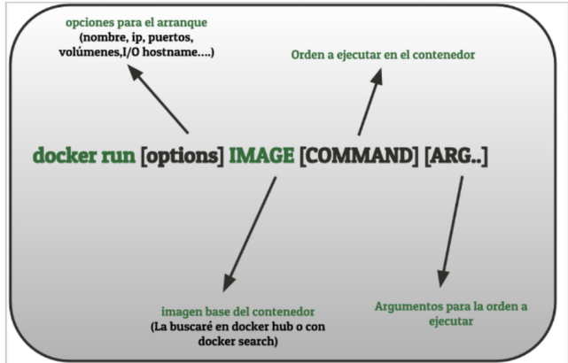

Solo vamos a ver algunas de las opciones que posee este comando:
+ **-d** o **--detach** para ejecutar un contenedor (normalmente porque tenga un servicio) en background.
+ **-e** o **--env** para establecer variables de entorno en la ejecución del contenedor.
+ **-h** o **--hostname** para establecer el nombre de red parar el contenedor.
+ **--help** para obtener ayuda de las opciones de docker.
+ **--interactive** o **-i** para mantener la STDIN abierta en el contenedor.
+ **--ip** si quiero darle una ip concreta al contenedor.
+ **--name** para darle nombre al contenedor.
+ **--net** o **--network** para conectar el contenedor a una red determinada.
+ **-p** o **--publish** para conectar puertos del contenedor con los de nuestro host.
+ **--restart** que permite reiniciar un contenedor si este se "cae" por cualquier motivo.
+ **--rm** que destruye el contenedor al pararlo.
+ **--tty** o **-t** para que el contenedor que vamos a ejecutar nos permita un acceso a un terminal para poder ejecutar órdenes en él.
+ **--user** o **-u** para establecer el usuario con el que vamos a ejecutar el contenedor.
+ **--volume** o **-v** para montar un bind mount o un volumen en nuestro contenedor.
+ **--wordirk** o **-w** para establecer el directorio de trabajo en un contenedor.

A continuación vamos a ver algunos ejemplos básicos. En apartados posteriores de este mismo módulo y en módulos posteriores continuaremos con la introducción de más opciones:

> **Ejemplo 1**

```bash
# Descargar una imagen de manera previa
docker pull ubuntu:18.04
# Crear un contenedor de ubuntu:18.04 y tener acceso a un shell en él. Si no hemos descargado la imagen de manera previa se descargará.
docker run -it ubuntu:18.04 /bin/bash
root@ef2bea1d6cb1:/#
```
Al crear el contenedor se nos da un acceso a un shell del mismo. Es importante destacar que **estamos accediendo como root**. Al salir del terminal el contenedor se para.

> **Ejemplo 2**
```bash
# Crear un contenedor de ubuntu:18.04 y listar el contendido de la carpeta /
docker run ubuntu:18.04 ls /
```
bin boot dev etc ...

Al crear el contenedor se ejecuta la orden ls / y posteriormente el contenedor pasa a estar parado. Y ya no podremos acceder a él. 


> **Ejemplo 3**

```bash
# Crear un contenedor de httpd (Servidor Apache)
docker run httpd
AH00558: httpd: Could not reliably determine the server's fully qualified domain name, using 172.17.0.2. Set the 'ServerName' directive globally to suppress this message
AH00558: httpd: Could not reliably determine the server's fully qualified domain name, using 172.17.0.2. Set the 'ServerName' directive globally to suppress this message
[Mon Dec 07 10:01:52.670809 2020] [mpm_event:notice] [pid 1:tid 140412541457536] AH00489: Apache/2.4.46 (Unix) configured -- resuming normal operations
[Mon Dec 07 10:01:52.670973 2020] [core:notice] [pid 1:tid 140412541457536] AH00094: Command line: 'httpd -D FOREGROUND'
```
Al ejecutar esa orden se crea un servidor Web Apache 2.4 en la ip mostrada y se nos muestra por pantalla el log de dicho servicio. Introducir la Ip en el navegador.

> **Ejemplo 4**

```bash
# Crear un contenedor de debian 9 y mostrar el contenido de una carpeta establecida con el parámetro -w
docker run -it -w /etc debian:9 ls
```
Al crear el contenedor se ejecuta la orden ls desde el directorio /etc, posteriormente el contenedor pasa a estar parado. Y ya no podremos acceder a él. 

> [!NOTE] 
> 
>Conforme vayamos creando contenedores hay dos órdenes que nos van a interesar para hacer un seguimiento de qué tenemos en nuestro sistema.

```bash
# Mostrar los contenedores en ejecución (Estado Up)
docker ps
# Mostrar todos los contenedores creados ya estén en ejecución (Estado Up) o parados (Estado Exited)
docker ps -a
```

[Referencia Docker run](https://docs.docker.com/engine/reference/commandline/run/)

## 5.1. Asignando nombre a los contenedores.

Hasta ahora cuando hemos puesto en ejecución los contenedores la propia aplicación docker ha sido  la que nos ha dado un **nombre por defecto**. Estos nombres creados aleatoriamente por docker **constan de dos nombres aleatorios unidos por un guión bajo _**, por ejemplo: happy_golick, magical_mclean etc.

Evidentemente esto no es operativo. Son nombre **difíciles de recordar**, que no tienen nada que ver con los contenedores que queremos lanzar e **imposible de gestionar y memorizar** cuando empezamos a tener muchos contenedores en nuestro sistema.

Por este motivo es conveniente que hagamos **obligatorio el uso del flag --name** cuando usamos la orden docker run. De esta manera, si usamos nombre elegidos por nosotros serán más fáciles de recordar que los asignados por defecto. Ademas podemos elegir nombres que tenga relación con la función que va a desempeñar dicho contenedor.

Pondremos varios ejemplos:

```bash
# Damos el nombre de servidorBD a un contenedor de la imagen mysql:8.0.22

docker run -d --name servidorBD -p 3306:3306 mysql:8.0.22

# Damos el nombre de servidorWeb a un contenedor de la imagen httpd:latest (Apache)

docker run -d --name servidorWeb -p 80:80 httpd
```

## 5.2. Ejecución de servicios. Puertos y variables de entorno.

Una de las cosas que más interesantes de docker no es ya el hecho de que se puede **probar todas versiones de los distintos sistemas** que van apareciendo, es el hecho de que **PARA PROBAR Y USAR CUALQUIER SERVICIO Y CUALQUIER APLICACIÓN NO TENGO QUE INSTALAR NADA EN MI SISTEMA**, sea cual sea el servicio o la aplicación que se me ocurra, siempre la tengo en Docker Hub. Solo tengo que buscarla, averiguar cuál es la versión que quiero y lanzar el contenedor o contenedores necesarios. 


Nos vamos a centrar en servicios de un solo contenedor, estamos hablando de servidores de bases de datos, servidores web, servidores de aplicaciones etc... servicios que de otra parte son de uso casi diario en nuestras aulas. Veremos en módulos posteriores aplicaciones que requieren la interacción de más de un contenedor.

Para la ejecución de contenedores de este tipo vamos a tener que en cuenta varias cosas:

+ Usar el **flag -d** para que el servicio se ejecute en **modo background o dettach**. Si no lo hacemos se bloqueará el terminal mostrando el log del servicio (en ciertas ocasiones puede interesarnos) y tendremos que salir del mismo con Ctrl+C. Esto para el contenedor aunque podremos arrancarlo posteriormente.
+ Si queremos que el servicio que vamos a lanzar sea accesible desde el exterior tendremos que añadir el **flag -p** de la siguiente manera **-p PUERTO_EN_HOST:PUERTO_EN_CONTENEDOR** que normalmente sería el puerto por defecto del servicio. Esto es una **REDIRECCIÓN DE PUERTOS**. Podemos tener varias reglas -p al arrancar (dependiendo del servicio será necesario) y es muy importante recordar que no podemos tener dos servicios escuchando en el mismo puerto. Si lo intentamos se nos mostrará un mensaje de error.
+ **Comprobar y definir** si es necesario las **variables de entorno** que puede tener el contenedor. Las variables de entorno importantes se describen en la página de las imágenes en DockerHub y para usarlas tenemos que usar el **flag -e NOMBRE_VARIABLE=VALOR**.

Para ilustrar todo esto vamos a poner varios ejemplos:

```bash
# Ejecuto un servidor Apache sin el flag -d ni redirección de puertos. Se bloquea el terminal mostrando los logs y tendré que salir con Ctrl+C

docker run httpd

# Ejecuto un servidor Apache en background y accediendo desde el exterior a través del puerto 8888 de mi máquina.

docker run -d --name servidorWeb -p 8888:80 httpd

# Ejecuto un servidor Apache en background y accediendo desde el exterior a través del puerto 8888 de mi máquina. Y hacemos que cuando se reinicie el servicio Docker el contenedor se arranque automáticamente.

docker run –restart always -d --name servidorWeb -p 8888:80 httpd

# Creación de un servidor de base de datos mariadb accediendo desde el exterior a través del puerto 3306 y estableciendo una contraseña de root mediante una variable de entorno

docker run -it -d -p 3306:3306 -e MYSQL_ROOT_PASSWORD=root mariadb
```

## 5.3. Ejecutar órdenes en contenedores.

Con los contenedores en ejecución vamos a querer ejecutar órdenes en ellos. Querremos realizar operaciones como:

+ Instalar paquetes.
+ Modificar o ver el contenido de ciertos ficheros.
+ Habilitar ciertos módulos de servicios
      
Esto lo podemos hacer de dos maneras o bien obteniendo un terminal del contenedor y ejecutando las órdenes necesarias desde allí o bien directamente ejecutando una orden determinada "contra" el contenedor. Para ambos casos voy a necesitar la orden **docker exec** y es **NECESARIO QUE EL CONTENEDOR ESTÉ EN EJECUCIÓN**.

La sintaxis de esta orden es bastante sencilla y muy similar a la de docker run:

```bash
docker exec [opciones] nombre_contenedor orden [argumentos]
```
Algunas de las opciones más importantes son:

+ **-it** (-i y -t juntos) si vamos a querer tener interactividad con el contenedor ejecutando un shell (/bin/bash normamente). Una vez tenemos el terminal ya podremos trabajar desde dentro del propio sistema.
+ **-u** o **--user** si quiero ejecutar la orden como si fuera un usuario distinto del de root.
+ **-w** o **--workdir** si quiero ejecutar la orden desde un directorio concreto.

Lo vamos a ver mejor con algunos ejemplos:

```bash
# Obtener un terminal en un contenedor que ejecutar un servidor Apache (httpd) y que se llama web

docker exec -it web /bin/bash

root@5d96ce1f7374:/usr/local/apache2#

# Mostrar el contenido de la carpeta /usr/local/apache2/htdocs del contenedor web. Como no hace falta interactividad no es necesario -it

docker exec web ls /usr/local/apache2/htdocs

# Crear directamente un fichero "HOLA MUNDO" en el directorio raíz del servidor apache. Utilizo sh -c para ordenes compuestas o complejas

docker exec -it web sh -c "echo 'HOLA MUNDO' > /usr/local/apache2/htdocs/index.html"
```

Adicionalmente existe otra orden que nos va a ser de mucha utilidad cuando trabajemos con contenedores, la orden docker cp que me permite mover ficheros desde mi sistema al contenedor y desde el contenedor a mi sistema. Su sintaxis es muy sencilla y la vamos a ilustrar con dos ejemplos, uno en cada sentido:

```bash
# Copiar mi fichero prueba.html al fichero /usr/local/apache2/htdocs/index.html de mi contenedor llamado web que es un servidor Apache (httpd)

docker cp prueba.html web:/usr/local/apache2/htdocs/index.html

#Copiar el fichero index.html que se encuenta en /usr/local/apache2/htdocs/index.html de mi contenedor llamado web un fichero llamado test.html en mi directorio HOME

docker cp web:/usr/local/apache2/htdocs/index.html $HOME/test.html
```

> [!NOTE] 
> Los contenedores vienen con solo lo imprescindible instalado. Si quiero instalr algo debo normalmente hacer antes un apt update (ya que la mayoría son basados en Debian).

## 5.4. Obtener información de los contenedores.

Conforme vayamos usando docker el número de contenedores que tenemos funcionando irá en aumento hasta que llegue un momento en que no sepamos con seguridad aspectos como si el contenedor tenía persistencia o no, si tenía redirección de puertos o no, si le había puesto algún nombre o estaba usando un nombre concedido por docker etc.
En ese contexto hay varios comandos docker que me van a ayudar a obtener información de un contenedor. En este curso vamos a usar los dos siguientes:

+ La orden docker ps.
+ La orden docker inspect.
+ La orden docker logs.

### 5.4.1. Docker ps.

La orden **docker ps** nos va a servir para obtener información de los contenedores ya arrancados. La información que nos proporciona va a ser menos exhaustiva que la que podemos obtener con **docker inspect** pero nos puede ayudar a determinar aspectos como:

+ El **estado** del contenedor (Parado EXITED o Funcionado UP).
+ La **imagen** de la que deriva el contenedor.
+ El **tamaño** actual del contenedor.
+ La orden que ejecuta el contenedor al arrancar, lo que se llama el ENTRYPOINT.
+ El **nombre** del contenedor, ya sea dado por nosotros o por docker.
+ **Cuando fue creado** el contenedor.
+ Las **redirecciones de puertos**, en caso de haberlas.

Como muchas de las órdenes de **docker ps** tiene multitud de opciones (flags) así que para ilustrar su uso mejor vamos a poner varios ejemplos de las más usadas.
```bash
# Mostrar los contenedores que están en ejecución
docker ps
# Mostrar todos los contenedores, estén parados o en ejecución (-a o --all)
docker ps -a
# Añadir la información del tamaño del contenedor a la información por defecto (-s o --size)
docker ps -a -s
# Mostrar información del último contenedor que se ha creado (-l o --latest). Da igual el estado
docker ps -l
# Filtar los contenedores de acuerdo a algún criterio usando la opción (-f o --filter)
# Filtrado por nombre
docker ps --filter name=servidor_web
# Filtrado por puerto. Contenedores que hacen público el puerto 8080
docker ps --filter publish=8080
```

### 5.4.2. Docker inspect.

Si la información que hemos obtenido usando docker ps , que es una información general, no es suficiente para nuestro objetivo deberemos usar la docker inspect que nos va a dar una información detallada del contenedor que seleccione. Lo podemos hacer de las siguientes formas:
```bash
# Por nombre. Por ejemplo: Mostrar información detallada del contenedor cuyo nombre es jenkins
docker inspect jenkins
# Por id. Por ejemplo: Mostrar información detallada del contenedor cuyo id es 5e5adf6815bc
docker inspect 5e5adf6815bc
```
Al ejecutar esto obtendremos una imagen similar a la siguiente:
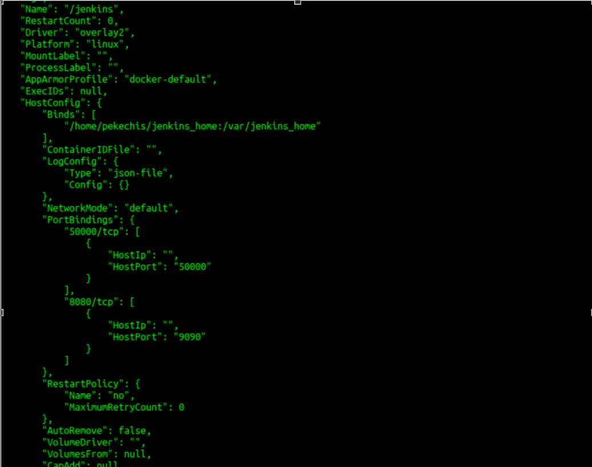

Esta imagen es una imagen parcial, porque se nos muestra mucha información, está en formato JSON (JavaScript Object Notation) y nos da datos sobre aspectos como:

+ El id del contenedor.
+ Los puertos abiertos y sus redirecciones.
+ Los bind mounts y volúmenes usados.
+ El tamaño del contenedor
+ La configuración de red del contenedor.
+ El ENTRYPOINT que es lo que se ejecuta al hacer docker run.
+ El valor de las variables de entorno.
+ Y muchas más cosas....

Adicionalmente podemos formatear la salida usando https://pkg.go.dev/text/template y el flag --format/-f. Una descripción detallada queda fuera de los objetivos de este curso pero vamos a poner varios ejemplos:
```bash
# Mostrar la ip del contenedor
docker inspect --format 'La ip es {{.NetworkSettings.Networks.bridge.IPAddress}}' jenkins
La ip es 172.17.0.2
# Mostrar las redirecciones de puertos del contenedor
docker inspect --format 'Las redirecciones de puertos son {{.NetworkSettings.Ports}}' jenkins
Las redirecciones de puertos son map[50000/tcp:[{0.0.0.0 50000}] 8080/tcp:[{0.0.0.0 9090}]]
```

> [!NOTE] 
> 
>Para poder este formateo debemos conocer en profundidad la estructura del JSON que nos devuelve.

### 5.4.3. Docker Logs.
Los dos comandos que hemos visto anteriormente nos dan información relativa al contenedor pero no nos dan información de lo que está pasando en el contenedor. Para determinar este tipo de cosas siempre hemos tenido los logs y siguen estando disponibles aunque estemos en docker mediante el uso de la orden docker logs, que me va a servir tanto para contenedores que estén parados como para contenedores en ejecución.

Los podemos hacer de las siguientes formas:
```bash
# Por nombre. Por ejemplo: Mostrar los logs del contenedor cuyo nombre es jenkins
docker logs jenkins
# Por id. Por ejemplo: Mostrar los logs cuyo id es 5e5adf6815bc
docker logs 5e5adf6815bc
```
Como todas las órdenes docker logs tiene más opciones más cuyo uso vamos a ilustrar con ejemplos:
```bash
# Opción -f o --follow . Sigue escuchando la salida que pueden dar los logs del contenedor
docker logs -f jenkins
# Opción  --tail 5. Muestra las 5 últimas líneas de los logs del contenedor en cuestión
docker logs --tail 5 jenkins
```
## 5.5. Gestión de contenedores.

Con el paso del tiempo iremos ejecutando muchos contenedores y llegará un momento en que tengamos la necesidad de realizar operaciones como las siguientes:

+ Parar un contenedor que no estamos necesitando o que , puede ser, esté ejecutando un servicio que ocupe un puerto que queremos ocupar con otro servicio o contenedor.
+ Eliminar un contenedor que instalamos y que ya no necesitamos. Puede ser que ya ni nos acordemos del motivo por el cual teníamos "eso" en nuestro sistema (a mí al menos me pasa).
+ Queremos iniciar un contenedor que estaba parado pero que vamos a volver a necesitar.
+ Queremos reiniciar un contenedor para que nuevas opciones de configuración sean aplicadas.

Para operaciones de ese tipo tenemos las siguientes órdenes docker:

+ **docker stop** para detener el contenedor, ya sea por nombre o por ID.
+ **docker rm** para borrar el contenedor, ya sea por nombre o por ID.
+ **docker start** iniciar un contenedor que estaba parado previamente, ya sea por nombre o por ID.
+ **docker restart** para reiniciar un contenedor que previamente ya estaba en ejecución.

Cada una de ellas tiene diferentes flags u opciones. Vamos a ver las más importantes mediante ejemplos:
```bash
# Para un contenedor en ejecución que se llame servidorWeb
docker stop servidorWeb
# Para un contenedor en ejecución cuyo ID es ea9b922190d8 pero esperando 10 segundo (-t o --time)
docker stop -t 10 ea9b922190d8
# Borrar un contenedor que se llama servidorBD
docker rm servidorBD
# Borrado un contenedor que se llame jenkins aunque esté en ejecución (--force o -f)
docker rm -f jenkins
# Inicio de un contenedor con nombre jenkins
docker start jenkins
# Inicio de un contenedor con nombre jenkins pero haciendo el attach de la entrada estándar para poder interactuar con él (-i o --interactive)
docker start -i jenkins
# Reinicio de un contenedor con ID ea9b922190d8
docker restart ea9b922190d8
```

Hay que tener en cuenta varias cosas que si pensamos un poco ya nos indica los efectos el propio sentido común:

+ Si hago **docker start** y el contenedor ya está iniciado, no pasa nada.
+ Si hago **docker stop** y el contenedor ya está parado, no pasa nada.
+ Si hago **docker restart** y el contenedor ya está parado, es lo mismo que si ejecutar un docker start.
+ Pero es importante destacar que **SI UN CONTENEDOR ESTÁ EN EJECUCIÓN NO PODEMOS BORRARLO** salvo que usemos la opción -f. 

# 6. Persistencia en Docker.

Trataremos los siguientes aspectos:

+ **Necesidad** de persistir los datos de los contenedores.
+ **Formas de gestionar** esa persistencia (Volúmenes y Bind Mounts).
+ **Operaciones** para la **gestión** de volúmenes y para la **obtención de información** de los mismos.
+ Cómo **asociar volúmenes o bind mounts a nuestros contenedores**. 
+ Uso de la persistencia de los datos como **copia de seguridad**.
+ **Compartición de datos** entre distintos contenedores.
**+ Depuración de aplicaciones usando bind mounts**.


## 6.1. Los datos en los contenedores.

Los **ficheros, datos y configuraciones** que creemos en los contenedores **sobreviven a las paradas** de los mismos, sin embargo, **son destruidos si el contenedor es destruido**. Y esto, como todos entendemos es una situación no deseable ya que puede echar por tierra nuestro trabajo.
Por lo tanto tenemos que tener muy presente varios aspectos a la hora de afrontar esta situación y la gestión del almacenamiento de los contenedores:

+ Los **datos de un contenedor mueren con él**.
+ Los datos de los contenedores **no se mueven fácilmente** ya que están fuertemente acoplados con el host en el que el contenedor está ejecutándose.
+ Escribir en los contenedores **es más lento que** escribir en el **host** ya que tenemos una capa adicional.

Ante la situación anteriormente descrita Docker nos proporciona **VARIAS SOLUCIONES PARA PERSISTIR DATOS** de contenedores.

+ Los **VOLÚMENES** docker.
+ Los **BIND MOUNT**.

## 6.2. Volúmenes y Bind Mount.

Tal y como dijimos en el apartado anterior, de las soluciones de persistencia que nos proporciona docker nos vamos a quedar con dos para este curso, los **volúmenes** y los **bind mounts**. Antes de que hablemos de las características y ventajas de cada una de ellas las vamos a situar dentro de nuestro host con el siguiente esquema general:

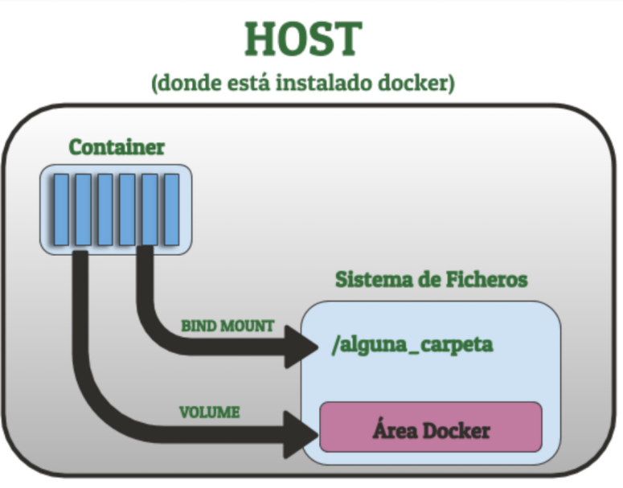

### 6.2.1. Volúmenes Docker.

Si elegimos conseguir la persistencia usando **volúmenes** estamos haciendo que **los datos de los contenedores** que nosotros decidamos se almacenen en una **parte del sistema de ficheros** que es **gestionada** por **docker** y a la que, debido a sus permisos, solo docker tendrá acceso.

Esa "**ZONA RESERVADA**" de docker cambia de un sistema operativo a otro y también puede cambiar dependiendo de la forma de instalación, pero de manera general podemos decir que es:

+ **/var/lib/docker/volumes** en las distribuciones de Linux si lo hemos instalado desde paquetes estándar.
* **/var/snap/docker/common/var-lib-docker/volumes** en Linux si hemos instalado docker mediante snap (no recomendado).
+ **C:\ProgramData\docker\volumes** en las instalaciones de Windows.
+ **/var/lib/docker/volumes** también en Mac aunque se requiere que haya una conexión previa a la máquina virtual que se crea.
      
Este tipo de volúmenes se suele usar en los siguiente casos:

+ Para compartir datos entre contenedores. Simplemente tendrán que usar el mismo volumen.
+ Para copias de seguridad ya sea para que sean usadas posteriormente por otros contenedores o para mover esos volúmenes a otros hosts.
+ Cuando quiero almacenar los datos de mi contenedor no localmente si no en un proveedor cloud.
+ En algunas situaciones donde usando Docker Desktop quiero más rendimiento. Esto se escapa al ámbito de este curso.

### 6.2.2. Bind Mount.

Si elegimos conseguir la persistencia de los datos de los contenedores usando **bind mount** lo que estamos haciendo es "**mapear**" una parte de mi sistema de ficheros, de la que yo normalmente tengo el control, con una parte del sistema de ficheros del contenedor.

Este mapeado de partes de mi sistema de ficheros con el sistema de ficheros del contenedor me va a permitir: 

+ **Compartir ficheros** entre el host y los containers.
+ Que otras aplicaciones que no sean docker tengan acceso a esos ficheros, ya sean código, ficheros etc...

Puede parecer que el hecho de que otras aplicaciones accedan a esos datos es algo negativo pero precisamente los **bind mounts** es el mecanismo que vamos a **preferir** para la fase de **DESARROLLO** ya que:

+ Las **aplicaciones** que podrán acceder a esos ficheros serán los **IDEs o editores de código**.
+ Estaremos modificando con aplicaciones locales **código** que a la vez se encuentra **en nuestro equipo y en el contenedor**.
+ Y desde mi propio equipo estaré probando ese **código en el entorno elegido, o en varios entornos** a la vez **sin necesidad de tener que instalar absolutamente nada** en mi sistema.

## 6.3. Gestionando volúmenes y obteniendo información.

En el apartado anterior presentamos las dos opciones para la persistencia de datos con docker que consideramos que eran de mayor interés para el desarrollo de software: volúmenes y bind mounts. En este apartado nos centraremos  en los volúmenes y en las operaciones básicas que podemos hacer con ellos mediante la orden docker volume. Estas operaciones son:

+ **Creación** de los volúmenes.
+ **Eliminación** de los volúmenes.
+ **Obtención de información** de los volúmenes.

En el apartado siguiente veremos  como, una vez hayamos definido estos volúmenes, podremos usarlos en nuestros contenedores.

### 6.3.1. Creación de volúmenes.

Para la creación de volúmenes vamos a usar la orden docker volume create que tiene la siguiente estructura:

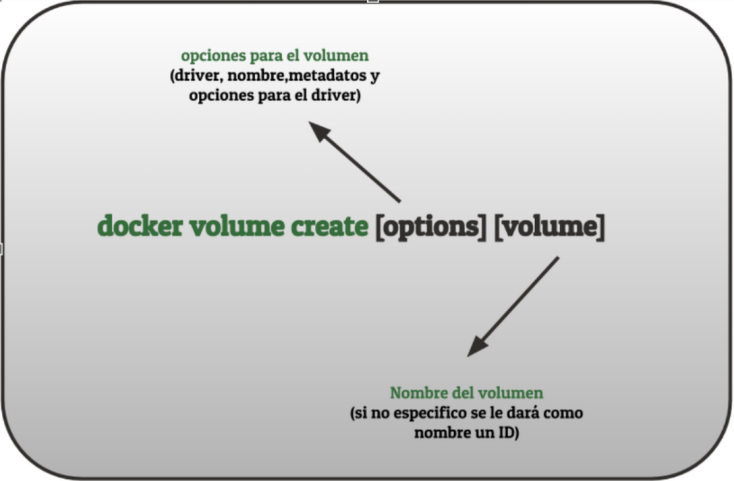

Entre las opciones que podemos incluir a la hora de crear los volúmenes están:

+ **--driver** o **-d** para especificar el driver elegido para el volumen. Si no especificamos nada el driver utilizado es el local que es el que nos interesa desde el punto de vista de desarrollo porque desarrollamos en nuestra máquina. Al ser Linux en mi caso ese driver local es **overlay2** pero existen otras posibilidades como **aufs, btrfs, zfs, devicemapper o vfs**. Si estamos interesados en conocer al detalle cada uno de ellos aquí tenemos más información.
+ **--label** para especificar los metadatos del volumen mediante parejas clave-valor.
+ **--opt** o **-o** para especificar opciones relativas al driver elegido. Si son opciones relativas al sistema de ficheros  puedo usar una sintaxis similar a las opciones de la orden mount.
+ **--name** para especificar un nombre para el volumen. Es una alternativa a especificarlo al final que es la  forma que está descrita en la imagen superior.

Vamos a ilustrar este funcionamiento con varios ejemplos:
```bash
# Creación de un volumen llamado datos (driver local sin opciones)
docker volume create data
# Creación de un volumen data especificando el driver local
docker volume create -d local data
# Creación de un volumen llamando web añadiendo varios metadatos
docker volume create --label servicio=http --label server=apache Web
```

### 6.3.2 Eliminación de volúmenes.

Para la eliminación de los volúmenes creados tenemos dos opciones:
+ **docker volume rm** para eliminar un volumen en concreto (por nombre o por id).
+ **docker volumen prune** para eliminar los volúmenes que no están siendo usados por ningún contenedor.
  
A continuación vamos a ver una lista de ejemplos para ilustrar el funcionamiento de ambos:

```bash
# Borrar un volumen por nombre
docker volume rm nombre_volumen
# Borrar un volumen por ID
docker volume rm a5175dc955cfcf7f118f72dd37291592a69915f82a49f62f83666ddc81f67441
# Borrar dos volúmenes de una sola vez
docker volume rm nombre_volumen1 nombre_volumen2
# Forzar el borrado de un volumen -f o --force
docker volume rm -f nombre_volumen
# Borrar todos los volúmenes que no tengan contenedores  asociados
docker volume prune
# Borrar todos los volúmenes que no tengan contenedores  asociados sin pedir confirmación (-f o --force)
docker volume prune -f
# Borrar todos los volúmenes sin usar que contengan cierto valor de etiqueta (--filter)
docker volume prune --filter label=valor
```

> [!NOTE] 
> No se pueden eliminar volúmenes en uso por contenedores, salvo que usemos el flag -f o --force y no es algo recomendado.

### 6.3.3 Obtención de información de los volúmenes.

Si queremos obtener información de los volúmenes que hemos creado podemos hacerlo de dos formas:

+ Usando **docker volume ls** que nos proporciona una lista de los volúmenes creados y algo de información adicional.
+ Usando **docker volume inspect** que nos dará una información mucho más detallada del volumen que hayamos elegido.

Si queremos información más detallada de un volumen tenemos que ejecutar la siguiente orden:

```bash
# Información detallada de un volumen por nombre
docker volume inspect nombre_volumen
# Información detallada de un volumen por ID
docker volume inspect a5175dc955cfcf7f118f72dd37291592a69915f82a49f62f83666ddc81f67441
```
Y la información que nos muestra es:

+ La fecha de creación del volúmen.
+ El tipo del driver.
+ Etiquetas asociadas.
+ El punto de montaje.
+ El nombre del volumen.
+ Las opciones asociadas al driver.
+ Y el ámbito del volumen.


### 6.3.4 Lista de volúmenes del sistema.

Si ejecutamos la siguiente orden:

```bash
# Listar los volúmenes creados en el sistema
docker volume ls
```

## 6.4. Asociando almacenamiento a los contenedores.

Una vez hemos visto en el apartado anterior cómo crear los volúmenes vamos a ver en este apartado como puedo usar los volúmenes y los bind mounts en los contenedores. Para cualquiera de los dos casos lo haremos mediante el uso de **dos flags** de la orden **docker run**:

+ El flag **--volume** o **-v**. Este flag lo utilizaremos para establecer bind mounts.
+ El flag **--mount**. Este flag nos servirá para establecer bind mounts y para usar volúmenes previamente definidos (entre otras cosas).

Es importante que tengamos en cuenta dos cosas importantes a la hora de realizar estas operaciones:

+ Al usar tanto volúmenes como bind mount el contenido de lo que tenemos **sobreescribirá la carpeta destino en el sistema de ficheros del contenedor** en caso de que exista. Y si nuestra carpeta origen no existe y hacemos un bind mount esa carpeta se creará pero lo que tendremos en el contenedor es una carpeta vacía. Con esto hay que tener especial cuidado, sobre todo cuando estamos trabajando con carpetas que pueden contener datos y configuraciones varias.
+ Si usamos imágenes de DockerHub, debemos **leer la información que cada imagen nos proporciona en su página** ya que esa información suele indicar cómo persistir los datos de esa imagen, ya sea con volúmenes o bind mounts, y cuáles son las **carpetas importantes** en caso de ser imágenes que contengan ciertos servicios (web, base de datos etc...)

Como acostumbramos en este curso vamos a ilustrar todo esto mediante una serie de ejemplos a los que añadiremos varias opciones

```bash
# BIND MOUNT (flag -v): La carpeta web del usuario será el directorio raíz del servidor apache. 
Se crea si no existe
docker run --name apache -v /home/usuario/web:/usr/local/apache2/htdocs -p 80:80 httpd
# BIND MOUNT (flag --mount): La carpeta web del usuario será el directorio raíz del servidor apache. Se crea si no existe
docker run --name apache -p 80:80 –mount type=bind, src=/home/usuario/web, dst=/usr/local/apache2/htdocs httpd
# VOLUME (flag --mount). Mapear el volumen previamente creado y que se llama Data en la carpeta raíz del servidor apache
docker run --name apache -p 80:80 --mount type=volume,src=Data,dst=/usr/local/apache2/htdocs httpd
# VOLUME (flag --mount). Igual que el anterior pero al no poner nombre de volumen se crea uno automáticamente (con un ID como nombre)
docker run --name apache -p 80:80 --mount type=volume,dst=/usr/local/apache2/htdocs httpd
```

En cualquiera de los dos casos, cuando creamos un bind mount o asociamos un volumen a un contenedor, esto queda reflejado en la salida de la orden **docker inspect sobre dicho contenedor**, de una manera similar a la imagen inferior.

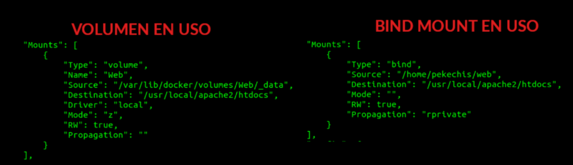

## 6.5. Uso de los volúmenes y bind mounts.

Hemos visto a lo largo de los apartados anteriores que con el uso de volúmenes y bind mounts conseguimos que los datos de los contenedores persistan y que sobrevivan incluso si los contenedores desaparecen. En este apartado vamos a concretar y desarrollar un poco más los usos que les podemos darles para conseguir: 

+ Hacer **copias de seguridad de contenidos**. En nuestro caso será tanto para código para datos.
+ Compartir **contenidos entre contenedores**. Lo haremos compartiendo código entre varios contenedores.
+ Probar una nueva versión de contenedor para **comprobar si la actualización de nuestro sistema puede dar problemas**.

Ilustraremos todo esto en los siguientes vídeos.

[Como copia de seguridad](https://youtu.be/rV9mEsPQJW0?list=PL-8CyWabyNa85xowmOeBMCspbrn6qNWgl)

[Compartir codigo entre contenedores](https://youtu.be/jIYQZIbSeng?list=PL-8CyWabyNa85xowmOeBMCspbrn6qNWgl)

[Para comprobar compatibilidad entre versiones](https://youtu.be/qdURCnir3dY?list=PL-8CyWabyNa85xowmOeBMCspbrn6qNWgl)

## 6.6. Bind mounts para desarrollo. Depurando aplicaciones.

En los apartados anteriores hemos visto como colocar las carpetas con el código que estaba editando en el contenedor que me interesaba. Hemos utilizado **BIND MOUNTS** porque ese tipo de persistencia me permite modificar los ficheros desde cualquier aplicación, no como los volúmenes que están en el área del sistema de ficheros que pertenece a docker y requiere permisos adicionales.

Sin embargo para poder afrontar con garantías el proceso de desarrollo vamos a necesitar en algún momento depurar y eso requiere que conectemos nuestro editor de código o IDE con el contenedor y que instalemos las utilidades necesarias.

Hay muchos editores e IDEs, muchos lenguajes de programación y muchos tipos de contenedores y aunque el curso no puede cubrirlos todos el proceso es más o menos siempre el mismo y vamos a ilustrarlo con los siguiente ejemplos:

+ Depurar desde Visual Studio Code una aplicación web PHP que se despliega en un contenedor con Apache+PHP
+ Depurar desde Visual Studio Code una aplicación python (Django) que se despliega en un contenedor de Django.

Para otro editores de código,IDES y lenguajes de programación el proceso es similar, la clave está en configurar una depuración remota ya que mi código va a estar en un  contenedor.

[Depurando una aplicacion en  PHP](https://youtu.be/OBvVSUYDq5s?list=PL-8CyWabyNa85xowmOeBMCspbrn6qNWgl)

[Depurando una aplicación web Python Django](https://youtu.be/LJ1_hxw1c38?list=PL-8CyWabyNa85xowmOeBMCspbrn6qNWgl)

# 7. Redes en Docker.

Docker ha creado sin que nosotros seamos conscientes una "red docker" y establecido las** reglas iptables necesarias para que esos contenedores tengan conectividad** con el exterior, para que tengan conectividad entre ellos si pertenecen a la misma red docker, y para que sean accesibles desde el exterior si es que hemos hecho la redirección de puertos pertinente.

En este módulo profundizaremos en este aspecto docker centrándonos en un tipo concreto de red docker, la red **bridge** que es la de uso más común para el desarrollo.

## 7.1. Tipos de redes en Docker.

Cuando nuestro contenedor y los servicios que podemos tener instalados en él  tienen algún tipo de conexión nosotros **no hemos tenido que configurar nada** y el contenedor ni sabe ni es consciente del funcionamiento de la red ni de la plataforma sobre la que funciona. El contenedor es **red y sistema agnóstico**.

Esto se consigue con un sistema de red en el que nosotros podemos "enchufar" distintos dispositivos de red a cada contenedor usando distintos drivers que pueden ser de los siguientes tipos:

+ **Bridge**: Es el driver por defecto. Mi equipo actúa como puente del contenedor con el exterior y como medio de comunicación entre los distintos contenedores que tengo en ejecución dentro de una misma red docker.
+ **Host**: El contenedor usa directamente la red de mi máquina (el host).
+ **Overlay**: Un sistema que conecta distintos servicios docker de máquinas diferentes. Se utiliza para docker Swarm, que es la tecnología de docker para la orquestación de contenedores.
+ **MacVlan**: Que nos permite asignar una MAC a nuestro contenedor que parecerá que es un dispositivo físico en nuestra red.
+ **None**:  Si queremos que el contenedor no tenga conectividad alguna.

Aunque todos estos tipos de drivers tienen su utilizad en determinadas situaciones lo cierto es que para los objetivos del curso nos vamos a centrar únicamente en los drivers de tipo **BRIDGE** que me van a permitir, siempre dentro nuestra máquina local:

+ **Aislar los distintos contenedores** que tengo en distintas subredes docker, de tal manera que desde cada una de las subredes solo podremos acceder a los equipos de esa misma subred.
+ **Aislar los contenedores del acceso exterior**.
+ **Publicar servicios** que tengamos en los contenedores **mediante redirecciones** que docker implementará con las pertinentes reglas de ip tables.

Un ejemplo de una configuración de una **RED CONSTRUIDA CON EL DRIVER BRIDGE** podría ser la siguiente:

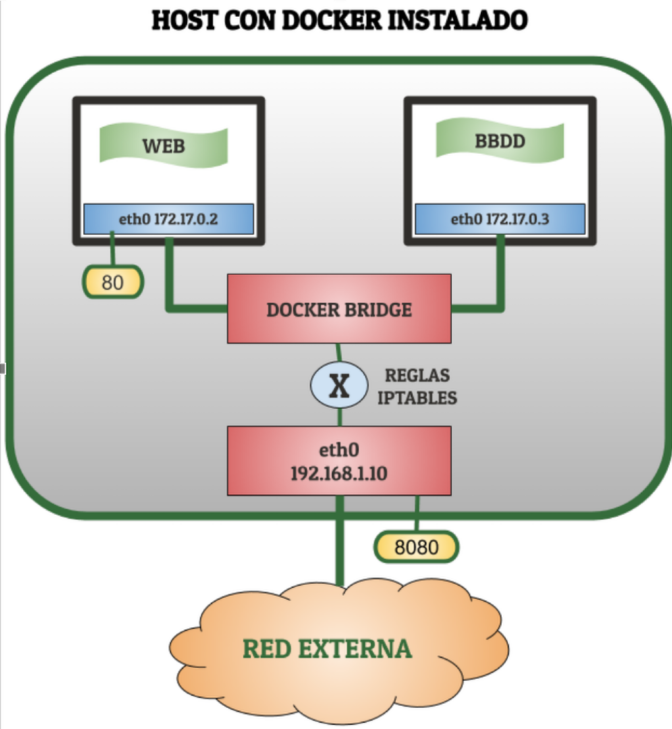

Este esquema representa una aplicación típica compuesta por dos servicios, un servidor web y un servidor de base de datos , cada uno de ellos en un contenedor diferente y haciendo accesible al exterior mi servidor web en el puerto 8080. 

Para que todo esto funcione docker creará de manera automática los interfaces virtuales y los puentes de red necesarios para cada uno de los dispositivos y configurará las reglas necesarias para que esos interfaces tengan acceso a internet, para aislar los contenedores del resto de las redes y para establecer las redirecciones de puertos necesarias.

## 7.2. Gestionando redes.

En el apartado anterior comentamos que para usar docker para el desarrollo vamos a tener más que suficiente con la creación de redes con el driver bridge. Sin embargo, vamos a tener que hacer una diferenciación entre dos tipos de redes "bridged": la red creada por defecto por docker para que funcionen todos los contenedores y aquellas redes "bridged" definidas por el usuario, es decir, por nosotros. Esta red por defecto se llama bridge  y podemos comprobrar que se ha creado ejecutando la siguiente orden que nos muestra todas las redes docker que tengamos:

```bash
# Mostrar todas las redes docker creadas
docker network ls
```
Como resultado obtendremos una salida similar a la siguiente, en la que se destaca mediante un recuadro la red bridge por defecto.

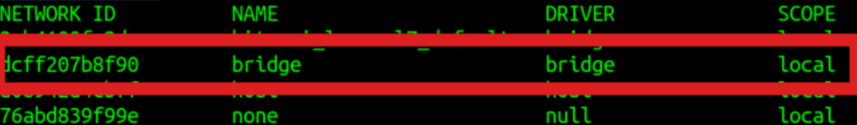


Esta salida, además del nombre de cada una de las redes creadas recoge la siguiente información:

+ El **NETWORK ID** que me sirve para identificar una red y que se puede usar indistintamente con el nombre para cualquiera de las operaciones de gestión de redes (crear, borrar, obtener información etc...)
+ El **DRIVER**, que como ya dijimos en el apartado anterior me define el tipo de red que voy a "conectar" a los contenedores. Podía tomar los valores bridge, none, host,macvlan y overlay.
+ El **SCOPE** que nos indica el ámbito de nuestras redes y que en este caso son redes locales dentro de nuestra propia máquina.
      
Esta red "bridged" por defecto, que es la usada por defecto por los contenedores, se diferencia en varios aspectos de las redes "bridged" que creamos nosotros. Estos aspectos son los siguientes:

+ Las redes que nosotros definamos proporcionan **resolución DNS entre los contenedores** cosa que la red por defecto no hace a  no ser que usemos opciones que ya se consideran "deprectated".
+ Puedo **conectar en caliente a los contenedores redes "bridged" definidas por el usuario**. Si uso la red por defecto tengo que parar previamente el contenedor.
+ Me permite gestionar de manera más segura el **aislamiento de los contenedores**, ya que si no indico una red al arrancar un contenedor este se incluye en la red por defecto donde pueden convivir servicios que no tengan nada que ver.
+ Tengo más control sobre la configuración de las redes si las defino yo. Los contenedores de la red por defecto comparten todos la misma configuración de red (MTU, reglas ip tables etc...).
+ Los contenedores dentro de la  red "bridge" comparten todos ciertas variables de entorno lo que puede provocar ciertos conflictos.

Una vez nos hemos situado vamos a ver cómo realizamos las operaciones más comunes para gestionar y trabajar con redes en docker. Estas operaciones son:

+ Listado de las redes (**docker network ls**).
+ Creación de las redes. (**docker network create**).
+ Borrado de las redes. (**docker network rm / docker network prune**).

Una descripción más detallada de lo todas las opciones la podemos ver en la [referencia completa de redes en docker](https://docs.docker.com/engine/network/) pero, tal y como acostumbramos en este curso, vamos a ilustrar su funcionamiento con distintos ejemplos.

> Ejemplos de creación de redes

```bash
# Crear una red. Al no poner nada más coge las opciones por defecto, red bridge local y el mismo docker elige la dirección de red y la máscara
docker network create red1
# Crear una red (la red2) dándole explícitamente el driver bridge (-d) , una dirección y una máscara de red (--subnet) y una gateway (--gateway)
docker network create -d bridge --subnet 172.24.0.0./16 --gateway 172.24.0.1 red2
```
La orden **docker network create** tiene más opciones para las redes de tipo bridge y muchas más para redes de otro tipo. Pero como estamos en un curso de docker aplicado al desarrollo estas opciones son más que suficientes para poder montar nuestros entornos y los de nuestros alumnos.

> [!NOTE] 
> Cada red docker que crea, crea un puente de red específico para cada red que podemos ver con ifconfig / ip a

> Eliminación de redes

```bash
# Eliminar la red red1
docker network rm red1
# Eliminar una red con un determinado ID
docker network rm 3cb4100fe2dc
# Eliminar todas la redes que no tengan contenedores asociados
docker network prune
# Eliminar todas las redes que no tengas contenedores asociados sin preguntar confirmación (-f o --force)
docker netowk prune -f
# Eliminar todas las redes que no tengan contenedores asociados y que fueron creadas hace más de 1 hora (--filter)
docker network prune  --filter until=60m
```

> [!NOTE] 
> No puedo borrar una red que tenga  contenedores que la estén usando. Deberé primero borrar los contenedores o desconectar la red.

## 7.3. Obteniendo información de las redes.

De igual manera que con las imágenes y los contenedores, puedo obtener información de las redes docker de maneras diferentes:

+ Mediante la orden **docker network ls**, que presentamos en el apartado anterior y que además tiene diversas opciones algunas de las cuales veremos posteriormente.
+ Mediante la orden **docker network inspect**, que nos mostrará una información mucho más detallada con todas las características de la red.

También podemos formatear esta salida usando https://pkg.go.dev/text/template, tal y como habíamos hecho en los módulos anteriores cuando inspeccionábamos imágenes o contenedores. Un ejemplo de ello sería lo siguiente:

```bash
# Mostrar el tipo de driver de una red docker (podríamos usar también el ID de la red)
docker network inspect mi_red  --format 'El driver de {{.Name}} es {{.Driver}}'
# Mostrar la dirección de red y la pasarela de una red docker
docker network inspect mi_red  --format '{{.IPAM.Config}}'
```

En cuanto a la orden docker network ls,  vamos a ver con distintos ejemplos algunas de las opciones que podemos usar:

```bash
# Mostrar solo el ID de las redes (-q o --quiet)
docker network ls -q
# Mostrar las redes de driver=bridge y nombre=brigde( la red por defecto) (-f o --filter)
docker network ls -f driver=bridge -f name="bridge"
# Mostrar lo mismo que en el anterior caso pero formateando con Go Templates
docker network ls -f driver=bridge -f name=bridge --format 'La red por de defecto tiene el siguiente ID {{.ID}}'
```

## 7.4. Asociando redes a contenedores.

En los tres apartados anteriores hemos hablado de aspectos relativos a las redes docker pero **no hemos dicho nada de cómo "conectamos" esas redes a nuestros contenedores** que es el paso fundamental para que dichos contenedores puedan conectarse entre ellos , puedan ofrecer servicios al exterior y puedan conectarse a Internet para poder actualizarse y/o instalar cualquier dependencia que necesitemos. Para realizar esta "conexión" debemos de tener en cuenta los siguientes aspectos:

+ Al arrancar un contenedor podemos **especificar a qué red** está conectado inicialmente usando el **flag --network** seguido del nombre de la red a la que queremos conectarlo.
+ Si al arrancar un contenedor **no especificamos una red**, el contenedor se conectará a la red por defecto, la red "**bridge**" **que usa el driver** "**bridge**".
+ **Al arrancar** un contenedor no puedo "**conectarlo**" inicialmente **a más de una red**.
+ **Tras crear el contenedor** puedo **conectarlo a más redes o desconectarlo de alguna red**. Dependiendo de si he elegido la red por defecto o no, podré o no podré hacer esa conexión o desconexión en caliente (con el contenedor un funcionando).

Para ilustrar todas estar afirmaciones vamos a realizar distintos ejemplos:

```bash
# Arrancar un contenedor de Apache sin especificar red y habilitando la conexión desde el exterior a través del puerto 80. Se conectará por defecto a la red bridge.
docker run -d --name web -p 80:80 httpd
# Arranchar un contenedor de Apache conectándose a la red red1 que es una red bridge definida por el usuario y habilitando la conexión desde el exterior a través del puerto 8080
docker run -d --name web2 --network red1 -p 8080:80 httpd
# Arranchar un contenedor de Apache conectándose a la red red1 dándole una ip (que debe pertenecer a esa red)
docker run -d --name web2 --network red1 --ip 172.18.0.5 -p 8181:80 httpd
# Conectar una nueva red, la red2  al contenedor web2.
docker network connect red2 web2
# Conectar una red, la red2 al contenedor web y darle una ip (que debe pertenecer a esa red)
docker network connect --ip 172.28.0.3 red2 web
# Desconectar la red1 del contenedor web2. Debe estar funcionando para poder desconectarse
docker network disconnect red1 web2
```

Por supuesto la orden docker connect tienen más opciones que podemos consultar en la referencia y , adicionalmente, hay varios flags de la orden docker run que están relacionados con redes y que pueden resultar de interés:

+ **--dns** para establecer unos servidores DNS predeterminados.
+ **--ip6** para establecer la dirección de red ipv6
+ **--hostname** o **-h** para establecer el nombre de host del contenedor. Si no lo establezco será el ID del mismo.

## 7.5. Iptables en contenedores.

En ocasiones en algunos de los módulos (más relacionados con redes normalmente) puede que queramos montar ciertos entornos,  compuestos por varias máquinas, en los que sea necesario que tengamos nosotros el control de las reglas iptables de las distintas máquinas que los conforman.

Normalmente esto se hace con distintas máquinas virtuales pero en vista de las posibilidades de red que nos dan los contenedores, ¿podría montar entornos de ese estilo con contenedores?. Por defecto esto no es posible en los contenedores, pero podemos conseguirlo de una de estas dos maneras:

+ Arrancar el contenedor con el flag --cap-add=NET_ADMIN. Así le damos al contenedor la "capacidad" Linux de administrar la red.
+ Arrancar el contenedor de con flag --privileged que le da todas las capacidades al contenedor que puede hacer lo mismo que se puede hacer desde el host. Esto, además de habilitar el uso de iptables, me permitiría cosas como "instalar docker dentro de un contenedor docker". Debemos de tener mucho cuidado con esta característica porque puede presentar varios problemas al levantar ciertas limitaciones a los cgroups..

Independientemente de la opción que elijamos, antes de poder usar iptables, y dado las pocas cosas que incluye por defecto un contenedor, deberemos:

+ **apt update** (para recargar los repositorios que no vienen cargados por defecto).
+ **apt install -y iptables** (para instalar la herramienta de firewall para Linux).


Video resumen:

https://youtu.be/DLce5da2ge4?list=PL-8CyWabyNa85xowmOeBMCspbrn6qNWgl


https://docs.docker.com/network/


# 8. Imágenes propias.

Hasta este capítulo hemos estado usando contenedores basados en imágenes de terceros que nos descargábamos desde DockerHub. En este capítulo vamos a realizar la **personalización de las imágenes** para que se adecúen a nuestras necesidades.

Esta personalización para conseguir nuestras propias imágenes la vamos a conseguir de dos maneras:

+ **Partiendo de un contenedor que tenemos en ejecución** y sobre el que hemos realizado modificaciones.
+ **De manera declarativa** a través del **fichero Dockerfile** y un proceso de construcción  que veremos que puede ser manual o automático.

## 8.1. Desde un contenedor en ejecución.

La primera forma para personalizar las imágenes y distribuirlas es partiendo de un contenedor en ejecución. Para ello vamos a tener varias posibilidades:

1. Utilizar la secuencia de órdenes **docker commit / docker save / docker load**. En este caso la **distribución** se producirá a partir de un **fichero**.
2. Utilizar la pareja de órdenes **docker commit / docker push**. En este caso la **distribución** se producirá a través de **DockerHub**.
3. Utilizar la pareja de órdenes **docker export / docker import**. En este caso la distribución de producirá a través de un **fichero**.

Veamos algunos ejemplos:
```bash
# Creación de una nueva imagen a partir del contenedor con nombre ejemplo (tag=latest)
docker commit ejemplo usuarioDockerHub/ubuntu20netutils
# Igual que la anterior pero añadiendo versión (tag)
docker commit ejemplo usuarioDockerHub/ubuntu20netutils:1.0
# Igual que la anterior pero pausando el contenedor durante el commit (--pause/-p) y añadiendo un mensaje describiendo el commit (--message/-m)
 docker commit -m "Versión con Nmap" -p ejemplo usuarioDockerHub/ubuntu20netutils:1.1
# Igual que la anterior pero añadiendo la información del autor (--author/-a)
docker commit -a "Juan Diego Pérez" -m "Versión con Nmap" -p ejemplo usuarioDockerHub/ubuntu20netutils:1.1
# Guardar la imagen ubuntu20netutils:1.1 al ficher u20v1.1.tar
docker save usuarioDockerHub/ubuntu20netutils:1.1 > u20v1.1.tar
# Lo mismo que en el apartado anterior sin la redirección y especificando el fichero (--output / -o)
docker save --output u20v1.1.tar usuarioDockerHub/ubuntu20netutils:1.1
# Carga la imagen con nombre imagen.tar (--input / -i)
docker load --input imagen.tar
# Autentificación en DockerHub
docker login
# Subir una imagen ubuntu20netutils:1.1 a DockerHub
docker push usuarioDockerHub/ubuntu20netutils:1.1
# Subir una imagen ubuntu20netutils:1.1 a DockerHub suprimiendo la salida que se muestra sobre la información del proceso de subida (--quiet /  -q)
docker push -q usuarioDockerHub/ubuntu20netutils:1.1
# Subir a DockerHub todas las versiones (tags) de la imagen ubuntu20netutils (--all-tags / -a)
docker push -a usuarioDockerHub/ubuntu20netutils
```
[Video explicativo](https://youtu.be/eWkqN9U5yJU?list=PL-8CyWabyNa85xowmOeBMCspbrn6qNWgl)

# 9. El fichero Dockerfile

En el apartado anterior hemos visto cómo crear y distribuir mis nuevas imágenes partiendo de un contenedor. Esta forma suele ser la preferida cuando empezamos porque es fácil si tenemos ciertos conocimientos de sistemas y porque no hace falta mucho conocimiento sobre docker y su entorno. Sin embargo este tipo de flujo de trabajo aunque fácil, tiene unos inconvenientes importantes: 

+ **No se puede reproducir la imagen**. Si la perdemos tenemos que recordar toda la secuencia de órdenes que habíamos ejecutado desde que arrancamos el contenedor hasta que teníamos una versión definitiva e hicimos docker commit.
+ **No podemos cambiar la imagen de base**. Si ha habido alguna actualización, problemas de seguridad etc con la imagen de base tenemos que descargar la nueva versión, volver a crear un nuevo contenedor basado en ella y ejecutar de nuevo toda la secuencia de órdenes.

Frente a estos inconvenientes el enfoque preferido es utilizar **ficheros Dockerfile**, que son una **forma declarativa de construir nuevas imágenes**. Este proceso de construcción queda descrito en las siguientes imágenes:

Si trabajamos así y aunque el proceso de construcción del Dockerfile es costoso al principio, vamos a evitar los dos problemas citados anteriormente:

+ **Podremos reproducir la imagen fácilmente** ya que en el fichero **Dockerfile** tenemos todas y cada una de las **órdenes necesarias** para la construcción de la imagen. Si además ese Dockfile está guardado en un sistema de control de versiones como git podremos, no solo reproducir la imagen sino asociar los cambios en el Dockerfile a los cambios en las versiones de las imágenes creadas.
+ Si queremos **cambiar la imagen de base** esto es extremadamente sencillo con un Dockerfile, únicamente tendremos que **modificar la primera línea de ese fichero** tal y como explicaremos posteriormente.

## 9.1. Uso de Docker build.

Por lo tanto para construir las imágenes necesitamos un fichero **Dockerfile** dentro de un contexto, ya sea en mi equipo o un repositorio exterior, y la orden **docker build** cuya estructura general es la siguiente:

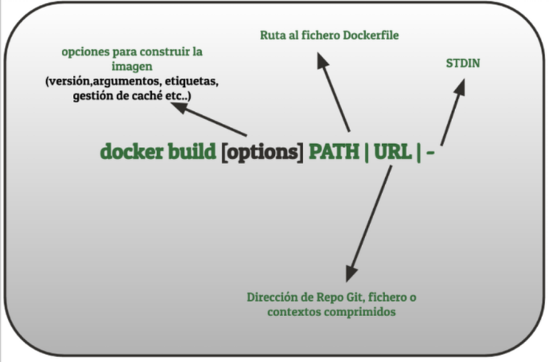

Ejemplos:

```bash
# Construcción de una imagen sin nombre ni versión estando el Dockerfile en el mismo directorio donde se ejecuta docker build
docker build .
# Construcción de una imagen especificando nombre y versión estando el Dockerfile en el mismo directorio donde se ejecuta docker build (--tag/-t)
docker build -t  usuario/nombre_imagen:1.0 .
# Construcción de una imagen especificando un repositorio en GitHub donde se encuentra el Dockerfile. Ese repositorio es el contexto de construcción
docker build -t usuarioDockerHub/nombre_imagen:1.1 https://github.com/...../nombre_repo.git#nombre_rama_git
# Construcción de una imagen usando una variable de entorno estando el Dockerfile en el mismo directorio donde se ejecuta docker build (--build-arg)
docker build --build-arg user=usuario -t  usuarioDockerHub/nombre_imagen:1.0 .
# Construcción de una imagen sin usar las capas cacheadas por haber realizado anteriormente imágenes con capas similares y estando el Dockerfile en el mismo directorio donde se ejecuta docker build (--no-cache)
docker build --no-cache -t  usuarioDockerHub/nombre_imagen:1.0 .
# Construcción de una imagen especificando nombre,versión y especificando la ruta al fichero Dockerfile mediante el flag --file/-f
docker build -t  usuario/nombre_imagen:1.0 -f /home/usuario/DockerProject/Dockerfile
```
> [!NOTE]
> Si quiero que la imagen construida sea distribuida mediante DockerHub debo poner como prefijo de la imagen mi nombre de usuario de DockerHub.

## 9.2. Resumen de comandos Dockerfile.

Un fichero **Dockerfile** es un conjunto de instrucciones que serán ejecutadas de forma secuencial para construir una nueva imagen docker.
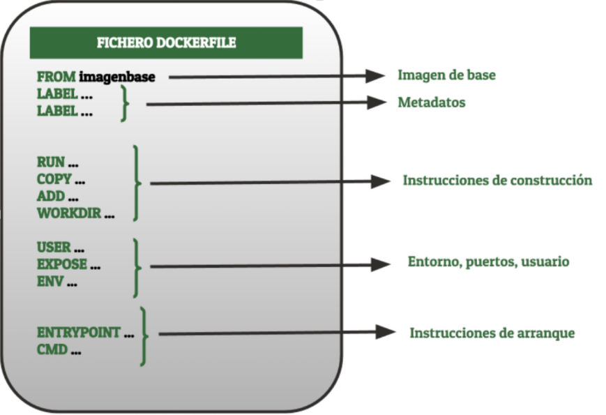


Las órdenes más comunes son:

+ **FROM**: Sirve para especificar la imagen sobre la que voy a construir la mía. Ejemplo: FROM php:7.4-apache
+ **LABEL**: Sirve para añadir metadatos a la imagen mediante clave=valor. 
      Ejemplo: LABEL company=iesalixar
+ **COPY**: Para copiar ficheros desde mi equipo a la imagen. Esos ficheros deben estar en el mismo contexto (carpeta o repositorio). Su sintaxis es `COPY [--chown=<usuario>:<grupo>] src dest`. 
      Por ejemplo: COPY --chown=www-data:www-data myapp /var/www/html
+ **ADD**: Es similar a COPY pero tiene funcionalidades adicionales como especificar URLs  y tratar archivos comprimidos.
+ **RUN**: Ejecuta una orden creando una nueva capa. Su sintaxis es `RUN orden / RUN ["orden","param1","param2"]`. Ejemplo: RUN apt update && apt install -y git. En este caso es muy importante que pongamos la opción -y porque en el proceso de construcción no puede haber interacción con el usuario.
+ **WORKDIR**: Establece el directorio de trabajo dentro de la imagen que estoy creando para posteriormente usar las órdenes RUN,COPY,ADD,CMD o ENTRYPOINT. Ejemplo: WORKDIR /usr/local/apache/htdocs
+ **EXPOSE**: Nos da información acerca de qué puertos tendrá abiertos el contenedor cuando se cree uno en base a la imagen que estamos creando. Es meramente informativo. Ejemplo: EXPOSE 80
+ **USER**: Para especificar (por nombre o UID/GID) el usuario de trabajo para todas las órdenes RUN,CMD Y ENTRYPOINT posteriores. 
      Ejemplos: USER jenkins / USER 1001:10001
+ **ARG**: Para definir variables para las cuales los usuarios pueden especificar valores a la hora de hacer el proceso de build mediante el flag --build-arg. Su sintaxis es `ARG nombre_variable o ARG nombre_variable=valor_por_defecto`. Posteriormente esa variable se puede usar en el resto de la órdenes de la siguiente manera $nombre_variable. Ejemplo: ARG usuario=www-data. NO SE PUEDE USAR EN ENTRYPOINT Y CMD
+ **ENV**: Para establecer variables de entorno dentro del contenedor. Puede ser usado posteriormente en las órdenes RUN añadiendo $ delante de el nombre de la variable de entorno. Ejemplo: ENV WEB_DOCUMENT_ROOT=/var/www/html  NO  SE PUEDE USAR EN ENTRYPOINT Y CMD
+ **ENTRYPOINT**: Para establecer el ejecutable que se lanza siempre  cuando se crea el contenedor  con docker run, salvo que se especifique expresamente algo diferente con el flag --entrypoint. Su síntaxis es la siguiente: `ENTRYPOINT <command> / ENTRYPOINT ["executable","param1","param2"]`. Ejemplo: ENTRYPOINT ["service","apache2","start"]
+ **CMD**: Para establecer el ejecutable por defecto (salvo que se sobreescriba desde la orden docker run) o para especificar parámetros para un ENTRYPOINT. Si tengo varios sólo se ejecuta el último. Su sintaxis es `CMD param1 param2 / CMD ["param1","param2"] / CMD["command","param1"]`.Ejemplo: CMD [“-c” “/etc/nginx.conf”]  / ENTRYPOINT [“nginx”].

>Ejemplos de ficheros Dockerfile

[DOCKERFILE Proyecto Tomcat](https://gist.github.com/pekechis/438a7aecfc9ecc67cb8d2bd1988875b4)

[DOCKERFILE Código de un repositorio (WORDPRESS)](https://gist.github.com/pekechis/50089bf90443bac115572a71b8ec42ac)

[DOCKERFILE para proyecto Django](https://gist.github.com/pekechis/d7237427bbee51a3ad1d0f3865f696fd)


[Referencia a ficheros Dockerfile](https://docs.docker.com/engine/reference/builder/)

## 9.3. Fichero .dokerignore

Antes de que se ejecuten las órdenes ADD y COPY de los Dockerfile el proceso de construcción de docker build mira si en el contexto de la construcción  existe un fichero .dockerignore. El funcionamiento de este tipo de ficheros es análogo al funcionamiento de los ficheros **.gitignore** que excluyen una serie de ficheros del control de versiones.


Un ejemplo genérico:
```gitignore
# Esa carpeta app tiene el contenido de un repositorio
#Excluyo la carpeta .git
app/.git
#Excluyo el fichero .gitignore
app/.gitignore
#Excluyo todos los archivos dentro de la carpeta log pero dejo la carpeta
app/log/*
#Excluyo todos los archivos dentro de la carpeta tmp pero dejo la carpeta.
app/tmp/*
#Excluyo el archivo README.md
app/README.md
```

Un ejemplo para una aplicación node:
```gitignore
# Esa carpeta nodeapp tiene el contenido de un repositorio
#Excluyo la carpeta .git
nodeapp/.git
#Excluyo el fichero .gitignore
nodeapp/.gitignore
#Excluyo la carpeta node_modules. Eso me obliga a hacer npm install al arrancar el contenedor
nodeapp/node_modules
#Excluyo el fichero creado por el editor de código
.vscode
```


[Referencia a ficheros .gitignore.](https://docs.docker.com/engine/reference/builder/#dockerignore-file)

# 10. Aplicaciones Multicapa. Docker Compose.


