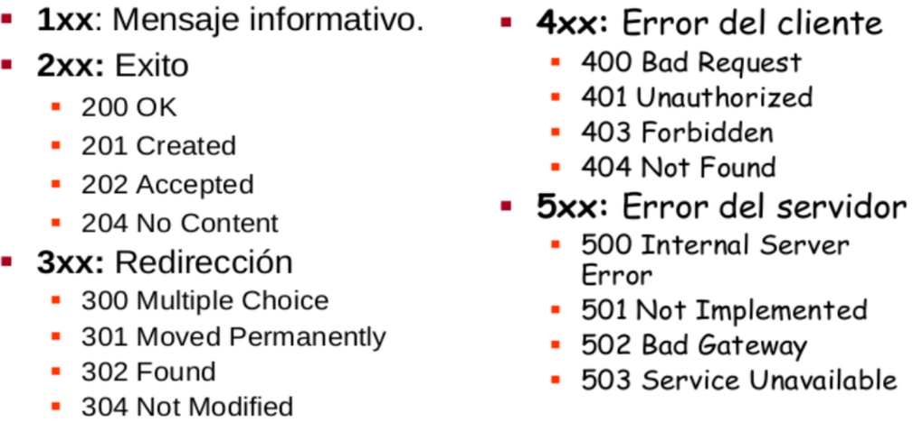
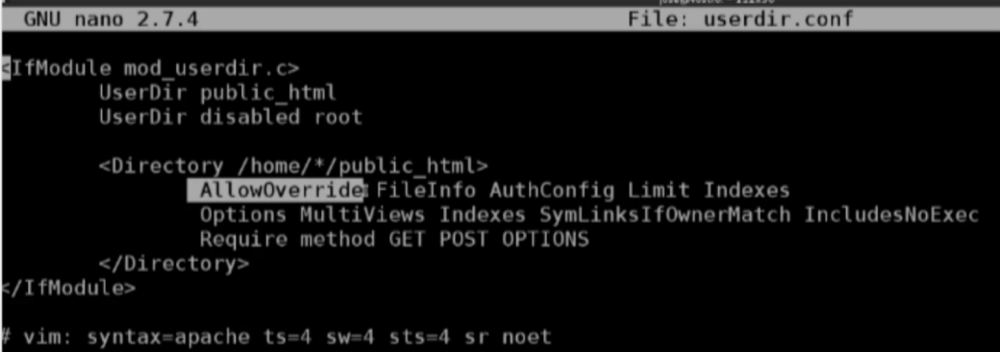
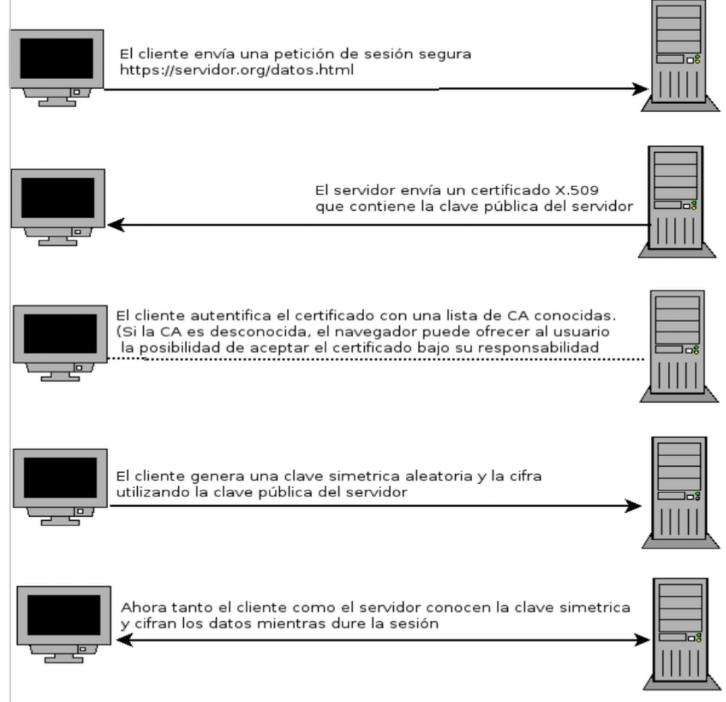
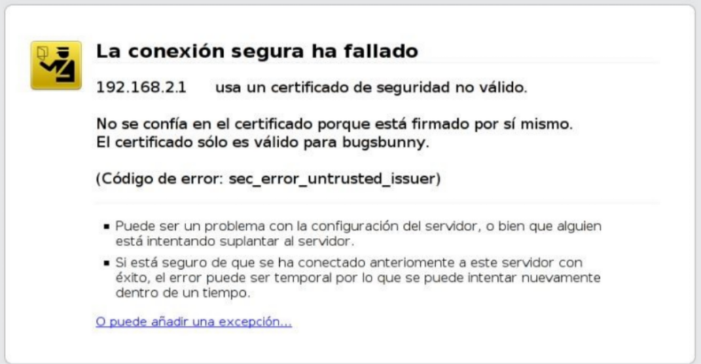

# UT3 APACHE <!-- omit in toc -->
---


- [1. Introducción.](#1-introducción)
- [2. Instalación en Debian/Ubuntu.](#2-instalación-en-debianubuntu)
- [3. Ficheros de configuración.](#3-ficheros-de-configuración)
  - [3.1. Opciones de configuración para servidores virtuales.](#31-opciones-de-configuración-para-servidores-virtuales)
- [4. Host Virtuales.](#4-host-virtuales)
  - [4.1. Configuración de los puertos de escucha.](#41-configuración-de-los-puertos-de-escucha)
  - [4.2. Como funciona en los Virtual Host.](#42-como-funciona-en-los-virtual-host)
  - [4.3. Ejemplo: Virtual Host basado en IP.](#43-ejemplo-virtual-host-basado-en-ip)
  - [4.4. Ejemplo: Servir el mismo contenido en varias IP.](#44-ejemplo-servir-el-mismo-contenido-en-varias-ip)
  - [4.5. Ejemplo: Sirviendo distintos sitios en distintos puertos.](#45-ejemplo-sirviendo-distintos-sitios-en-distintos-puertos)
- [5. Fichero .htacces.](#5-fichero-htacces)
- [6. Módulos en Apache.](#6-módulos-en-apache)
  - [6.1. Utilización de módulos.](#61-utilización-de-módulos)
  - [6.2. Módulos activos por defecto.](#62-módulos-activos-por-defecto)
  - [6.3. Módulo userdir.conf](#63-módulo-userdirconf)
- [7. Acceso autentificado.](#7-acceso-autentificado)
  - [7.1. Creación de contraseñas.](#71-creación-de-contraseñas)
  - [7.2. Restricciones de acceso a recursos.](#72-restricciones-de-acceso-a-recursos)
- [8. Protocolo Https.](#8-protocolo-https)
- [9. Enlaces Web.](#9-enlaces-web)


# 1. Introducción.

Protocolo de comunicaciones estándar que comunica servidores, proxys y clientes. Permite la transferencia de documentos web, sin importar cual es el cliente o cual es el servidor.
Es un protocolo basado en el esquema petición/respuesta. El cliente realiza una petición y el servido devuelve una respuesta.

El protocolo HTTP está basado en mensajes de texto plano y es un protocolo sin manejo de estados.

El usuario escribe una URL, indicando el protocolo, servidor y recurso que quiere obtener, el servidor procesa dicha información y devuelve un mensaje de respuesta, normalmente con el HTML de la página que se va a visualizar,…

Cuando se realiza una petición se puede utilizar uno de los siguientes métodos:

+ GET: Solicita un documento al servidor. Se pueden enviar datos en la URL.
+ HEAD: Similar a GET, pero sólo pide las cabeceras HTTP.
+ POST: Manda datos al servidor para su procesado. Similar a GET, pero además envía datos en el cuerpo del mensaje.
+ PUT: Almacena el documento enviado en el cuerpo del mensaje.
+ DELETE: Elimina el documento referenciado en la URL.

Cuando el servidor devuelve una respuesta se indica un código de estado:



# 2. Instalación en Debian/Ubuntu.

Para instalar el servidor web Apache en sistemas GNU/Linux Debian/Ubuntu y derivados, ejecutamos como administrador:

```bash
sudo apt update
sudo apt install apache2
apache2 -v # nos indica la versión de apache instalada
```

Para controlar el servicio apache2 podemos usar ([para más información](https://httpd.apache.org/docs/2.4/es/stopping.html)):

```bash
apache2ctl [-k start|restart|graceful|graceful-stop|stop]
```

La opción graceful es un reinicio suave, se terminan de servir las peticiones que están establecidas y cuando se finaliza se hace una reinicio del servidor.

Con esta herramienta podemos obtener también más información del servidor:

+ **apache2ctl -t** : Comprueba la sintaxis del fichero de configuración.
+ **apache2ctl -M** : Lista los módulos cargados.
+ **apache2ctl -S** : Lista los sitios virtuales y las opciones de configuración.
+ **apache2ctl -V** : Lista las opciones de compilación

Evidentemente el servidor está gestionado por Systemd, por lo tanto para controlar el arranque, reinicio y parada del servicio utilizaremos la siguiente instrucción:

``` bash
systemctl [start|stop|restart|reload|status] apache2.service
```
Podemos comprobar el funcionamiento del servidor abriendo el navegador y escribiendo la dirección.

```
http://localhost

http://127.0.0.1

http://IP_privada_servidor
```

# 3. Ficheros de configuración.

Los ficheros de configuración se encuentra en `/etc/apache2`.

|Nombre |Tipo|Descripción|
|-------|----|-----------|
|apache2.conf|Archivo|Contiene la configuración principal del servidor web|
|ports.conf|Archivo|Permite cambiar o añadir los puertos que escucha el servidor|
|/mods-availabe/|Directorio|Contiene los módulos disponibles, pero aún inactivos|
|/mods-enable/|Directorio|Contiene los módulos que están habilitados (activos)|
|/sites-availabe/|Directorio|Contiene los sitios web disponibles, pero aún inactivos|
|/sites-enable/|Directorio|Contiene los sitios web que están habilitados (activos)|

El fichero principal de configuración de Apache2 es `/etc/apache2/apache2.conf`. En ese fichero se incluyen los ficheros que forman parte de la configuración de Apache2:

```apache
...
IncludeOptional mods-enabled/*.load
IncludeOptional mods-enabled/*.conf
...
Include ports.conf
...
IncludeOptional conf-enabled/*.conf
IncludeOptional sites-enabled/*.conf
```

+ Los ficheros que se añaden guardados en el directorio **mods-enabled** corresponden a los módulos activos.
+ Los ficheros añadidos del directorio **sites-enabled** corresponden a la configuración de los sitios virtuales activos.
+ Del directorio **conf-enabled** añadimos ficheros de configuración adicionales.
+ Por último en el fichero **ports.conf** se especifica los puertos de escucha del servidor.

## 3.1. Opciones de configuración para servidores virtuales.

Por defecto se indican las opciones de configuración del directorio **/var/www** y de todos sus subdirectorios, por lo tanto los `DocumentRoot` de los virtual host que se crean deben ser subdirectorios de este directorio, por lo tanto encontramos en el fichero **/etc/apache2/apache2.conf** lo siguiente:

```apache
<Directory /var/www/>
    Options Indexes FollowSymLinks
    AllowOverride None
    Require all granted
</Directory>
```
Podemos indicar como directorio raíz de nuestros virtual host otro directorio (tenemos que descomentar):

```apache
#<Directory /srv/>
#    Options Indexes FollowSymLinks
#    AllowOverride None
#    Require all granted
#</Directory>
```
# 4. Host Virtuales.

El término Hosting Virtual se refiere a hacer funcionar más de un sitio web (tales como **www.pagina1.com** y **www.pagina2.com**) en una sola máquina. Los sitios web virtuales pueden estar “basados en direcciones IP”, lo que significa que cada sitio web tiene una dirección IP diferente, o “basados en nombres diferentes”, lo que significa que con una sola dirección IP están funcionando sitios web con diferentes nombres (de dominio). Apache fue uno de los primeros servidores web en soportar hosting virtual basado en direcciones IP.

El servidor web Apache2 se instala por defecto con un host virtual en  `/etc/apache2/sites-available/000-default.conf`.

Cuyo contenido podemos ver:
```apache
<VirtualHost *:80>
        #ServerName www.example.com    
        ServerAdmin webmaster@localhost
        DocumentRoot /var/www/html    
        ErrorLog ${APACHE_LOG_DIR}/error.log
        CustomLog ${APACHE_LOG_DIR}/access.log combined    
</VirtualHost>
```

`*`  Indica la dirección Ip a la que se accede al servidor, si tenemos mas de una dirección Ip el servidor.

Donde encontramos los siguientes parámetros:

+ **ServerName**: Nombre por el que se va a acceder al virtual host.
+ **ServerAdmin**: Correo electrónico del responsable de este virtual host.
+ **ServerAlias**: Otros nombres con los que se puede acceder al sitio.
+ **DocumentRoot**: directorio donde se guardan los ficheros servidos en este virtual host.
+ **ErrorLog**: Fichero donde se guardan los errores.
+ **CustomLog**: Fichero donde se guarda los accesos al sitio.

Por defecto el directorio donde se guardan los logs es `/var/log/apache2`.

Podemos habilitar o deshabilitar nuestros host virtuales utilizando los comandos `a2ensite` y `a2dissite`.

> Ejemplo para crear dos Virtual Server accediendo desde la misma dirección IP.

Creamos los dos directorios donde vamos a almacenar lo ficheros html
```
/var/www/apache1

/var/www/apache2
```

Es recomendable que sean de usuario de Apache **www-data** el comando es el siguiente:

```bash
chown -R www-data:www-data apache1
chown -R www-data:www-data apache2
```

Despues en **sites-available** nos creamos los ficheros de configuración de los dos sitios. Podemos copiar el default.

**apache1.conf**

```apache
<VirtualHost *:80>
	ServerName apache1.daw2.net
	ServerAdmin webmaster@localhost
	DocumentRoot /var/www/apache1
	ErrorLog ${APACHE_LOG_DIR}/error_apache1.log
	CustomLog ${APACHE_LOG_DIR}/access_apache1.log combined
</VirtualHost>
```
**apache2.conf**

```apache
<VirtualHost *:80>
	ServerName apache2.daw2.net
	ServerAdmin webmaster@localhost
	DocumentRoot /var/www/apache2
	ErrorLog ${APACHE_LOG_DIR}/error_apache2.log
	CustomLog ${APACHE_LOG_DIR}/access_apache2.log combined
</VirtualHost>
```

Una vez creado estos dos ficheros activamos los sitios con:

```bash
a2ensite apache1
a2ensite apache2
```

Deben de haber creado los enlaces en **sites-enabled**.

Después reiniciamos apache con:

```bash
systemctl reload apache2
```
Para que todo funcione modificamos nuestro fichero `/etc/hots` añadiendo, configurando de forma estática el Dns que 

```h
127.0.0.1 apache1.daw2.net
127.0.0.1 apache2.daw2.net
```
Y podemos acceder a través del Dns.

También podemos desactivar el sitio por defecto con:

```bash
a2dissite 000-default.conf
```

## 4.1. Configuración de los puertos de escucha.

Para determinar los puertos de escucha del servidor web utilizamos la directiva [Listen](https://httpd.apache.org/docs/2.4/es/mod/mpm_common.html#listen) que podemos modificar en el archivo `/etc/apache2/ports.conf`.

## 4.2. Como funciona en los Virtual Host.

Listen solo le dice al servidor principal en qué direcciones y puertos tiene que escuchar. Si no se usan directivas `<VirtualHost>`, el servidor se comporta de la misma manera con todas las peticiones que se acepten. Sin embargo, `<VirtualHost>` puede usarse para especificar un comportamiento diferente en una o varias direcciones y puertos. Para implementar un host virtual, hay que indicarle primero al servidor que escuche en aquellas direcciones y puertos a usar. Posteriormente se debe crear una sección `<VirtualHost>` en una dirección y puerto específicos para determinar el comportamiento de ese host virtual.

Por defecto los Virtual Host que hemos definido responden desde cualquier IP en el puerto **80**, en el fichero **/etc/apache2/sites-available/000-default.conf** encontramos:
`<VirtualHost *:80>`


## 4.3. Ejemplo: Virtual Host basado en IP.

En este caso nuestra máquina debe tener configurado varias IP (lo vamos a probar en nuestro servidor local que tiene configurado dos interfaces de red), por cada IP se va servir un virtual host.

```apache
<VirtualHost 192.168.56.3:80>
    ServerAdmin webmaster@localhost
    DocumentRoot /var/www/externa
    ErrorLog ${APACHE_LOG_DIR}/error_externa.log
    CustomLog ${APACHE_LOG_DIR}/access_externa.log combined
</VirtualHost>    

<VirtualHost 172.22.0.1:80>
    ServerAdmin webmaster@localhost
    DocumentRoot /var/www/interna
    ErrorLog ${APACHE_LOG_DIR}/error_interna.log
    CustomLog ${APACHE_LOG_DIR}/access_interna.log combined
</VirtualHost>
```

## 4.4. Ejemplo: Servir el mismo contenido en varias IP.

Suponemos que nuestro servidor tiene dos interfaces de red (una interfaz interna (intranet) y otra externa (internet)), queremos que responda a las dos direcciones:

```apache
<VirtualHost 192.168.56.3 172.22.0.1>
    DocumentRoot /var/www/externa
    ServerName servidor.example.com
    ServerAlias servidor
    ...
</VirtualHost>
```
## 4.5. Ejemplo: Sirviendo distintos sitios en distintos puertos.
En esta ocasión hemos definido dos puertos de escucha en el fichero **/etc/apache2/ports.conf**:

```
Listen 80
Listen 8080
```

Y la configuración de los virtual host podría ser la siguiente:

```apache
<VirtualHost *:80>
    ServerName servidor.example.com
    DocumentRoot /var/www/externa
</VirtualHost>

<VirtualHost *:8080>
    ServerName servidor.example.com
    DocumentRoot /var/www/interna
</VirtualHost>
```
# 5. Fichero .htacces.

Un fichero `.htaccess` (hypertext access), también conocido como archivo de configuración distribuida, es un fichero especial, popularizado por el Servidor HTTP Apache que nos permite definir diferentes directivas de configuración para cada directorio (con sus respectivos subdirectorios) sin necesidad de editar el archivo de configuración principal de Apache.

Para permitir el uso de los ficheros .htaccess o restringir las directivas que se puedn aplicar usamos ela directiva AllowOverride, que puede ir acompañada de una o varias opciones:

+ **All**: Se pueden usar todas las directivas permitidas.
+ **None**: Se ignora el fichero .htaccess. Valor por defecto.
+ **AuthConfig**: Directivas de autentificación y autorización: AuthName, AuthType, AuthUserFile, Require, …
+ **FileInfo**: Directivas relacionadas con el mapeo de URL: redirecciones, módulo rewrite, …
+ **Indexes**: Directiva que controlan la visualización de listado de ficheros.
+ **Limit**: Directivas para controlar el control de acceso: Allow, Deny y Order.

[Ejemplos de uso del fichero .htaccess](https://ticket.cdmon.com/es/faq/view/410/informacion-y-usos-del-fichero-htaccess)

# 6. Módulos en Apache.

Uno de los aspectos característicos del servidor HTTP Apache es su modularidad, Apache tiene un sinfín de características adicionales que si estuvieran siempre incluidas, harían de él un programa demasiado grande y pesado. En lugar de esto, Apache se compila de forma modular y se cargan en memoria sólo los módulos necesarios en cada caso.

Los módulos se guardan en la configuración de apache2 en dos directorios:

+ **/etc/apache2/mods-available/**: Directorio que contiene los módulos disponibles en la instalación actual.
+ **/etc/apache2/mods-enabled/**: Directorio que incluye mediante enlaces simbólicos al directorio anterior, los módulos que se van a cargar en memoria la próxima vez que se inicie Apache.

Los módulos de apache se pueden encontrar de dos maneras, compilados dentro del ejecutable apache2 o compilados de forma individual como una biblioteca de enlace dinámico (con extensión .so). Para saber qué módulos incluye el ejecutable de nuestra instalación de apache, podemos utilizar la siguiente instrucción:

```bash
apache2 -l    
Compiled in modules:
  core.c
  mod_so.c
  mod_watchdog.c
  http_core.c
  mod_log_config.c
  mod_logio.c
  mod_version.c
  mod_unixd.c
```
El resto de módulos disponibles para cargar en tiempo de ejecución se encuentran en el directorio /usr/lib/apache2/modules/:

```bash
ls /usr/lib/apache2/modules/

httpd.exp        mod_dav.so        mod_proxy_fcgi.so
mod_access_compat.so    mod_dbd.so        mod_proxy_fdpass.so
mod_actions.so        mod_deflate.so        mod_proxy_ftp.so
```

Pueden parecer muchos, pero son sólo los módulos de la instalación estándar y se incluyen dentro del paquete `apache2-data`. Hay otros muchos módulos que se distribuyen en paquetes separados, que en debian reciben el nombre `libapache2-mod-*`:

```bash
apt-cache search libapache2-mod
libapache2-mod-auth-ntlm-winbind - apache2 module for NTLM authentication against Winbind
libapache2-mod-upload-progress - upload progress support for the Apache web server
libapache2-mod-xforward - Apache module implements redirection based on X-Forward response header
```

## 6.1. Utilización de módulos.

Si vamos al directorio donde se ubican los módulos disponibles de Apache `/etc/apache2/mods-available` y hacemos un listado encontramos ficheros *.load y *.conf.

Los ficheros con extensión load suelen incluir una línea con la directiva **LoadModule**, por ejemplo:

```bash
cat userdir.load 
Load Module userdir_module /usr/lib/apache2/modules/mod_userdir.so
```
Además de cargar el módulo, en muchos casos es necesario realizar alguna configuración mediante directivas, por lo que en esos casos se existe un fichero con extensión **.conf**.

Si queremos que Apache utilice cualquier módulo, lo que tendríamos que hacer es un enlace simbólico del fichero de extensión **.load** (y del **.conf** si existe) en el directorio **/etc/apache2/mods-enabled**. Este enlace lo podemos hacer con la instrucción `a2enmod`, por ejemplo:

> Habilitar un módulo
```bash
a2enmod userdir
Enabling module userdir.
To activate the new configuration, you need to run:
systemctl restart apache2
```
Para desactivarlo (borrar el enlace simbólico) utilizamos la instrucción **a2dismod**. después de utilizar estos comandos hay que reiniciar el servicio.

```bash
a2dismod userdir
```

## 6.2. Módulos activos por defecto.

Para ver los módulos activados en apache2:

```bash
apache2ctl -M

Loaded Modules:
 core_module (static)
 so_module (static)
 watchdog_module (static)
 http_module (static)
 log_config_module (static)
```

## 6.3. Módulo userdir.conf

Nos permite que un usuario pueda tener una página web desde su usuario home, introduciendo los ficheros en una carpeta indicada en userdir.conf



Se accede con `servidor/~nombre_usuario`.

En sistemas con múltiples usuarios, cada usuario puede tener un sitio web en su directorio home usando el módulo **UserDir**. Los visitantes de una URL  http://example.com/~username/` recibirán el contenido del directorio home del usuario “username”, en el subdirectorio especificado por la directiva **UserDir**.

La directiva UserDir la podemos modificar en el fichero `/etc/apache2/mods-available/userdir.conf`, y se puede configurar de distintas maneras:

+ **UserDir public_html**: Valor por defecto, la URL http://example.com/~rbowen/file.html se traducirá en la ruta del fichero /home/rbowen/public_html/file.html.
+ **UserDir /var/html**: La URL http://example.com/~rbowen/file.html se traducirá en la ruta del fichero /var/html/rbowen/file.html.
+ **UserDir /var/www/*/docs**: La URL http://example.com/~rbowen/file.html se traducirá en la ruta del fichero /var/www/rbowen/docs/file.html
+ **UserDir public_html /var/html**: Para la URL http://example.com/~rbowen/file.html, Apache buscará ~rbowen. Si no lo encuentra, Apache buscará rbowen en /var/html.
  
> Desactivando userdir para algunos usuarios

Por ejemplo, con la directiva **UserDir disabled root** desactivamos la funcionalidad que ofrece el módulo para el usuario root.

> Configurando el directorio de acceso de cada usuario

Como vemos en el fichero `/etc/apache2/mods-available/userdir`.conf debemos configurar las opciones del directorio al que se accede al pedir la página del usuario.

```apache
<Directory /home/*/public_html>
    AllowOverride FileInfo AuthConfig Limit Indexes
    Options MultiViews Indexes SymLinksIfOwnerMatch IncludesNoExec
    Require method GET POST OPTIONS
</Directory>
```

> Activación del módulo

Para activar el módulo:
```bash
a2enmod userdir
```

Reiniciamos el servidor, creamos una carpeta **public_html** en el home del usuario y creamos un fichero **index.html**. Y podemos probar el acceso a la URL http://www.pagina1.org/~usuario.

> [!NOTE] 
> Para su funcionamiento es necesario darle permisos al usuario, para ello le daremos los permisos a la carpeta del usuario 755

# 7. Acceso autentificado.

El acceso HTTP suele ser anó nimo, pero existe se puede forzar la introducció n de un usuario y contraseña.

En Apache, para el acceso autentificado a un directorio concreto crearemos una sección `<Directory>` dentro del fichero **apache2.conf**.

Se necesita establecer en la Configuración Global del servidor la directiva y valor:

```bash
<Directory /home/*/public_html>
    AllowOverride  AuthConfig
</Directory>
```
Los módulos necesarios son (hay que asegurarse de que están **habilitados**):

✔ auth_basic (permite la autenticación básica HTTP).

✔ authz_groupfile (para el uso de grupos).

✔ authz_host (para el uso de la directiva Require).

✔ authn_core y authz_core

✔ authn_file

## 7.1. Creación de contraseñas.

Este fichero deberá estar en un sitio que no se pueda tener acceso desde la web, así nadie podrá verlo ni descargarlo. Por ejemplo, si tu sitio web está en **/var/www/html**, guarda las contraseñas en el directorio **/var/www/passwd**.

Para crear el fichero de contraseñas se emplea la utilidad `htpasswd` de la siguiente forma:

```bash
htpasswd -c /var/www/passwd/claves pedro
New password: miclave
Re-type new password: miclave
Adding password for user pedro
```

Para añadir un usuario al fichero de contraseñas:

```bash
htpasswd  /var/www/passwd/claves juan
```
No se debe usar el parámetro `-c` ya que sobrescribirá el contenido.

Para usar **htpasswd** tiene que estar el paquete **apache2-utils** instalado, **apt install apache2-utils**.

> Configuración

Si queremos proteger el directorio  **/var/www/html/secreto**. En **apache2.conf**:

```apache
<Directory /var/www/html/secreto>
    AuthType Basic
    AuthName “Acceso denegado”
    AuthUserFile /var/www/passwd/claves
    Require user pedro
</Directory>
```

También se puede dejar acceder a un grupo de usuarios locales con las directivas:

```
AuthGroupFile /var/www/passwd/grupos
Require group MiGrupo
```
El contenido del fichero que se ha de crear (en el ejemplo, MiGrupo) sería:

**MiGrupo: pedro juan antonio**

A cualquier usuario listado en el grupo **MiGrupo**, y con una entrada en el fichero de contraseñas **claves**, se le permitirá el acceso si introduce su contraseña correctamente.

Explicación de las directivas utilizadas:

➢ **AuthType Basic**: Método para autenticar al usuario. El más común es Basic.

➢ **AuthName "Acceso denegado"**: Muestra este texto como parte del cuadro de diálogo.

➢ **AuthUserFile “/var/www/passwd/claves”**: Ruta al fichero de contraseñas.

➢ **AuthGroupFile “/var/www/passwd/grupo”**: Ruta al fichero de grupo. Contiene el nombre del mismo y el de los usuarios que lo forman, separados por un espacio en blanco.

➢ **Require user | group | valid-user | ...** : Establece el o los usuarios a los que se les permite el acceso. Lo veremos con más detenimiento en el siguiente apartado.

> Directiva Options

Se trata de otra **directiva muy importante de seguridad**.

Se puede especificar tanto a nivel global como a un directorio concreto (`<Directory>`).

Veremos uno de sus posibles valores:

➢ **Indexes**: Si una URL solicita un directorio (sin especificarse el fichero concreto) y no existe un DirectoryIndex (por ejemplo, index.html), el servidor devolverá una lista del contenido (ficheros, carpetas y enlaces simbó licos) de ese directorio, lo cual es inseguro.
+ +Indexes  => Activa esta función
+ -Indexes  => Desactiva esta función

Si Indexes está desactivado y no se encuentra el fichero de DirectoryIndex se obtiene un error 403 (Forbidden, acceso prohibido).
Ejemplo:

Si se intenta acceder a http://localhost/sitio/ y hemos especificado DirectoryIndex index.html pero este fichero no existe:

+ Con **Options +Indexes** se mostrará un listado con el contenido del directorio sitio.
+ Con **Options -Indexes** se mostrará el error 403 (recurso no disponible).

Para el directorio raíz (al que se accede al escribir http://localhost):

```apache
<Directory />
    Options -Indexes
	# Otras directivas
</Directory>
```

Para un sitio web del servidor:

```apache
<Directory /var/www/html/sitio>
		Options Indexes
		# Otras directivas
</Directory>
```

## 7.2. Restricciones de acceso a recursos.

**Autorización** es cualquier proceso en el cual cualquiera está permitido a estar donde se quiera, o tener información la cuál se quiera tener.

La directiva **Require** es la utilizada para establecer estas restricciones. Este acceso puede ser controlado en función del nombre del host cliente o su IP. **Estas restricciones tienen más prioridad que las basadas en el nombre de usuario** (Require user | group | valid-user).

Require suele estar incluida en una sección `<Directory>`.

> [!NOTE]
>En el apartado anterior ya se explicaron las opciones de Require que controlan el acceso en base a los usuarios: user, group y valid-user. Ahora trataremos las que lo hacen en función del nombre del host cliente y su IP (ip, host y local) y las generales (all).

> Require ip

+ Ip completa, permite el acceso al cliente con esa IP.
  
    Require ip 10.1.2.3

    Require ip 192.168.1.104 192.168.1.205
      
+ Ip parcial, se indica algunos octetos.
  
    Require ip 10.1

    Require ip 10 172.20 192.168.2
      
+ Dirección de red/Máscara
  
    Require ip 10.1.0.0/255.255.0.0
      
+ Notificación CIDR
  
    Require ip 10.1.0.0/16

> Require host

Permite controlar el acceso al servidor en función del nombre del host cliente especificado. Los hosts cuyos nombres coinciden o finalizan en esta cadena tienen permitido el acceso.

Require host sitio.org

Require host .net sitio.edu

> Require local

Permite el acceso si se cumple alguna de estas condiciones:

+ La IP del cliente coincide con 127.0.0.0/8
+ Tanto el cliente como el servidor tienen la misma IP.
  
Require local

> Acceso General

Para **permitir** el acceso a todo aquel que lo solicite:

Require all granted

Para **denegar** el acceso a todo aquel que lo solicite:

Require all denied

# 8. Protocolo Https.
Cada vez es más necesario cifrar el contenido que se trasmite entre el cliente y el servidor, este proceso nos permite asegurar por ejemplo el proceso de autenticación
de usuarios para evitar que alguien capture una contraseña de usuario y acceda de forma fraudulenta.

El cifrado de la comunicación entre el navegador y el servidor web se hace mediante el protocolo HTTPS, que tiene las siguientes características principales:

+ Utiliza el protocolo SSL (actualmente TLS) para el cifrado de datos.
+ El servidor utiliza por defecto el puerto 443/tcp.
+ Utiliza mecanismos de cifrado de clave pública y las claves públicas se denominan certificados.
+ El formato de los certificados está especificado por el estándar X.509 y normalmente son emitidos por una entidad denominada **Autoridad Certificadora** (CA por sus siglas en inglés).
+ En el caso de HTTPS, la función principal de la CA es demostrar la autenticidad del servidor y que pertenece legítimamente a la persona u organización que lo utiliza.
Dependiendo de los criterios utilizados para comprobar la autenticidad del servidor se emiten diferentes tipos de certificados X.509 (actualmente se usa el llamado Extended Validation Certificate).
+ El navegador contiene una lista de certificados de CA en las que confía y acepta inicialmente sólo los certificados de los servidores emitidos por alguna de estas CA.
+ Una vez aceptado el certificado de un servidor web, el navegador utiliza éste para cifrar los datos que quiere enviar al servidor mediante el protocolo HTTPS y cuando llegan al servidor sólo éste podrá descifrarlos ya que es el único que posee la clave privada que los descifra.

El funcionamiento de forma esquemática de HTTPS la podríamos resumir en el siguiente gráfico:




Seguramente tengamos ya el certificado SSL autofirmado instalado en nuestro equipo, porque **ssl-cert** se instala al instalar Apache. Lo comprobamos con:

**aptitude search ssl-cert**, nos aparecerá. 
Si no está instalado se instala con **sudo apt install aptitude**.

Al instalar el paquete ssl-cert se generan automáticamente (con el comando openssl) un par de certificados:

+ `/etc/ssl/private/ssl-cert-snakeoil.key` (privado) → Clave privada.
+ `/etc/ssl/certs/ssl-cert-snakeoil.pem` (público) → Certificado.

Para comprobarlo nos vamos al directorio y ejecutamos:

1. El certificado X.509 está en formato PEM (base64), compruébalo editando el fichero:
2. 
```bash
   more  ssl-cert-snakeoil.pem
```
1. Para mostrar su contenido utiliza la siguiente instrucción desde el directorio correspondiente:
```bash
openssl x509 -in ssl-cert-snakeoil.pem -inform PEM -text
```
La información contenida en **ssl-cert-snakeoil.pem** es la misma que nos facilita el navegador web cuando queremos ver el contenido del certificado.

Si el certificado autofirmado no fuese correcto, podemos generar uno nuevo con:

```bash
make-ssl-cert generate-default-snakeoil --force -overwrite
```

Si el certificado que se genera así no tiene todas las características necesarias, habrá que crear un certificado autofirmado directamente mediante openssl.

> Crear un certificado autofirmado con openssl

1. Creamos una clave privada RSA de 2048 bits:
   
```bash
openssl genrsa 2048 > /etc/ssl/private/clave-ssl.key
```
2. Modificamos los propietarios y permisos.

```bash
chown root:ssl-cert /etc/ssl/private/clave-ssl.key
chmod 640 /etc/ssl/private/clave-ssl.key
```

3. Con la clave privada anterior creamos un certificado X.509 de un año de validez. En este proceso openssl nos solicitará información para completar los atributos del certificado:

```bash
openssl req -new -x509 -nodes -sha1 -days 365 -key clave-ssl.key > servidor.pem
       .....
       Country Name (2 letter code) [AU]:ES
       State or Province Name (full name) [Some -State]:Cordoba
       Locality Name (eg, city) []:Montilla
       Organization Name (eg, company) [Internet Widgits Pty Ltd]:IES Inca Garcilaso
       Organizational Unit Name (eg, section) []:
       Common Name (eg, YOUR name) []:
       Email Address []:
```

> Utilización de HTTPS en Apache2 con certificado autofirmado

Cuando instalamos apache2 sólo se activa el protocolo HTTP y se abre el puerto 80/tcp, para utilizar el protocolo HTTPS debemos activar el módulo ssl y reiniciar Apache:

```bash
a2enmod ssl
.....
service apache2 restart
```

Si vemos el contenido del fichero ports.conf comprobaremos que Apache sólo escucha peticiones
en el puerto 443/tcp cuando el módulo ssl está activado:

```apache
Listen 80
<IfModule ssl_module>
	Listen 443
</IfModule>
```

Sin embargo, Apache todavía no acepta peticiones del tipo https://ciclo.instituto.com, porque el único sitio que está activo está definido sólo en el puerto **80/tcp**, como podemos comprobar viendo el contenido del fichero **/etc/apache2/sites-available/000-default.conf**:

```apache
<VirtualHost *:80>
...
</VirtualHost>
```

> [!IMPORTANT]
>Los sitios del servidor están en: /etc/apache2/sites-available y /etc/apache2/sites-enabled.

Hay otro sitio predefinido (**default-ssl**) que escucha peticiones en el **puerto 443** y que está preparado para utilizar SSL, únicamente hay activarlo y recargar el servidor:

```bash
a2ensite default-ssl
Enabling site default -ssl.
Run '/etc/init.d/apache2 reload ' to activate new configuration!
service apache2 reload
```

Si editamos el fichero **default-ssl.conf** vemos que se sirven los mismos ficheros que con HTTP con el certificado y clave indicados en **SSLCertificateFile** y **SSLCertificateKeyFile**, respectivamente:

```
...
SSLEngine on
SSLCertificateFile /etc/ssl/certs/ssl-cert-snakeoil.pem
SSLCertificateKeyFile /etc/ssl/private/ssl-cert-snakeoil.key
…
```
El significado de las directivas, que pueden incluirse en la Configuración Global o en secciones `<VirtualHost>` es:

+ **SSLEngine**: Habilita/Deshabilita el uso del motor del protocolo SSL del servidor.
+ **SSLCertificateFile**: Indica la ruta del certificado del servidor.
+ **SSLCertificateKeyFile**: Indica la ruta de la clave privada de cifrado del servidor.

También se puede emplear la directiva **SSLRequireSSL** (equivalente a “Require ssl”) en una sección `<Directory>` para negar una conexión que no use el protocolo HTTPS. Por ejemplo, para denegar la entrada al sitio web “secreto” si no se accede con https://localhost/secreto :

```apache
<Directory “/var/www/html/secreto”>
	SSLRequireSSL
	...
</Directory>
```
> Configuración del navegador

Cuando establecemos por primera vez una conexión HTTPS con servidor web que utiliza un certificado autofirmado, el navegador nos advertirá que no reconoce ese servidor con un mensaje como el de la imagen:



Para solucionarlo añadimos una excepción, que consiste en aceptar de forma permanente o no el certificado X.509 que nos está facilitando el servidor web, lo que nos garantiza que la comunicación en**tre el cliente y el servidor web se realizará de forma cifrada. De esta forma nunca se garantiza la autenticidad del servidor**, ya que podría darse el caso de que aceptásemos el certificado de un servidor que hubiese suplantado al legítimo y posteriormente le diésemos información relevante.


# 9. Enlaces Web.

+ Documentación oficial de Apache https://httpd.apache.org/docs/2.4/es/