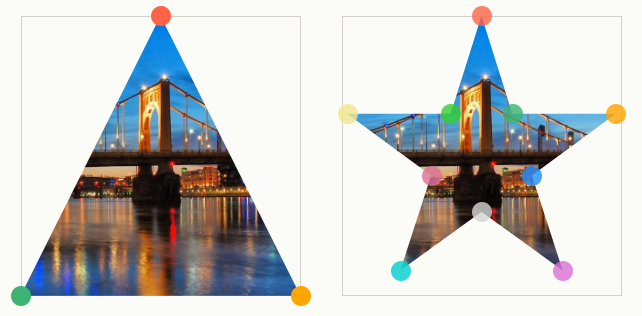
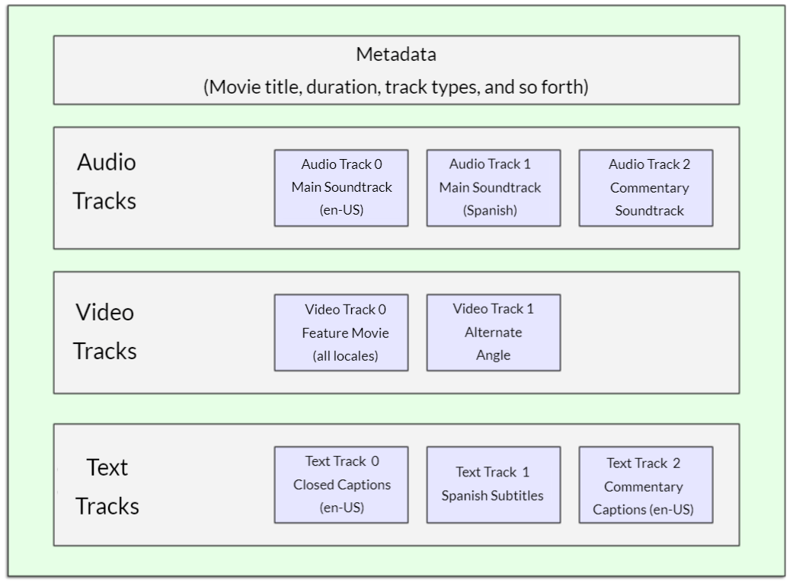
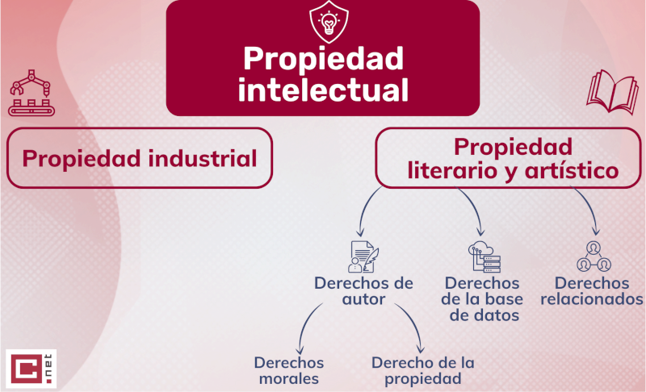
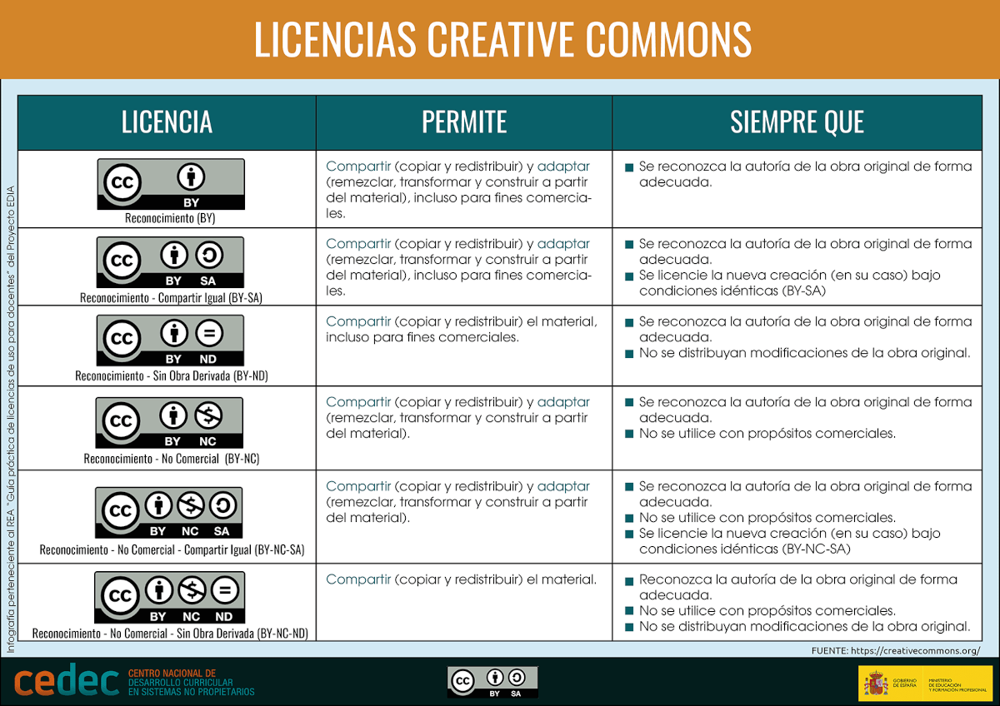

> DISEÑO DE INTERFACES WEB

# Tema 3: Implantación de contenido multimedia  <!-- omit in toc -->
> IMAGEN, AUDIO, VIDEO, LICENCIAS

- [1. Introducción](#1-introducción)
- [2. Imágenes](#2-imágenes)
  - [2.1. Imágenes de fondo](#21-imágenes-de-fondo)
  - [2.2. Software para crear y procesar imágenes](#22-software-para-crear-y-procesar-imágenes)
  - [2.3. Tipos de imágenes](#23-tipos-de-imágenes)
  - [2.4. Formatos](#24-formatos)
  - [2.5. Ajuste](#25-ajuste)
  - [2.6. Recorte](#26-recorte)
  - [2.7. Filtros](#27-filtros)
  - [2.8. Optimización de imágenes para la Web](#28-optimización-de-imágenes-para-la-web)
- [3. Audio](#3-audio)
  - [3.1. Formatos de codec y archivo](#31-formatos-de-codec-y-archivo)
  - [3.2. Funcionalidades](#32-funcionalidades)
- [4. Vídeo](#4-vídeo)
  - [4.1. Formatos de codec](#41-formatos-de-codec)
  - [4.2. Formatos de archivo](#42-formatos-de-archivo)
  - [4.3. Funcionalidades](#43-funcionalidades)
- [5. Otras tecnologías](#5-otras-tecnologías)
  - [5.1. Iframe](#51-iframe)
  - [5.2. Canvas](#52-canvas)
- [6. Licencias](#6-licencias)
- [7. Recursos](#7-recursos)
  - [7.1. Herramientas](#71-herramientas)
  - [7.2. Formación](#72-formación)


---

# 1. Introducción

Este documento es un resumen realizado a partir de la documentación disponible en **[W3Schools](https://www.w3schools.com/css/default.asp)**. 

Por favor, para un tratamiento en mayor profundidad y demos on-line, no dudes en consultar la documentación anterior.


# 2. Imágenes

El uso de imágenes en la web está muy extendido, puesto que proporciona una funcionalidad añadida a la información textual.

Existen numerosas formas de añadir imágenes a una página web. Aquí tienes algunas etiquetas HTML para ello:

- `img`
- `figure`
- `picture`

**Ejemplos**:

```html


<figure>
  
  <figcaption>An elephant at sunset</figcaption>
</figure>

<picture>
  <source srcset="photo.avif" type="image/avif" />
  <source srcset="photo.webp" type="image/webp" />
  
</picture>

<picture>
  <source srcset="mdn-logo-wide.png" media="(min-width: 800px)" />
  <source srcset="mdn-logo-medium.png" media="(min-width: 600px)" />
  
</picture>
```

## 2.1. Imágenes de fondo

También podemos poner imágenes como fondo de página y/o capas. Para ello podemos usar las propiedades de CSS `background` y `background-image`.

**Ejemplo**:

```css
div {
  width: 200px;
  height: 200px; 
  background-image: url('fondo.png');
  background-repeat: no-repeat;
  background-size: cover;
}
```

La propiedad `background-image` soporta la colocación de múltiples imágenes, colores o gradientes. Esto es especialmente útil si se combina con transparencias. 

Cada imagen, gradiente o color se separa del resto mediante comas. Por ejemplo:

```css
background-image: linear-gradient(rgba(0, 0, 255, 0.5), rgba(255, 255, 0, 0.5)),
                  url("../../media/examples/lizard.png");
```

Otra propiedad muy interesante es `background-blend-mode`, que permite hacer una combinación de las imágenes, gradientes o colores. 

Referencias:

- [Propiedad background-image](https://developer.mozilla.org/en-US/docs/Web/CSS/background-image)
- [Propiedad background-blend-mode](https://developer.mozilla.org/en-US/docs/Web/CSS/background-blend-mode)


## 2.2. Software para crear y procesar imágenes

**Visores**
- Explorador de archivos
- Navegador web
- IrfanView
- Gwenview (Linux)
- Eye of GNOME (Linux)

**Editores**
- MS Paint
- GIMP
- Krita
- Photoshop
- CorelDRAW (Gráficos vectoriales)
- Adobe Illustrator (Gráficos vectoriales)
- Inkscape (Gráficos vectoriales)


## 2.3. Tipos de imágenes

**Mapas de bits**

Un imagen de mapa de bits está compuesta por una cuadrícula de píxeles, organizados en una rejilla. Cada uno de los píxeles que conforma el mapa de bits tiene un color definido que presenta un valor.

Si hacemos zoom sobre la imagen podemos ver claramente cada uno de esos píxeles. Cuanto mayor sea el número de píxeles por imagen, mayor será su **resolución**. Por otro lado, los **píxeles por pulgada (ppi)** indican cuántos pixeles se muestran en una pulgada. Cuanto más alto sea este valor, mayor calidad en la visualización.


**Vectoriales**

Las imágenes vectoriales se basan en una serie de **coordenadas matemáticas que definen su posición, forma, color y otros atributos**. Estas imágenes se componen de vectores, que son unas figuras geométricas que pueden ser puntos, líneas, polígonos o segmentos. Por ejemplo, un rectángulo está definido por dos puntos, el círculo por un centro y un radio, mientras que una curva por varios puntos y una ecuación.

Eso sí, una imagen vectorial permite representar únicamente formas simples, lo que significa que no todas las imágenes se pueden describir con vectores.

A las imágenes vectoriales al estar compuestas por entidades matemáticas, se le pueden aplicar transformaciones geométricas a la misma, como ampliar, expandir o reducir, sin que pierdan nada de calidad, ya que continuaremos viendo las diferentes líneas y manchas de colores perfectamente definidas.

Además, las vectoriales permiten definir una imagen con muy poca información, lo que hace que los archivos tengan un tamaño bastante reducido.

> **Más información**: https://www.marcaprint.com/blog/diferencia-entre-bits-y-vectorial/

## 2.4. Formatos

**GIF**

Características:

- Formato de mapa de bits.
- Usa comprensión SIN pérdida.
- 256 colores como máximo de paleta de 8 bits.
- Admite transparencia. No admite semitransparencia.
- Admite animaciones.
- Usado ampliamente en el pasado.
- Muy poco usado actualmente en la web.
- Muy usado en redes sociales y mensajería.


**JPEG**

Características:

- Formato de mapa de bits.
- Usa compresión CON pérdida.
- No admite transparencias.

**PNG**

Características:

- Formato de mapa de bits.
- Usa compresión SIN pérdidas.
- Admite transparencias.


**WEBP**

Características:

- Formato de mapa de bits.
- Usa compresión CON/SIN pérdidas.
- Admite transparencias.
- Admite animaciones.
- Código abierto.

> **Más información**: https://www.adslzone.net/reportajes/foto-video/webp-formato-ventajas/


**AVIF**

Características:

- Formato de mapa de bits.
- Usa compresión CON/SIN pérdidas.
- Admite transparencias.
- Admite animaciones.
- Espacio en disco menor que JPEG y WEBP.
- Características avanzadas: HDR, gran profundidad de color, ...

**SVG**

Características:

- Formato vectorial.
- Permite reescalado sin pérdida de calidad.
- Ideal para logotipos y formas simples.
- No adecuado para fotografías.

 
## 2.5. Ajuste

- Propiedades **`object-fit`** y **`object-position`**

Permite ajustar y posicionar una imagen en su área de visualización. Para obtener un ajuste agradable a la vista suele usarse **`object-fit: cover;`**.

Ejemplo:

```css
/* La imagen puede ser de inferior o superior tamaño al área de visualización. */
/* La imagen puede tener un ratio distinto al área de visualización. */
img {
  /* En este caso el área de visualización tiene un ratio 4:3 y tamaño 200x150 px */
  width: 200px;
  height: 150px;
  object-fit: cover;
}
```

Se mantiene el ratio de la imagen. Si la relación de aspecto de la imagen no coincide con la relación de aspecto del área visible, entonces la imagen se recortará para ajustarse.

Para fondos de página o de capa puede usarse la propiedad `background-size: cover;`

```css
body {
  background-image: url('...');
  background-size: cover;
}

div {
  width: /* ... */ ;
  height:  /* ... */;
  background-image: url('...');
  background-size: cover;
}
```


## 2.6. Recorte

- Propiedades `clip-path` y `mask-image`.

Permite recortar la imagen según el contorno deseado. 
Por ejemplo, para recortar la imagen en forma de triángulo podemos hacer **`clip-path: polygon(50% 0%, 0% 100%, 100% 100%);`**

Existe un generador de recortes en https://bennettfeely.com/clippy/



Por otro lado, también podemos emplear la propiedad `mask-image` para el mismo fin. Consultar https://www.w3schools.com/css/css3_masking.asp


## 2.7. Filtros 
 
- Propiedad **`filter`**

Permite aplicar ciertos filtros a la imagen. Por ejemplo, para aplicar un desenfoque hacemos **`filter: blur(5px);`**, o para aplicar una sombra al contorno (especialmente atractivo con imágenes PNG con fondo transparente) hacemos **`filter: drop-shadow(2px 2px 10px gray);`**

En el siguiente enlace tienes más información:

- [MDN - Filter](https://developer.mozilla.org/en-US/docs/Web/CSS/filter)


- propiedad **`backdrop-filter`**
  
Permite aplicar efectos gráficos como desenfoque o cambio de color al área detrás de un elemento. Debido a que se aplica a todo lo que hay detrás del elemento, para ver el efecto debe hacer que el elemento o su fondo sean al menos parcialmente transparentes.

En el siguiente enlace tienes más información:

- [MDN - Backdrop Filter](https://developer.mozilla.org/es/docs/Web/CSS/backdrop-filter)


```html
<!DOCTYPE html>
<html lang="en">

<head>
    <meta charset="UTF-8">
    <meta name="viewport" content="width=,, initial-scale=1.0">
    <title> backdrop-filter </title>
    <style>
         * {
            margin: 0;
            box-sizing: border-box;
        }

        body {
            min-height: 100vh;
            display: grid;
            place-content: center;
            background: url(https://images.unsplash.com/photo-1724942462164-7c30f103d91c) no-repeat;
            background-size: cover;
            background-attachment: fixed;  
        }
        

        div {
            display: grid;
            place-content: center;
            width: 300px;
            height: 200px;                        
            border: solid 1px rgba(0, 0, 0, .05);
            border-radius: 5px;
            box-shadow: 0 0 10px 0 rgba(0, 0, 0, .2);
            font-size: 40px; 
            color: white;
            background-color: rgb(50% 0 0 / 0.10);   /* <-------------- */
            backdrop-filter: blur(5px);              /* <-------------- */
        }
    </style>
</head>

<body>
    <div>
      Hola Mundo
    </div>
</body>
</html>
```

**Otros ejemplos**

- [CSS Tricks 1](https://css-tricks.com/backdrop-filter-effect-with-css/)
- [CSS Tricks 2](https://css-tricks.com/the-backdrop-filter-css-property/)


## 2.8. Optimización de imágenes para la Web

Consulta el siguiente enlace de MDN:

- [Imágenes adaptables](https://developer.mozilla.org/es/docs/Learn/HTML/Multimedia_and_embedding/Responsive_images)

Y realiza el siguiente proyecto propuesto por MDN:

- [Proyecto propuesto](https://developer.mozilla.org/es/docs/Learn/HTML/Multimedia_and_embedding/Mozilla_splash_page#assessment_or_further_help)

El código fuente del proyecto puede obtenerse en [Github](https://github.com/mdn/learning-area/tree/main/html/multimedia-and-embedding/mdn-splash-page-start)


# 3. Audio

Para añadir audio a una página web podemos usar la etiqueta HTML `audio`.

**Ejemplo**:

```html
<audio controls>
  <source src="horse.ogg" type="audio/ogg">
  <source src="horse.mp3" type="audio/mpeg">

  Descarga <a download href="horse.ogg">OGG</a> o <a download href="horse.mp3">MP3</a>  
</audio>
```

Más información acerca de atributos soportados en [MDN - Etiqueta HTML de audio](https://developer.mozilla.org/en-US/docs/Web/HTML/Element/audio)


## 3.1. Formatos de codec y archivo

Los principales formatos para la web son:

**MP3**

El formato MP3 se convirtió en el estándar utilizado para streaming de audio y compresión de audio con pérdida de mediana fidelidad gracias a la posibilidad de ajustar la calidad de la compresión, proporcional a la tasa de bits (bitrate) y en consecuencia el tamaño final del archivo, permitiendo reducir hasta 12 e incluso 15 veces el del archivo original antes de su compresión.

Fue el primer formato de compresión de audio popularizado gracias a Internet, ya que hizo posible el intercambio de ficheros musicales.

**Vorbis OGG**

Ogg es un formato contenedor libre y abierto, desarrollado y mantenido por la Fundación Xiph.Org que no está restringido por las patentes de software,​ y está diseñado para proporcionar una difusión de flujo eficiente y manipulación de multimedios digitales de alta calidad.

- Codecs de audio con pérdida: **Vorbis**, **Opus**.
- Codecs de audio sin pérdida: **FLAC**

La Fundación Xiph.Org está detrás de formatos de compresión libres tales como FLAC, Vorbis, Theora, Icecast y Speex.

**AAC**

Formato de señal digital audio basado en un algoritmo de compresión con pérdida, un proceso por el que se eliminan algunos de los datos de audio para poder obtener el mayor grado de compresión posible, resultando en un archivo de salida que suena lo más parecido posible al original.

El formato AAC a diferencia del formato .ogg, permite incluir legalmente la protección de los derechos de autor, como la protección anticopia.


## 3.2. Funcionalidades

```html
<!DOCTYPE html>
<html lang="es">

<head>
  <meta charset="utf-8">
  <title>Audio</title>
</head>

<body>

  <audio controls src="https://mdn.github.io/webaudio-examples/audio-basics/outfoxing.mp3">
  </audio>

  <script>
    const audio = document.querySelector("audio");
    let reanudar;
    // Pausamos el audio si cambiamos a otra pestaña.
    document.addEventListener("visibilitychange", () => {
      if (document.hidden) {
        // Si el audio se está reproduciendo, establecemos reanudar a true
        if (!audio.paused) reanudar = true;
        else reanudar = false;        
        audio.pause();        
      } 
      else if (reanudar) audio.play();
    });
  </script>
</body>

</html>
```

# 4. Vídeo

Para añadir vídeo a una página web podemos usar la etiqueta HTML `video`.

**Ejemplos**:

```html
<video controls>
  <source src="flower.webm" type="video/webm" />
  <source src="flower.mp4" type="video/mp4" />

  Descarga <a download href="flower.webm">WEBM</a> o <a download href="flower.mp4">MP4</a>
</video>
``` 

```html
<!-- Simple video example -->
<!-- 'Big Buck Bunny' licensed under CC 3.0 by the Blender foundation. Hosted by archive.org -->
<!-- Poster from peach.blender.org -->
<video
  controls
  src="https://archive.org/download/BigBuckBunny_124/Content/big_buck_bunny_720p_surround.mp4"
  poster="https://peach.blender.org/wp-content/uploads/title_anouncement.jpg?x11217"
  width="620">
  Lo sentimos, tu navegador no admite vídeos incrustados, pero no te preocupes, puedes
  <a href="https://archive.org/details/BigBuckBunny_124">descargarlo</a>
  ¡Y verlo con tu reproductor de video favorito!
</video>
```

Más información acerca de atributos soportados en [MDN - Etiqueta HTML de vídeo](https://developer.mozilla.org/en-US/docs/Web/HTML/Element/video)

## 4.1. Formatos de codec

Los principales formatos de codec para la web son:

**MPEG-4**

MPEG 4 es un método para la compresión digital de audio y vídeo. Fue introducido a finales de 1998 y designado como un estándar para un grupo de formatos de codificación de audio, video y las tecnologías relacionadas.

MPEG-4 absorbe muchas de las características de MPEG-1 y MPEG-2 y otros estándares relacionados, añadiendo nuevas características.

- Codecs famosos basados en MPEG-4: **DivX**, **Xvid**.

**Theora OGG**

Theora es un códec de vídeo de propósito general con bajo consumo de CPU.​ Está basado en el códec de vídeo VP3 producido por On2 Technologies quien donó el código fuente del VP3.1 a la Fundación Xiph.Org quién lo publicó bajo la licencia BSD revisada de 3 cláusulas.

Theora es un método de compresión de vídeo con pérdidas. El vídeo comprimido puede ser almacenado en cualquier contenedor multimedia conveniente (ej. Matroska), pero generalmente se encuentra en el formato contenedor Ogg que es el recomendado por Xiph.Org y es frecuentemente usado con el formato de audio Vorbis.

**VP8/VP9**

VP8 es un códec de video de formato abierto diseñado por On2 Technologies como sucesor de VP7. Fue anunciado el 13 de septiembre de 2008.

VP9 es un formato abierto de compresión de vídeo libre de regalías desarrollado por Google. El desarrollo de VP9 comenzó en el tercer cuatrimestre de 2011.1​2​ Uno de los objetivos de VP9 es reducir la tasa de bits un 50% en comparación con VP8 manteniendo la misma calidad de vídeo.

**H.264**

Códec de vídeo de alta compresión, desarrollada conjuntamente por el ITU-T Video Coding Experts Group (VCEG) y el ISO/IEC Moving Picture Experts Group (MPEG).

**H.265 (HEVC)**

H.265, MPEG-H Parte2 o HEVC (High Efficiency Video Coding «codificación de vídeo de alta eficiencia»)1​ es una norma que define un formato de compresión de video, sucesor de H.264/MPEG-4 AVC (Advanced Video Coding, «codificación avanzada de vídeo»), desarrollado conjuntamente por la ISO/IEC Moving Picture Experts Group (MPEG) y ITU-T Video Coding Experts Group (VCEG)

Asimismo puede ser utilizado para proporcionar mejor calidad de videos con la misma tasa de datos. Es compatible con la televisión en ultraalta definición y resoluciones hasta 8192x4320.


## 4.2. Formatos de archivo

Los archivos de vídeo proporcionan un **contenedor** a las pistas de audio, video y, opcionalmente, subtítulos.



Las pistas de audio y video dentro del contenedor mantienen los datos en un formato adecuado para el *codec* usado para codificar ese medio. Se usan diferentes formatos para pistas de audio versus de video. 

Cada pista de audio es codificada usando un *codec* de audio mientras que las pistas de video son codificadas usando un *codec* de video. 

Los principales formatos de archivo para la web son:

**WebM**

Normalmente contiene audio Ogg Vorbis y vídeo VP8/VP9.

**MP4**

Normalmente contiene audio AAC o MP3 y vídeo H.264

**AVI**

Puede contener cualquier formato audio/video (AC3/DivX, o MP3/Xvid, entre otros).

**3GP**

Normalmente contiene audio AMR-NB o AAC-LC y vídeo MPEG4 o H.263.

**MKV**

Contiene diferentes tipos de audio y vídeo (incluido el nuevo H.265). También tiene cabida para  subtítulos. 


## 4.3. Funcionalidades

Una de las funcionalidades más llamativas y útiles es la de **Picture In Picture** (PIP).

PIP básicamente permite a los usuarios ver videos en una ventana separada del navegador y siempre por encima de otras ventanas incluso si el navegador está minimizado. Esto permite poder ver contenido multimedia mientras se realizan otras actividades.

Referencias:
- https://filisantillan.com/blog/picture-in-picture/
- https://developer.mozilla.org/en-US/docs/Web/API/Picture-in-Picture_API

Para hacer uso de esta funcionalidad no basta con tener código HTML. Es necesario además añadir código Javascript.

> [!NOTE] 
> 
> Firefox no soporta PIP

**Ejemplo**

```html
<!DOCTYPE html>
<html lang="es">

<head>
  <meta charset="utf-8">
  <title>Picture In Picture - Ejemplo</title>
</head>

<body>
  <video width="720" controls 
    src="http://commondatastorage.googleapis.com/gtv-videos-bucket/sample/BigBuckBunny.mp4"></video>  
  <button> Cambiar PIP </button>
 
  <script>
    const video = document.querySelector("video");
    const button = document.querySelector("button");

    button.addEventListener("click", async () => {
      if (document.pictureInPictureElement === video) 
        await document.exitPictureInPicture();
      else 
        await video.requestPictureInPicture();
    });
  </script>
</body>

</html>
```


# 5. Otras tecnologías

## 5.1. Iframe

Es un elemento HTML que permite insertar contenido externo, embebido dentro de la página. Es habitual su uso para la inserción de vídeos de diversas plataformas de streaming o la inserción de mapas geográficos. Asimismo también admite incrustar otro tipo de contenido.

**Ejemplo**:

```html
<iframe width="560" height="315" 
  src="https://www.youtube.com/embed/ojcNcvb1olg?si=t8jYzqQyB28DYNtf" 
  title="YouTube video player" 
  frameborder="0" 
  allow="autoplay; clipboard-write; encrypted-media; picture-in-picture; web-share" 
  allowfullscreen>
</iframe>
``` 

## 5.2. Canvas

Es un elemento HTML que permite dibujar gráficos y animaciones. Para ello es necesario hacer uso del lenguaje `Javascript`.

**Ejemplo**:

```html
<canvas width="120" height="120">
  Un texto alternativo que describe lo que muestra el lienzo.
</canvas>
```

```javascript
const canvas = document.querySelector("canvas");
const ctx = canvas.getContext("2d");
ctx.fillStyle = "green";
// Añadir un rectangulo en posición (10, 10) con ancho 100x100 pixeles
ctx.fillRect(10, 10, 100, 100);
```

**Ejemplo**:

- [El juego del Tetris](https://github.com/jamj2000/tetris-code)


# 6. Licencias

Licencias. Ley de la propiedad intelectual. Derechos de autor.



Consulta el siguiente enlace:

- [Derechos de autor, copyright y creative commons](https://www.compilatio.net/es/noticias/derechos-autor-copyright-creative-commons)

Y haz un resumen de la página anterior. ¿Qué es la licencia CC0?




# 7. Recursos

## 7.1. Herramientas
- [SVG Repo](https://www.svgrepo.com/)
- [Favicon Generator](https://realfavicongenerator.net/)
- [BoxIcons](https://boxicons.com/)
- [Simple Icons](https://simpleicons.org/)
- [Tabler Icons - Iconos SVG](https://tablericons.com/)
- [Flaticon - Iconos SVG](https://www.flaticon.es/)
- [Font Awesome - Iconos SVG](https://fontawesome.com/search?o=r&m=free). Existe la posibilidad de descarga en formato SVG.
- [Icomoon- Iconos](https://icomoon.io/)
- [Ionicons - Iconos](https://ionicons.com)
- [Unsplash - Imágenes gratuitas](https://unsplash.com/)
- [Pexels - Imágenes gratuitas](https://www.pexels.com/es-es/)
- [Pixabay - Imágenes gratuitas](https://pixabay.com/es/)
- [Freepik - Imágenes gratuitas](https://www.freepik.es/)
- [Open-source illustrations - Ilustraciones gratuitas](https://undraw.co/)
- [Get Waves](https://getwaves.io/)
- [Clip Path Generator](https://bennettfeely.com/clippy/)
- [Glassmorphism CSS Generator](https://css.glass/)
- [Tinypng: Optimizador de imágenes online](https://tinypng.com/)
- [Imgto: Optimizador de imágenes online](https://imgto.xyz/)

## 7.2. Formación

- [Wikipedia - Formatos de imagen](https://es.wikipedia.org/wiki/Formatos_de_archivos_de_imagen)
- [Wikipedia - Visores de imágenes](https://es.wikipedia.org/wiki/Visor_de_im%C3%A1genes)
- [Wikipedia - Edición de imágenes](https://es.wikipedia.org/wiki/Edici%C3%B3n_de_im%C3%A1genes)
- [Wikipedia - Gráfico vectorial](https://es.wikipedia.org/wiki/Gr%C3%A1fico_vectorial)
- [MDN - Contenido de audio y vídeo](https://developer.mozilla.org/es/docs/Learn/HTML/Multimedia_and_embedding/Video_and_audio_content)
- [Formatos de audio](https://culturasonora.es/blog/formatos-de-audio/)
- [Formatos de vídeo](https://hotmart.com/es/blog/formatos-de-video)
