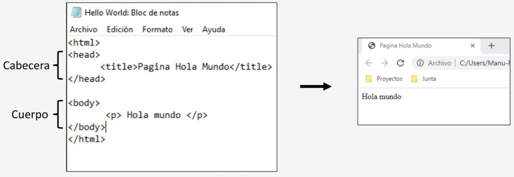

# UT1 INTRODUCCIÓN <!-- omit in toc -->
---

- [1. Introducción.](#1-introducción)
- [2. Clasificación de los lenguajes de marcas.](#2-clasificación-de-los-lenguajes-de-marcas)
- [3. Características comunes de los lenguajes de marcas.](#3-características-comunes-de-los-lenguajes-de-marcas)
- [4. Lenguajes de maras mas usados.](#4-lenguajes-de-maras-mas-usados)

# 1. Introducción.

Un **lenguaje de marcas** es una forma de codificar un documento que, junto con el texto, **incorpora etiquetas o marcas que contienen información** adicional acerca de la **estructura del texto** o su **presentación**.

Características:

+  Se usa tanto en paginas web como en programas de escritorio, en estos últimos para almacenar información, configuración de la aplicación,…
+ Suelen utilizarse como marcas el signo menor (>) y mayor (<). Una excepción a esto es TeX (LaTeX) que utiliza la barra invertida al inicio de la marca (`\`).
+ No pueden compararse con los lenguajes de programación (Java, Python, C, …) aunque si pueden combinarse con ciertos lenguajes (PHP y/o JavaScript + HTML).
+ Su origen es el lenguaje de marcado estándar SGML (standard generalized markup lenguage) descendiente de GML (generalized markup lenguage). Esta conversión se hizo en 1986 lo que dio lugar a la ISO 8879.
+ La herramienta para visualizar documentos XML, HTML, XHTML, … es el navegador web.

**HTML** es uno de los principales lenguajes de marcas, fue desarrollado a principios de los noventa por Tim Berners-Lee. Los documentos HTML tienen la extensión **.html**.

# 2. Clasificación de los lenguajes de marcas.

El uso de los lenguajes de marcas es muy diverso, se utilizan para mensajería instantánea (XMPP), servicios web (WSDL), páginas web (HMTL), sindicación de contendidos (RSS, Atom), documentación electrónica (RTF,TeX),.. Aunque es posible definir tres tipos:

+ **De procedimiento (TeX, Nroff, LaTeX)**: Se utilizan para la representación de texto, siendo las marcas visible para el usuario. Utilizan etiquetas para poner el titulo centrado, reducir el tamaño de la letra, poner el texto en cursiva,…
+ **De presentación (Microsoft Word)**: Se utilizan para lo mismo que el anterior pero en éstos las etiquetas no son visibles al usuario, por lo que son fáciles de crear pero difíciles de mantener o modificar.
+ **Descriptivos o semánticos (SGML, XML, HTML)**: Es un marcado flexible que usa etiquetas sin especificar la manera de representarlas ni el orden. Las marcas dan información sobre su estructura y una descripción del contenido.

# 3. Características comunes de los lenguajes de marcas.

No todos los lenguajes de marcas tiene las mismas características puesto a que hay un gran numero de ellos en el mercado, pero si existen una serie de características comunes:

+ **Uso de texto plano**: Estos no pueden almacenar información con formato (color, tamaño, fuente,…) únicamente se componen de caracteres (letras, números, caracteres especiales y control). Suelen estar codificados en ASCII, IISO 8859-1, Unicode o UTF-8.
+ **Interoperabilidad o independencia**: Pueden abrirse y editarse en cualquier maquina solo se tiene que tener en cuenta la codificación.
+ **Flexibles y fáciles de usar**: Solo se necesita un editor de texto para poder crearlos y guardarlos en la extensión que se desee. Se pueden combinar con otros lenguajes para darle mayor funcionalidad.

# 4. Lenguajes de maras mas usados.

Los lenguajes de marcas se utilizan para estructurar, organizar o formatear datos e información, diferenciándose de los lenguajes de programación tradicionales. Los más utilizados en el desarrollo web, la gestión de datos y la documentación incluyen:

+ **HTML**: El pilar absoluto de Internet. Se usa para definir la estructura, el contenido y la presentación de las páginas web.

+ **XML**: Diseñado para almacenar y transportar datos de forma estructurada y legible tanto por máquinas como por humanos.

+ **JSON**: Aunque suele ser un formato de intercambio de datos, funciona de manera similar para estructurar información de manera ligera y jerárquica.

+ **Markdown**: Un lenguaje de marcado ligero ideal para redactar textos con formato complejo (negritas, listas, enlaces) utilizando un editor de texto plano simple.

+ **LaTeX**: Fundamental en el ámbito académico y científico para componer documentos técnicos y fórmulas matemáticas complejas.

+ **SVG**: Lenguaje basado en XML utilizado para describir gráficos vectoriales bidimensionales que pueden escalar sin perder calidad.

