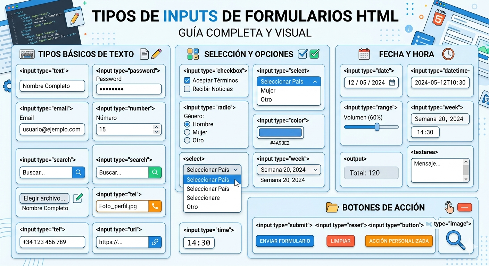

# UT2 HTML 5 <!-- omit in toc -->
---

- [1. Introducción](#1-introducción)
- [2. Estructura y sintaxis del lenguaje HTML](#2-estructura-y-sintaxis-del-lenguaje-html)
  - [2.1 Estructura básica de una página HTML](#21-estructura-básica-de-una-página-html)
  - [2.2. Comentarios](#22-comentarios)
- [3. Etiquetas Semánticas](#3-etiquetas-semánticas)
- [4. Elementos de HTML](#4-elementos-de-html)
  - [4.1 Elemento html](#41-elemento-html)
  - [4.2 Elemento head](#42-elemento-head)
    - [4.2.1 Elemento title](#421-elemento-title)
    - [4.2.2 Metadatos](#422-metadatos)
  - [4.3 Elemento body](#43-elemento-body)
    - [4.3.1 Elementos de Bloque (block)](#431-elementos-de-bloque-block)
    - [4.3.2. Elementos en Línea (inline)](#432-elementos-en-línea-inline)
  - [4.4 Párrafos](#44-párrafos)
  - [4.5 Formatos de texto](#45-formatos-de-texto)
  - [4.6. Listas](#46-listas)
    - [4.6.1 Listas no ordenadas](#461-listas-no-ordenadas)
    - [4.6.2 Listas ordenadas](#462-listas-ordenadas)
    - [4.6.1 Listas de definiciones](#461-listas-de-definiciones)
  - [4.7. Enlaces html - Hipervínculos, links](#47-enlaces-html---hipervínculos-links)
  - [4.8. Imágenes](#48-imágenes)
  - [4.9. Tablas](#49-tablas)
  - [4.10 Formularios](#410-formularios)
  - [4.11 Uso de multimedia en HTML](#411-uso-de-multimedia-en-html)


# 1. Introducción

Cuando se usan los navegadores para consultar las distintas web, se aprecian una serie de páginas que contienen elementos como enlaces, texto, imágenes, vídeos, etc. Si se accede al código fuente de dicha página, se aprecia que el código escrito en lenguaje HTML (HyperText Markup Language) es el componente básico de la web, junto con otras tecnologías entre las que destacan CSS, JavaScript, AJAX, etc.

HTML es un lenguaje de marcado que se usa para la creación de páginas web y tuvo su origen en 1991. Para poder crear cualquier documento, es necesario disponer de un editor de texto plano.

Existen herramientas de escritorio gratuitas y comerciales que facilitan este trabajo. Si no desea instalarse ni usarse ninguna herramienta de escritorio, existen herramientas online que permiten crear y editar este tipo de documentos.

De HTML se estudiará su estructura y sintaxis, así como sus elementos principales (listas, tablas, formato de texto, párrafos, cabeceras, formularios, etc.). Elaborar una web sin un diseño atractivo es algo impensable. En este punto es cuando entran en juego las hojas de estilo en cascada (CSS), que describen la manera de visualizar una página web por pantalla. 

[W3school](https://www.w3schools.com/html/default.asp)

# 2. Estructura y sintaxis del lenguaje HTML

HTML es un lenguaje de marcado que va a ser la base de nuestro módulo Lenguajes de Marcas y Sistemas de Gestión de Información.
Los navegadores interpretan las marca contenidas en los documentos HTML y representan la información para que los usuarios la puedan consultar e interactuar con ella.

Los elementos que forman las páginas HTML están identificadas por marcas o etiquetas. Estas marcas envuelven el contenido de la página, ya sea texto, imágenes o cualquier otro tipo de elemento. Las marcas o etiquetas están compuestas por un nombre rodeado de los símbolos `<` y `>`.

```html
<etiqueta>
```

Esta etiqueta puede estar escrito en mayúsculas o minúsculas. Se recomienda que que sea uniforme que se escriba todo de una forma.

Toda etiqueta de apertura debe tener una de cierre, y se especifica con el simbolo / justo antes del nombre.

```html
</etiqueta>
```
Ambas etiquetas deben tener el mismo nobmre que rodearán el contenido.

```html
<etiqueta> Esto es el contenido </etiqueta>
```

Aunque existen algunas etiquetas que no necesitan apertura y cierre, como por ejemplo `<br>`.

A veces nos vamos a encontrar que algunas etiquetas pueden incluir `atributos`, que van a permitir caracterizar los elementos de las etiquetas. Estos se incluyen en las etiquetas de apertura y estan compuestos por nombre el simbolo = y el valor entre comillas, dobles o simples.

```html
<etiqueta atributo1="valor1" atributo2="valor2">
```

## 2.1 Estructura básica de una página HTML

A continuación vemos la estructura básica de una página web, para probarla copia este codigo en un editor como puede ser el Block de Notas, guardala con nombre `index.html` y abrelo con un navegador.

```html
<!DOCTYPE html>
<html lang="es">
<head>
    <meta charset="UTF-8">
    <title>Titulo del documento</title>
</head>
<body>
    Este es cuerpo de la pagina
</body>
</html>
```
## 2.2. Comentarios

Los comentarios son elementos que no tienen ningún efecto sobre la página, ya que único objetivo es proporcionar información para una mejor comprensión del código.
El contenido debe estar delimitado con los caracteres `<!--` y `  -->` y será ignorado por el navegador.

Vamos a ver un ejemplo del uso de los comentarios, crea un fichero llamado `comentarios.html` e introduce el siguiente código, guardalo y abrelo con un navegador.:

```html
<!DOCTYPE html>
<html lang="es">
<head>
    <meta charset="UTF-8">
    <title>Uso de comentarios</title>
</head>
<body>
    <!-- Esto es un comentario -->
   Hola Mundo !!!!!
</body>
</html>
```

# 3. Etiquetas Semánticas

HTML 5 ha introducido las etiquetas semánticas las cuales describen en contenido que almacenan.

Antes se usaba la etiqueta `<div>` o `<span>` , que son unas etiquetas de bloque el cual servía para agrupar contenido.

Las etiquetas semánticas:

+ describen el propósito de su contenido.
+ mejoran accesibilidad.
+ ayudan al SEO.
+ hacen el código mas entendible.

> **`<header>`**

Cabecera de una página o sección, puede contener el logo, título y el menú.

> **`<nav>`**

Menú de navegación

> **`<main>`**

Contenido de la página principal, solo debe existir uno por página.

> **`<section>`**

Agrupa contenido relacionado.

> **`<article>`**

Contenido independiente como puede ser na noticia un post o un comentario.

> **`<aside>`**

Contenido secundario o lateral.

> **`<footer>`**

Pie de página.

> Ejemplo:

```html
<body>

<header>
    <h1>Tienda Online</h1>
</header>

<nav>
    <a href="#">Inicio</a>
    <a href="#">Productos</a>
</nav>

<main>

    <section>
        <h2>Ofertas</h2>

        <article>
            <h3>Portátil</h3>
            <p>Descripción...</p>
        </article>

    </section>

    <aside>
        Publicidad
    </aside>

</main>

<footer>
    © 2026
</footer>

</body>
```

# 4. Elementos de HTML

Un documento HTML está compuesto de elementos organizados de manera jerárquica. En los ejemplos anteriores lo hemos visto, dichos elementos son \<html>, \<head> y \<body>.

Cada elemento se identifica por una etiqueta y puede tener un conjunto de atributos, los cuales pueden ser específicos de un elemento en concreto.

Como ejemplo podemos ver en la etiqueta `\<html>` el atributo `lang`, para indicar el idioma de nuestra página web, con `es` estamos indicando el idioma Español.

## 4.1 Elemento html

Es el elemento principal del documento HTML. Todo el contenido debe estar dentro de dicha etiqueta, como vemos tiene una etiqueta de inicio y otra de cierre.

## 4.2 Elemento head

En este elemento  incluye el titulo de la página y los metadatos que podemos configurar para nuestra página web.

Este contenido no es visible.

### 4.2.1 Elemento title

Con esta etiqueta indicamos el titulo de nuestra página, dicho título se mostrará en la pestaña del navegador donde hemos abierto nuestra página web.

```html
<title> Titulo de la página Web </title>
```
Es lo que aparece en:

+ pestaña del navegador.
+ favoritos.
+ resultados de buscadores.


### 4.2.2 Metadatos

Los metadatos definen características generales del documento HTML e información que se desea proporcionar al navegador, se utiliza la etiqueta `\<meta>`.

En el siguiente enlace podemos obtener mas información sobre las etiquetas meta.

[Mas informacion sobre etiquetas Meta](https://lenguajehtml.com/html/metadatos/etiqueta-html-meta/)

A continuación vamos a ver algunos:

>  **Codificación caracteres **

```html
<meta charset="UTF-8">
```
Codificación Unicode e ISO-8859-1.

Evita problemas con:

+ tildes.
+ ñ.
+ caracteres especiales.

> **Diseño responsive**

Hace que se adapte a móviles.
```html
<meta name="viewport" content="width=device-width, initial-scale=1.0">
```

> **Ayuda a SEO**


+  Descripción del contenido de la página.
```html  
<meta name="description" content="Curso de JavaScript desde cero con ejemplos prácticos">
```

+  Autor de la página.

```html
<meta name="author" content="Autor">
```

+ Lista palabras que hacen referencia a la pagina web.  

```html
<meta name="keywords" content="html, lenguaje, lenguaje de marcado, código html, etiqueta">
```

> **Enlaces CSS**

Enlazar con hojas de estilo CSS
```html
<link rel="stylesheet" href="estilos.css">
```
>** Enlaces JavaScript Externo**

Aunque normalmente hoy se pone antes de `</body>` para mejorar carga.
```html
<script src="script.js"></script>
```
> **Icono de la página (favicon)**

Es el icono que aparece junto al título de la pagina web.
```html
<link rel="icon" href="favicon.ico">
```

A continuación vemos el ejemplo de un `<head>` típico:

```html
<head>
    <meta charset="UTF-8">
    <meta name="viewport" content="width=device-width, initial-scale=1.0">

    <title>Tienda Online</title>

    <meta name="description" content="Venta de productos tecnológicos">

    <link rel="stylesheet" href="css/estilos.css">

    <script src="js/app.js" defer></script>
</head>
```

## 4.3 Elemento body

El elemento `<body>` delimita el contenido de toda nuestra página Web. Es la sección mas importante ya que en ella se encuentran los contenidos a presentar por el navegador.

### 4.3.1 Elementos de Bloque (block)

Estos bloques comienzan en una **nueva línea** y ocupan todo el ancheo de su contendor (de izquierda a derecha).

+ **Comportamiento**: Puedes ajustarel width, hight, padding y margin.
+ **Ejemplos comunes**: `<div>`, `<h1> - <h6>`, `<p>`, `<ul>`, `<li>`, `<header>`, `<footer>`, `<section>`.

### 4.3.2. Elementos en Línea (inline)
Estos elementos solo ocupan el espacio necesario para contener su contenido (texto o imagen). No provocan un salto de línea.

+ **Comportamiento**: No respetan las propiedades de width o height. El margin y padding solo funcionan horizontalmente (izquierda y derecha), pero no afectan el espacio vertical de otros elementos.
+ **Ejemplos comunes**: `<span>`, `<a>`, `<strong>`, `<em>`, `` (aunque la imagen es un caso especial).
  


|Característica|Bloque (block)|En Línea (inline)|
| -------------|-------------|------------------|
|Salto de línea|Sí (siempre empieza abajo)|No (sigue el flujo)|
|Ancho por defecto|100% del contenedor|Solo su contenido|
|Permite width/height|Sí|No|
|Uso común|Estructura y secciones|Estilizar texto|

## 4.4 Párrafos

Los párrafos se generan con la etiqueta `<p>`, debe tener su etiqueta de cierre y entre ambas etiquetas lo que se escriba se tomará como un parrafo indempendiente.

```html
<p> Este es un párrafo sencillo </p>
```

Hay dos etiquetas que no necesitan cierre y son `<br>` que nos inserta un salto de línea y `<hr>` que nos muestra una línea horizontal.

```html
Esto es un <br> salto de línea.
<hr>
nos muestra la línea

```

Esto es un <br> salto de línea.
<hr>
nos muestra la línea

## 4.5 Formatos de texto

> **Negrita**

Para escribir texto en negrita tenemos que incluirlo dentro de las etiquetas `<b>` (bold) y su cierre `</b>`. Esta misma tarea es desempeñado por **strong** y su cierre.

<b>Texto en negrita</b>
```html
<b>Texto en negrita</b>
```

> **Itálica**

Para escribir texto en negrita tenemos que incluirlo dentro de las etiquetas `<i>` (italic) y su cierre `</i>`. 


<i>Texto en italica</i>
```html
<i>Texto en italica</i>
```

> **Subrayado**

Para escribir texto en negrita tenemos que incluirlo dentro de las etiquetas `<u>` (underlined) y su cierre `</u>`. 


<u>Texto en subrallado</u>
```html
<i>Texto en subrallado</i>
```

> **Subíindices y superíndices**

Este tipo de formato resulta de extremada utilidad para textos científicos. Las etiquetas empleadas  son:

`<sup>` y `</sup>` para los superíndices
`<sub>` y `</sub>` para los subíndices

Aquí tenéis un ejemplo:
```html
La <sup>13</sup>CC<sub>3</sub>H<sub>4</sub>ClNOS es un heterociclo alergeno enriquecido
```

El resultado:

La <sup>13</sup>CC<sub>3</sub>H<sub>4</sub>ClNOS es un heterociclo alergeno enriquecido

> **Anidar etiquetas**

Todas estas etiquetas y por supuesto el resto de las vistas y que veremos más adelante pueden ser anidadas unas dentro de otras de manera a conseguir resultados diferentes. Así, podemos sin ningún problema crear texto en negrita e itálica embebiendo una etiqueta dentro de la otra:

```html
<b>Esto sólo está en negrita <i>y esto en negrita e itálica</i></b>
```

<b>Esto sólo está en negrita <i>y esto en negrita e itálica</i></b>

> **Encabezados**

Son etiquetas utilizadas para dar importancia al texto, variando su tamaño y van desde `<h1>` hasta `<h6>`.

```html
    <h1>Encabezado nivel 1</h1>
    <h2>Encabezado nivel 2</h2>
    <h3>Encabezado nivel 3</h3>
    <h4>Encabezado nivel 4</h4>
    <h5>Encabezado nivel 5</h5>
    <h6>Encabezado nivel 6</h6>
```

<h1>Encabezado nivel 1</h1>
<h2>Encabezado nivel 2</h2>
<h3>Encabezado nivel 3</h3>
<h4>Encabezado nivel 4</h4>
<h5>Encabezado nivel 5</h5>
<h6>Encabezado nivel 6</h6>

## 4.6. Listas

### 4.6.1 Listas no ordenadas

Las listas no ordenadas (unordened list) van dentro de la etiqueta `<ul>` y su cierre `</ul>`. Para cada item que queramos añadir a la lista, lo haremos dentro de la etiqueta `<li>` y su cierre.

Si no le indicamos nada a la etiqueta `<li>` HTML, ésta se generará de forma automática, si no, hay que tener en cuenta el atributo para el uso de viñetas, que será **type** con alguno de los siguientes valores: **disc**, **square** o **circle**.

```html
<ul>
    <li type="circle">Esto es un tipo de item.</li>
    <li type="square">Este es otro.</li>
    <li type="disc">Y este es otro diferente.</li>
</ul>
```

<ul>
    <li type="circle">Esto es un tipo de item.</li>
    <li type="square">Este es otro.</li>
    <li type="disc">Y este es otro diferente.</li>
</ul>

### 4.6.2 Listas ordenadas

Las listas ordenadas (ordered list) van enmarcadas dentro de las etiquetas `<ol>` y su cierre. Cada item de la lista se escribe con la misma etiqueta que en las no numeradas: `<li>`. Pero al ser listas ordenadas los símbolos serán números y éstos se  irán  generando automáticamente por orden , conforme escribamos nuevos puntos.

En las listas ordenadas podemos hacer que el primer punto comience con el número que nosotros queramos. Lo conseguiremos gracias al atributo “**value**” o el atributo "**start**"
(si no se especifica, comenzará por 1). Los siguientes puntos que escribamos se generarán automáticamente por orden, partiendo de ese número.
```html
<ol>
<li value="20">Este será el número 20.</li>
<li>Este será el 21.</li>
<li> Este será el 22. Y así sucesivamente.</li>
</ol>
```
<ol>
<li value="20">Este será el número 20.</li>
<li>Este será el 21.</li>
<li> Este será el 22. Y así sucesivamente.</li>
</ol>


También podemos utilizar el atributo **type** para indicar el estilo de numeración (1, a,i,I,A)

```html
<ol type ="A">
<li> Capítulo 1</li>
<li> Capítulo 2</li>
<li> Capítulo 3</li>
<li> Capítulo 4</li>
</ol>
```
<ol type ="A">
<li> Capítulo 1</li>
<li> Capítulo 2</li>
<li> Capítulo 3</li>
<li> Capítulo 4</li>
</ol>

### 4.6.1 Listas de definiciones

Si lo que vamos a hacer es un listado de definiciones, podemos usar las etiquetas `<dl>`, `<dt>` y `<dd>`. Vamos a explicarlas por partes:

+ La etiqueta `<dl>` viene de los términos ingleses “definiton list” y nos indica que dentro de ella, entre ella y su cierre, va a ir una definición.
+ La etiqueta `<dt>` viene de los términos “definition term” y dentro de ella irá el término que vamos a definir. Para entendernos mejor, dentro de `<dt>` iría el título de la definición.
+ La etiqueta `<dd>` viene de los términos “definition description” y nos dice que dentro de
ésta irá la definición.

Ejemplo:
```html
<h3>Metalenguajes</h3>
<dl>
    <dt>SGML</dt>
        <dd>Metalenguaje para la definición de otros lenguajes de marcado</dd>
    <dt>XML</dt>
        <dd>Lenguaje basado en SGML y que se emplea para describir datos</dd>
    <dt>RSS</dt>
    <dt>GML</dt>
    Este ejemplo arrojará la siguiente página por el navegador:
    <dt>XHTML</dt>
    <dt>SVG</dt>
    <dt>XUL</dt>
    <dd>Lenguajes derivados de XML para determinadas aplicaciones</dd>
</dl>
```


<h3>Metalenguajes</h3>
<dl>
    <dt>SGML</dt>
        <dd>Metalenguaje para la definición de otros lenguajes de marcado</dd>
    <dt>XML</dt>
        <dd>Lenguaje basado en SGML y que se emplea para describir datos</dd>
    <dt>RSS</dt>
    <dt>GML</dt>
    <dt>XHTML</dt>
    <dt>SVG</dt>
    <dt>XUL</dt>
    <dd>Lenguajes derivados de XML para determinadas aplicaciones</dd>
</dl>

## 4.7. Enlaces html - Hipervínculos, links

En HTML se utiliza el elemento ancla `<a>` para crear un enlace. Cuando un visitante hace clic en él, el navegador abre otra página, normalmente. El elemento ancla es un elemento contenedor y su aspecto es el siguiente:

`<a>...</a>`

El contenido, texto del enlace, sobre el que pulsa el visitante se coloca dentro del elemento ancla:

<a>Enlace a otra página</a>

El enlace anterior no apunta aningun sítio. Para que apunte hay que indicarlo en el atributo `href`.

```html
<a href="https://www.w3schools.com/html/default.asp">Enlace a W3schools</a>
```

<a href="https://www.w3schools.com/html/default.asp">Enlace a W3schools</a>

En este ejemplo estamos enlazando con una pagina web externa, pero también podemos enlazar con otras paginas html que estén en el mismo directorio o en directorios diferententes, incluso podemos enlazar con partes dentro de la misma página html.
Vamos a ver ejemplos de cada uno de estos supuestos:

Enlazamos con una página **dentro del mismo directorio**:

```html
Si quieres más información sobre la reseña de alguno de los libros de este sitio puedes <a href="contactame.html">contáctarme</a> vía email.
```
el fichero `contactame.html`, debe estar dentro del mismo directorio.

Enlazamos con una página **en otro directorio**:


```html
Si quieres más información sobre la reseña de alguno de los libros de este sitio puedes <a href="./contactos/contactame.html">contáctarme</a> vía email.
```
Estamos utilizando una ruta relativa ya que nuestro fichero `contactame.html` se encuentra dentro del directorio `contactos`.

También podemos ver estos enlaces dentro de una misma página de la siguiente manera:

```html
<p>Si haces click aquí <a href="#respuesta4">4</a> "saltas" a la sección ‘4’</p>
<p>…</p>
<p>…</p>
<p id="respuesta4">4: aquí está escrita la respuesta</p>
```
> **Abrir hipervínculo con una ventana nueva**

Para ello utilizamos el atributo `target`. Y puede tmar los siguientes valores:

+ **_self** Por defecto abre el documento en la misma pestaña.
+ **_blank** Abre el documento en  una ventana/pestaña nueva.
+ **_parent**  Abre el documento en el marco padre
+ **_top**  Abre el documento en toda la ventana del navedador


> **Enlaces para descargar archivos**

En realidad, dentro del atributo href="" podemos colocar la ruta hacia cualquier tipo de recurso, de ahí lo de URL (Uniform Resource Locator). Si el navegador reconoce la extensión, lo abre por ejemplo: html, jpg, png, gif, svg, pdf, etc. Pero si no lo reconoce o es un archivo comprimido (.rar, .zip), el navegador le ofrece al usuario descargarlo.

```html
<a href="fotos.rar">Descargá todas las fotos</a>
```

## 4.8. Imágenes

Para mostrar una imagen en una página tenemos dos formas de hacerlo, una es usando el elemento `img` y otras es mediante CSS (que veremos en el capítulo correspondiente).

Esta etiqueta sólo requiere de dos atributos obligatorios que son: `src` (de source) y el otro es `alt` (de alternative), El atributo `src` lo usaremos para indicar la URL (absoluta o relativa) a la imagen, y `alt` como el texto (alternativo) como que mostrará el navegador en caso de no encontrar la imagen.

Ejemplo de imagen desde una dirección URL.

```html

```
Ejemplo de imagen desde una ruta

```html

```
Podemos alinear la foto en la página como queramos mediante `align`, utilizando los atributos `left` para alinearla a la izquierda o `right` para alinearla a la derecha: otras formas de alinear imágenes son posibles pero están dentro de CSS, así que por ahora no las veremos.

Atributos opcionales pero muy recomendables, son el height y el width. El height marca la altura de la imagen, mientras que el width marca la anchura. Son recomendables porque así ayudaremos al navegador a representar la imagen. Hay que tener cuidado de no deformar la imagen, hecho que sucede si incluimos al mismo tiempo height y width con una proporción diferente a la de la imagen original. Lo normal es redimensionar on un atributo de esto dos.

Y por último, también queremos mostrarte que le puedes adjudicar un borde a la fotografía. El atributo ya te lo sabes:  `border`. Después solo tendrás que definir cuál quieres que sea el grosor del borde.

## 4.9. Tablas

Para crear una tabla utilizaremos la etiqueta `<table>` junto a su terminación `</table>` y entre ellas vamos configurando nuestra tabla.

Resumen de las etiquetas:

|Etiqueta|	Función|
|:------:|:-------:|
| `<table>` |	Tabla |
|`<tr>`	|Fila|
|`<td>`	|Celda|
|`<th>`	|Encabezado|
|`<caption>`	|Título|
|`<thead>`	|Cabecera|
|`<tbody>`	|Cuerpo|
|`<tfoot>`	|Pie|
|`<colgroup>`	|Grupo de columnas|
|`<col>`	|Configuración columna|

Atributos importantes:

|Atributo|	Función|
|:------:| :-------:|
| colspan |	Une columnas |
|rowspan	|Une Filas|


Ejemplo:

<table>
<!-- Fila 1 -->
<tr>
<td>Fila 1, columna 1</td>
<td>Fila 1, columna 2</td>
</tr>
<!-- Fila 2 -->
<tr>
<td>Fila 2, columna 1</td>
<td>Fila 2, columna 2</td>
</tr>
</table>
<h2>Tabla (uniendo celdas)</h2>
<table>
<tr>
<td>Fila 1, columna 1</td>
<td colspan="3"> Fila 1, columnas 2, 3 y 4</td>
</tr>
<tr>
<td rowspan="2">Fila 2, columna 1 <br>+<br>Fila 3, columna 1</td>
<td>Fila 2 columna 2</td>
<td>Fila 2 columna 3</td>
<td>Fila 2 columna 4</td>
</tr>
<tr>
<td>Fila 3 columna 2</td>
<td>Fila 3 columna 3</td>
<td>Fila 3 columna 4</td>
</tr>
</table>

## 4.10 Formularios

Los formulários nos van apermitir perdir datos al usuario.

Los formulários son creado con al etiqueta `<form>` y su cierre `</form>`, y entre ambas etiquetas vamos a crear los controles del formulario.

Ejemplo:
```html
<form>
    Nombre:
    <input type="text">
    <br><br>
    <input type="submit" value="Enviar">
</form>
```
> **Etiquetas principales**


|Etiqueta|	Función|
|:----:| :----:|
|`<form>`|	Formulario|
|`<input>`	|Campo de entrada|
|`<label>`	|Etiqueta descriptiva|
|`<textarea>`	|Área de texto|
|`<select>`	|Lista desplegable|
|`<option>`	|Opción desplegable|
|`<button>`	|Botón|
|`<fieldset>`	|Agrupar campos|
|`<legend>`	|Título del grupo|


> **Atributos importantes de `<form>`**

| Atributo       | Función                       |
| :------------: | :---------------------------: |
| `action`       | Página destino                  |
| `method`       | GET o POST (Php)                |
| `autocomplete` | Activa/desactiva autocompletado |

Ejemplo:

```html
<form action="guardar.php" method="post">
</form>
```
> **Tipos de `<input>`**

| Tipo       | Función           |
| ---------- | ----------------- |
| `text`     | Texto             |
| `password` | Contraseña        |
| `email`    | Correo            |
| `number`   | Número            |
| `date`     | Fecha             |
| `checkbox` | Casilla           |
| `radio`    | Opción única      |
| `file`     | Subir archivo     |
| `color`    | Selector color    |
| `range`    | Barra deslizante  |
| `submit`   | Enviar formulario |
| `reset`    | Reiniciar         |
| `hidden`   | Campo oculto      |




> **Atributos importantes**

| Atributo      | Función             |
| :-------------:| :-------------------: |
| `name`        | Nombre del campo    |
| `id`          | Identificador       |
| `placeholder` | Texto ayuda         |
| `required`    | Obligatorio         |
| `readonly`    | Solo lectura        |
| `disabled`    | Desactivado         |
| `maxlength`   | Máximo caracteres   |
| `min` / `max` | Límites             |
| `checked`     | Marcado por defecto |


[Para mas información visite este enlace](https://lenguajehtml.com/html/formularios/etiqueta-html-form/)

En el siguiente ejemplo puedes ver todos los inputs en un formulario:


[Ejemplo Forumulaio](formulario.html)


## 4.11 Uso de multimedia en HTML

> **Etiqueta `<audio>`**

Inserta sonido o música.

**Atributos importantes**

| Atributo   | Función                   |
| :----------: | :-------------------------: |
| `controls` | Muestra controles         |
| `autoplay` | Reproduce automáticamente |
| `loop`     | Repetición                |
| `muted`    | Silenciado                |

Ejemplo:
```html
<audio controls autoplay muted>

    <source src="musica.mp3"
            type="audio/mpeg">

</audio>
```


> **Etiqueta `<video>`**

Inserta vídeos.

**Atributos importantes**

| Atributo   | Función                 |
| :----------: | :-----------------------: |
| `controls` | Controles reproducción  |
| `autoplay` | Reproducción automática |
| `loop`     | Repetir                 |
| `muted`    | Silenciar               |
| `poster`   | Imagen previa           |

```html
<video controls
       width="500"
       poster="miniatura.jpg">
    <source src="pelicula.mp4"
            type="video/mp4">

</video>
```

> **Etiqueta `<canvas>`**

Área gráfica manipulable con Javascript

**Ejemplo:**

Parte html.

```html

<canvas id="miCanvas"
        width="400"
        height="200"
        style="border:1px solid black;">
</canvas>

```

Parte Javascript

```js
<script>

    // Obtener canvas
    const canvas = document.getElementById("miCanvas");
    // Obtener contexto 2D
    const ctx = canvas.getContext("2d");
    // Dibujar rectángulo
    ctx.fillStyle = "blue";
    ctx.fillRect(20, 20, 150, 80);
    // Dibujar texto
    ctx.font = "20px Arial";
    ctx.fillStyle = "red";
    ctx.fillText("Hola Canvas", 180, 70);

</script>
```

> **Etiqueta `<svg>`**

Permite crear gráficos vectoriales.

**Ejemplo:**

```html
<svg width="400" height="200"
     style="border:1px solid black;">

    <!-- Rectángulo -->
    <rect x="20"
          y="20"
          width="120"
          height="80"
          fill="blue" />

    <!-- Círculo -->
    <circle cx="220"
            cy="60"
            r="40"
            fill="red" />

    <!-- Texto -->
    <text x="120"
          y="150"
          font-size="24"
          fill="green">

          Hola SVG

    </text>

</svg>
```