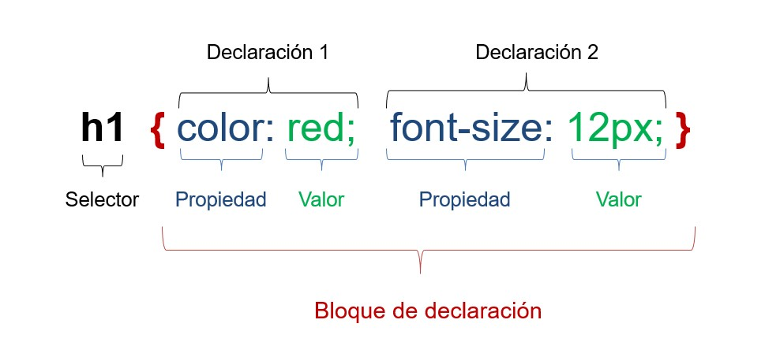
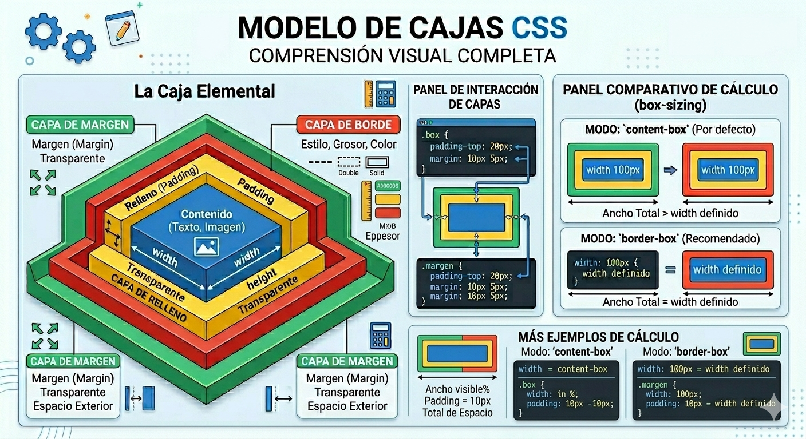

# UT2 CSS <!-- omit in toc -->
---

- [1. Introducción](#1-introducción)
- [2. Hojas de estilo CSS](#2-hojas-de-estilo-css)
- [3. Sintaxis básica](#3-sintaxis-básica)
  - [3.1. Selectores](#31-selectores)
  - [3.2 Propiedades de los elementos](#32-propiedades-de-los-elementos)
    - [3.2.1 Propiedades de texto](#321-propiedades-de-texto)
    - [3.2.2. Propiedades de color y fondo](#322-propiedades-de-color-y-fondo)
    - [3.2.3. Propiedades de las Listas](#323-propiedades-de-las-listas)
    - [3.2.4. Propiedades de las tablas](#324-propiedades-de-las-tablas)
    - [3.2.5. Propiedad float](#325-propiedad-float)
    - [3.2.6. Propiedad position](#326-propiedad-position)
- [4. Modelo de cajas](#4-modelo-de-cajas)
  - [4.1. Flex](#41-flex)
- [5. Unidades de longitud](#5-unidades-de-longitud)
  - [5.1. Unidades de longitud absoluta](#51-unidades-de-longitud-absoluta)
  - [5.2. Unidades de longitud relativa](#52-unidades-de-longitud-relativa)
- [6. Colores](#6-colores)
- [7. Variables en CSS](#7-variables-en-css)


# 1. Introducción

Hasta ahora hemos visto nuestros documentos HTML de la forma predeterminada que nos ofrecen los navegadores, cada uno con algunas diferencias respecto a los otros.

Con CSS vamos a darle formato aplicando estilos a las etiquetas, donde podremos asignar fondos, colores, tipos de letra, etc...


[W3Schools](https://www.w3schools.com/css/default.asp)

# 2. Hojas de estilo CSS

CSS es un lenguaje creado por la W3C que añade diferentes estilos a los documentos HTML dando formato mediante su uso. Se crearon con la intención de separar el contenido del formato del documento, y esto permite estructurar mejor los documentos.

Podemos aplicar estilo a una parte de la página HTML o a todos los elementos de la misma, y se permiten distintos formatos para las mismas etiquetas. Por tanto, el código HTML no tiene que ser modificado para que la apariencia de los elementos del mismo
cambie.

Para aplicar estos estilos los podemos hacer de tres formas, la recomendada es la externa.

Los estilos hay que crearlos en un fichero de texto con extención `.css`


> **Estilos internos**

Mediante la etiqueta `<style>` y se introduce en el `<head>`.

Ejemplo:

```html
<!DOCTYPE html>
<html lang="es">
<head>
    <meta charset="UTF-8">
    <title>Ejemplo de CSS en el Head</title>

    <style>
        body {
            font-family: Arial, sans-serif;
            background-color: #f4f4f9;
            display: flex;
            flex-direction: column;
            align-items: center;
            padding: 50px;
        }

        h1 {
            color: #333;
            border-bottom: 2px solid #3498db;
        }

        .boton-personalizado {
            background-color: #3498db;
            color: white;
            padding: 10px 20px;
            border: none;
            border-radius: 5px;
            cursor: pointer;
            transition: background 0.3s ease;
        }

        .boton-personalizado:hover {
            background-color: #2980b9;
        }
    </style>
</head>
<body>

    <h1>Título Estilizado</h1>
    <p>Este párrafo recibe estilos desde el head.</p>
    
    <button class="boton-personalizado">
        Mi Botón con CSS
    </button>

</body>
</html>

```

> **Estilos externos ( Recomendados)**

Si creamos aparte nuestra hoja de estilo llamada "mis estilos.css", en nuestro documento HTML lo primero será indicar dónde esta la misma para poder hacer uso de los estilos definidos en la misma, para ello usamos dentro de la cabecera (head) la siguiente etiqueta con los siguientes atributos:

```html
<link rel="stylesheet" type="text/css" href="mis estilos.css"/>
```

Dentro del fichero `.css` podemos tener los distintos estilos, siendo lo correcto empezar indicando los estilos también de elementos más generales a los más particulares.

```css
body {
    background-color:blue;
}
h1 {
    font-family: verdana;
    color: white;
}
li {
    text-decoration:underline;
}
```

> **Estilos en línea**

Utilizando el atributo `<style>` en el elemento que deseamos darle formato.

```html
<h1 style="color: darkblue; text-align: center; font-family: sans-serif;">
    Título con CSS en línea
</h1>

<p style="background-color: yellow; padding: 10px; border: 1px solid black; border-radius: 8px;">
    Este párrafo tiene un fondo amarillo, bordes redondeados y espacio interno (padding) definido directamente en la etiqueta.
</p>

```

> **Comentarios**

Dentro de la etiqueta style, los comentarios comienza con `/*` y terminan con `*/`. Observa el siguiente ejemplo:

```css
li {
    text-decoration:underline; /* Decoración del texto: subrayado */
}
```
> **Agrupamientos**

Cuando tenemos varios elementos a los cuales aplica el mismo formato, en lugar de definir la regla para uno de ellos, se separan por comas, por ejemplo:

```css
h1, h2, h3 {
    color: red;
}
```

# 3. Sintaxis básica

Las declaraciones de estilos CSS se hace a través de **reglas**. Está compuesto por dos partes diferenciadas:

+ El **selector**, o una lista de ellos.
+ Una **declaración**.


Dentro de la **declaración** podemos tener una o varias parejas de:

+ Propiedad
+ Valor/es asociado/s a la misma.
  
En la siguiente imagen se muestra el ejemplo de una regla CSS con las partes comentadas:




## 3.1. Selectores

Los selectoroes son la forma en que se apunta a los elelmentos HTML a los cuales queremos dar formato.

> **De tipo**

Se aplica a todos los elementos del mismo tipo por ejemplo `<p>`,`<h1>`, etc...

El siguiente ejemplo asigna al cuerpo de documento el fondo de color azul y a todos los h1 de color amarillo.

```css
body {
    background-color: blue;
}

h1 {
    color: yellow;
}
```
> **Selector universal**

Utiliza el carácter de asterisco "*" y se aplica la regla a todos los elementos de la página:

```css
* { regla }
```

Suele usarse para limpiar el formato de todo el dcocumento.

> **Selector de clase**

Aplica los estilos a los elementos que pertenecen a la misma clase.

Delcaración CSS

```css
.nombre_clase{
    color:red;
}

```

Declaración en HTML, este ejemplo hace que el contenido `<h1>` se muestre el color rojo.

```html

<h1 class="nombre_clase">
```

> **Selector id**

Similar a la clase pero con la peculiaridad de que solo puede haber dentro del HTML una única etiqueta con dicho ID

Declaración CSS


```css
#nombre_id{
    color:red;
}
```

Declaración en HTML

```html

<h1 class="nombre_id">
```

> **Selector de atributo**

Seleccionan elementos HTML que tienen un atributo específico, se puede utilizar atributos como `herf` y `src`.

Se escriben entre cochetes.

Delcaración CSS

```css
a[href^="https"] {
  color: blue;
}
```
Con esto hacemos que elenlace se vea en color azul.

> **Selectores de descendencia**

Seleccionan elementos que son descendientes de otro.

```css
div p {
  font-style: italic;
}
```

El parrafo que se encuentre dentro de un `<div>`, el tipo de letra será italica.

```html
<div>
  <p>Este es un párrafo dentro de un div.</p>
</div>
```


> **Selectores de hijo directo**

Seleccionan elementos con hijos directo de otro elemento específico,se
escriben separados por `>`.

```css
ul > li {
  list-style: square;
}
```
Aplicamos que el estilo de la lista no ordenada sea un cuadrado.

```html
<ul>
  <li>Elemento 1</li>
  <li>Elemento 2</li>
  <li>Elemento 3</li>
</ul>
```

> **Selectores adyacentes**

Selecciona el siguiente elemento adyacente a uno específico, se escriben separando los selectores por `+`.

```css
h1 + p {
  margin-top: 0;
}
```
Aplicamos el margen superior a 0 en ambos elelmentos.

```html
<h1>Título de sección</h1>
<p>Este es el primer párrafo de la sección.</p>
```

> **Selectores de hermanos**

Seleccionan los hermanos de los elementos hermanos del mismo nivel, se describen con el selector `~`.

```css
div ~ p {
    color: red;
}
```

Todos los párrafos serán rojos. La etiqueta `<span>`, no se pondrá en rojo.

```html
<div>Primer div</div>

<p>Párrafo 1</p>

<p>Párrafo 2</p>

<span>Texto span</span>

<p>Párrafo 3</p>
```

> **Selectores de pseudoclase**

Permiten dar formato a elementos en un estado especial o situación concreta, se describen utilizando `:`.

```css
a:hover {
  color: red;
  text-decoration: underline;
}
```
Al pasar el ratón por encima del enlace se pondrá rojo y se subrayará.

```html
<a href="#">Enlace de ejemplo</a>
```


**Pseudoclases más importantes.**

| Pseudoclase    | Función                |
| :--------------: | :----------------------: |
| `:hover`       | Ratón encima           |
| `:active`      | Elemento pulsado       |
| `:focus`       | Campo seleccionado     |
| `:visited`     | Enlace visitado        |
| `:link`        | Enlace no visitado     |
| `:first-child` | Primer hijo            |
| `:last-child`  | Último hijo            |
| `:nth-child()` | Hijo específico        |
| `:checked`     | Checkbox/radio marcado |
| `:disabled`    | Elemento deshabilitado |
| `:enabled`     | Elemento habilitado    |
| `:not()`       | Negación               |
| `:empty`       | Elemento vacío         |

## 3.2 Propiedades de los elementos

### 3.2.1 Propiedades de texto

A continuación vemos las propiedades mas usadas cuando queremos dar formato a los textos.

| Propiedad         | Descripción                       | Valores más usados                              |
| ----------------- | --------------------------------- | ----------------------------------------------- |
| `color`           | Color del texto                   | `red`, `blue`, `#ff0000`, `rgb()`               |
| `font-size`       | Tamaño del texto                  | `12px`, `2em`, `120%`                           |
| `font-family`     | Tipo de letra                     | `Arial`, `Verdana`, `serif`                     |
| `font-weight`     | Grosor del texto                  | `normal`, `bold`, `100-900`                     |
| `font-style`      | Estilo del texto                  | `normal`, `italic`, `oblique`                   |
| `text-align`      | Alineación horizontal             | `left`, `center`, `right`, `justify`            |
| `text-decoration` | Decoración del texto              | `underline`, `overline`, `line-through`, `none` |
| `text-transform`  | Transformar mayúsculas/minúsculas | `uppercase`, `lowercase`, `capitalize`          |
| `letter-spacing`  | Espacio entre letras              | `2px`, `5px`                                    |
| `word-spacing`    | Espacio entre palabras            | `5px`, `10px`                                   |
| `line-height`     | Espacio entre líneas              | `1.5`, `20px`                                   |
| `text-shadow`     | Sombra del texto                  | `2px 2px 5px gray`                              |
| `text-indent`     | Sangría primera línea             | `20px`, `5em`                                   |
| `white-space`     | Gestión de espacios               | `normal`, `nowrap`, `pre`                       |
| `direction`       | Dirección del texto               | `ltr`, `rtl`                                    |
| `vertical-align`  | Alineación vertical               | `top`, `middle`, `bottom`                       |

### 3.2.2. Propiedades de color y fondo

A continuación vemos las propiedades mas usadas cuando queremos dar formato de color y fondo de los documentos.

| Propiedad               | Descripción              | Valores más usados                |
| ----------------------- | ------------------------ | --------------------------------- |
| `color`                 | Color del texto          | `red`, `blue`, `#ff0000`, `rgb()` |
| `background-color`      | Color de fondo           | `yellow`, `black`, `rgba()`       |
| `background-image`      | Imagen de fondo          | `url(imagen.jpg)`                 |
| `background-repeat`     | Repetición del fondo     | `repeat`, `no-repeat`             |
| `background-position`   | Posición del fondo       | `center`, `top`, `left`           |
| `background-size`       | Tamaño del fondo         | `cover`, `contain`                |
| `background-attachment` | Fondo fijo o desplazable | `fixed`, `scroll`                 |
| `opacity`               | Transparencia            | `0` a `1`                         |
| `background`            | Propiedad abreviada      | combinación propiedades           |
| `linear-gradient()`     | Fondo degradado lineal   | colores                           |
| `radial-gradient()`     | Fondo degradado radial   | colores                           |

### 3.2.3. Propiedades de las Listas

A continuación vemos las propiedades mas usadas cuando queremos dar formato a las listas.

|Propiedad|Descripción|Valores más usados|
|:------|:-------|:------|
|`list-style-type`|Define el diseño del marcador (viñeta o número)|disc, circle, square, decimal, lower-roman, none.|
|`list-style-image`|Permite usar una imagen personalizada como marcador|url('ruta/imagen.png'), none|
|`list-style-position`|Define si el marcador está dentro o fuera del flujo del texto.|inside, outside.|
|`list-style`|Propiedad "shorthand" para definir las tres anteriores en una línea.|Ejemplo: square inside url('img.png')|

### 3.2.4. Propiedades de las tablas

A continuación vemos las propiedades mas usadas cuando queremos dar formato a las tablas.

|Propiedad|Descripción|Valores más usados|
| ------|-------|------|
|`border-collapse`|Determina si los bordes de las celdas se fusionan en uno solo o se mantienen separados.|collapse (unido), separate (separado).|
|`border-spacing`|Define la distancia entre los bordes de las celdas (solo si border-collapse es separate).|En píxeles: 5px, 10px 20px.|
|`caption-side`|Coloca el título de la tabla (`<caption>`) arriba o abajo.|top, bottom.|
|`empty-cells`|Indica si se deben mostrar los bordes y el fondo en celdas que no tienen contenido.|show, hide.|
|`table-layout`|Controla el algoritmo que usa el navegador para calcular el ancho de las celdas.|auto (basado en contenido), fixed (ancho fijo).|

### 3.2.5. Propiedad float

Es utilizado para maquetar elementos de [bloque](../Ut2/README.md#431-elementos-de-bloque-block).

Los elmentos de bloque mas utilizado son `<header>`, `<footer>`, `<aside>`, `<nav>`, `<article>`, `<section>` y `<div>`.

|Valor |Descripción|
|------| ----------|
|`left`| empuja el elemento a lado izquierdo de su contenedor|
|`right`|empuja el elemento a lado derecho de su contenedor|
|`none`|valor por defecto, no flota|
|`inherit`|hereda el valor de la propiedad **float** del padre|

[Ejemplo con 3 contenedores ](float.zip), descarga y prueba a cambiar los valores para ver el resultado. (Para descargar puls con el boton derecho sobre el enlace, en el menú elige "**Guardar enlace como ...**")


### 3.2.6. Propiedad position

Determina como se posiciona un elemento en el documento.

|Valor |Descripción|
|------| ----------|
|`static`| Por defecto se posiciona siguiendo el flujo normal del documento, no le afecta top,botton, left, right y z-index|
|`relative`|Se posiciona siguiendo el flujo normal del documento pero se puede desplazar su posicion usando top,botton, left, right y z-index|
|`absolute`| El elemento deja de seguir el flujo del documento, mediante top,botton, left, right se posiciona de manera relativa a su ancestro, y si no posee a la pagina completa |
|`fixed`|El elemento deja de seguir el flujo del documento, mediante top,botton, left, right se posiciona de manera relativa a la pagina completa|
|`sticky`|Se posiciona siguiendo el flujo normal del documento mediante  top,botton, left, right  se fijan las posiciones límites relativas a su conteneor de manera que no exceda de estas|


[Ejemplo de uso de position ](position.zip), descarga y prueba a cambiar los valores para ver el resultado. (Para descargar puls con el boton derecho sobre el enlace, en el menú elige "**Guardar enlace como ...**")

# 4. Modelo de cajas




El Modelo de Cajas (o Box Model) es fundamental en CSS. Básicamente, dicta que cada elemento HTML es visto por el navegador como una caja rectangular.

Comprender cómo interactúan sus partes es la clave para que tus diseños no se "rompan" o se vean desalineados.

> **Componentes del Modelo de Cajas**

Cada caja se compone de cuatro capas, de adentro hacia afuera:
+ **Content (Contenido)**: Donde aparece el texto, imágenes o videos. Su tamaño se controla con width y height.
+ **Padding (Relleno)**: El espacio transparente entre el contenido y el borde. Se usa para que el texto no "choque" con las paredes de la caja.
+ **Border (Borde)**: Una línea que rodea el padding y el contenido. Tiene grosor, estilo y color.
+ **Margin (Margen)**: El espacio exterior a la caja. Se usa para separar un elemento de sus vecinos. Es transparente y no tiene fondo.

> **Propiedades y Valores**

|Capa|Propiedad CSS|Ejemplo de Valor|
|-------|------|------|
|Contenido|width, height|300px, 50%|
|Relleno|padding, padding-top,padding-bottom,padding-left,padding-right|20px, 10px 5px|
|Borde|border,border-raius,border-style,border-width,border-color|2px solid black|
|Margen|margin, margin-top,magin-botton,margin-left,margin-right|15px, auto|

[Ejemplo de uso de cajas ](cajas.zip)

## 4.1. Flex

Flexbox **(display:flex)** es un sistema de CSS que permite organizar elementos:

+ horizontalmente
+ verticalmente
+ alineados
+ distribuidos automáticamente

Es uno de los sistemas más usados actualmente para maquetación web.

Principales propiedades de Flexbox:

| Propiedad         | Descripción                     | Valores posibles                                                                               |
| ----------------- | ------------------------------- | ---------------------------------------------------------------------------------------------- |
| `display`         | Activa Flexbox                  | `flex`, `inline-flex`                                                                          |
| `flex-direction`  | Dirección de los elementos      | `row`, `row-reverse`, `column`, `column-reverse`                                               |
| `justify-content` | Alineación en el eje principal  | `flex-start`, `center`, `flex-end`, `space-between`, `space-around`, `space-evenly`            |
| `align-items`     | Alineación en el eje secundario | `stretch`, `flex-start`, `center`, `flex-end`, `baseline`                                      |
| `flex-wrap`       | Permite salto de línea          | `nowrap`, `wrap`, `wrap-reverse`                                                               |
| `align-content`   | Alineación de múltiples líneas  | `stretch`, `flex-start`, `center`, `flex-end`, `space-between`, `space-around`, `space-evenly` |
| `gap`             | Espacio entre elementos         | `10px`, `1rem`, etc.                                                                           |
| `row-gap`         | Espacio entre filas             | valores en `px`, `em`, `rem`                                                                   |
| `column-gap`      | Espacio entre columnas          | valores en `px`, `em`, `rem`                                                                   |
| `flex-grow`       | Hace crecer elementos           | números (`0`, `1`, `2`...)                                                                     |
| `flex-shrink`     | Permite reducir tamaño          | números (`0`, `1`, `2`...)                                                                     |
| `flex-basis`      | Tamaño inicial                  | `auto`, `100px`, `30%`                                                                         |
| `flex`            | Propiedad abreviada             | `flex: 1`, `flex: 1 1 auto`                                                                    |
| `align-self`      | Alineación individual           | `auto`, `stretch`, `center`, `flex-start`, `flex-end`, `baseline`                              |
| `order`           | Cambia orden visual             | números enteros                                                                                |

[Ejemplo de uso de flex ](flex.zip)


# 5. Unidades de longitud
Las unidades de longitud en CSS definen medidas de distancia y se dividen en dos grandes grupos: 
+ **absolutas** (fijas, ideales para impresión)
+ **relativas** (escalables, ideales para el diseño web responsivo)

## 5.1. Unidades de longitud absoluta

Son medidas fijas que mantienen su tamaño real independientemente del dispositivo, por lo que no suelen adaptarse a diferentes pantallas. 


+ **px (píxeles)**: La unidad absoluta más común. Equivale a un punto en la pantalla.
+ **cm / mm**: Centímetros y milímetros (físicos).
+ **in (pulgadas)**: Equivale a 2.54 cm.
+ **pt (puntos)**: Tradicional medida de tipografía. 
+ **pc (picas)**: 


## 5.2. Unidades de longitud relativa

Dependen de otro valor de referencia (el tamaño de la fuente, el elemento padre o la pantalla), lo que las hace perfectas para diseños adaptables.

> **Relativas a la tipografía**

+ **rem**: Relativo al tamaño de fuente del elemento raíz (`<html>`). Es la unidad más recomendada por MDN Web Docs para escalabilidad y accesibilidad.
+ **em**: Relativo al tamaño de fuente del elemento contenedor directo.
+ **ch / ex**: Medidas basadas en el ancho del carácter "0" o la altura de la letra "x" de la tipografía actual

> **Relativas a la ventana gráfica**

+ **vw**: Porcentaje del ancho total de la pantalla o ventana.
+ **vh**: Porcentaje de la altura total de la pantalla o ventana.
+ **vmin / vmax**: Toma el valor más pequeño o más grande entre el ancho y la altura, respectivamente. 
# 6. Colores

En CSS, los colores son una de las herramientas más potentes para definir la identidad de un sitio. No solo se trata de elegir un tono, sino de entender los diferentes formatos (sistemas) que el navegador interpreta para renderizarlos.


> **Declarar los colores** 

Hay varias formas de declarar un color:

|Formato|Descripción|Ejemplo|
|------|----------|--------|
|Nombres Clave|Palabras en inglés (141 nombres estándar)|red, skyblue, bisque|
|Hexadecimal|Código de 6 dígitos (#RRGGBB) Es el más común|#ff5733|
|RGB|Define la intensidad de Rojo, Verde y Azul (0-255)|rgb(255, 87, 51)|
|RGBA|Igual que RGB, pero añade "Alpha" (opacidad de 0 a 1)|rgba(255, 87, 51, 0.5)|
|HSL|Tono (0-360), Saturación (%) y Luminosidad (%)|hsl(11, 100%, 60%)|

> **Propiedades de los alumnos**

El color se puede aplicar a casi cualquier parte de un elemento. Las propiedades principales son:

+ **color**: Cambia el color del texto.
+ **background-color**: Cambia el fondo de la caja.
+ **border-color**: Define el color del borde (requiere que el borde tenga estilo, ej: solid).
+ **outline-color**: Color del contorno (fuera del borde).
+ **text-decoration-color**: Color de la línea de subrayado o tachado.

> **Gradientes**

Los gradientes no son colores planos, sino transiciones. Se tratan técnicamente como imágenes de fondo (background-image).

+ **Linear Gradient**: Transición en línea recta.

    + background: linear-gradient(to right, #ff7e5f, #feb47b);

+ **Radial Gradient**: Transición desde un punto central hacia afuera.

    + background: radial-gradient(circle, white, blue);

> **Transparencias**

A veces quieres que el fondo se vea a través del elemento. Tienes dos formas de hacerlo:

+ **Propiedad opacity**: Afecta a todo el elemento (incluyendo el texto interior).

    + opacity: 0.5;

+ **Canal Alpha (RGBA/HSLA)**: Afecta solo al color (el texto se mantiene sólido).

    + background-color: rgba(0, 0, 0, 0.5);

# 7. Variables en CSS


Las **CSS Custom Properties** (conocidas como variables CSS) son un mecanismo de CSS que permite dar un valor personalizado a las propiedades CSS. El objetivo principal es evitar escribir múltiples veces un mismo valor, y en su lugar, ponerle un nombre más lógico, semántico y fácil de recordar, que hará referencia al valor real. De esta forma será mucho más legible y más fácil de mantener.

> **Declaración de variable**s

Para declararlas usamos un nombre que comience con dos guiones `(--)`.

Por ejemplo:
```css
elemento {
  --main-bg-color: brown;
}
```
En esta variable estamos declarando un color de fondo marrón.

Ten en cuenta que el selector que usemos para las reglas de estilo define el ámbito (scope) en el que podremos usar la propiedad personalizada (variable). Una buena práctica común es declarar variables en la pseudo-clase `:root`, y así aplicarlas globalmente al documento HTML:

```css
:root {
  --main-bg-color: brown;
}
```
> **Uso de variables**

Para acceder al valor de una propiedad personalizada usamos el nombre de la propiedad dentro de la función `var()`, en lugar de cualquier otro valor normal:

```css
elemento {
  background-color: var(--main-bg-color);
}
```
