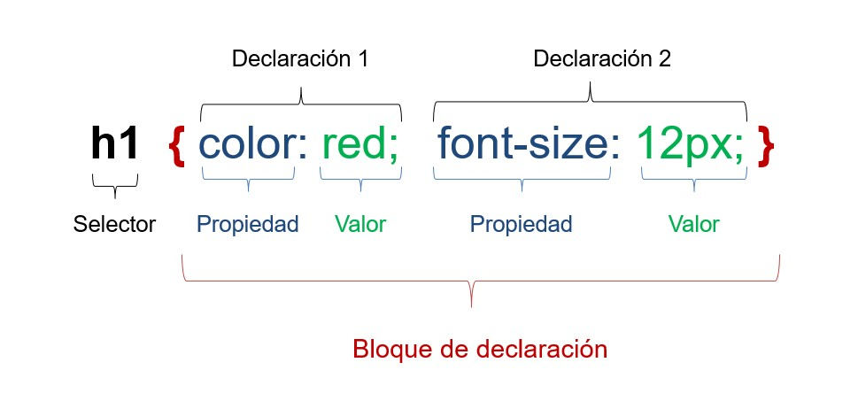
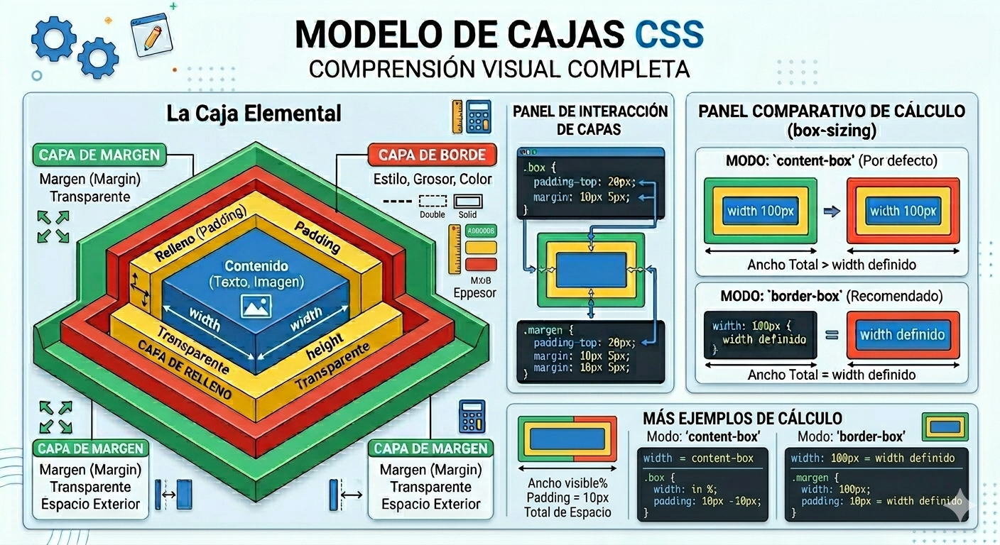
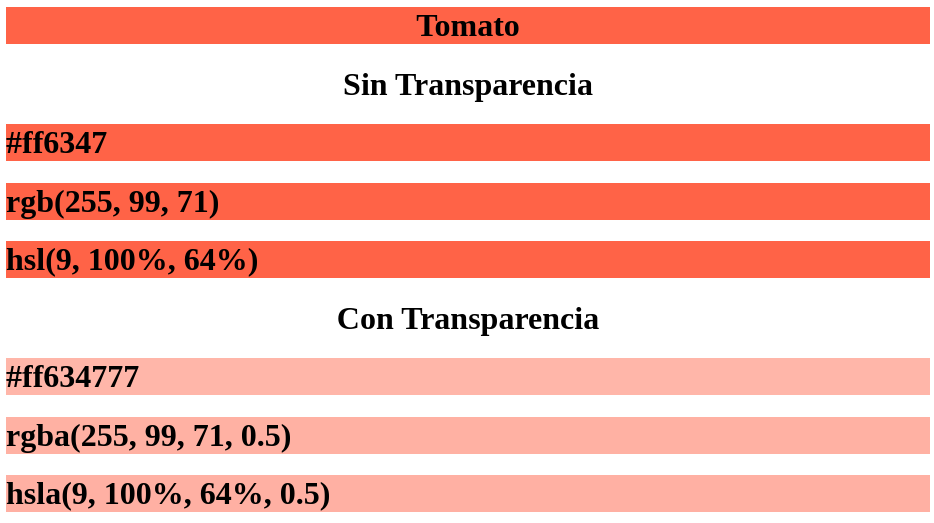
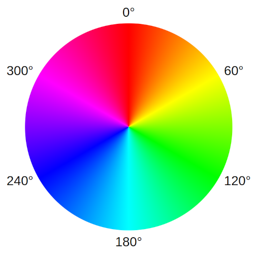
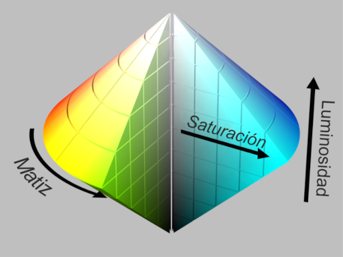
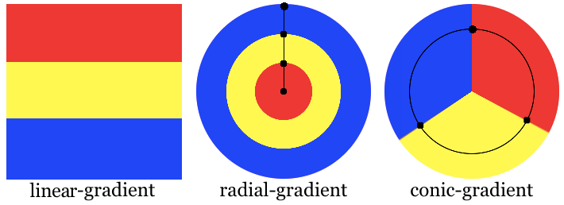
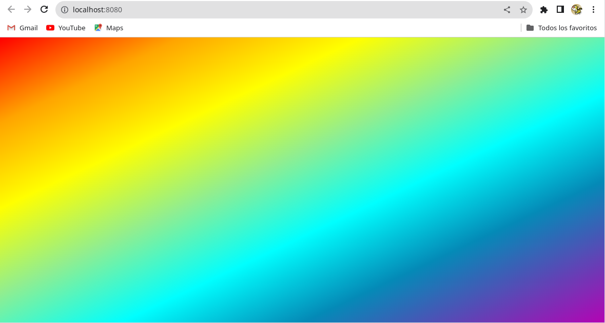
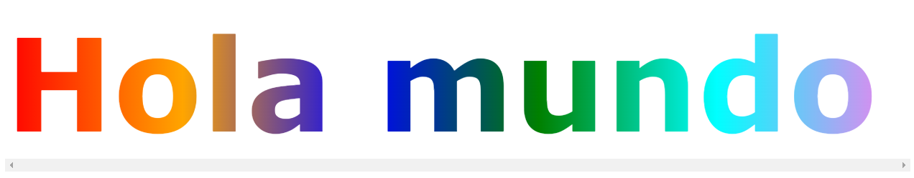
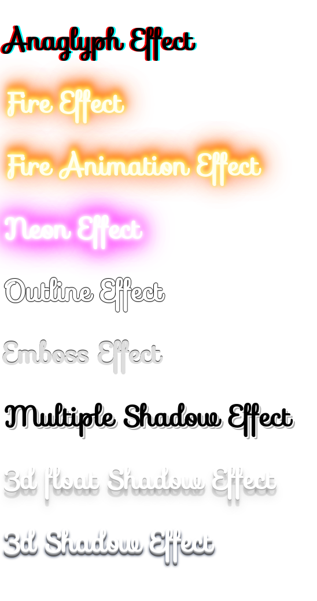

# UT3 CSS <!-- omit in toc -->
---

- [1. Introducción](#1-introducción)
- [2. Hojas de estilo CSS](#2-hojas-de-estilo-css)
- [3. Sintaxis básica](#3-sintaxis-básica)
  - [3.1. Selectores](#31-selectores)
  - [3.2 Propiedades de los elementos](#32-propiedades-de-los-elementos)
    - [3.2.1 Propiedades de texto](#321-propiedades-de-texto)
    - [3.2.2. Propiedades de color y fondo](#322-propiedades-de-color-y-fondo)
    - [3.2.3. Propiedades de las Listas](#323-propiedades-de-las-listas)
    - [3.2.4. Propiedades de las tablas](#324-propiedades-de-las-tablas)
    - [3.2.5. Propiedad float](#325-propiedad-float)
    - [3.2.6. Propiedad position](#326-propiedad-position)
- [4. Modelo de cajas](#4-modelo-de-cajas)
  - [4.1. Flex](#41-flex)
- [5. Unidades de longitud](#5-unidades-de-longitud)
  - [5.1. Unidades de longitud absoluta](#51-unidades-de-longitud-absoluta)
  - [5.2. Unidades de longitud relativa](#52-unidades-de-longitud-relativa)
- [6. Colores](#6-colores)
  - [6.1. Identificación](#61-identificación)
  - [6.2. Valores RGB](#62-valores-rgb)
  - [6.3. Valores RGBA](#63-valores-rgba)
  - [6.4. Valores HSL](#64-valores-hsl)
  - [6.5. Valores HSLA](#65-valores-hsla)
  - [6.6. Valores OKLCH](#66-valores-oklch)
  - [6.7. Gradientes de color](#67-gradientes-de-color)
  - [6.8. Uso](#68-uso)
- [7. Fuentes](#7-fuentes)
  - [7.1. Fuentes según su diseño](#71-fuentes-según-su-diseño)
  - [7.2. Fuentes según el formato de archivo](#72-fuentes-según-el-formato-de-archivo)
  - [7.3. Fuentes de iconos](#73-fuentes-de-iconos)
  - [7.4. Efectos](#74-efectos)
- [8. Listas](#8-listas)
- [9. Tablas](#9-tablas)
- [10. Variables en CSS](#10-variables-en-css)


# 1. Introducción

Hasta ahora hemos visto nuestros documentos HTML de la forma predeterminada que nos ofrecen los navegadores, cada uno con algunas diferencias respecto a los otros.

Con CSS vamos a darle formato aplicando estilos a las etiquetas, donde podremos asignar fondos, colores, tipos de letra, etc...


[W3Schools](https://www.w3schools.com/css/default.asp)

# 2. Hojas de estilo CSS

CSS es un lenguaje creado por la W3C que añade diferentes estilos a los documentos HTML dando formato mediante su uso. Se crearon con la intención de separar el contenido del formato del documento, y esto permite estructurar mejor los documentos.

Podemos aplicar estilo a una parte de la página HTML o a todos los elementos de la misma, y se permiten distintos formatos para las mismas etiquetas. Por tanto, el código HTML no tiene que ser modificado para que la apariencia de los elementos del mismo
cambie.

Para aplicar estos estilos los podemos hacer de tres formas, la recomendada es la externa.

Los estilos hay que crearlos en un fichero de texto con extención `.css`


> **Estilos internos**

Mediante la etiqueta `<style>` y se introduce en el `<head>`.

Ejemplo:

```html
<!DOCTYPE html>
<html lang="es">
<head>
    <meta charset="UTF-8">
    <title>Ejemplo de CSS en el Head</title>

    <style>
        body {
            font-family: Arial, sans-serif;
            background-color: #f4f4f9;
            display: flex;
            flex-direction: column;
            align-items: center;
            padding: 50px;
        }

        h1 {
            color: #333;
            border-bottom: 2px solid #3498db;
        }

        .boton-personalizado {
            background-color: #3498db;
            color: white;
            padding: 10px 20px;
            border: none;
            border-radius: 5px;
            cursor: pointer;
            transition: background 0.3s ease;
        }

        .boton-personalizado:hover {
            background-color: #2980b9;
        }
    </style>
</head>
<body>

    <h1>Título Estilizado</h1>
    <p>Este párrafo recibe estilos desde el head.</p>
    
    <button class="boton-personalizado">
        Mi Botón con CSS
    </button>

</body>
</html>

```

> **Estilos externos ( Recomendados)**

Si creamos aparte nuestra hoja de estilo llamada "misestilos.css", en nuestro documento HTML lo primero será indicar dónde esta la misma para poder hacer uso de los estilos definidos en la misma, para ello usamos dentro de la cabecera (head) la siguiente etiqueta con los siguientes atributos:

```html
<link rel="stylesheet" type="text/css" href="misestilos.css"/>
```

Dentro del fichero `.css` podemos tener los distintos estilos, siendo lo correcto empezar indicando los estilos también de elementos más generales a los más particulares.

```css
body {
    background-color:blue;
}
h1 {
    font-family: verdana;
    color: white;
}
li {
    text-decoration:underline;
}
```

> **Estilos en línea**

Utilizando el atributo `<style>` en el elemento que deseamos darle formato.

```html
<h1 style="color: darkblue; text-align: center; font-family: sans-serif;">
    Título con CSS en línea
</h1>

<p style="background-color: yellow; padding: 10px; border: 1px solid black; border-radius: 8px;">
    Este párrafo tiene un fondo amarillo, bordes redondeados y espacio interno (padding) definido directamente en la etiqueta.
</p>

```

> **Comentarios**

Dentro de la etiqueta style, los comentarios comienza con `/*` y terminan con `*/`. Observa el siguiente ejemplo:

```css
li {
    text-decoration:underline; /* Decoración del texto: subrayado */
}
```
> **Agrupamientos**

Cuando tenemos varios elementos a los cuales aplica el mismo formato, en lugar de definir la regla para uno de ellos, se separan por comas, por ejemplo:

```css
h1, h2, h3 {
    color: red;
}
```

# 3. Sintaxis básica

Las declaraciones de estilos CSS se hace a través de **reglas**. Está compuesto por dos partes diferenciadas:

+ El **selector**, o una lista de ellos.
+ Una **declaración**.


Dentro de la **declaración** podemos tener una o varias parejas de:

+ Propiedad
+ Valor/es asociado/s a la misma.
  
En la siguiente imagen se muestra el ejemplo de una regla CSS con las partes comentadas:




## 3.1. Selectores

Los selectoroes son la forma en que se apunta a los elelmentos HTML a los cuales queremos dar formato.

> **De tipo**

Se aplica a todos los elementos del mismo tipo por ejemplo `<p>`,`<h1>`, etc...

El siguiente ejemplo asigna al cuerpo de documento el fondo de color azul y a todos los h1 de color amarillo.

```css
body {
    background-color: blue;
}

h1 {
    color: yellow;
}
```
> **Selector universal**

Utiliza el carácter de asterisco "*" y se aplica la regla a todos los elementos de la página:

```css
* { regla }
```

Suele usarse para limpiar el formato de todo el dcocumento.

> **Selector de clase**

Aplica los estilos a los elementos que pertenecen a la misma clase.

Delcaración CSS

```css
.nombre_clase{
    color:red;
}

```

Declaración en HTML, este ejemplo hace que el contenido `<h1>` se muestre el color rojo.

```html

<h1 class="nombre_clase">
```

> **Selector id**

Similar a la clase pero con la peculiaridad de que solo puede haber dentro del HTML una única etiqueta con dicho ID

Declaración CSS.


```css
#nombre_id{
    color:red;
}
```

Declaración en HTML.

```html

<h1 class="nombre_id">
```

> **Selector de atributo**

Seleccionan elementos HTML que tienen un atributo específico, se puede utilizar atributos como `herf` y `src`.

Se escriben entre cochetes.

Delcaración CSS

```css
a[href^="https"] {
  color: blue;
}
```
Con esto hacemos que elenlace se vea en color azul.

> **Selectores de descendencia**

Seleccionan elementos que son descendientes de otro.

```css
div p {
  font-style: italic;
}
```

El parrafo que se encuentre dentro de un `<div>`, el tipo de letra será italica.

```html
<div>
  <p>Este es un párrafo dentro de un div.</p>
</div>
```


> **Selectores de hijo directo**

Seleccionan elementos con hijos directo de otro elemento específico,se
escriben separados por `>`.

```css
ul > li {
  list-style: square;
}
```
Aplicamos que el estilo de la lista no ordenada sea un cuadrado.

```html
<ul>
  <li>Elemento 1</li>
  <li>Elemento 2</li>
  <li>Elemento 3</li>
</ul>
```

> **Selectores adyacentes**

Selecciona el siguiente elemento adyacente a uno específico, se escriben separando los selectores por `+`.

```css
h1 + p {
  margin-top: 0;
}
```
Aplicamos el margen superior a 0 en ambos elelmentos.

```html
<h1>Título de sección</h1>
<p>Este es el primer párrafo de la sección.</p>
```

> **Selectores de hermanos**

Seleccionan los hermanos de los elementos hermanos del mismo nivel, se describen con el selector `~`.

```css
div ~ p {
    color: red;
}
```

Todos los párrafos serán rojos. La etiqueta `<span>`, no se pondrá en rojo.

```html
<div>Primer div</div>

<p>Párrafo 1</p>

<p>Párrafo 2</p>

<span>Texto span</span>

<p>Párrafo 3</p>
```

> **Selectores de pseudoclase**

Permiten dar formato a elementos en un estado especial o situación concreta, se describen utilizando `:`.

```css
a:hover {
  color: red;
  text-decoration: underline;
}
```
Al pasar el ratón por encima del enlace se pondrá rojo y se subrayará.

```html
<a href="#">Enlace de ejemplo</a>
```


**Pseudoclases más importantes.**

| Pseudoclase    | Función                |
| :--------------: | :----------------------: |
| `:hover`       | Ratón encima           |
| `:active`      | Elemento pulsado       |
| `:focus`       | Campo seleccionado     |
| `:visited`     | Enlace visitado        |
| `:link`        | Enlace no visitado     |
| `:first-child` | Primer hijo            |
| `:last-child`  | Último hijo            |
| `:nth-child()` | Hijo específico        |
| `:checked`     | Checkbox/radio marcado |
| `:disabled`    | Elemento deshabilitado |
| `:enabled`     | Elemento habilitado    |
| `:not()`       | Negación               |
| `:empty`       | Elemento vacío         |

## 3.2 Propiedades de los elementos

### 3.2.1 Propiedades de texto

A continuación vemos las propiedades mas usadas cuando queremos dar formato a los textos.

| Propiedad         | Descripción                       | Valores más usados                              |
| ----------------- | --------------------------------- | ----------------------------------------------- |
| `color`           | Color del texto                   | `red`, `blue`, `#ff0000`, `rgb()`               |
| `font-size`       | Tamaño del texto                  | `12px`, `2em`, `120%`                           |
| `font-family`     | Tipo de letra                     | `Arial`, `Verdana`, `serif`                     |
| `font-weight`     | Grosor del texto                  | `normal`, `bold`, `100-900`                     |
| `font-style`      | Estilo del texto                  | `normal`, `italic`, `oblique`                   |
| `text-align`      | Alineación horizontal             | `left`, `center`, `right`, `justify`            |
| `text-decoration` | Decoración del texto              | `underline`, `overline`, `line-through`, `none` |
| `text-transform`  | Transformar mayúsculas/minúsculas | `uppercase`, `lowercase`, `capitalize`          |
| `letter-spacing`  | Espacio entre letras              | `2px`, `5px`                                    |
| `word-spacing`    | Espacio entre palabras            | `5px`, `10px`                                   |
| `line-height`     | Espacio entre líneas              | `1.5`, `20px`                                   |
| `text-shadow`     | Sombra del texto                  | `2px 2px 5px gray`                              |
| `text-indent`     | Sangría primera línea             | `20px`, `5em`                                   |
| `white-space`     | Gestión de espacios               | `normal`, `nowrap`, `pre`                       |
| `direction`       | Dirección del texto               | `ltr`, `rtl`                                    |
| `vertical-align`  | Alineación vertical               | `top`, `middle`, `bottom`                       |

### 3.2.2. Propiedades de color y fondo

A continuación vemos las propiedades mas usadas cuando queremos dar formato de color y fondo de los documentos.

| Propiedad               | Descripción              | Valores más usados                |
| ----------------------- | ------------------------ | --------------------------------- |
| `color`                 | Color del texto          | `red`, `blue`, `#ff0000`, `rgb()` |
| `background-color`      | Color de fondo           | `yellow`, `black`, `rgba()`       |
| `background-image`      | Imagen de fondo          | `url(imagen.jpg)`                 |
| `background-repeat`     | Repetición del fondo     | `repeat`, `no-repeat`             |
| `background-position`   | Posición del fondo       | `center`, `top`, `left`           |
| `background-size`       | Tamaño del fondo         | `cover`, `contain`                |
| `background-attachment` | Fondo fijo o desplazable | `fixed`, `scroll`                 |
| `opacity`               | Transparencia            | `0` a `1`                         |
| `background`            | Propiedad abreviada      | combinación propiedades           |
| `linear-gradient()`     | Fondo degradado lineal   | colores                           |
| `radial-gradient()`     | Fondo degradado radial   | colores                           |

Los colores son explicados en el apartado 6 de esta unidad [Colores](#6-colores)

### 3.2.3. Propiedades de las Listas

A continuación vemos las propiedades mas usadas cuando queremos dar formato a las listas.

|Propiedad|Descripción|Valores más usados|
|:------|:-------|:------|
|`list-style-type`|Define el diseño del marcador (viñeta o número)|disc, circle, square, decimal, lower-roman, none.|
|`list-style-image`|Permite usar una imagen personalizada como marcador|url('ruta/imagen.png'), none|
|`list-style-position`|Define si el marcador está dentro o fuera del flujo del texto.|inside, outside.|
|`list-style`|Propiedad "shorthand" para definir las tres anteriores en una línea.|Ejemplo: square inside url('img.png')|

La propiedad más usada es

- `list-style-type`


Ejemplos:

```css
ul {
  list-style-type: none;
  list-style-type: circle;
  list-style-type: square;
}

ol {
  list-style-type: none;
  list-style-type: upper-roman;
  list-style-type: lower-alpha;
}
```
### 3.2.4. Propiedades de las tablas

A continuación vemos las propiedades mas usadas cuando queremos dar formato a las tablas.

|Propiedad|Descripción|Valores más usados|
| ------|-------|------|
|`border-collapse`|Determina si los bordes de las celdas se fusionan en uno solo o se mantienen separados.|collapse (unido), separate (separado).|
|`border-spacing`|Define la distancia entre los bordes de las celdas (solo si border-collapse es separate).|En píxeles: 5px, 10px 20px.|
|`caption-side`|Coloca el título de la tabla (`<caption>`) arriba o abajo.|top, bottom.|
|`empty-cells`|Indica si se deben mostrar los bordes y el fondo en celdas que no tienen contenido.|show, hide.|
|`table-layout`|Controla el algoritmo que usa el navegador para calcular el ancho de las celdas.|auto (basado en contenido), fixed (ancho fijo).|

Los principales elementos a los cuales dar estilo son:

- **`table`**: Tabla
- **`tr`**: Fila
- **`th`**: Celda de cabecera
- **`td`**: Celda de datos

Es habitual usar la pseudoclase `:nth-child()` para colorear las filas. Por ejemplo:

```css
table, td, th {
  border: 1px solid black;
}

table {
  border-collapse: collapse;
  width: 100%;
}

th {
  height: 70px;
}

td {
  text-align: center;     /* Alineación horizontal */
  vertical-align: middle; /* Alineación vertical */
}

tr:nth-child(even) {      /* Filas pares */
  background-color: #f2f2f2;
}
```

Si la tabla es ancha y se va a visualizar en dispositivos móviles, debemos asegurarnos de insertarla dentro de un `div` con la propiedad `overflow-x: auto;` para mostrar un scroll horizontal que permita al usuario desplazarse a derecha e izquierda de la tabla. 

```html
<div style="overflow-x: auto;">
  <table>
  ...
  </table>
</div>
```
### 3.2.5. Propiedad float

Es utilizado para maquetar elementos de [bloque](../Ut2/README.md#431-elementos-de-bloque-block).

Los elmentos de bloque mas utilizado son `<header>`, `<footer>`, `<aside>`, `<nav>`, `<article>`, `<section>` y `<div>`.

|Valor |Descripción|
|------| ----------|
|`left`| empuja el elemento a lado izquierdo de su contenedor|
|`right`|empuja el elemento a lado derecho de su contenedor|
|`none`|valor por defecto, no flota|
|`inherit`|hereda el valor de la propiedad **float** del padre|

[Ejemplo con 3 contenedores ](float.zip), descarga y prueba a cambiar los valores para ver el resultado. (Para descargar pulsa con el boton derecho sobre el enlace, en el menú elige "**Guardar enlace como ...**")


### 3.2.6. Propiedad position

Determina como se posiciona un elemento en el documento.

|Valor |Descripción|
|------| ----------|
|`static`| Por defecto se posiciona siguiendo el flujo normal del documento, no le afecta top,botton, left, right y z-index|
|`relative`|Se posiciona siguiendo el flujo normal del documento pero se puede desplazar su posicion usando top,botton, left, right y z-index|
|`absolute`| El elemento deja de seguir el flujo del documento, mediante top,botton, left, right se posiciona de manera relativa a su ancestro, y si no posee a la pagina completa |
|`fixed`|El elemento deja de seguir el flujo del documento, mediante top,botton, left, right se posiciona de manera relativa a la pagina completa|
|`sticky`|Se posiciona siguiendo el flujo normal del documento mediante  top,botton, left, right  se fijan las posiciones límites relativas a su conteneor de manera que no exceda de estas|


[Ejemplo de uso de position ](position.zip), descarga y prueba a cambiar los valores para ver el resultado. (Para descargar puls con el boton derecho sobre el enlace, en el menú elige "**Guardar enlace como ...**")

# 4. Modelo de cajas




El Modelo de Cajas (o Box Model) es fundamental en CSS. Básicamente, dicta que cada elemento HTML es visto por el navegador como una caja rectangular.

Comprender cómo interactúan sus partes es la clave para que tus diseños no se "rompan" o se vean desalineados.

> **Componentes del Modelo de Cajas**

Cada caja se compone de cuatro capas, de adentro hacia afuera:
+ **Content (Contenido)**: Donde aparece el texto, imágenes o videos. Su tamaño se controla con width y height.
+ **Padding (Relleno)**: El espacio transparente entre el contenido y el borde. Se usa para que el texto no "choque" con las paredes de la caja.
+ **Border (Borde)**: Una línea que rodea el padding y el contenido. Tiene grosor, estilo y color.
+ **Margin (Margen)**: El espacio exterior a la caja. Se usa para separar un elemento de sus vecinos. Es transparente y no tiene fondo.

> **Propiedades y Valores**

|Capa|Propiedad CSS|Ejemplo de Valor|
|-------|------|------|
|Contenido|width, height|300px, 50%|
|Relleno|padding, padding-top,padding-bottom,padding-left,padding-right|20px, 10px 5px|
|Borde|border,border-raius,border-style,border-width,border-color|2px solid black|
|Margen|margin, margin-top,magin-botton,margin-left,margin-right|15px, auto|

[Ejemplo de uso de cajas.](cajas.zip)

## 4.1. Flex

Flexbox **(display:flex)** es un sistema de CSS que permite organizar elementos:

+ horizontalmente
+ verticalmente
+ alineados
+ distribuidos automáticamente

Es uno de los sistemas más usados actualmente para maquetación web.

Principales propiedades de Flexbox:

| Propiedad         | Descripción                     | Valores posibles                                                                               |
| ----------------- | ------------------------------- | ---------------------------------------------------------------------------------------------- |
| `display`         | Activa Flexbox                  | `flex`, `inline-flex`                                                                          |
| `flex-direction`  | Dirección de los elementos      | `row`, `row-reverse`, `column`, `column-reverse`                                               |
| `justify-content` | Alineación en el eje principal  | `flex-start`, `center`, `flex-end`, `space-between`, `space-around`, `space-evenly`            |
| `align-items`     | Alineación en el eje secundario | `stretch`, `flex-start`, `center`, `flex-end`, `baseline`                                      |
| `flex-wrap`       | Permite salto de línea          | `nowrap`, `wrap`, `wrap-reverse`                                                               |
| `align-content`   | Alineación de múltiples líneas  | `stretch`, `flex-start`, `center`, `flex-end`, `space-between`, `space-around`, `space-evenly` |
| `gap`             | Espacio entre elementos         | `10px`, `1rem`, etc.                                                                           |
| `row-gap`         | Espacio entre filas             | valores en `px`, `em`, `rem`                                                                   |
| `column-gap`      | Espacio entre columnas          | valores en `px`, `em`, `rem`                                                                   |
| `flex-grow`       | Hace crecer elementos           | números (`0`, `1`, `2`...)                                                                     |
| `flex-shrink`     | Permite reducir tamaño          | números (`0`, `1`, `2`...)                                                                     |
| `flex-basis`      | Tamaño inicial                  | `auto`, `100px`, `30%`                                                                         |
| `flex`            | Propiedad abreviada             | `flex: 1`, `flex: 1 1 auto`                                                                    |
| `align-self`      | Alineación individual           | `auto`, `stretch`, `center`, `flex-start`, `flex-end`, `baseline`                              |
| `order`           | Cambia orden visual             | números enteros                                                                                |

[Ejemplo de uso de flex ](flex.zip)


# 5. Unidades de longitud
Las unidades de longitud en CSS definen medidas de distancia y se dividen en dos grandes grupos: 
+ **absolutas** (fijas, ideales para impresión)
+ **relativas** (escalables, ideales para el diseño web responsivo)

## 5.1. Unidades de longitud absoluta

Son medidas fijas que mantienen su tamaño real independientemente del dispositivo, por lo que no suelen adaptarse a diferentes pantallas. 


+ **px (píxeles)**: La unidad absoluta más común. Equivale a un punto en la pantalla.
+ **cm / mm**: Centímetros y milímetros (físicos).
+ **in (pulgadas)**: Equivale a 2.54 cm.
+ **pt (puntos)**: Tradicional medida de tipografía. 
+ **pc (picas)**: 


## 5.2. Unidades de longitud relativa

Dependen de otro valor de referencia (el tamaño de la fuente, el elemento padre o la pantalla), lo que las hace perfectas para diseños adaptables.

> **Relativas a la tipografía**

+ **rem**: Relativo al tamaño de fuente del elemento raíz (`<html>`). Es la unidad más recomendada por MDN Web Docs para escalabilidad y accesibilidad.
+ **em**: Relativo al tamaño de fuente del elemento contenedor directo.
+ **ch / ex**: Medidas basadas en el ancho del carácter "0" o la altura de la letra "x" de la tipografía actual

> **Relativas a la ventana gráfica**

+ **vw**: Porcentaje del ancho total de la pantalla o ventana.
+ **vh**: Porcentaje de la altura total de la pantalla o ventana.
+ **vmin / vmax**: Toma el valor más pequeño o más grande entre el ancho y la altura, respectivamente. 
# 6. Colores

## 6.1. Identificación

- Por **nombre**:  tomato
- Por **valor hexadecimal**: #ff6347
- Por **valores RGB**: rgb(255, 99, 71)
- Por **valores HSL**: hsl(9, 100%, 64%)


**Ejemplo**
```html
<!DOCTYPE html>
<html>
<body>

<h1 style="background-color: Tomato; text-align: center;">Tomato</h1>

<h1 style="text-align: center;">Sin Transparencia</h1>

<h1 style="background-color:#ff6347;">#ff6347</h1>
<h1 style="background-color:rgb(255, 99, 71);">rgb(255, 99, 71)</h1>
<h1 style="background-color:hsl(9, 100%, 64%);">hsl(9, 100%, 64%)</h1>

<h1 style="text-align: center;">Con Transparencia</h1>

<h1 style="background-color:#ff634777;">#ff634777</h1>
<h1 style="background-color:rgba(255, 99, 71, 0.5);">rgba(255, 99, 71, 0.5)</h1>
<h1 style="background-color:hsla(9, 100%, 64%, 0.5);">hsla(9, 100%, 64%, 0.5)</h1>

</body>
</html>
```



> [!TIP] 
>
> Existe el color `transparent`, que puede ser usado tanto para primer como segundo plano.
>
> ```css
> color: transparent;
> background-color: transparent;
>```


## 6.2. Valores RGB

En CSS, un color se puede especificar como un valor RGB mediante esta fórmula:

**rgb ( rojo, verde , azul )**


- Cada parámetro (rojo, verde y azul) define la **intensidad del color entre 0 y 255**.
- Por ejemplo, rgb(255, 0, 0) se muestra en rojo, porque el rojo está configurado en su valor más alto (255) y los demás están configurados en 0.
- Para mostrar negro, establezca todos los parámetros de color en 0, así: rgb(0, 0, 0).
- Para mostrar blanco, establezca todos los parámetros de color en 255, así: rgb(255, 255, 255)
- Para mostrar alguna nivel de gris, establezca todos los parámetros de color con igual valor, así: rgb(200, 200, 200)


## 6.3. Valores RGBA

Los valores de color RGBA son una extensión de los valores de color RGB con un **canal alfa**, que especifica la **opacidad de un color**.

Un valor de color RGBA se especifica con:

**rgba ( rojo, verde , azul, alfa )**

El parámetro alfa es un número entre:
-  **0,0**: completamente **transparente**
-  **1,0**: completamente **opaco**


> [!NOTE] 
> 
> La [`función rgb()`](https://lenguajecss.com/css/colores/funcion-rgb/) también admite una forma más moderna, en la cual separamos los valores por espacios y podemos indicar la opacidad después del separador de /, siendo 0 o 0% totalmente transparente y 1 o 100% totalmente opaco. Ejemplo:
> 
> ```css
> background-color: rgb(100% 50% 25% / 50%);
> background-color: rgb(255 127 63 / 0.5);  
>```

## 6.4. Valores HSL

En CSS, un color se puede especificar usando tono, saturación y luminosidad (HSL) en la forma:

**hsl ( tono , saturación , luminosidad )**

- El tono es un grado en la **rueda de colores de 0 a 360 grados**. 0 es rojo, 120 es verde y 240 es azul.
- **La saturación es un valor porcentual**. 0% significa un tono de gris y 100% es el color completo.
- **La luminosidad es un valor porcentual**. 0% es negro, 50% no es ni claro ni oscuro, 100% es blanco


**Tono** o Hue



- Referencia: https://developer.mozilla.org/en-US/docs/Web/CSS/hue

**Saturación** y **Luminosidad**




## 6.5. Valores HSLA

Los valores de color HSLA son una extensión de los valores de color HSL con un **canal alfa**, que especifica la **opacidad de un color**.

Un valor de color HSLA se especifica con:

**hsla ( tono, saturación , luminosidad, alfa )**

El parámetro alfa es un número entre:
-  **0,0**: completamente **transparente**
-  **1,0**: completamente **opaco**

> [!NOTE] 
> 
> La [`función hsl()`](https://lenguajecss.com/css/colores/funcion-hsl/) también admite una forma más moderna, en la cual separamos los valores por espacios y podemos indicar la opacidad después del separador de /, siendo 0 o 0% totalmente transparente y 1 o 100% totalmente opaco. Ejemplo:
> 
> ```css
> background-color: hsl(180deg 50% 25% / 75%);
> background-color: hsl(180 50% 25% / 0.75); 
>```

## 6.6. Valores OKLCH

Las pantallas modernas no pueden mostrar todos los colores visibles para el ojo humano. El subconjunto de colores estándar actual se denomina **sRGB** y solo puede reproducir el **35% de estos colores visibles para el ojo humano**.

**Las nuevas pantallas solucionan este problema, ya que añaden un 30% más de colores nuevos**; este conjunto de colores se denomina **P3** (también conocido como gama amplia). En cuanto a su adopción, todos los dispositivos Apple modernos, y muchas pantallas OLED, son compatibles con el color P3. Por lo tanto, esto no es algo del futuro lejano; es algo que ya está sucediendo.

Afortunadamente, OKLCH tiene una buena legibilidad, admite P3 y superiores, así como cualquier color visible para el ojo humano.

`**oklch()**` es una nueva forma de definir colores CSS. En oklch(L C H) u oklch(L C H / a), cada elemento corresponde a lo siguiente:

- `L` es la **luminosidad percibida** (0-1). "Percibido" significa que tiene una luminosidad constante para nuestros ojos, a diferencia de L en hsl().
- `C` es el **croma**, desde el gris hasta el color más saturado.
- `H` es el ángulo de **tono** (0-360).
- `a` es la **opacidad** (0-1 o 0-100%).

**Ejemplo:**

```css
a:hover {
  background:   oklch(0.45 0.26 264); /* blue */
  color:        oklch(1 0 0);     /* white */
  color:        oklch(0 0 0 / 50%); /* black with 50% opacity */
}
``` 

**Beneficios de OKLCH**

1. OKLCH libera a los diseñadores de la necesidad de elegir manualmente cada color. Pueden definir una fórmula, elegir algunos colores y se genera automáticamente una paleta completa del sistema de diseño.
2. OKLCH se puede utilizar para colores P3 de amplia gama. Por ejemplo, los dispositivos nuevos (como los de Apple) pueden mostrar más colores que los antiguos monitores sRGB, y podemos usar OKLCH para especificar estos nuevos colores.
3. A diferencia de hsl(), OKLCH es mejor para las modificaciones de color y la generación de paletas. Utiliza la luminosidad perceptual, por lo que se evitan los resultados inesperados, como los que se producían con darken() en Sass.
4. Además, gracias a su luminosidad predecible, OKLCH ofrece una mejor ***a11y***. 
5. A diferencia de rgb() o hex (#ca0000), OKLCH es legible. Puedes saber rápida y fácilmente qué color representa un valor de OKLCH simplemente observando los números. OKLCH funciona como HSL, pero codifica la luminosidad mejor que HSL.

> [!NOTE]
> El término **a11y** es una abreviatura numérica de la palabra "accessibility" (**accesibilidad** en inglés). Se llama así porque hay 11 letras entre la "a" y la "y" en la palabra accessibility.
>


> [!TIP]
>
> **Más información:**
>
> - [OKLCH in CSS: why we moved from RGB and HSL](https://evilmartians.com/chronicles/oklch-in-css-why-quit-rgb-hsl)
> - [OKLCH Color Picker & Converter](https://oklch.com/#0.7,0.1,295,100)


## 6.7. Gradientes de color

Un gradiente de color es la transición gradual entre dos o más colores. En CSS tenemos 3 tipos de gradientes:

- **LINEAL**
- **RADIAL**
- **CÓNICO**


Para generar dichos gradientes usamos las funciones:

- `linear-gradient()`
- `radial-gradient()`
- `conic-gradient()`



En su forma más sencilla, usando sólo dos colores, tenemos los siguientes ejemplos:

```css
background: linear-gradient( red, blue );
background: radial-gradient( red, blue );
background: conic-gradient( red, blue );
```

> [!NOTE]
>
> Para usar gradientes en CSS, no se usa la propiedad `background-color`, sino la propiedad **`background-image`**.

Para ver usos más elaborados consultar los siguientes enlaces:

- [MDN: linear-gradient](https://developer.mozilla.org/en-US/docs/Web/CSS/gradient/linear-gradient)
- [MDN: radial-gradient](https://developer.mozilla.org/en-US/docs/Web/CSS/gradient/radial-gradient)
- [MDN: conic-gradient](https://developer.mozilla.org/en-US/docs/Web/CSS/gradient/conic-gradient)

## 6.8. Uso

El color está presente en numerosas propiedades. A continuación, se muestran unas cuantas:

- `color`
- `border`
- `background`
- `background-color`
- `background-image`

**Ejemplo 1:**

A continuación se muestra como crear un fondo de página con un gradiente en forma de arco iris, usando la propiedad `background-image`.



```css
body {
  height: 100vh;
  background-image: linear-gradient(to bottom right,
    red 0%,
    orange 15%,
    yellow 30%,
    lightgreen 45%,
    cyan 60%,
    rgb(4 138 183) 75%,
    rgb(180 4 180) 100%);
}
```


**Ejemplo 2:**

Un ejemplo más elaborado. En este caso aplicamos el gradiente lineal a un elemento `h1`. Para ello necesitaremos hacer uso de las siguientes propiedades adicionales:

```css
h1 {
  background-clip: text;
  color: transparent;
}
```




También hemos usado otras propiedades no relacionadas con el color como `overflow` y `text-wrap`, con la finalidad de ofrecer funcionalidades de gestión del desbordamiento y ajuste de línea. 


```html
<!DOCTYPE html>
<html lang="en">

<head>
    <meta charset="UTF-8">
    <meta name="viewport" content="width=device-width, initial-scale=1.0">
    <title>Document</title>
    <style>
        body {
            overflow: hidden;
        }

        div {
            overflow-x: scroll;
        }

        h1 {
            margin-block: 0;
            width: 1100px;
            text-wrap: nowrap;
            font-family: 'Lucida Sans', 'Lucida Sans Regular', 'Lucida Grande', 'Lucida Sans Unicode', Geneva, Verdana, sans-serif;
            font-weight: 700;
            font-size: 10rem;
            background: linear-gradient(.25turn, red, orange, blue, green, cyan, violet);
            background-clip: text;
            color: transparent;
        }
    </style>
</head>

<body>
    <div>
        <h1>Hola mundo</h1>
    </div>
</body>

</html>
```


# 7. Fuentes

Las propiedades más frecuentes para el texto son las siguientes:

- `font-family`
- `font-size`
- `font-weight`
- `word-spacing`
- `letter-spacing`
- `line-height`
- `text-shadow`

Para importar un tipo de letra o fuente, podemos usar la regla `@import`

Ejemplo:

```css
@import url('https://fonts.googleapis.com/css2?family=Fira+Code:wght@300;400;500&display=swap');

div {
    color: tomato;
    font-family: 'Fira Code', monospace;
    font-size: 1rem;  /* 16px */
    font-weight: 400;    
    word-spacing: 8px;
    letter-spacing: 1rem;
    line-height: 300px;
    text-align: center;
    text-decoration: none;
    text-shadow: 4px 4px 4px #aaa;
}
```

Los valores por defecto son:

```css
    font-size: 1rem;  /* o  font-size: 16px */
    font-weight: 400;
```

> [!NOTE]
> 
> `1rem` = 1 "root em" → es relativo al tamaño de fuente (font-size) del elemento raíz (<html>)
> `1em` → es relativo al tamaño de fuente (font-size) del elemento padre, un antecesor o en su defecto <body>


## 7.1. Fuentes según su diseño

Las tipografías más habituales son las siguientes:

- **SERIF**
- **SANS-SERIF**, **SLAB-SERIF**
- **MONOSPACE**


Referencias:

- [Artículo en wikipedia: Tipografía gráfica](https://es.wikipedia.org/wiki/Clasificaci%C3%B3n_tipogr%C3%A1fica)
- [Artículo en wikipedia: Clasificación de Francis Thibaudeau](https://es.wikipedia.org/wiki/Clasificaci%C3%B3n_de_Francis_Thibaudeau)
- [Artículo en wikipedia: Clasificación Vox-ATypI](https://es.wikipedia.org/wiki/Clasificaci%C3%B3n_Vox-ATypI)
- [Google Fonts Knowledge: Making sense of typographic classifications](https://fonts.google.com/knowledge/introducing_type/making_sense_of_typographic_classifications)
- [Google Fonts Knowledge](https://fonts.google.com/knowledge)

## 7.2. Fuentes según el formato de archivo

Las fuentes se distribuyen habitualmente en alguno de los siguientes formatos:

- **OTF** (OpenType)
- **TTF** (TrueType)
- **WOFF**, **WOFF2** (Web Open Font Format)
- **SVG**

Referencias:

- [Artículo en tutsplus](https://design.tutsplus.com/es/articles/different-font-file-types-explained-ott-ttf-woff--cms-39047)
- [Artículo en creativefabrica](https://www.creativefabrica.com/es/the-ultimate-font-guide/difference-between-font-formats/)


## 7.3. Fuentes de iconos

Existen fuentes, que en lugar de contener [glifos](https://es.wikipedia.org/wiki/Glifo#:~:text=En%20tipograf%C3%ADa%2C%20un%20glifo%20es,glifo%20es%20una%20unidad%20gr%C3%A1fica.) para caracteres de texto, están conformados por iconos.

Por ejemplo, **[Material Symbols Outlined](https://fonts.google.com/icons)**

```html
<!DOCTYPE html>
<html>

<head>
  <!-- Lista de iconos y los settings para ellos -->
  <!-- Guía: https://developers.google.com/fonts/docs/material_symbols?hl=es-419 -->
  <!-- Iconos que usaremos: favorite,home,search,settings -->
  <!-- Settings: opsz,wght,FILL,GRAD -->
  <!-- Valores que usaremos para los settings anteriores: 20,700,1,200 -->
  <link href="https://fonts.googleapis.com/css2?family=Material+Symbols+Outlined:opsz,wght,FILL,GRAD@20,700,1,200&icon_names=favorite,home,search,settings" rel="stylesheet" />
</head>

<body>
  <span class="material-symbols-outlined">search</span> <!-- Icono search -->
  <span class="material-symbols-outlined">home</span> <!-- Icono home -->
  <span class="material-symbols-outlined">settings</span> <!-- Icono settigs -->
  <span class="material-symbols-outlined">favorite</span> <!-- Icono favorite -->
</body>
</html>
```

Resultado:


Para la configuración de la apariencia del icono, consultar la [guía disponible en Google Fonts](https://developers.google.com/fonts/docs/material_icons?hl=es-419). 

## 7.4. Efectos 

[Muchas fuentes de Google Fonts soportan efectos](https://developers.google.com/fonts/docs/getting_started?hl=es-419).
Estos efectos se ven realmente bien en títulos, no en texto de párrafo.

Por ejemplo, el siguiente código HTML

```html
<!DOCTYPE html>
<html>
<head>
<link rel="stylesheet" href="https://fonts.googleapis.com/css?family=Sofia&effect=anaglyph|fire|fire-animation|neon|outline|emboss|shadow-multiple|3d-float|3d">
<style>
body {
  font-family: "Sofia", sans-serif;
  font-size: 30px;
}
</style>
</head>
<body>

<h1 class="font-effect-anaglyph">Anaglyph Effect</h1>
<h1 class="font-effect-fire">Fire Effect</h1>
<h1 class="font-effect-fire-animation">Fire Animation Effect</h1>
<h1 class="font-effect-neon">Neon Effect</h1>
<h1 class="font-effect-outline">Outline Effect</h1>
<h1 class="font-effect-emboss">Emboss Effect</h1>
<h1 class="font-effect-shadow-multiple">Multiple Shadow Effect</h1>
<h1 class="font-effect-3d-float">3d float Shadow Effect</h1>
<h1 class="font-effect-3d">3d Shadow Effect</h1>

</body>
</html>
```

Se vería así



Referencia: https://www.w3schools.com/css/css_font_google.asp


# 8. Listas

La propiedad más usada es

- `list-style-type`


Ejemplos:

```css
ul {
  list-style-type: none;
  list-style-type: circle;
  list-style-type: square;
}

ol {
  list-style-type: none;
  list-style-type: upper-roman;
  list-style-type: lower-alpha;
}
```

# 9. Tablas

Los principales elementos a los cuales dar estilo son:

- **`table`**: Tabla
- **`tr`**: Fila
- **`th`**: Celda de cabecera
- **`td`**: Celda de datos

Es habitual usar la pseudoclase `:nth-child()` para colorear las filas. Por ejemplo:

```css
table, td, th {
  border: 1px solid black;
}

table {
  border-collapse: collapse;
  width: 100%;
}

th {
  height: 70px;
}

td {
  text-align: center;     /* Alineación horizontal */
  vertical-align: middle; /* Alineación vertical */
}

tr:nth-child(even) {      /* Filas pares */
  background-color: #f2f2f2;
}
```

Si la tabla es ancha y se va a visualizar en dispositivos móviles, debemos asegurarnos de insertarla dentro de un `div` con la propiedad `overflow-x: auto` para mostrar un scroll horizontal que permita al usuario desplazarse a derecha e izquierda de la tabla. 

```html
<div style="overflow-x: auto;">
  <table>
  ...
  </table>
</div>
```


# 10. Variables en CSS


Las **CSS Custom Properties** (conocidas como variables CSS) son un mecanismo de CSS que permite dar un valor personalizado a las propiedades CSS. El objetivo principal es evitar escribir múltiples veces un mismo valor, y en su lugar, ponerle un nombre más lógico, semántico y fácil de recordar, que hará referencia al valor real. De esta forma será mucho más legible y más fácil de mantener.

> **Declaración de variable**s

Para declararlas usamos un nombre que comience con dos guiones `(--)`.

Por ejemplo:
```css
elemento {
  --main-bg-color: brown;
}
```
En esta variable estamos declarando un color de fondo marrón.

Ten en cuenta que el selector que usemos para las reglas de estilo define el ámbito (scope) en el que podremos usar la propiedad personalizada (variable). Una buena práctica común es declarar variables en la pseudo-clase `:root`, y así aplicarlas globalmente al documento HTML:

```css
:root {
  --main-bg-color: brown;
}
```
> **Uso de variables**

Para acceder al valor de una propiedad personalizada usamos el nombre de la propiedad dentro de la función `var()`, en lugar de cualquier otro valor normal:

```css
elemento {
  background-color: var(--main-bg-color);
}
```
