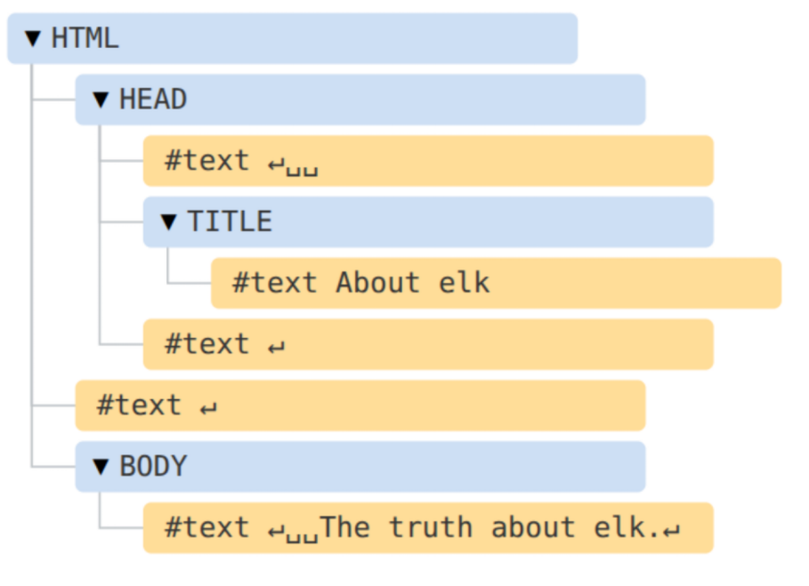

# UT4 Javascript <!-- omit in toc -->
---

- [1. Introducción.](#1-introducción)
- [2. Formas de escribir Javascript.](#2-formas-de-escribir-javascript)
  - [2.1. Script de línea.](#21-script-de-línea)
  - [2.2. Script externo.](#22-script-externo)
- [3. Entrada y salida de datos.](#3-entrada-y-salida-de-datos)
  - [3.1. Entrada de datos.](#31-entrada-de-datos)
  - [3.2. Salida de datos.](#32-salida-de-datos)
- [4 Camelcase vs Pascalcase.](#4-camelcase-vs-pascalcase)
  - [4.1 Camelcase.](#41-camelcase)
  - [4.2 Pascalcase.](#42-pascalcase)
- [5. Declaración de Variables y Constantes.](#5-declaración-de-variables-y-constantes)
  - [5.1. Variables.](#51-variables)
  - [5.2. Constantes.](#52-constantes)
- [6. Tipos de datos.](#6-tipos-de-datos)
  - [6.1. Tipos de datos Simples.](#61-tipos-de-datos-simples)
  - [6.2. Conversión entre tipos de datos.](#62-conversión-entre-tipos-de-datos)
  - [6.3. Tipos de datos compuestos.](#63-tipos-de-datos-compuestos)
    - [6.3.1. Array.](#631-array)
      - [6.3.1.1. Arrays → String.](#6311-arrays--string)
      - [6.3.1.2. String → Arrays.](#6312-string--arrays)
  - [6.3.2. Objetos.](#632-objetos)
  - [6.3.3. Set.](#633-set)
    - [6.3.3.1. Métodos de los Set.](#6331-métodos-de-los-set)
  - [6.3.4. Map.](#634-map)
    - [6.3.4.1. Métodos de los Map.](#6341-métodos-de-los-map)
- [7 Métodos funcionales para colecciones.](#7-métodos-funcionales-para-colecciones)
  - [7.1. Método map.](#71-método-map)
  - [7.2. Método filter.](#72-método-filter)
- [8. Operadores.](#8-operadores)
- [9. Sentencias de control.](#9-sentencias-de-control)
  - [9.1. Condicionales.](#91-condicionales)
    - [9.1.1. If else](#911-if-else)
    - [9.1.2. Switch](#912-switch)
    - [9.1.2. Operador Ternario](#912-operador-ternario)
  - [9.2. Bubles.](#92-bubles)
    - [9.2.1. For.](#921-for)
    - [9.2.2. While.](#922-while)
    - [9.2.3. Do While](#923-do-while)
- [10. Funciones.](#10-funciones)
  - [10.1. Definición e invocación.](#101-definición-e-invocación)
  - [10.2. Paso por referencia o paso por valor.](#102-paso-por-referencia-o-paso-por-valor)
    - [10.2.1. Paso por valor.](#1021-paso-por-valor)
    - [10.2.2. Paso por referencia.](#1022-paso-por-referencia)
  - [10.3. Funciones anónimas.](#103-funciones-anónimas)
  - [10.4. Funciones flecha.](#104-funciones-flecha)
- [11. Manejo de erroes.](#11-manejo-de-erroes)
- [12. Programación orientada a objetos (POO).](#12-programación-orientada-a-objetos-poo)
  - [12.1. Conceptos.](#121-conceptos)
  - [12.2. Crear una clase.](#122-crear-una-clase)
  - [12.3. Herencia.](#123-herencia)
  - [12.4. Sobreescribir métodos.](#124-sobreescribir-métodos)
- [13. DOM Html.](#13-dom-html)
- [14. Eventos.](#14-eventos)
  - [14.1. Mediante atributos HTML.](#141-mediante-atributos-html)
    - [14.1.1. Modificar elementos.](#1411-modificar-elementos)
    - [14.1.2. Modificar atributos de los elementos.](#1412-modificar-atributos-de-los-elementos)
    - [14.1.3. Crear e insertar elementos.](#1413-crear-e-insertar-elementos)
    - [14.1.4. Modificar estilos CSS.](#1414-modificar-estilos-css)
  - [14.2. Método addEventListener().](#142-método-addeventlistener)


# 1. Introducción.
JavaScript es un lenguaje con las siguientes características:

+ Es un lenguaje interpretado
+ Lenguaje de lado del cliente.
+ Lenguaje con tipado dinámico.
+ Multiparadigma, funcional y orientado a objetos.

JavaScript es utilizado para que el usuario interactue con el documento web, produciendo **eventos** que se asocian a código JavaScript. Por ejemplo el evento **onclick**.

Compiladores online:

https://www.programiz.com/javascript/online-compiler/ Recomendado

https://jsfiddle.net/

https://www.mycompiler.io/es/new/nodejs

# 2. Formas de escribir Javascript.

## 2.1. Script de línea.

Dentro del código Html mediante las marcas `<script>` y  `</script>`.


```html
<html>
  <head>
    <title>Título de la página</title>
    <script>
      console.log("¡Hola!");
    </script>
  </head>
  <body>
    <p>Ejemplo de texto.</p>
  </body>
</html>
```

## 2.2. Script externo.

Utilizando un fichero externo donde vamos a codificar todas nuestras funciones Javascript. Para ello debemos hacer referencia a nuestro **fichero.js** dentro del **head**. 

> [!IMPORTANT] 
> Este es el que se va a utilizar.

```html
<html>
  <head>
    <title>Título de la página</title>
    <script src="js/index.js"></script>
  </head>
  <body>
    <p>Ejemplo de texto.</p>
  </body>
</html>
```


# 3. Entrada y salida de datos.

## 3.1. Entrada de datos.

Para la entrada de datos por teclado tenemos el método **prompt**. Además de los textbox de los formularios.

```html
<!DOCTYPE html>
<html>
  <head>
    <title>Ejemplo de JavaScript</title>
    <meta charset="UTF-8">
  </head>
  <body>
    <script>
      let nombre;
      let edad;
      nombre = prompt('Ingrese su nombre:');
      edad = prompt('Ingrese su edad:');
      document.write('Hola ');
      document.write(nombre);
      document.write(' asi que tienes ');
      document.write(edad);
      document.write(' años');
    </script>
  </body>
</html>
```

## 3.2. Salida de datos.

+ **Windows.alert** muestra una ventana con la información.
+ **Document.write** escribe directamente en el documento Html.
+ **Inner.html** escribe en  un elemento Htmal, usado con **.getElementById**
+ **console.log** muestra mensajes por consola, para poder visualizarlos tenemos que entrar en las herramientas de desarrollo pulsando `F12` o `Ctrl + Shift + J`, en Windows/Linux y en Mac `Cmd + Option + J`. Una vez dentro buscamos **Console**.


# 4 Camelcase vs Pascalcase.

Son convenciones utilizadas para nombrar las variables, funciones, clases etc.., son usadas para unir palabras sin usar espacios en blanco.

> [!IMPORTANT] 
> Estas convenciones serán obligatorias su uso en este módulo, para el nombrado de variables, constantes , funciones, etc...

## 4.1 Camelcase.

Se nombra la primera palabra en minúscula y la segunda en mayuscula.

```
mivariableEjemplo
```

Se usa principalmente para nombrar elementos que epresentan datos específicos o acciones, tales como:

+ Variables locales.
+ Funciones y métodos.
+ Propiedades en objetos (en JavaScript, TypeScript o Java).

## 4.2 Pascalcase.

Se nombra la primera palabra en mayuscula y la segunda en mayuscula.

```
MivariableEjemplo
```

Se reserva para nombres de estructuras de alto nivel y tipos en la mayoría de los lenguajes de programación, como por ejemplo:

+ Clases y constructores.
+ Interfaces.
+ Tipos personalizados (Types) o Enums.
+ Componentes de frameworks web (como React).

# 5. Declaración de Variables y Constantes.

## 5.1. Variables.

A partir de ES6 se recomienda utilizar la palabra clave **let** en lugar de **var** para la declaración de variables. La razón es que **let** declara la variable en un ámbito de bloque al igual que la mayoría de los lenguajes de programación, lo cual es menos propenso a errores en el momento de la ejecución del código. Por contra, las variables declaradas con **var** siguen existiendo fuera del bloque en el cual fueron declaradas, estando únicamente limitadas en su visibilidad por la función en la que fueron declaradas.

```js
var a=1;
let b=2;
```

## 5.2. Constantes.

Desde ES6 también podemos declarar constantes. Un constante es un dato que "no puede ser modificado en tiempo de ejecución". Se declara mediante la palabra reservada **const**.

``` js
const  a = 10;
a = 20; // TypeError: Assignment to constant variable.
const b = [1, 2, 3];
b = [ 1, 4 ];  // Uncaught TypeError: Assignment to constant variable
```

# 6. Tipos de datos.
## 6.1. Tipos de datos Simples.

Los tipos de datos primitivos son:

+ Números enteros y reales.
+ Texto.
+ Booleanos.

```js
const  a = 10;
a = 20;        // TypeError: Assignment to constant variable.
const b = [1, 2, 3];
b = [ 1, 4 ];  // Uncaught TypeError: Assignment to constant variable
const pi=3.14;
// Un número muy grande (se añade n al final)
const bignumber = 12345678901234567890n;
// Un valor de verdadero o falso
let boolean = true;
```
## 6.2. Conversión entre tipos de datos.

Para convertir	 entre tipos de datos tenemos las siguientes funciones:

+ **parseInt** convierte los datos a enteros.
+ **parseFloat** convierte los datos en coma flotante.
+ **toString** para convertir a texto.

```js
let a = "12";       // es string
let b = "23.01";    // es string
let c = 50;         // es number
console.log ( c + c );  // 100
console.log ( c + a );             // 5012
console.log ( c + parseInt(a) );   // 62 
console.log ( a + b );             // 1223.01
console.log ( c + parseFloat(b) ); // 73.01 
c.toString();                      // "50", es string
```
## 6.3. Tipos de datos compuestos.
### 6.3.1. Array.

Colección de valores separados por comas y dentro de corchetes. En Javascript, a diferencia de otros lenguajes, los valores no tienen  que ser del mismo tipo.

```js
let a;
a = [ 100, 200, 23 ]; 
typeof a;              // object
a instanceof Array;    // true 
a = [ 100, "hola", true ]; 
typeof a;              // object
a instanceof Array;    // true
// Los elementos están indexados, empezando en 0
a[0]   // 100
a[1]   // "hola"
a[2]   // true
// para mostrarlos por pantalla con bucle for in
for (let i in a)  console.log (i + " ---> " + a[i]);
```

#### 6.3.1.1. Arrays → String.
Es frecuente realizar conversiones de un Array a String. Para ello se aplica el método **join** al array. Dicho método recibe una cadena de texto como separador.

La sintaxis es: `array.join(separador)`.

+ **separador** (Opcional): El carácter o cadena que se insertará entre los elementos. Si no lo incluye, el array se separará por defecto con una coma.

```js
let array = ['Tierra', 'Mar', 'Aire'];
array.join (' y ');    // "Tierra y Mar y Aire"
['Tierra', 'Mar', 'Aire'].join (' y ');    // "Tierra y Mar y Aire"
```
Si el método join no recibe ningún parámetro entonces la separación se realiza mediante comas:
```js
['Tierra', 'Mar', 'Aire'].join ();   // "Tierra,Mar,Aire"
```

#### 6.3.1.2. String → Arrays.

También es frecuente realizar conversiones de un String a Array. Para ello se aplica el método **split** al string. Dicho método recibe una cadena de texto como separador.

La sintaxis es: `cadena.split(separador)`.

+ **separador** (Opcional): El carácter o cadena que se insertará entre los elementos. Si se omite la cadena completa se guarda como un único elemento.

```js
let texto = 'Tierra y Mar y Aire';
texto.split (' y ');  // ["Tierra", "Mar", "Aire"] 
'Tierra y Mar y Aire'.split (' y ');  // ["Tierra", "Mar", "Aire"]
```
Si el método split no recibe ningún parámetro entonces se devuelve un array con un único elemento:
```js
'Tierra y Mar y Aire'.split ();       // ["Tierra y Mar y Aire"]
```
## 6.3.2. Objetos.

Colección de **clave:valor** separados por comas y dentro de llaves.

```js
let persona;
persona = { nombre:"José",  edad:30,  altura:170 };
typeof persona;              // object
// Propiedades del objeto
persona.nombre   // "José"
persona.edad     // 30
persona.altura   // 170
```
Asignación de valores a las propiedades mediante variables:
```js
let persona = { nombre: 'Jose', edad: 22 }
let miNombre = 'Juan'
let miEdad = 33

persona = { nombre: miNombre, edad: miEdad }    
// { nombre: 'Juan', edad: 33 }
let nombre = 'Eva'
let edad = 11

persona = { nombre: nombre, edad: edad }        
// { nombre: 'Eva', edad: 11 }
```
Para almacenar más de un objeto podemos crear un Array de Objetos de la siguiente forma:
```js
const usuarios = [
  { id: 1, nombre: "Ana", edad: 25 },
  { id: 2, nombre: "Luis", edad: 30 },
  { id: 3, nombre: "Sofía", edad: 22 }
];
// Los mostramos de la siguiente forma
for (let i in usuarios)  
console.log (i + " ---> " + usuarios[i].id,usuarios[i].nombre,usuarios[i].edad);
```

## 6.3.3. Set.

Los **Set** o **conjuntos**, son colecciones de elementos similares a los Array, pero con una diferencia particular: **no pueden contener elementos duplicados**. 

```js
const set = new Set();  
// Set({})               (Conjunto vacío)
const set = new Set([5, 6, 7, 8, 9]);     
// Set({5, 6, 7, 8, 9})  (Conjunto con 5 elementos)
const set = new Set([5, 5, 7, 8, 9]);     
// Set({5, 7, 8, 9})     (Conjunto con 4 elementos)
set.constructor.name;                     // "Set"

```
### 6.3.3.1. Métodos de los Set.

+ **.size** devuelve el número de elementos del set.
+ **.add(elemento)** añade un elemento al set. Devuelve el set.
+ **.has(elemento)** Comprueba si elemento ya existe en el conjunto. Devuelve si existe. Booleano
+ **.delete(elemento)** Elimina el elemento del conjunto. Devuelve si lo eliminó correctamente.


```js
const set = new Set();
set.size;    // 0
const set = new Set([5, 6, 7, 8]);
set.size;    // 4
const set = new Set([5, 6, 7, 8, 8]);
set.size;    // 4 (El 8 sólo se inserta una vez)
```
## 6.3.4. Map.

Los **Map** o **mapas**, son estructuras muy similares a los objetos de Javascript, sin embargo, son un poco más potentes y eficientes. Es una estructura que permite almacenar pares clave-valor (como los objetos), pero con ciertas diferencias:
+ Permite claves de cualquier tipo, no solo string  y symbol  como los objetos.
+ Garantiza un orden de elementos insertados, al contrario que los objetos.
+ Es una estructura de datos más eficiente para búsquedas de datos.
```js
const map = new Map();                                       
// Mapa vacío
const map = new Map([[1, "uno"]]);                           
// { 1=>"uno" }
const map = new Map([[1, "uno"], [2, "dos"], [3, "tres"]]);  
// { 1=>"uno", 2=>"dos" ... }
map.constructor.name;                     // "Map"
```
Podemos crear un Array de Maps:
```js
const usuarios = [
  { id: 1, nombre: "Ana", email: "ana@ejemplo.com" },
  { id: 2, nombre: "Luis", email: "luis@ejemplo.com" },
  { id: 3, nombre: "Sara", email: "sara@ejemplo.com" }
];
usuarios.forEach(objeto => {
  console.log(`El nombre es: ${objeto.nombre}`, `El email es: ${objeto.email}`);
});
```
### 6.3.4.1. Métodos de los Map.

+ **.size** Propiedad que devuelve el número de elementos que tiene el mapa.
+ **.set(key, value)** Establece o modifica la clave key con el valor value.
+ **.has(key)** Comprueba si key ya existe en el mapa y devuelve si existe o no.
+ **.get(key)** Obtiene el valor de la clave key del mapa.
+ **.delete(key)** Elimina el elemento con la clave key del mapa. Devuelve si lo eliminó correctamente.
+ **.clear()** Vacía el mapa completamente.

# 7 Métodos funcionales para colecciones.
## 7.1. Método map.
Crea un nuevo array con los resultados de aplicar una función a cada elemento del array original. Este método no modifica el array original.
+ Uso básico, toma un array y lo eleva al cuadrado y devuelve un nuevo array.
```js
const numeros = [1, 2, 3, 4];
const cuadrados = numeros.map(num => num ** 2);
console.log(cuadrados); // [1, 4, 9, 16]
```
+ Uso con objetos, extrae los nombres de los objetos de usuario y los coloca en un nuevo array.

```js
const usuarios = [
  { nombre: 'Luis', edad: 25 },
  { nombre: 'Ana', edad: 30 }
];
const nombres = usuarios.map(usuario => usuario.nombre);
console.log(nombres); // ['Luis', 'Ana']
```
## 7.2. Método filter.
Crea un nuevo array con todos los elementos que pasan el filtro puesto, implementado este filtro por una función. Al igual que map no modifica el array original.

+ Uso básico, filtra los números mayores que tres y devuelve un nuevo array con dichos valores.
```js
const numeros = [1, 2, 3, 4, 5];
const mayoresDeTres = numeros.filter(num => num > 3);
console.log(mayoresDeTres); // [4, 5]
``` 
+ Uso con objetos, selecciona los usuarios mayores de edad.
```js
const usuarios = [
  { nombre: 'Luis', edad: 25 },
  { nombre: 'Ana', edad: 30 },
  { nombre: 'Luis', edad: 19 }
];
const mayoresDeEdad = usuarios.filter(usuario => usuario.edad >= 18);
console.log(mayoresDeEdad); // [{ nombre: 'Luis', edad: 25 }, { nombre: 'Ana', edad: 30 }]
```
Más métodos funcionales
https://www.luisllamas.es/javascript-metodos-funcionales-en-arrays/

# 8. Operadores.

+ Operador de asignación: =
+ Operadores aritméticos: + , - , * ,** (exponencia), / , % (modulo), ++ (incremento), -- (decremento)
+ Suma de números y cadenas de caracteres: + 
```js
let x= 5 + 5;//10
let y= "5" + 5;//”55”
let z = "Hello" + 5;//”Hello5”
```
+ Operadores de asignación y aritméticos: podemos combinar los operadores aritméticos con el de asignación: +=,-=,*=,/=,%=,**= , += → x+=y --- x=x+y
+ Operadores de comparación: == , === (igual valor e igual tipo), !=,!==, >,<,>=,<=
+ Operadores lógicos: && (and), || (or), ! (not)
+ Operador spread: … utilizado para descomponer un array o una cadena de caracteres en elementos individuales.

Ejemplo de uso del operador spread:
```js
let arr1 = [1, 2, 3];
let arr2 = [...arr1, 4, 5]; 
console.log(arr2);// arr2 es [1, 2, 3, 4, 5]
```
Si el uso del operador spread
```js
let arr1 = [1, 2, 3];
let arr2 = [arr1, 4, 5]; 
console.log(arr2);// arr2 es [[1, 2, 3], 4, 5]
```

# 9. Sentencias de control.
## 9.1. Condicionales.
### 9.1.1. If else

```js
if (condition1) {
  // code to execute if condition1 is true
} else if (condition2) {
  // code to execute if the condition1 is false and condition2 is true
} else {
  // code to execute if the condition1 is false and condition2 is false
}
```

### 9.1.2. Switch
```js
switch(expression) {
  case x:
    // code block
    break;
  case y:
    // code block
    break;
  default:
    // code block
}
```
### 9.1.2. Operador Ternario

La sintaxis es `condition ? expression1 : expression2`.

Si se cumple la `condicion` se ejecuta `expresiion1` y si no `expresion2`.

```js
let text = (edad < 18) ? "Menor" : "Mayor";
```
## 9.2. Bubles.
### 9.2.1. For.

Se repite un número finito de veces.

Sintaxis:

```
for (expr1; expr2; expr) {
  // code block to be executed
}
```

```js
for (let i = 0; i < 5; i++) {
  text += "El numero es: " + i + "<br>";
}
```

Variante1:

```
for (key in objeto) {
  
}
```

```js
let a;
a = [ 100, 200, 23 ]; 
// para mostrarlos por pantalla con bucle for in
for (let i in a)  {
	console.log (i + " ---> " + a[i]);
}
```

Variante2:

```
for (variable of objeto_iterable) {
  
}
```

```js
const cars = ["BMW", "Volvo", "Mini"];
let text = "";
for (let x of cars) {
  text += x;
}
```

### 9.2.2. While.

Se repite mientras se cumpla la condición, cuando no se cumpla se saldría del bucle.
```
while (condition) {
  
}
```

```js
while (i < 10) {
  text += "The number is " + i;
  i++;
}
```
### 9.2.3. Do While
Al menos se repite una vez y se saldría cuando no se cumpla la condición. Suele usarse en los menús de los programas.
```
do {

}while (condition);
```

```js
do {
  text += "The number is " + i;
  i++;
}while (i < 10);
```
# 10. Funciones.
Una función es un conjunto de instrucciones que se agrupan bajo un nombre de función. Se ejecuta sólo cuando es llamada por su nombre en el código del programa. La llamada provoca la ejecución de las órdenes que contiene.

Las funciones son muy importantes por diversos motivos:
+ Ayudan a estructurar los programas para hacerlos su código más comprensible y más fácil de modificar.
+ Permiten repetir la ejecución de un conjunto de órdenes todas las veces que sea necesario sin necesidad de escribir de nuevo las instrucciones.
  
Una función consta de las siguientes partes básicas:
+ Un nombre de función.
+ Los parámetros pasados a la función separados por comas y entre paréntesis.
+ Las llaves de inicio y final de la función.
+ Desde Javascript ES6, se pueden definir valores por defecto para los parámetros.

## 10.1. Definición e invocación.

Sintaxis de la **definición de una función**.

```
function nombrefuncion (parámetro1, parámetro2=valorPorDefecto...){
  // instrucciones
  //si la función devuelve algún valor añadimos:
  return valor;
}
```
Sintaxis para la **llamada a una función**.

```
valorRetornado=nombrefuncion (parám1, parám2...);
```
## 10.2. Paso por referencia o paso por valor.

Cuando pasamos los argumentos a una función se pueden pasar de dos maneras:

### 10.2.1. Paso por valor.

+ Se hace una copia del valor de la variable pasada a la función.
+ La función no puede modificar el valor de la variable original.
+ Se usa con tipos de datos básicos.
  
```js
let a = 1
function f1 ( num ) {
  num++;
  console.log ( num )   
}
f (a)   // 2
consolle.log(a);       // 1  
// No se modifica el valor de la variable original
```

### 10.2.2. Paso por referencia.

+ No se hace copia del valor de la variable pasada a la función. Lo que se copia es la referencia o dirección de memoria donde se almacenan los datos.
+ La función puede modificar el valor de la variable original.
+ Se usa con arrays, objetos y funciones.

```js
const b = [ 1, 2 ]   
function f2 ( array ) {
  array[0]++
  console.log( array )
}
f2 ( b )  // [ 2, 2 ]  
console.log(b);         // [ 2, 2 ]  
// Se modifica el valor de la variable original
```
## 10.3. Funciones anónimas.
Son un tipo de funciones que no tienen nombre, así que en principio no son invocables, suelen usarse cuando solo se invocan una vez o manejadores de eventos.
```js
var myFunction = function() {
  console.log("This is an example of an anonymous function.");
};
// Invoking the anonymous function
myFunction();
```
Ejemplo manejando eventos:

```js
document.querySelector("Button").addEventListener("click", function() {
  console.log("Button clicked!");
});
```
## 10.4. Funciones flecha.
Es parecida a las funciones anónimas pero sustituyendo `function` por `=>`.
```js
(a, b) => { return a + b; }// expresada en forma de función flecha
(a, b) => a + b;  // expresada en forma de función flecha, simplificando return
```
Ejemplo de función fecha que suma dos números:

```js
let suma= (a, b) => a + b;
console.log(suma(10,20));
```
# 11. Manejo de erroes.
La manera de controlar los errores que nos pueden aparecer cuando estamos programando es utilizando las sentencias  `try … catch.`

Cuando aparece un error el script se para y si no tenemos forma de ver el punto donde se produjo el error es muy complicado encontrarlo si tenemos muchas líneas de código.

La sintaxis es la siguiente:

```
try {
	  // código...
} catch (err) {
	  // manipulación de error
}finally{
	// se ejecuta siempre
}
```
El funcionamiento es el siguiente:

1. Se ejecuta el código de try{…}.
2. Si no hubo errores, se ignora catch(err), la ejecución llega al final del try y continúa omitiendo el catch.
3. Tendremos tantos bloques catch(err) como errores queramos controlar.
4. Si se produce un error, la ejecución del try se detiene y el control comienza con el catch (err). La variable err contendrá un objeto error con detalles sobre lo que sucedió.
5. El bloque finally siempre se ejecuta, se produzca error o no.

De esta forma no se para el script y podemos ver donde se ha producido el error.

El **objeto err**, contiene información del error sucedido, posee dos propiedades que nos ayudarán del error cometido:

**name**: nombre del error.

**message**: detalles del error.

Veamos el siguiente código
```js
try {

	  alert('Inicio de ejecuciones try');  // (1) <--

	  lalala; // error, variable no está definida!

	  alert('Fin de try (nunca alcanzado)');  // (2)

} catch (err) {

	  alert(`¡Un error ha ocurrido!`); // (3) <--

}
```
Si ejecutamos el código vemos que se muestra las salidas (1) y (3).

Si queremos ver detalles del error mostramos las propiedades del objeto err.
```js
alert(err.name); // ReferenceError
alert(err.message); // lalala no está definida!
alert(err.stack); // ReferenceError: lalala no está definida en (...call stack)
  // También puede mostrar un error como un todo
  // El error se convierte en cadena como "nombre: mensaje"
alert(err); 
```
>Lanzando nuestros propios errores

Por defecto hay muchos errores ya preprogramados en JavaScript, pero nosotros podemos controlar errores que no estén controlados por JavaScript, para ello utilizamos el operador **throw**.

```js
function dividir(a, b) {
  if (b === 0) {
    throw new Error("No se puede dividir entre cero");
  }
  return a / b;
}

try {
  console.log(dividir(10, 0));
} catch (error) {
  console.error("Error capturado:", error.message);
}
```

# 12. Programación orientada a objetos (POO).
Javascript  permite una mejor definición de clases que en anteriores versiones de Javascript. Mediante la palabra reservada “class”, permite definir clases, métodos, atributos, etc… 

Recordad que los objetos en Javascript se guardan como referencias de memoria. En apartados anteriores hablamos de como clonar arrays y objetos.

https://lenguajejs.com/javascript/oop/que-es/

## 12.1. Conceptos.

+ **Clase**: Una plantilla para crear objetos, define sus propiedades y métodos.
+ **Objeto**: Una instancia concreta de una clase (ej. un Perro específico).
+ **Propiedad**: Datos que describen un objeto (ej. nombre, color).
+ **Método**: Funciones que un objeto puede realizar (ej. hablar(), caminar()).
+ **Constructor**: Un método especial que se ejecuta al crear un nuevo objeto.
+ **Herencia**: Permite que una clase herede propiedades y métodos de otra (ej. Estudiante hereda de Persona).
+ **Encapsulamiento**: Agrupar datos y métodos en una unidad (objeto) para ocultar detalles internos.
+ **Polimorfismo**: La capacidad de diferentes objetos de responder al mismo mensaje (método) de forma distinta. 

## 12.2. Crear una clase.

Para crear una clase utilizamos la palabra clave `class` :
```js
class nombre_clase{
	constructor(propiedad1, propiedad2, ...){
		this.propiedad1=valor1;
		this.propiedad2=valor2:
		….
	}
	static medotodos(objetos){
	}
}
```
Si utilizamos métodos `static`, podemos utilizarlos sin que tengamos que crear un objeto de dicha clase.

Ejemplo de una clase y su uso:
```js
class Punto {
// Constructor de la clase
	constructor(pX,pY){
		this.pX=pX;
		this.pY=pY;
	}
// Método estático para calcular distancia entre dos puntos
	static distancia ( a , b) {
		const dx = a.pX - b.pX;
		const dy = a.pY - b.pY;
		return Math.sqrt ( dx * dx + dy * dy );
	}
// Método indicado para ser usado como getter
	get coordX() {
			return this.pX;
}

// Método normal
	devuelveXporY () {
		return this.pX * this.pY;
	}
}

let p1 = new Punto(5,5);
let p2 = new Punto(10,10);
//Llamada método estático
console.log (Punto.distancia(p1, p2));
//Llamada método normal
console.log (p1.devuelveXporY());
// Al ser un getter, puede usarse como una propiedad
console.log (p1.coordX);
```
## 12.3. Herencia.
La herencia de clase es el modo para que una clase extienda a otra. De esta manera podemos añadir nueva funcionalidad a la ya existente. Utilizamos la palabra clave **extends**.

```js
class clase_hija extends clase_padre{
}
```
Ejemplo de herencia:

```js
class Animal {
  constructor(name) {
    this.speed = 0;
    this.name = name;
  }
  run(speed) {
    this.speed = speed;
    alert(`${this.name} corre a una velocidad de ${this.speed}.`);
  }
  stop() {
    this.speed = 0;
    alert(`${this.name} se queda quieto.`);
  }
}

let animal = new Animal("Mi animal");

class Rabbit extends Animal {
  hide() {
    alert(`¡${this.name} se esconde!`);
  }
}

let rabbit = new Rabbit("Conejo Blanco");

rabbit.run(5); // Conejo Blanco corre a una velocidad de 5.
rabbit.hide(); // ¡Conejo Blanco se esconde!
```
## 12.4. Sobreescribir métodos.

Los métodos que no están definidos en la clase hija se toman de la clase padre, pero nos puede interesar sobreescribir en la clase hija algún método.

Para ello debemos definir en la clase hija el método con el mismo nombre, pero este método tiene una función diferente que en el método padre.

En el ejemplo anterior si queremos sobreescribir el método stop podríamos codificar lo siguiente:

```js
class Rabbit extends Animal {
  hide() {
    alert(`¡${this.name} se esconde!`);
  }
  stop() {
    super.stop(); // llama el stop padre
    this.hide(); // y luego hide
  }
}
```
# 13. DOM Html.

Según el Modelo de Objetos del Documento (DOM), cada etiqueta HTML es un objeto. Las etiquetas anidadas son llamadas “hijas” de la etiqueta que las contiene. El texto dentro de una etiqueta también es un objeto.

Todos estos objetos son accesibles empleando JavaScript, y podemos usarlos para modificar la página.

Por ejemplo, **document.body** es el objeto que representa la etiqueta `<body>`.

Ejecutar el siguiente código hará que el `<body>` sea de color rojo durante 3 segundos:

```js
<script>
document.body.style.background = 'red';
setTimeout(() => document.body.style.background = '', 3000);
</script>
```
Un ejemplo de DOM
```html
<!DOCTYPE HTML>
<html>
<head>
  <title>About elk</title>
</head>
<body>
  The truth about elk.
</body>
</html>
```
El DOM representa el HTML como una estructura de árbol de etiquetas. A continuación podemos ver cómo se muestra:




Cada nodo del árbol es un objeto.

Las etiquetas son nodos de elementos (o simplemente “elementos”) y forman la estructura del árbol. `<html>` está ubicado en la raíz del documento, por lo tanto, `<head>` y `<body>` son sus hijos, etc.

El texto dentro de los elementos forma nodos de texto, y son etiquetados como #text. Un nodo de texto puede contener únicamente una cadena y no puede tener hijos, siempre es una hoja del árbol.

Por ejemplo, la etiqueta `<title>` tiene el texto "About elk".

Hay que tener en cuenta los caracteres especiales en nodos de texto:

+ una línea nueva: ↵ (en JavaScript se emplea \n para obtener este resultado)
+ un espacio: ␣

Los espacios y líneas nuevas son caracteres totalmente válidos, al igual que letras y dígitos. Ellos forman nodos de texto y se convierten en parte del DOM. Así, por ejemplo, en el caso de arriba la etiqueta `<head>` contiene algunos espacios antes de la etiqueta `<title>`, entonces ese texto se convierte en el nodo #text, que contiene una nueva línea y solo algunos espacios.

Para mas informaciín consultar los siguientes enlaces: 

https://es.javascript.info/dom-nodes

https://www.luisllamas.es/javascript-que-es-el-dom/

# 14. Eventos.

Los eventos son señales que indican que algo ha ocurrido permitiendo que el código reaccione a acciones del usuario como un clic en un botón o a cambios en el sistema, como la carga de una página.

Algunos eventos pueden ser:

+ Evento **click**: Se ha hecho click de ratón sobre un elemento de la página.
+ Evento **keydown**: Pulsación de una tecla específica del teclado.
+ Evento **play**: Reproducción de un archivo de audio/video
+ Evento **wheel**: Scroll con la rueda del ratón sobre un elemento de la página
+ Evento **beforeprint**: El usuario ha activado la opción «Imprimir página».
  
[En el siguiente enlace vemos los diferentes eventos](
https://developer.mozilla.org/es/docs/Web/API/Document_Object_Model/Events)

Existen varias alternativas para manejar los eventos en Javascript.

[Eventos del navegador](https://lenguajejs.com/eventos/eventos-navegador/que-son/)

[Eventos de teclado](https://lenguajejs.com/eventos/eventos-navegador/keyboard-event/)
[Eventos de puntero](https://lenguajejs.com/eventos/eventos-navegador/pointer-event/)
[Seleccionar elementos del DOM](https://www.luisllamas.es/seleccionar-elementos-del-dom-javascript/)

[Eventos DOM mas usados](https://www.luisllamas.es/javascript-eventos-dom-mas-usados/)

## 14.1. Mediante atributos HTML.

Asociar por ejemplo a un botón un evento mediante un atributo:
```html
<button onClick="alert('Hello!')">Saludar</button>
```
En el ejemplo anterior estamos añadiendo el código ejecutable dentro de la etiqueta button, en este caso al ser un trozo pequeño no pasa nada, pero si tuviéramos un código más extenso, lo mejor es crear una función con dicho código y asociar dicha función.
```js
<script>
  function doTask() {
    alert("Hello!");
  }
</script>

<button onClick="doTask()">Saludar</button>
```

Para modificar el contenido de una etiqueta tenemos que asignarle un ID que buscaremos con **getElementById**. Es utilizado porque el ID en un documento es único.

Ejemplo:

Html
```html
 
```
JavaScript
```js
<button onclick="document.getElementById('myImage').src='images/on.jpg'">Encender</button>
```

[Mas información sobre getElemntById](https://developer.mozilla.org/es/docs/Web/API/Document/getElementById)

**document.getElementById(id).propiedad=””**,  **id** es el ID que se le ha asociado al elemento Html y propiedad es la propiedad que queremos modificar. En el ejemplo anterior modificamos **.src** que es donde se indica la imagen que muestra. Si por ejemplo queremos modificar el texto utilizaremos **.innerHtml=”texto”**.

También podemos seleccionar elementos pertenecientes a una clase con **getElementsByClassName**, seleccionaremos a todos. Devuelve una colección de elementos con la clase especificada.
```js
const elementos = document.getElementsByClassName('mi-clase');
```
Otra forma de seleccionar es mediante **getElementsByTagName**, devuelve una colección de todos los elementos de dicha etiqueta.
```js
const elementos = document.getElementsByTagName('p');
```
### 14.1.1. Modificar elementos.

+ **textContent** → Cambia el texto visible de un elemento reemplazando todo el contenido.
```js
const elemento = document.getElementById('mi-elemento');
elemento.textContent = 'Nuevo contenido de texto';
```      
+ **innerHTML** → Permite modificar el contenido HTML dentro de un elemento. Esto incluye etiquetas HTML y texto. Es útil para agregar contenido dinámico, pero hay que tener cuidado con la inyección de código para evitar vulnerabilidades de seguridad.
  
```js  
const elemento = document.getElementById('mi-elemento');
elemento.innerHTML = '<strong>Texto en negrita</strong>';
```
### 14.1.2. Modificar atributos de los elementos.

+ **setAttribute** → permite cambiar el valor de un elemento HTML.
```js      
const elemento = document.getElementById('mi-elemento');
elemento.setAttribute('data-info', 'valor');
```
+ **getAtrribute** → se usa para obtener el valor de un atributo de un elemento.
```js      
const elemento = document.getElementById('mi-elemento');
const valor = elemento.getAttribute('data-info');
console.log(valor); // 'valor'
```
+ **Modificación directa: src, href y className** → modificamos directamente las propiedades del objeto.
```js
const imagen = document.getElementById('mi-imagen');
imagen.src = 'nueva-foto.jpg';
```
### 14.1.3. Crear e insertar elementos.

+ **document.createElement** → crea un elemento nuevo en DOM.
+ **AppendChild** → añade el elemento al final de la lista del nodo padre.

En el siguiente código se muestra como al cargar la página nos crea una taabla dinámicamente 10x10.
```js
document.addEventListener("DOMContentLoaded", () => {
  const filas = 10;
  const columnas = 10;
  const contenedor = document.getElementById('contenedor-tabla');
  const tabla = document.createElement('table');
  for (let i = 0; i < filas; i++) {
    const fila = document.createElement('tr');
    for (let j = 0; j < columnas; j++) {
      const celda = document.createElement('td');
      celda.id = `${i}${j}’;
      celda.textContent = `${i},${j}`; 
      fila.appendChild(celda);
    }
    tabla.appendChild(fila);
  }
 contenedor.appendChild(tabla);
});
```

[Como reemplazar y eliminar elementos](https://www.luisllamas.es/insertar-y-eliminar-elementos-del-dom-javascript/)

### 14.1.4. Modificar estilos CSS.

+ elemento.style.propiedadCSS=’valor’

```css
elemento.style.color = 'red';
elemento.style.backgroundColor = 'yellow';
elemento.style.fontSize = '18px';
elemento.style.width = '200px';
elemento.style.height = '100px';
```
[Modificar estilos CSS](https://www.luisllamas.es/javascript-modificar-estilos-css-dom/)

+ miElemento.classList.add("nueva-clase");

Para asignar una clase a un elemento. Previamente hay que haberlo capturado,

## 14.2. Método addEventListener().

El método **.addEventListener()** nos permite empezar a escuchar un evento o eventos concretos, y en el caso de que ocurra alguno, ejecutar la función asociada.

> [!IMPORTANT] 
> Todos los eventos que vamos a capturar deben hacerse con este método. No se permitirá dentro del código Html.

```html
<button>Click me</button>
<script>
const button = document.querySelector("button");
function action() {
  alert("Hello!");
};
button.addEventListener("click", action);
</script>
```
+ Buscamos el elemento que tendrá el evento, en este caso `<button>`.
+ Creamos la función `action()`, que realizará la acción deseada.
+ En el botón, escuchamos el evento `click` y le asociamos la función `action`.

El ejemplo anterior lo podemos reducir en el siguiente código.
```js
const button = document.querySelector("button");
button.addEventListener("click", function() {
  console.log("Boton clickeado!");
});
```

Ejemplo anterior con función flecha

```js
button.addEventListener("click", () => {
  console.log("Boton clickeado!");
});
button.addEventListener("mouseleave", () => {
  console.log("Raton salio del boton!");
});
button.addEventListener("click", funcion);
```
**funcion** debe estar definida con anterioridad.

> [!IMPORTANT] 
> Nos vamos a encontrar que cuando pongamos nuestro script en el `<head>`, no nos va a funcionar, ya que **addEventListener** se ejecuta antes de que el HTML se cargue, impidiendo que JS encuentre los elementos.

**Defer** indica que el script se ejecute cuando el DOM esté completamente formado.

Para solucionarlo tenemos dos formas:
+ Colocar el script al final de `<body>`.
+ Añadir defer a la etiqueta `<script>`.

```html
<script src="script.js" defer></script>
```
