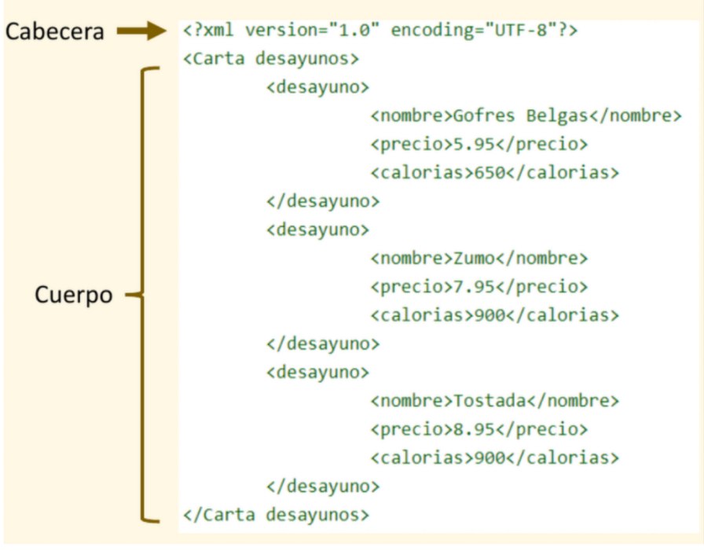

# UT6 XML <!-- omit in toc -->
---
- [1. Introducción.](#1-introducción)
- [2. Estructura de un documento XML.](#2-estructura-de-un-documento-xml)
- [3. Reglas Básicas de los XML.](#3-reglas-básicas-de-los-xml)
- [4. Atributos en XML.](#4-atributos-en-xml)
- [5. Difeencias con Json.](#5-difeencias-con-json)
- [6. Creación del tipo de documento (DTD).](#6-creación-del-tipo-de-documento-dtd)
	- [6.1. Declaraciones de tipo de elementos.](#61-declaraciones-de-tipo-de-elementos)
	- [6.2. Modelos de contenido.](#62-modelos-de-contenido)
	- [6.3. Declaraciones de lista de atributos.](#63-declaraciones-de-lista-de-atributos)
	- [6.4. Tipos de atributos.](#64-tipos-de-atributos)


# 1. Introducción.

El XML (Extensible Markup Language) es un lenguaje de marcado basado en texto utilizado para estructurar, almacenar e intercambiar datos de forma legible tanto para humanos como para máquinas. A diferencia de HTML, utiliza etiquetas personalizables (no predefinidas) para describir el contenido, siendo un estándar clave en facturación electrónica, archivos de configuración y transferencia entre sistemas. 

Características:

+ Se usa pare el almacenamiento de datos, intercambio de información, sindicación de contenidos, …
+ XML no indica cómo presentar la información, un mismo documento XML puede  presentarse de muchas formas.
+ Los documentos XML forman una estructura de tipo árbol, comenzando desde la raíz (root/raíz), con ramas hacia las hojas (leaves/hijos).
+ No necesita licencia.
+ Puede codificarse en cualquier editor de texto.

# 2. Estructura de un documento XML.

La estructura general de un documento XML está formada por dos partes:
+ **Cabecera/Prologo**: Contiene información respecto al documento (versión, codificación, descripción de estructura, etc.).
+ **Cuerpo**: Es el contenido de información del documento, organizado como un árbol único de elementos marcados.



# 3. Reglas Básicas de los XML.

Las reglas de sintaxis básicas de XML son muy simples:

+ Todos los elementos XML deben tener un elemento root que es padre de todos los demás.
+ La primera línea del documento es opcional y se llama prologo.
  
```html
<?xml version="1.0" encoding="UTF-8“ ?>
```
+ Todos los elementos han de tener su etiqueta de cierre.
+ Las etiquetas XML son sensibles a mayúsculas y minúsculas.
+ Las etiquetas han de ir correctamente anidadas.
+ Los atributos XML deben ir entre comillas.
+ La sintaxis para escribir comentarios en XML es como en
HTML.

```html
<!-- Esto es un comentario ->
```
Reglas recomendadas para los elementos:

+ Son sensibles a mayúsculas y minúsculas.
+ Deben empezar con una letra o barra baja.
+ No pueden empezar con las letras “xml”.
+ Pueden contener letras, dígitos, guiones, barras bajas y puntos.
+ No pueden contener espacios.
+ Lo ideal es mantener unos nombres sencillos, evitando caracteres como guiones y puntos.
+ Si los documentos XML tienen una base de datos asociada, lo normal es usar los nombres de la base de datos para los elementos.

# 4. Atributos en XML.
Los elementos XML pueden tener atributos, como en HTML. Están diseñados para contener datos relacionados con un elemento específico.

> Ejemplo XML, para lamacenar datos de libros de una libreria

```xml
<?xml version="1.0" encoding="UTF-8"?>
<libreria>
  <libro categoria="programacion">
    <titulo>Eloquent JavaScript</titulo>
    <autor>Marijn Haverbeke</autor>
    <anio>2018</anio>
    <precio moneda="USD">35.00</precio>
  </libro>
  <libro categoria="ficcion">
    <titulo>El Psicoanalista</titulo>
    <autor>John Katzenbach</autor>
    <anio>2002</anio>
    <precio moneda="EUR">18.50</precio>
  </libro>
</libreria>
```
# 5. Difeencias con Json.

|Característica|XML|JSON|
|--------------|----|----|
|Sintaxis| Basada en etiquetas (estilo HTML).| Basada en llaves y corchetes.|
|Peso|Más pesado (repite nombres en etiquetas).|Más ligero y rápido de leer.|
|Atributos|Permite atributos (ej: categoria="web").|No tiene atributos, solo pares clave-valor.|
|Comentarios|Soporta comentarios ``.|No soporta comentarios oficialmente.|

# 6. Creación del tipo de documento (DTD).

Crear una definición del tipo de documento (DTD) es como crear nuestro propio lenguaje de marcas, para una aplicación específica. Por ejemplo, podríamos crear un DTD que defina una tarjeta de visitas. A partir de ese DTD, tendríamos una serie de elementos XML que nos permitirían crear tarjetas de visita.

La DTD define los tipos de elementos, como se jerarquizan, sus atributos y entidades permitidas, y puede expresar algunas limitaciones para combinarlos.

Normalmente una DTD reside en un fichero externo, y quizás compartido por varios (puede que miles) de documentos XML. Otras veces la definición DTD es interna y va entre [ ] detrás de SYSTEM en el documento XML.

> Ejemplo de almacenamiento de contactos

**contacto.dtd**

```xml
<!ELEMENT etiqueta (nombre, calle, ciudad, pais, codigo)>
<!ELEMENT nombre (#PCDATA)>
<!ELEMENT calle (#PCDATA)>
<!ELEMENT ciudad (#PCDATA)>
<!ELEMENT pais (#PCDATA)>
<!ELEMENT codigo (#PCDATA)>
```
**contacto.xml**

```xml
<?xml version="1.0" encoding="UTF-8"?>
<!DOCTYPE etiqueta SYSTEM "contacto.dtd">
<etiqueta>
	<nombre>Fulano Mengánez</nombre>
	<calle>c/ Mayor, 27</calle>
	<ciudad>Valderredible</ciudad>
	<pais>España</pais>
	<codigo>39343</codigo>
</etiqueta>
```
Las declaraciones DTD son las líneas que empiezan con `"<!ELEMENT"` y se denominan declaraciones de tipo elemento. También se pueden declarar atributos, entidades y anotaciones para una DTD.

## 6.1. Declaraciones de tipo de elementos.

Los elementos son la base de las marcas XML, y deben ajustarse a un tipo de documento declarado en un DTD para que el documento XML sea considerado válido.

Las declaraciones de tipo de elemento deben empezar con **"<!ELEMENT "** seguidas por el identificador genérico del elemento que se declara. A continuación tienen una **especificación de contenido**.

```xml
<!ELEMENT receta (titulo, ingredientes, procedimiento)>
```
En este ejemplo, el elemento `<receta>` tiene que contener dentro un elemento `<titulo>`, otro  `<ingredientes>` y otro más `<procedimiento>` en ese orden, que, a su vez, estarán definidos también en la DTD más abajo y podrán contener más elementos.

Siguiendo la definición de elemento anterior, este ejemplo de documento XML sería válido:

```xml
<receta>
	<titulo>...</titulo>
	<ingredientes>...</ingredientes>
	<procedimiento>...</procedimiento>
</receta>
```

Por tanto el formato general de una declaración de un tipo de elemento es:

```xml
<!ELEMENT nombre especificacion_de_contenido >
```
La especificación de contenido puede ser de varios tipos:

+ **EMPTY**: indica que el elemento no tiene contenido, es decir no existe texto u otras formas entre las etiquetas de apertura y cierre del elemento. Cuando sucede así, el contenido de ese elemento, si existiese, suele ir dentro de los atributos.
```xml
<!ELEMENT salto-de-pagina EMPTY>
```
+ **ANY**: puede tener cualquier contenido. No se suele usar, ya que es conveniente estructurar adecuadamente nuestros documento XML jerarquizando unos elementos en otros.
```xml
<!ELEMENT batiburrillo ANY>
```
+ **Element**: Sólo puede contener sub-elementos especificados en la especificación de contenido. Se define colocando el nombre del elemento o elementos.
```xml
<!ELEMENT mensaje (remite, destinatario, texto)>
```
+ **Mixed**:  puede tener caracteres de tipo dato o una mezcla de caracteres y sub-elementos especificados en la especificación de contenido mixto. Se define usando el símbolo | para separar un contenido de otro.

A partir de la definición `<!ELEMENT enfasis (#PCDATA)>` donde el elemento definido `(<enfasis>)` puede contener datos de carácter (#PCDATA), una definición de contenido mixto o mixed puede ser:

```xml
<!ELEMENT parrafo (#PCDATA  | enfasis)* >
```

que indica que el elemento `(<parrafo>)` puede contener tanto datos de carácter (#PCDATA) 	como subelementos de tipo `<enfasis>`, estos a su vez contendrán datos carácter.

## 6.2. Modelos de contenido.

Para declarar que un tipo de elemento tenga contenido de elementos se especifica un modelo de contenido en lugar de una especificación de contenido mixto o una de las claves ya descritas.

Un modelo de contenido es un patrón que establece los sub-elementos aceptados, y el orden en que  se acepta.

Un modelo sencillo puede tener un solo tipo de sub-elemento:

```xml
<!ELEMENT aviso (parrafo)>
```
Esto indica que `<aviso>` sólo puede contener un solo `<parrafo>`.

```xml
<!ELEMENT aviso (titulo, parrafo)>
```

La coma, en este caso, denota una secuencia. Es decir, el elemento `<aviso>` debe contener un `<titulo>` seguido de un `<parrafo>`.

```xml
	<!ELEMENT aviso (parrafo | grafico)>
```
La barra vertical "|" indica una opción. Es decir, `<aviso>` puede contener o bien un `<parrafo>` o bien un `<grafico>`. El número de opciones no está limitado a dos, y se pueden agrupar usando paréntesis.

```xml
<!ELEMENT aviso (titulo, (parrafo | grafico))>
```

En este último caso, el `<aviso>` debe contener un `<titulo>` seguido de un `<parrafo>` o un `<grafico>`.

Además, cada partícula de contenido puede llevar un indicador de frecuencia, que siguen directamente a un identificador general, una secuencia o una opción, y no pueden ir precedidos por espacios en blanco.

Indicadores de frecuencia
+ `?`  Opcional (0 ó 1 vez)
+ `*` Opcional y repetible (0 ó más veces)
+ `+` Necesario y repetible (1 ó más veces)

Para entender esto, vamos a ver un ejemplo.
```xml
<!ELEMENT aviso (titulo?, (parrafo+, grafico)*)>
```
En este caso, `<aviso>` puede tener `<titulo>` o no (pero sólo uno), y puede tener cero o más conjuntos `<parrafo><grafico>`, ´<parrafo><parrafo><grafico>`, etc. De esta forma se representa un patrón que  vale para multitud de casos distintos de estructura jerárquica de los documentos XML. 

## 6.3. Declaraciones de lista de atributos.

Los atributos permiten añadir información adicional a los elementos de un documento. **La principal diferencia entre los elementos y los atributos, es que los atributos no pueden contener sub-atributos**.  Se usan para añadir información corta, sencilla y desestructurada. Otra diferencia entre los atributos y los elementos, es que cada uno de los atributos solo se puede especificar una vez y en cualquier orden.

Las declaraciones de los atributos empiezan con "**<!ATTLIST** ", y a continuación del espacio en blanco viene el identificador del elemento al que se aplica el atributo. Después viene el nombre del atributo, su tipo y su valor por defecto.

```xml
<!ATTLIST elemento  atributo1 tipo1 defecto1
atributo2 tipo2 defecto2 … >
```
A partir de las definiciones siguientes:

```xml
<!ELEMENT mensaje (de, a, texto)>
<!ATTLIST mensaje prioridad (normal | urgente) “normal”>
<!ELEMENT texto (#PCDATA)>
<!ATTLIST texto idioma CDATA #REQUIRED>
```
El atributo "prioridad" puede estar en el elemento `<mensaje>` y puede tener el valor "normal" o "urgente", siendo "normal" el valor por defecto si no especificamos el atributo.

```xml
<mensaje prioridad="urgente">
	<de>Alfredo Reino</de>
	<a>Hans van Parijs</a>
	<texto idioma="holandés">
		Hallo Hans, hoe gaat het?
	</texto>
</mensaje>
```
El atributo "idioma", pertenece al elemento texto, y puede contener datos de carácter CDATA. Es más, la palabra #REQUIRED significa que no tiene valor por defecto, ya que es obligatoria especificar este atributo.

A menudo interesa que se pueda omitir un atributo, sin que se adopte automáticamente un valor por defecto. Para esto se usa la condición "#IMPLIED". Por ejemplo, en una supuesta DTD que define la etiqueta `` de HTML (en este caso no sería HTML 5 donde alt es obligatorio):

```xml
<!ATTLIST img src CDATA #REQUIRED
		alt CDATA #IMPLIED>
```
Es decir, el atributo "src" es obligatorio, mientras que el "alt" es opcional (y si se omite, no toma ningún elemento por defecto).

## 6.4. Tipos de atributos.

> Atributos CDATA y NMTOKEN

Los atributos **CDATA** (Character DATA) son los más sencillos, y pueden contener casi cualquier cosa. Los atributos NMTOKEN (NaMe TOKEN) son parecidos, pero solo aceptan los caracteres válidos para nombrar cosas (letras, números, puntos, guiones, subrayados y los dos puntos).

```xml
<!ATTLIST mensaje fecha CDATA #REQUIRED>
<mensaje fecha="15 de Diciembre de 1999">
```
Con **NMTOKEN** no es posible usar espacios en blanco entre otros caracteres
```xml
<!ATTLIST mensaje fecha NMTOKEN #REQUIRED>
<mensaje fecha="15-12-1999">
```
En cambio un conjunto de tokens indicados por NMTOKENS (con S final) permite un conjunto de  tokens, En este caso para separar un token de otro se usa el espacio en blanco. Por tanto, el espacio en blanco no forma parte de ningún token pero sí se incluye en un conjunto de tokens para separar uno de otro.
```xml
<!ATTLIST equipo jugadores NMTOKENS #REQUIRED>
<equipo jugadores="kepa pedri gavi carvajal">
```
> Atributos enumerados y notaciones

Los atributos enumerados son aquellos que sólo pueden contener un valor de entre un número reducido de opciones.

```xml
<!ATTLIST mensaje prioridad (normal | urgente) “normal”>
```
> Atributos ID e IDREF

El tipo ID permite que un tipo determinado tenga un nombre único que podrá ser referenciado por un atributo de otro elemento que sea de tipo IDREF. Por ejemplo, para implementar un sencillo sistema de hipervínculos en un documento:
```xml
<!ELEMENT enlace EMPTY>
<!ATTLIST enlace destino IDREF #REQUIRED>
<!ELEMENT capitulo (parrafo)*>
<!ATTLIST capitulo referencia ID #IMPLIED>
```
En este caso, una etiqueta `<enlace destino="seccion-3">` haría referencia a un elemento `<capitulo referencia="seccion-3">`, de forma que el procesador XML lo podría considerar como un  hipervínculo, o convertir a otra cosa.

Existe una ampliación IDREFS que permite referenciar a uno o varios ID, separados cada uno de ellos demás por un espacio en blanco, por tanto un ID no puede contener un espacio en blanco ni empezar por número, como otros identificadores de otros lenguajes.

> Ejemplo de DTD

Un ejemplo de DTD que puede servir para resumir todo lo visto hasta ahora podría ser un DTD que nos defina un lenguaje de marcado para una base de datos de personas con direcciones e-mail.

El fichero listin.dtd podría ser algo así:
```xml
<!ELEMENT listin (persona)+>
<!ELEMENT persona (nombre, email*, relacion?)>
<!ATTLIST persona id ID #REQUIRED>
<!ATTLIST persona sexo (hombre | mujer) #IMPLIED>
<!ELEMENT nombre (#PCDATA)>
<!ELEMENT email (#PCDATA)>
<!ELEMENT relacion EMPTY>
<!ATTLIST relacion amigo-de IDREFS #IMPLIED
			enemigo-de IDREFS #IMPLIED>
```
Basándonos en este DTD, podríamos escribir nuestro primer listín en XML de la siguiente manera:

```xml
<?xml version="1.0"?>
<!DOCTYPE listin SYSTEM "listin.dtd">
<listin>
	<persona sexo="hombre" id="ricky">
		<nombre>Ricky Martin</nombre>
		<email>ricky@puerto-rico.com</email>
		<relacion amigo-de="leatitia" />
	</persona>
	<persona sexo="mujer" id="leatitia">
		<nombre>Leatitia Casta</nombre>
		<email>castal@micasa.com</email>
</persona>
</listin>
```

EJERCICIOS

+ Crea un documento XML basado en listin.dtd con lo mínimo y esencial para que sea  considerado válido en esa gramática. Analiza con detalle cada modelo de contenido (con sus  indicadores de frecuencia) así como cada especificación de contenido.
  
	Consejo:

  + Crea inicialmente un documento con solo elementos y sin atributos.
  + Cuando obtengas el modelo completo pasa a añadir los atributos obligatorios.
  
+ Crea un segundo documento válido en ese DTD que tenga lo máximo posible, añadiendo en los casos de más de uno solamente tres ocurrencias.