# UT7 GIT. GITHUB. <!-- omit in toc -->
---

- [1. Github.](#1-github)
	- [1.1. Visual Studio Code.](#11-visual-studio-code)
		- [1.1.1. Extensiones útiles para VSC.](#111-extensiones-útiles-para-vsc)
	- [1.2. Crear usuario en Github.](#12-crear-usuario-en-github)
		- [1.2.1. Crear Repositorio nombreUsuario.github.io](#121-crear-repositorio-nombreusuariogithubio)
	- [1.3. Uso del repositorio con Visual Studio Code (en Linux).](#13-uso-del-repositorio-con-visual-studio-code-en-linux)
		- [1.3.1. Clonar repositorio .github.io.](#131-clonar-repositorio-githubio)
		- [1.3.2. Trabajar con el repositorio y subirlo a Github.](#132-trabajar-con-el-repositorio-y-subirlo-a-github)
- [2. Git.](#2-git)

# 1. Github.

**GitHub** es la plataforma de desarrollo colaborativo más grande del mundo. En esencia, es una red social y una herramienta de almacenamiento en la nube diseñada específicamente para desarrolladores de software, donde pueden guardar su código, realizar un seguimiento de los cambios y trabajar en equipo.

[Github](https://github.com/). 

**Repositorio (Repo)**: Es la carpeta virtual de tu proyecto. Contiene todos los archivos de código, documentación (como el archivo README.md) y el historial de cambios de cada uno de ellos. Puede ser público (cualquiera puede verlo) o privado.

Github tiene un repositorio especial, que actúa como un alojamiento  web gratuito. Esto nos servirá para alojar las practicas de este módulo.

El nombre del repositorio tiene el siguiente formato `nombre_usuario.github.io`.

A continuación vamos a ver el proceso de creación del repositorio, y como utilizarlo. Para ello vamos a utilizar el editor Visual Studio Code, y se recomendarán algunas extensiones.

## 1.1. Visual Studio Code.

Para instalar el editor nos vamos a la pagina web y descargamos la versión para el sistema operativo que estemos utilizando.

[Visual Studio Code](https://code.visualstudio.com/).

### 1.1.1. Extensiones útiles para VSC.

Vamos a ver algunas extensiones útiles genéricas para nuesto editor, si necesitas para un lenguaje específico solo hay que buscarla.

En el buscador de extensiones escribimos el nombre y podemos instalar, además se abre una página con información de la extensión que se indica a continuación:

+ **Spanish Language Pack ..** para poner en español el editor. La instalamos y reiniciamos.
+ **Git Graph** lo usaremos para subir el contenido a nuestro repositorio. Lo muestra de forma gráfica. Debe estar instalado Git.
+ **Prettier - Code formatter** colorea y formatea el código que escribamos.
+ **Bracket Pair Colorization ...** nos colorea tanto las llaves como los paréntesis indicado el comienzo y el fin, muy útil cuando estamos revisando el código.
+ **Live Server** crea un servidor Web donde podemos comprobar el funcionamiento de nuestra pagina web.
+ **Markdown All in One** extensión para Markdown, cada vez mas usado para la documentación en Github.

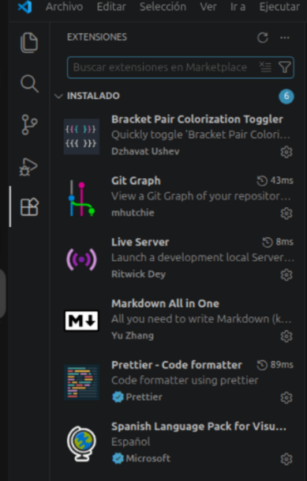

## 1.2. Crear usuario en Github.

Nos vamos a la pagina de [Github](https://github.com/) y creamos nuestro usuario, debemos crear como nombre de usuario el usuario Séneca del alumnado.

Una vez crado nos logueamos con nuestro usuario, y vamos a crear el repositorio.

### 1.2.1. Crear Repositorio nombreUsuario.github.io

En la pagina principal pulsamos sobre `Create repository`.

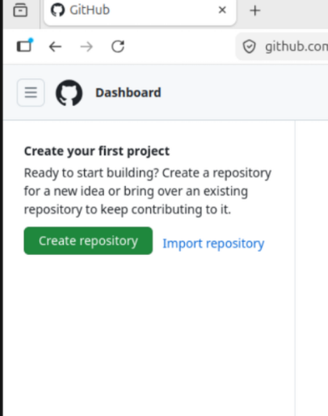

Aparecerá la siguiente página, en la imagen se ve un ejemplo de como se debe crear el repositio, modificando los datos por los del alumno/a.

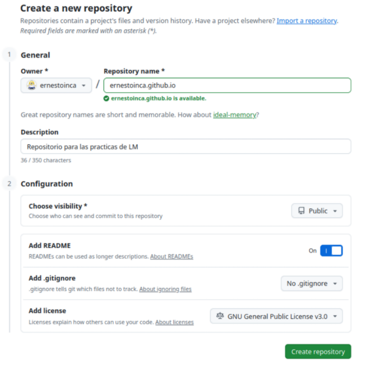

+ **Repository name** es donde hay que escribir el nombre del repositorio, en el ejemplo `ernestoinca.github.io` donde `ernestoinca` hay que sustituirlo por `nombreUsuarioAlumno/a`.
+ **Description **escribimos una breve descripción del contenido de nuestro repositorio.
+ **Choose visibility** debemos dejarlo como `Public` para que esté público.
+ **Add README** lo ponemos a `On`, creando un fichero README.md, donde vamos a ir describiendo el contenido del repositorio, debe estar escrito en **Markdown**. En la Unidad 8 hay una [introducción a Markdown](../Ut8/README.md).
+ **Add .gitignore** es un fichrero opcional donde se indica el contenido que no queremos que se tenga encuenta. Como pueden ser ficheros temporales, ejecutables, etc...
+ **Add license opcional** puedes o no indicar una licencia.

Una vez relleno pulsamos en `Create repository`, y nos creará el repositorio.

Y ya solo queda ir añadiendo el contenido.

>[!Note]
> Cuando añadamos contenido y accedemos a nuestra web, puede que tarde un rato en actualizarse, así que se paciente.

Si escribimos en el navegador `https://ernestoinca.github.io/`, sustituyendo **ernestoinca** por **tu usuario** debe aparecer algo parecido a:

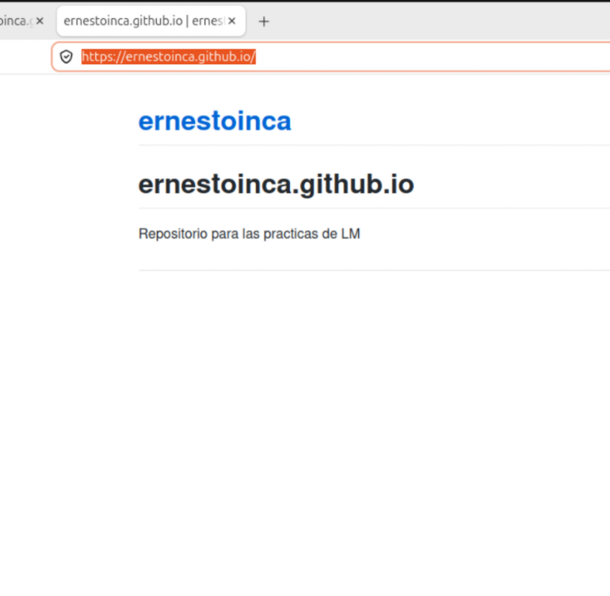

Para ver nuestra web hay que subir los ficheros **.html**, **.css** y **.js**.

## 1.3. Uso del repositorio con Visual Studio Code (en Linux).

La forma facil es clonar el repositorio a nuestro ordenador y abrirlo con el editor.

### 1.3.1. Clonar repositorio .github.io.

Para clonar debemos hacer:

1. Nos vamos al repositorio y pulsamos sobre el botón verde `<> Code`.
2. Se abre una pagina y abajo pulsamos sobre `Dowload ZIP`.

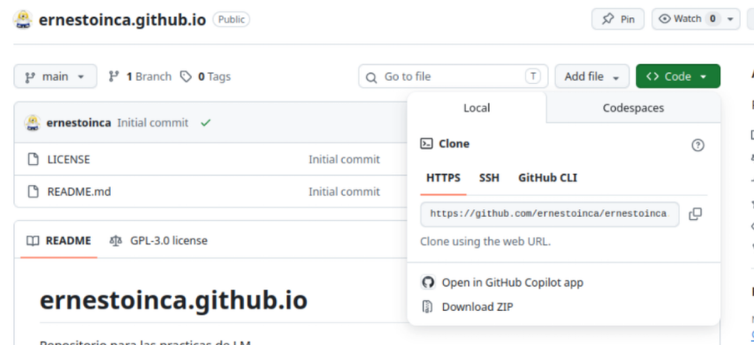

3. Descarga el contenido del repositorio. Normalmente lo descarga en `Descargas`.
4. Descomprimimos el fichero en una ubicación que tengamos controlado y allí podemos trabajar sobre el repositorio. Por ejemplo yo lo he descomprimido en `Documentos\practicas\LM`.

### 1.3.2. Trabajar con el repositorio y subirlo a Github.

Para trabajar sobre el repositorio debemos realizar:

1. Abrimos VSC. Una vez abierto vamos a `Archivo\Abrir Carpeta`, nos abrirá un cuado de diálogo donde nos moveremos hasta el directorio. Este proceso lo repetimos para los diferentes repositoros que tengamos y trabajar sobre el.

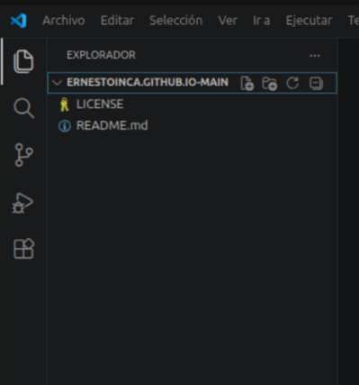

2. Ya podemos trabajar. Vamos a crear un fichero llamad `index.html` donde el contenido es `<h1> Practicas de Nombre Alumno </h1>` solo debe contener eso.

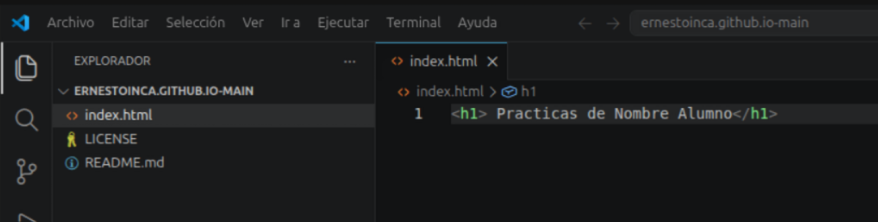

3. Una vez creado ya podemos publicar en el repositorio. Para subir los ficheros podemos subirlos añadiendolo desde el repositorio. Vamos a `Add file` donde se nos abre la siguiente pantalla.

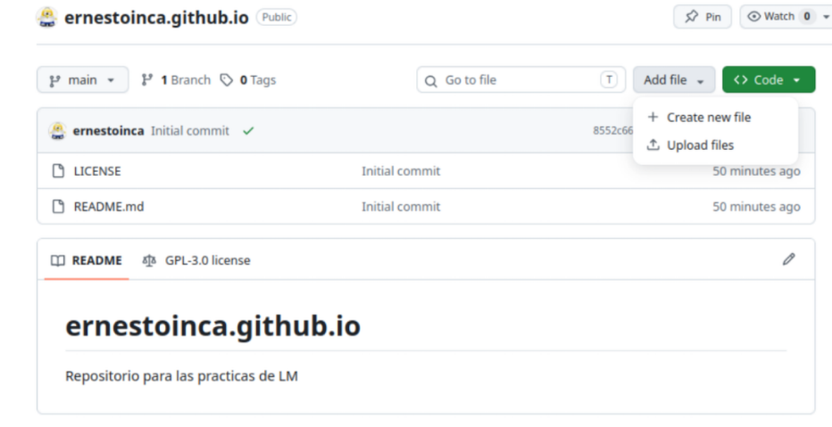

4. Pulsamos sobre `Upload files`, donde podemos arrastras desde el explorador de ficheros los ficheros que hayamos modificado. Podemos arrastrar y soltar los ficheros.
   
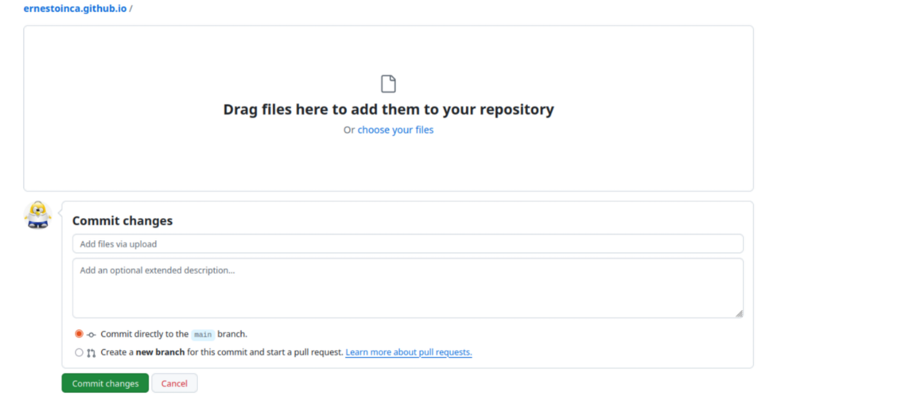

5. Una vez añadidos pulsamos sobre `Commit changes`.

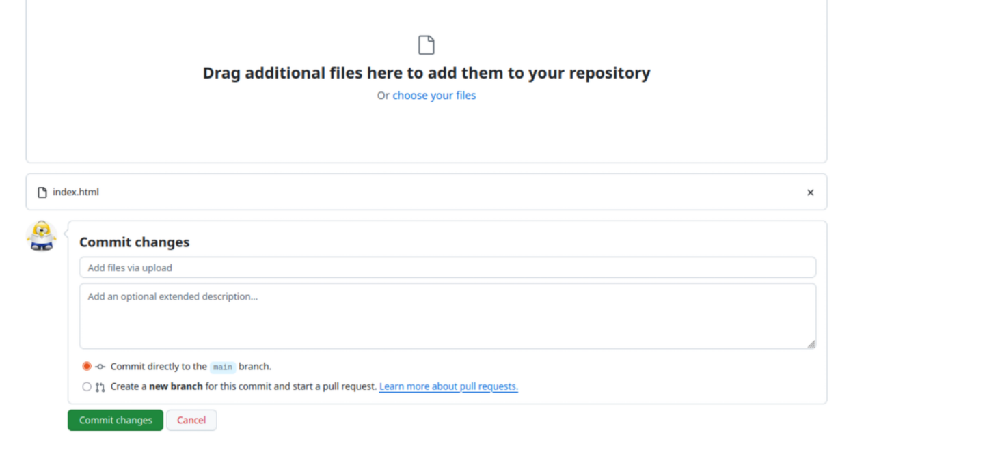

6. Nos aseguramos que ya esta subido nuestros ficheros.
7. Al cabo de un rato debe de cambiar el contenido de `https://ernestoinca.github.io/`.

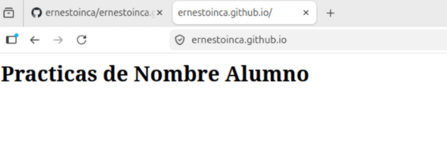

> [!important]
> Cuando subamos los archivos hay que tener cuidado, ya que podemos subir la carpeta donde dentro tenemos todo nuestro contenido, el repositorio es un servidor Web, y para mostrar su contenido va ha buscar siempre un fichero index.html, si no lo encontrase no mostraría nada.

Se recomienda el uso de [Github Desktop](https://desktop.github.com/download/), ya que facilita la actualización del repositorio.

# 2. Git.

Es un sistema de control de versiones local. Es un software que instalas en tu ordenador para registrar el historial de cambios de tus archivos, permitiéndote "viajar en el tiempo" a versiones anteriores si algo sale mal.
