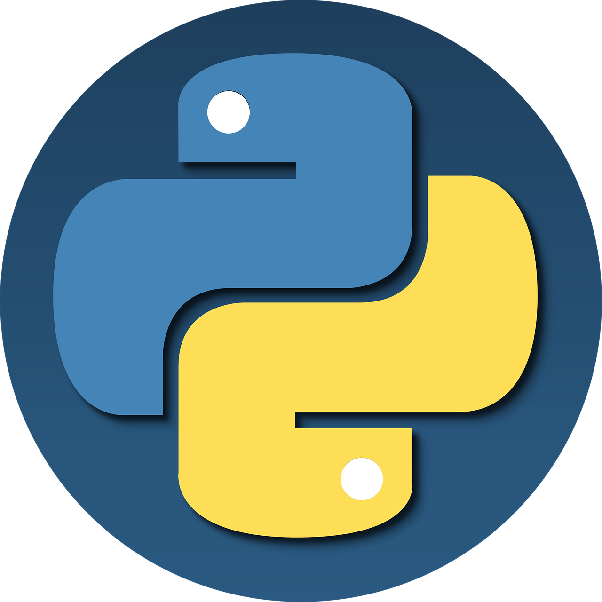
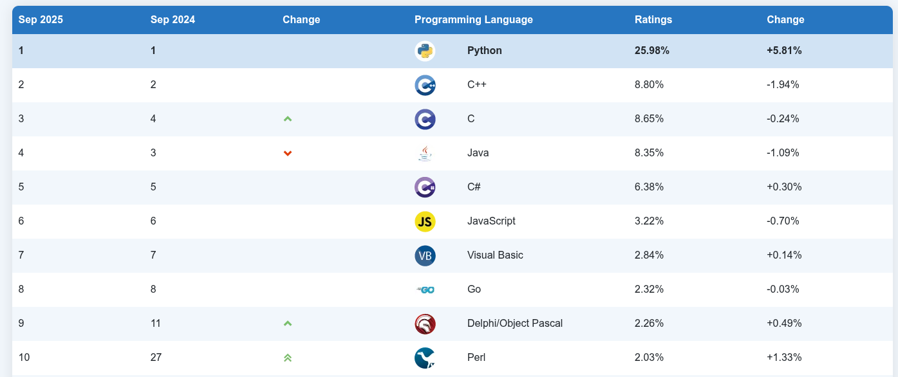

# INTRODUCCIÓN A PYTHON
---


[1.- Introducción.](#1-introducción)

[2.- Instalación de Python.](#2-instalación-de-python)


---


# 1. Introducción
Python es uno de los lenguajes de programación mas utilizado en el mundo. Según el índice
TIOBE Python está a la cabeza del ranking como podemos ver en la siguiente imagen:



Python es también usado para fines diversos como son los siguientes:

- **Desarrollo Web:** Existen frameworks como Django, Pyramid, Flask o Bottle que permiten desarrollar páginas web a todos los niveles.
- **Ciencia y Educación:** Debido a su sintaxis tan sencilla, es una herramienta perfecta para enseñar conceptos de programación a todos los niveles. En lo relativo a ciencia y cálculo numérico, existen gran cantidad de librerías como SciPy o Pandas.
- **Desarrollo de Interfaces Gráficos:** Gran cantidad de los programas que utilizamos tienen un interfaz gráfico que facilita su uso. Python también puede ser usado para desarrollar GUIs con librerías como Kivy o pyqt.
- **Desarrollo Software:** También es usado como soporte para desarrolladores, como para testing.
- **Machine Learning:** En los último años ha crecido el número de implementaciones en Python de librerías de aprendizaje automático como Keras, TensorFlow, PyTorch o sklearn.
- **Visualización de Datos:** Existen varias librerías muy usadas para mostrar datos en gráficas, como matplotlib, seaborn o plotly.
- **Finanzas y Trading:** Gracias a librerías como QuantLib o qtpylib y a su facilidad de uso, es cada vez más usado en estos sectores.

**Características de Python**

Como cualquier otro lenguaje, Python tiene una serie de características que lo hacen diferente al resto. Las explicamos a continuación:

- Es un lenguaje interpretado, no compilado.
- Usa tipado dinámico, lo que significa que una variable puede tomar valores de distinto tipo.
- Es fuertemente tipado, lo que significa que el tipo no cambia de manera repentina. Para que se produzca un cambio de tipo tiene que hacer una conversión explícita.
- Es multiplataforma, ya que un código escrito en macOS funciona en Windows o Linux y viceversa.

Tal vez algunos de estos conceptos puedan resultarte extraños si estás empezando en el mundo de la programación. El siguiente código pretende ilustrar algunas de las características de Python.

Algunas cosas curiosidad que en otros lenguajes no pasan. La función acepta un parámetro entrada pero no se especifica su tipo. La x almacena primero una cadena, luego un float y luego un integer. La función funcion() es llamada con un int, pero su valor se divide entre 2 y el resultado es convertido automáticamente en un float.

```python
def funcion(entrada): 
    return entrada/2 
x = "Hola" 
x = 7.0 
x = int(x) 
x = funcion(x) 
print(x) #3.5
print(type(x)) #<class 'float'> 
``` 

# 2. Instalación de Python
La forma más recomendable es la instalación desde la página oficial de Python, aunque muchas distribuciones Linux ya vienen con la versión 3 instalada.

La página oficial es la siguiente: [Instalacion de python](https://www.python.org/downloads/) donde elegirémos el SO donde vamos a realizar la instalación.

Una vez instalado comprobamos si está bién instalado con el siguiente comando, que nos mostrarà la versión instalada:

```bash
python3 -V
```
