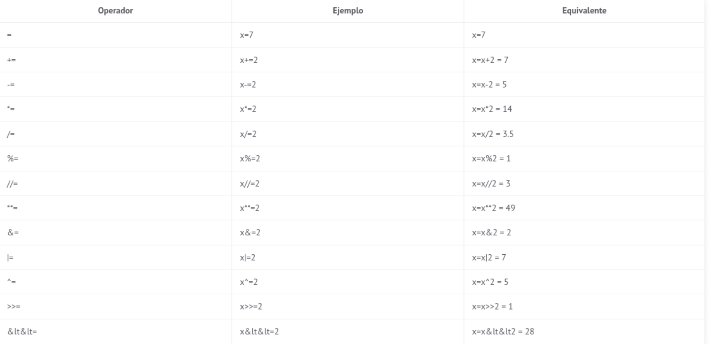
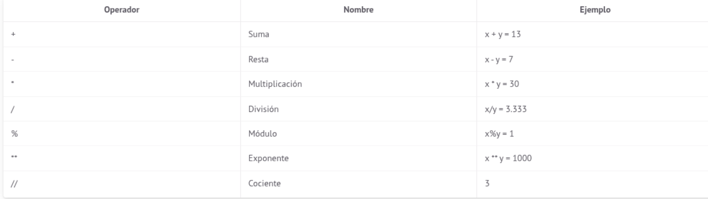

# UT1 INTRODUCCIÓN, INSTALACIÓN, TIPOS DE DATOS Y OPERADORES <!-- omit in toc -->
---


- [1. Introducción](#1-introducción)
- [2. Instalación de Python](#2-instalación-de-python)
- [3. Sintaxis de Python](#3-sintaxis-de-python)
  - [3.1 Entrada y salida de datos](#31-entrada-y-salida-de-datos)
- [4. Tipos de datos y operadores](#4-tipos-de-datos-y-operadores)
  - [4.1 Tipos de datos](#41-tipos-de-datos)
    - [4.1.1 Enteros](#411-enteros)
    - [4.1.2 Booleanos](#412-booleanos)
    - [4.1.3 Float](#413-float)
    - [4.1.4 Cadenas o strings](#414-cadenas-o-strings)
    - [4.1.5 Listas](#415-listas)
    - [4.1.6 Set](#416-set)
    - [4.1.7 Tupla](#417-tupla)
    - [4.1.8 Diccionario](#418-diccionario)
  - [4.2 Tipos de operadores](#42-tipos-de-operadores)
    - [4.2.1 De asignación](#421-de-asignación)
    - [4.2.2 Aritméticos](#422-aritméticos)
    - [4.2.3 Relacionales](#423-relacionales)
    - [4.2.4 Lógicos](#424-lógicos)
    - [4.2.5 A nivel de Bit](#425-a-nivel-de-bit)
    - [4.2.6 De identidad](#426-de-identidad)
    - [4.2.7 Membresía](#427-membresía)


---


# 1. Introducción
Python es uno de los lenguajes de programación mas utilizado en el mundo. Según el índice
TIOBE Python está a la cabeza del ranking como podemos ver en la siguiente imagen:


Python es también usado para fines diversos como son los siguientes:

- **Desarrollo Web:** Existen frameworks como Django, Pyramid, Flask o Bottle que permiten desarrollar páginas web a todos los niveles.
- **Ciencia y Educación:** Debido a su sintaxis tan sencilla, es una herramienta perfecta para enseñar conceptos de programación a todos los niveles. En lo relativo a ciencia y cálculo numérico, existen gran cantidad de librerías como SciPy o Pandas.
- **Desarrollo de Interfaces Gráficos:** Gran cantidad de los programas que utilizamos tienen un interfaz gráfico que facilita su uso. Python también puede ser usado para desarrollar GUIs con librerías como Kivy o pyqt.
- **Desarrollo Software:** También es usado como soporte para desarrolladores, como para testing.
- **Machine Learning:** En los último años ha crecido el número de implementaciones en Python de librerías de aprendizaje automático como Keras, TensorFlow, PyTorch o sklearn.
- **Visualización de Datos:** Existen varias librerías muy usadas para mostrar datos en gráficas, como matplotlib, seaborn o plotly.
- **Finanzas y Trading:** Gracias a librerías como QuantLib o qtpylib y a su facilidad de uso, es cada vez más usado en estos sectores.

**Características de Python**

Como cualquier otro lenguaje, Python tiene una serie de características que lo hacen diferente al resto. Las explicamos a continuación:

- Es un lenguaje interpretado, no compilado.
- Usa tipado dinámico, lo que significa que una variable puede tomar valores de distinto tipo.
- Es fuertemente tipado, lo que significa que el tipo no cambia de manera repentina. Para que se produzca un cambio de tipo tiene que hacer una conversión explícita.
- Es multiplataforma, ya que un código escrito en macOS funciona en Windows o Linux y viceversa.

Tal vez algunos de estos conceptos puedan resultante extraños si estás empezando en el mundo de la programación. El siguiente código pretende ilustrar algunas de las características de Python.

Algunas cosas curiosidad que en otros lenguajes no pasan. La función acepta un parámetro entrada pero no se especifica su tipo. La x almacena primero una cadena, luego un float y luego un integer. La función funcion() es llamada con un int, pero su valor se divide entre 2 y el resultado es convertido automáticamente en un float.

```python
def funcion(entrada): 
    return entrada/2 
x = "Hola" 
x = 7.0 
x = int(x) 
x = funcion(x) 
print(x) #3.5
print(type(x)) #<class 'float'> 
``` 

# 2. Instalación de Python
La forma más recomendable es la instalación desde la página oficial de Python, aunque muchas distribuciones Linux ya vienen con la versión 3 instalada.

La página oficial es la siguiente: [Instalación de python](https://www.python.org/downloads/) donde elegirémos el SO donde vamos a realizar la instalación.

Una vez instalado comprobamos si está bien instalado con el siguiente comando, que nos mostrara la versión instalada:

```bash
python3 -V
```
# 3. Sintaxis de Python
La sintaxis es el **el conjunto de reglas que definen como se tiene que escribir el código de un determinado lenguaje de programación**. 

**Comentarios**

Son bloques de código usados para comentar el código. Ofrecer a otros programadores o a nosotros mismos información relevante acerca de código escrito. Estos comentarios no existen para el interprete de Python.

Los comentarios se indican con **#** si son de una sola línea.

```python
# esto es un comentario
```
También podemos comentar varias líneas usando triples comillas dobles o simples.

```python
""" Esto es un comentario
de varias lineas """
```
**Identación y bloques de código**

En Python los bloques de código se representan con indentación, y aunque hay un poco de debate con respecto a usar tabulador o espacios, la norma general es usar **cuatro espacios**.

En el siguiente código tenemos un **condicional if**. Justo después tenemos un **print()** indentado con cuatro espacios. Por lo tanto, todo lo que tenga esa indentación pertenecerá al bloque del if.
```python
if True: 
    print("True")
```
Esto es muy importante ya que el código anterior y el siguiente no son lo mismo. De hecho el siguiente código daría un error ya que el if no contiene ningún bloque de código, y eso es algo que no se puede hacer en Python.
```python
if True: 
print("True")
```
En Python no es necesario terminar las sentencias con **;**, basta con un salto de línea, pero si podemos usarlo para tener dos sentencias en la misma línea.

```python
x=5
y=10
# podemos declarar las dos varables en una sola línea
x=5;y=10
``` 
En algunas situaciones se puede dar el caso de que queramos tener una sola instrucción en varias línea de código. Uno de los motivos principales podría ser que fuera demasiado larga, y de hecho en la especificación PEP8 se recomienda que las líneas no excedan los 79 caracteres.

Haciendo uso de **\** se puede romper el código en varias líneas, lo que en determinados casos hace que el código sea mucho más legible.

```python
x = 1 + 2 + 3 + 4 +\

    5 + 6 + 7 + 8
```
Si por lo contrario estamos dentro de un bloque rodeado con paréntesis (), bastaría con saltar a la siguiente línea.
```python
x = (1 + 2 + 3 + 4 +
     5 + 6 + 7 + 8)
```
Se puede hacer lo mismo para llamadas a funciones
```python
def funcion(a, b, c):
    return a+b+c

d = funcion(10,
23,
3)
```
> **Creando variables**

Las variables son los objetos que van a almacenar la información manejada de nuestro programa, para asignarle un valor se utiliza el simbolo **=**.

A con tinuación vemos varias formas de asignar valores  a las variables.
```python
x=10
x=y=z=10
x,y = 4,2
nombre="Rafael"
temp=23.3
```
> **Nombres de las variables**

Para nombrar las variables hay que tener encuenta las siguientes normas:

- Distinción en tre mayúsculas y minúsculas, **x** y **X** son variables diferentes.
- El nombre no puede empezar por nun número.
- No se permiten en uso de guiones -
- No se permiten en uso de espacios.

Ejemplos:

```python
# Valido
_variabe=10
variable10=10
Variable=10
# No Valido
2variabe=10
var-iable=10
var iable=10
```

> **Palabras reservadas en Python**

Son palabras que no podemos utilizar para nombrar variables ni funciones, ya que las reserva internamente para su funcionamiento.

```python
import keyword
print(keyword.kwlist)

# ['False', 'None', 'True', 'and', 'as', 'assert',
# 'async', 'await', 'break', 'class', 'continue',
# 'def', 'del', 'elif', 'else', 'except', 'finally',
# 'for', 'from', 'global', 'if', 'import', 'in', 'is',
# 'lambda', 'nonlocal', 'not', 'or', 'pass', 'raise',
# 'return', 'try', 'while', 'with', 'yield']
``` 

## 3.1 Entrada y salida de datos

Para leer desde teclado utilizamos **input** y para mostrar los datos por pantalla utlizamos **print**, en el siguiente ejemplo vemos como utilizamos los dos comandos.

```python
#Entrada 
cadena = input("Introduce una cadena: ")

#Salida print(cadena) 
#Como formatear texto y variables en un print 
nombre = "Marcos" 
apellidos = "Rivera Gavilán" 
correo = "riveragavilanmarcos@gmail.com" 

print("Hola me llamo " + nombre + " " + apellidos + " y mi correo es " + correo)
#El + concatena sin espacios 

print(f"Hola me llamo {nombre} {apellidos} y mi correo es {correo}")
# Al estar dentro de una cadena ponemos los espacios normalmente 

print("Hola me llamo {} {} y mi correo es {}".format(nombre, apellidos, correo))
# Al estar dentro de una cadena ponemos los espacios normalmente
```


# 4. Tipos de datos y operadores
## 4.1 Tipos de datos
### 4.1.1 Enteros
Python no tiene el problema de otros lenguajes que dependiendo del valor del entero a representar teníamos que  definir un tipo u otro, Python se encarga de asignar mas o menos memoria al número y podemos representar practicamente cualquier número.

```python
i = 12
print(i)          #12
print(type(i)) #<class 'int'>
```
Convertir a **int**
```python
b = int(1.6)
print(b) #1
```
### 4.1.2 Booleanos

Al igual que en otros lenguajes de programación, en Python existe el tipo bool o booleano. Es un tipo de dato que permite almacenar dos valores **True** o **False**.
```python
x = True
y = False
```
Un valor booleano también puede ser el resultado de evaluar una expresión. Ciertos operadores como el mayor que, menor que o igual que devuelven un valor bool.
```python
print(1 > 0)  #True
print(1 <= 0) #False
print(9 == 9) #True
```
### 4.1.3 Float
El tipo numérico float permite representar un número positivo o negativo con decimales, es decir, números reales. Si vienes de otros lenguajes, tal vez conozcas el tipo doble, lo que significa que tiene el doble de precisión que un float. En Python las cosas son algo distintas, y los float son en realidad double.
```python
f = 0.10093
print(f)  #0.10093
print(type(f)) #<class 'float'>
```
> ***Conversión a float**

También se puede declarar usando la notación científica con e y el exponente. El siguiente ejemplo sería lo mismo que decir 1.93 multiplicado por diez elevado a -3.
```python
f = 1.93e-3
```

También podemos convertir otro tipo a float haciendo uso de float(). Podemos ver como True es en realidad tratado como 1, y al convertirlo a float, como 1.0.
```python
a = float(True)
b = float(1)
print(a, type(a)) #1.0 <class 'float'>
print(b, type(b)) #1.0 <class 'float'>
```

> ***Rango representable***

Alguna curiosidad es que los float no tienen precisión infinita. Podemos ver en el siguiente ejemplo como en realidad f se almacena como si fuera 1, ya que no es posible representar tanta precisión decimal.

```python
f = 0.99999999999999999
print(f)
 #1.0
print(1 == f) #True
```
Los float a diferencia de los int tienen unos valores mínimo y máximos que pueden representar.
La  mínima  precisión  es  ***2.2250738585072014e-308***  y  la  máxima
***1.7976931348623157e+308***, pero si no nos crees, lo puedes verificar tu mismo.

### 4.1.4 Cadenas o strings
Las cadenas en Python o strings son un tipo inmutable que permite almacenar secuencias de
caracteres. Para crear una, es necesario incluir el texto entre comillas dobles ***"***. Puedes obtener más ayuda con el comando ***help(str)***.
```python
s = "Esto es una cadena"
print(s)  #Esto es una cadena
print(type(s)) #<class 'str'>
```
También es valido declarar las cadenas con comillas simples simples ***'***.
```python
s = 'Esto es otra cadena'
print(s)  #Esto es otra cadena
print(type(s)) #<class 'str'>
```
Las cadenas no están limitadas en tamaño, por lo que el único límite es la memoria de tu ordenador.
Una situación que muchas veces se puede dar, es cuando queremos introducir una comilla, bien sea
simple ***'*** o doble ***"*** dentro de una cadena. Si lo hacemos de la siguiente forma tendríamos un error,
ya que Python no sabe muy bien donde empieza y termina.
Para resolver este problema debemos recurrir a las secuencias de escape. En Python hay varias, pero
las analizaremos con más detalle en otro capítulo. Por ahora, la más importante es ***\"***, que nos
permite incrustar comillas dentro de una cadena.
```python
s = "Esto es una comilla doble \" de ejemplo"
print(s) #Esto es una comilla doble " de ejemplo
```
Podemos incluir un salto de línea con ***\n***.
```python
s = "Primer linea\nSegunda linea"
print(s)
#Primer linea
#Segunda linea
```
***Ejemplos de String***

Para entender mejor la clase ***string***, vamos a ver unos ejemplos de como se comportan. Podemos
sumar dos strings con el operador ***+***. Lo que hace es concatenar los String.
```python
s1 = "Parte 1"
s2 = "Parte 2"
print(s1 + " " + s2) #Parte 1 Parte 2
```
Se puede multiplicar un ***string*** por un ***int***. Su resultado es replicarlo tantas veces como el valor
del entero.
```python
s = "Hola "
print(s*3) #Hola Hola Hola
```
Con ***chr()*** and ***ord()*** podemos convertir entre carácter y su valor numérico que lo representa y
viceversa. El segundo sólo función con caracteres, es decir, un string con un solo elemento.
```python
print(chr(8364)) #€
print(ord("€")) #110
```
La longitud de una cadena viene determinada por su número de caracteres, y se puede consultar con
la función ***len()***.
```python
print(len("Esta es mi cadena"))# 17
```
> ***Algunos métodos de la Clase String***

+ ***capitalize()***
  
El método capitalize() se aplica sobre una cadena y la devuelve con su primera letra en mayúscula.
```python
s = "mi cadena"
print(s.capitalize()) #Mi cadena
``` 
+ ***lower()***
  
El método lower() convierte todos los caracteres alfabéticos en minúscula.
  ```python
  s = "MI CADENA"
  print(s.lower()) #mi cadena
  ```

+ ***swapcase()***
  
El método swapcase() convierte los caracteres alfabéticos con mayúsculas en minúsculas y viceversa.
  ```python
  s = "mI cAdEnA"
  print(s.swapcase()) #Mi CaDeNa
  ```
+ ***upper()***

El método upper() convierte todos los caracteres alfabéticos en mayúsculas.
  ```python
  s = "mi cadena"
  print(s.upper())
  ```
+  ***count(sub[,start[,end]])***
  
El método count() permite contar las veces que otra cadena se encuentra dentro de la primera.   Permite también dos parámetros opcionales que indican donde empezar y acabar de buscar.
  ```python
  s = "el bello cuello "
  print(s.count("llo")) #2
  ``` 
+  ***split(sep=None, maxsplit =-1)***
  
El método split() divide una cadena en subcadenas y las devuelve almacenadas en una lista. La división es realizada de acuerdo a el primer parámetro, y el segundo parámetro indica el número máximo de divisiones a realizar.
  ```python
  s = "Python,Java,C"
  print(s.split(",")) #['Python', 'Java', 'C']
  ``` 

### 4.1.5 Listas

Son un tipo de dato que permite almacenar datos de cualquier tipo.

> ***Crear listas en Python***

Las listas en Python son uno de los tipos o estructuras de datos más versátiles del lenguaje, ya que
permiten almacenar un conjunto arbitrario de datos. Es decir, podemos guardar en ellas prácticamente lo que sea. Si vienes de otros lenguajes de programación, se podría decir que son similares a los arrays.
```python
lista = [1, 2, 3, 4]
```
Una lista sea crea con[]separando sus elementos con comas,. Una gran ventaja es que pueden almacenar tipos de datos distintos.
```python
lista = [1, "Hola", 3.67, [1, 2, 3]]
```
Algunas propiedades de las listas:

+ Son ***ordenadas***, mantienen el orden en el que han sido definidas
+ Pueden ser formadas por tipos ***arbitrarios***.
+ Pueden ser ***indexadas*** con[i].
+ Se pueden ***anidar***, es decir, meter una dentro de la otra.
+ Son ***mutables***, ya que sus elementos pueden ser modificados.
+ Son ***dinámicas***, ya que se pueden añadir o eliminar elementos.

> ***Acceder y modificar lisas***

Si tenemos una lista a con 3 elementos almacenados en ella, podemos accederusando corchetes y un índice, que va desde 0 a n-1 siendo n el tamaño de la lista.
```python
a = [90, "Python", 3.87]
print(a[0]) #90
print(a[1]) #Python
print(a[2]) #3.87
```
Se puede también acceder al último elemento usando el índice[-1].
```python
a = [90, "Python", 3.87]
print(a[-1]) #3.87
```
También podemos tener listas anidadas, es decir, una lista dentro de otra. Incluso podemos tener una lista dentro de otra lista y a su vez dentro de otra lista. Para acceder a sus elementos sólo tenemos que usar ***[]*** tantas veces como niveles de anidado tengamos.
```python
x = [1, 2, 3, ['p', 'q', [5, 6, 7]]]
print(x[3][0]) #p
print(x[3][2][0]) #5
print(x[3][2][2]) #7
```
También es posible crear sublistas más pequeñas de una más grande. Para ello debemos de usar:entre corchetes, indicando a la izquierda el valor de inicio, y a la izquierda el valor final que no está incluido. Por lo tanto[0:2]creará una lista con los elementos[0]y[1]de la original.
```python
l = [1, 2, 3, 4, 5, 6]
print(l[0:2]) #[1, 2]
print(l[2:6]) #[3, 4, 5, 6]
```
> ***Iterar listas***

En Python es muy fácil iterar una lista, mucho más que en otros lenguajes de programación.
```python
lista = [5, 9, 10]
for l in lista:
    print(l)
```
Si necesitamos un índice acompañado con la lista, que tome valores desde 0 hasta n-1, se puede hacer de la siguiente manera.
```python
lista = [5, 9, 10]
for index, l in enumerate(lista):
  print(index, l)
```
> ***Metodos para listas***

+ ***append (obj)***
  
El método append() añade un elemento al final de la lista.
```python
l = [1, 2]
l.append(3)
print(l) #[1, 2, 3]
```
+ *** extend(iterable )***

El método extend() permite añadir una lista a la lista inicial.
```python
l = [1, 2]
l.extend([3, 4])
print(l) #[1, 2, 3, 4]
```
+ ***insert(index,obj)***

El método insert() añade un elemento en una posición o índice determinado.
```python
l = [1, 3]
l.insert(1, 2)
print(l) #[1, 2, 3]
```
+ ***remove(obj)***

El método remove() recibe como argumento un objeto y lo borra de la lista.
```python
l = [1, 2, 3]
l.remove(3)
print(l) #[1, 2]
```
+ ***pop(index=-1)***
  
El método pop() elimina por defecto el último elemento de la lista, pero si se pasa como parámetro un índice permite borrar elementos diferentes al último.
```python
l = [1, 2, 3]
l.pop()
print(l) #[1, 2]
```
+ ***reverse()***

El método reverse() inverte el órden de la lista.
```python
l = [1, 2, 3]
l.reverse()
print(l) #[3, 2, 1]
```
+ ***sort()***

El método sort() ordena los elementos de menos a mayor por defecto.
```python
l = [3, 1, 2]
l.sort()
print(l) #[1, 2, 3]
```
Y también permite ordenar de mayor a menor si se pasa como parámetro reverse=True.
```python
l = [3, 1, 2]
l.sort(reverse=True)
print(l) #[3, 2, 1]
```
+ ***index(obj[,index])***

El método index() recibe como parámetro un objeto y devuelve el índice de su primera aparición. Como hemos visto en otras ocasiones, el índice del primer elemento es el 0.
```python
l = ["Periphery", "Intervals", "Monuments"]
print(l.index("Intervals"))
```

### 4.1.6 Set
Los sets en Python son una estructura de datos usada para almacenar elementos de una manera similar a las listas, pero con ciertas diferencias.

> ***Crear set en Python***

Los set en Python son un tipo que permite almacenar varios elementos y acceder a ellos de una forma muy similar a las listas pero con ciertas diferencias:

+ Los elementos de un set son único, lo que significa que no puede haber elementos duplicados.
+ Los set son desordenados, lo que significa que no mantienen el orden de cuando son declarados.
+ Sus elementos deben ser inmutables.

Para crear un set en Python se puede hacer con ***set()*** y pasando como entrada cualquier tipo iterable, como puede ser una lista. Se puede ver como a pesar de pasar elementos duplicados como dos 8 y en un orden determinado, al imprimir el set no conserva ese orden y los duplicados se han eliminado.
```python
s = set([5, 4, 6, 8, 8, 1])
print(s)  #{1, 4, 5, 6, 8}
print(type(s)) #<class 'set'>
```
Se puede hacer lo mismo haciendo uso de **{}** y sin usar la palabra **set()** como se muestra a continuación.
```python
s = {5, 4, 6, 8, 8, 1}
print(s)  #{1, 4, 5, 6, 8}
print(type(s)) #<class 'set'>
```
A diferencia de las listas, en los set no podemos modificar un elemento a través de su índice. Si lo intentamos, tendremos un TypeError.
```python
s = set([5, 6, 7, 8])
#s[0] = 3 #Error! TypeError
```
Los sets se pueden iterar de la misma forma que las listas.
```python
s = set([5, 6, 7, 8])
for ss in s:
  print(ss) #8, 5, 6, 7
```

Con la función len() podemos saber la longitud total del set. Como ya hemos indicado, los duplicados son eliminados.
```python
s = set([1, 2, 2, 3, 4])
  print(len(s)) #4
```
> ***Metodos de los Sets***

+ ***s.add(elem)***
  
El método add() permite añadir un elemento al set.
```python
l = set([1, 2])
l.add(3)
print(l) #{1, 2, 3}
```
+ ***s.remove(elem)***
  
El método remove() elimina el elemento que se pasa como parámetro. Si no se encuentra, se lanza la excepción KeyError.
```python
s = set([1, 2])
s.remove(2)
print(s) #{1}
```
+ ***s.discard(elem)***
  
El método discard() es muy parecido al remove(), borra el elemento que se pasa como parámetro, y si no se encuentra no hace nada.
```python
s = set([1, 2])
s.discard(3)
print(s) #{1, 2}
```
+ ***s.pop()***
  
El método pop() elimina un elemento aleatorio del set.
```python
s = set([1, 2])
s.pop()
print(s) #{2}
```
+ ***s.clear()***

El método clear() elimina todos los elementos de set.
```python
s = set([1, 2])
s.clear()
print(s) #set()
```
### 4.1.7 Tupla

Las tuplas en Python son un tipo o estructura de datos que permite almacenar datos de una manera muy parecida a las listas, con la salvedad de que son inmutables.

> ***Crear una Tupla en Python***

Las tuplas en Python o tuples son muy similares a las listas, pero con dos diferencias. Son inmutables, lo que significa que no pueden ser modificadas una vez declaradas, y en vez de inicializarse con corchetes se hace con ***()***. Dependiendo de lo que queramos hacer, las tuplas pueden ser más rápidas.
```python
tupla = (1, 2, 3)
print(tupla) #(1, 2, 3)
```
También pueden declararse sin ***()***, separando por , todos sus elementos.
```python
tupla = 1, 2, 3
print(type(tupla)) #<class 'tuple'>
print(tupla)  #(1, 2, 3)
```
> ***Operaciones con tuplas***

Como hemos comentado, las tuplas son tipos inmutables, lo que significa que una vez asignado su valor, no puede ser modificado. Si se intenta, tendremos un TypeError.
Como las Listas pueden ser anidadas.

Se puede iterar una tupla de la misma forma que se hacía con las listas.
```python
tupla = [1, 2, 3]
for t in tupla:
  print(t) #1, 2, 3
```
> ***Métodos con tuplas***

+ ***count(obj)***

El método count() cuenta el número de veces que el objeto pasado como parámetro se ha encontrado en la lista.
```python
l = [1, 1, 1, 3, 5]
print(l.count(1)) #3
```

+ ***index(obj[,index])***

El método index() busca el objeto que se le pasa como parámetro y devuelve el índice en el que se ha encontrado.
```python
l = [7, 7, 7, 3, 5]
print(l.index(5)) #4
```
En el caso de no encontrarse, se devuelve un ValueError.
```python
l = [7, 7, 7, 3, 5]
#print(l.index(35)) #Error! ValueError
```
El método index() también acepta un segundo parámetro opcional, que indica a partir de que índice empezar a buscar el objeto.
```python
l = [7, 7, 7, 3, 5]
print(l.index(7, 2)) #2
```
### 4.1.8 Diccionario
Los diccionarios en Python son una estructura de datos que permite almacenar su contenido en forma de llave y valor.

> ***Crear dicionarios en Python***
>
Un diccionario en Python es una colección de elementos, donde cada uno tiene una llave ***key*** y un valor ***value***. Los diccionarios se pueden crear con paréntesis ***{}*** separando con una coma cada par ***key: value***. En el siguiente ejemplo tenemos tres keys que son el nombre, la edad y el documento.
```python
d1 = {
"Nombre": "Sara",
"Edad": 27,
"Documento": 1003882
}
print(d1) #{'Nombre': 'Sara', 'Edad': 27, 'Documento': 1003882}
```
Otra forma equivalente de crear un diccionario en Python es usando dict() e introduciendo los pares key: value entre paréntesis.
```python
d2 = dict([
('Nombre', 'Sara'),
('Edad', 27),
('Documento', 1003882),])
print(d2) #{'Nombre': 'Sara', 'Edad': '27', 'Documento': '1003882'}
```
También es posible usar el constructor dict() para crear un diccionario.
```python
d3 = dict(Nombre='Sara',
Edad=27,
Documento=1003882)
print(d3) #{'Nombre': 'Sara', 'Edad': 27, 'Documento': 1003882}
```
Algunas propiedades de los diccionario en Python son las siguientes:
+ Son dinámicos, pueden crecer o decrecer, se pueden añadir o eliminar elementos.
+ Son indexados, los elementos del diccionario son accesibles a través del key.
+ Y son anidados, un diccionario puede contener a otro diccionario en su campo value.

> ***Acceder y modificar elementos***

Se puede acceder a sus elementos con [] o también con la función get()
```python
print(d1['Nombre'])  #Sara
print(d1.get('Nombre')) #Sara
```

Para modificar un elemento basta con usar [] con el nombre del key y asignar el valor que queremos.
```python
d1['Nombre'] = "Laura"
print(d1) #{'Nombre': Laura', 'Edad': 27, 'Documento': 1003882}
```
Si el key al que accedemos no existe, se añade automáticamente.
```python
d1['Direccion'] = "Calle 123"
print(d1) #{'Nombre': 'Laura', 'Edad': 27, 'Documento': 1003882, 'Direccion': 'Calle 123'}
```
> ***Iterar un diccionario***

Los diccionarios se pueden iterar de manera muy similar a las listas u otras estructuras de datos.
Para imprimir los key.
```python
# Imprime los key del diccionario
for x in d1:
  print(x)
```
> ***Métodos de diccionarios en Python***

+ ***clear()***
  
El método clear() elimina todo el contenido del diccionario.
```python
d = {'a': 1, 'b': 2}
d.clear()
print(d) #{}
```
+ ***get(key[,default])***

El método get() nos permite consultar el value para un key determinado. El segundo parámetro es opcional, y en el caso de proporcionarlo es el valor a devolver si no se encuentra la key.
```python
d = {'a': 1, 'b': 2}
print(d.get('a')) #1
print(d.get('z', 'No encontrado')) #No encontrado
```
+ ***items()***

El método items() devuelve una lista con los keys y values del diccionario. Si se convierte en list se puede indexar como si de una lista normal se tratase, siendo los primeros elementos las key y los segundos los value.
```python
d = {'a': 1, 'b': 2}
it = d.items()
print(it)  #dict_items([('a', 1), ('b', 2)])
print(list(it))  #[('a', 1), ('b', 2)]
print(list(it)[0][0]) #a
```
+ ***keys()***
  
El método keys() devuelve una lista con todas las keys del diccionario.
```python
d = {'a': 1, 'b': 2}
k = d.keys()
print(k)  #dict_keys(['a', 'b'])
print(list(k)) #['a', 'b']
```
+ ***values()***
  
El método values() devuelve una lista con todos los values o valores del diccionario.
```python
d = {'a': 1, 'b': 2}
print(list(d.values())) #[1, 2]
```
+ ***pop(key[,default])***

El método pop() busca y elimina la key que se pasa como parámetro y devuelve su valor asociado. Daría un error si se intenta eliminar una key que no existe.
```python
d = {'a': 1, 'b': 2}
d.pop('a')
print(d) #{'b': 2}
```
También se puede pasar un segundo parámetro que es el valor a devolver si la key no se ha encontrado. En este caso si no se encuentra no habría error.
```python
d = {'a': 1, 'b': 2}
d.pop('c', -1)
print(d) #{'a': 1, 'b': 2}
```
+ ***popitem()***
  
El método popitem() elimina de manera aleatoria un elemento del diccionario.
```python
d = {'a': 1, 'b': 2}
d.popitem()
print(d) #{'a': 1}
```
+ ***update(obj)***
  
El método update() se llama sobre un diccionario y tiene como entrada otro diccionario. Los value son actualizados y si alguna key del nuevo diccionario no esta, es añadida.
```python
d1 = {'a': 1, 'b': 2}
d2 = {'a': 0, 'd': 400}
d1.update(d2)
print(d1) #{'a': 0, 'b': 2, 'd': 400}
```

## 4.2 Tipos de operadores

### 4.2.1 De asignación


Anteriormente hemos visto los operadores aritméticos, que usaban dos números para calcular una operación aritmética (como suma o resta) y devolver su resultado. En este caso, los operadores de asignación o assignment operators nos permiten realizar una operación y almacenar su resultado en la variable inicial. Podemos ver como realmente el único operador nuevo es el ***=***. El resto son abreviaciones de otros operadores que habíamos visto con anterioridad. Ponemos un ejemplo con x=7


```python
a=7; b=2
print("Operadores de asignación")
x=a; x+=b;  print("x+=", x)  # 9
x=a; x-=b;  print("x-=", x)  # 5
x=a; x*=b;  print("x*=", x)  # 14
x=a; x/=b;  print("x/=", x)  # 3.5
x=a; x%=b;  print("x%=", x)  # 1
x=a; x//=b; print("x//=", x) # 3
x=a; x**=b; print("x**=", x) # 49
x=a; x&=b;  print("x&=", x)  # 2
x=a; x|=b;  print("x|=", x)  # 7
x=a; x^=b; print("x^=", x)   # 5
x=a; x>>=b; print("x>>=", x) # 1
x=a; x<<=b; print("x<<=", x) # 28
```
+ ***Operador %=***

El operador %= equivale a hacer el módulo de la división de dos variables y almacenar su resultado en la primera. Calculamos el resto de la división.
```python
x = 3
x%=2
print(x) # 1
```

+ ***Operador //=***
  
El operador //= realiza la operación cociente entre dos variables y almacena el resultado en la
primera. El equivalente de x//=2 sería x=x//2.
```python
x=5
 # El resultado es el cociente
x//=3
 # de la división
print(x) # 1
```
+ ***Operador \*\*=***
  
El operador \*\*= realiza la operación exponente del primer número elevado al segundo, y almacena el resultado en la primera variable. El equivalente de x**=2 sería x=x**2.
```python
x=5
 # Eleva el número al cuadrado
x**=2
 # y guarda el resultado en la misma
print(x) # 25
```
Otro ejemplo similar, sería empleando un exponente negativo, algo que es totalmente válido y equivale matemáticamente al inverso del número elevado al exponente en positivo. Dicho de otra forma, x−2 equivale a 1/x2.
```python
x=5
 # Elevar 5 a -2 equivale a dividir
x**=-2 # uno entre 25.
print(x) # 0.04
```
+ ***Operador &=***

El operador &= realiza la comparación & bit a bit entre dos variables y almacena su resultado en la primera. El equivalente de x&=1 sería x=x&1
```python
a = 0b101010
a&= 0b111111
print(bin(a))# 0b101010
```

+ ****Operador |=****

El operador |= realiza el operador | elemento a elemento entre dos variables y almacena su resultado en la primera. El equivalente de x|=2 sería x=x|2
```python
a = 0b101010
a|= 0b111111
print(bin(a))# 0b111111
```
+ ***Operador ^=***

El operador ^= realiza el operador ^ elemento a elemento entre dos variables y almacena su resultado en la primera. El equivalente de x^=2 sería x=x^2
```python
a = 0b101010
a^= 0b111111
print(bin(a))# 0b10101
```
+ ***Operador »=***

El operador >>= es similar al operador >> pero permite almacenar el resultado en la primera variable. Por lo tanto x>>=3 sería equivalente a x=x>>3. Desplazamiento de bits a la derecha.
```python
x = 10
x>>=1
print(x) # 5
```
Es importante tener cuidado y saber el tipo de la variable x antes de aplicar este operador, ya que se podría dar el caso de que x fuera una variable tipo float. En ese caso, tendríamos un error porque el operador >> no esta definido para float.
```python
x=10.0
 # Si la x es float
print(type(x)) # <class 'float'>
#x>>=1  # ERROR! TypeError
 ```
+ ***Operador «=***

Muy similar al anterior, <<= aplica el operador << y almacena su contenido en la primera variable.
El equivalente de x<<=1 sería x=x<<1. Desplazamiento de bits a la izquierda
```python
x=10
 # Inicializamos a 10
x<<=1
 # Desplazamos 1 a la izquierda
print(x) # 20
```
### 4.2.2 Aritméticos


```python
x = 10; y = 3
print("Operadores aritméticos")
print("x+y =", x+y) #13
print("x-y =", x-y) #7
print("x*y =", x*y) #30
print("x/y =", x/y) #3.3333333333333335
print("x%y =", x%y) #1
print("x**y =", x**y) #1000
print("x//y =", x//y) #3
```
> **Orden de aplicación**

En los ejemplos anteriores simplemente hemos aplicado un operador a dos números sin mezclarlos entre ellos. También es posible tener varios operadores en la misma línea de código, y en este caso es muy importante tener en cuenta las prioridades de cada operador y cual se aplica primero. Ante la duda siempre podemos usar paréntesis, ya que todo lo que está dentro de un paréntesis se evaluará conjuntamente, pero es importante saber las prioridades.
El orden de prioridad sería el siguiente para los peradores aritméticos, siendo el primero el de mayor prioridad:

+ () Paréntesis
+ ** Exponente
+ -x Negación
+ \* / // Multiplicación, División, Cociente, Módulo
+ \+ - Suma, Resta
```python
print(10*(5+3)) # Con paréntesis se realiza primero la suma # 80
print(10*5+3) # Sin paréntesis se realiza primero la multiplicación # 53
print(3*3+2/5+5%4) # Primero se multiplica y divide, después se suma #10.4
print(-2**4)
 # Primero se hace la potencia, después se aplica el signo
#-16
```

### 4.2.3 Relacionales
### 4.2.4 Lógicos
### 4.2.5 A nivel de Bit
### 4.2.6 De identidad
### 4.2.7 Membresía